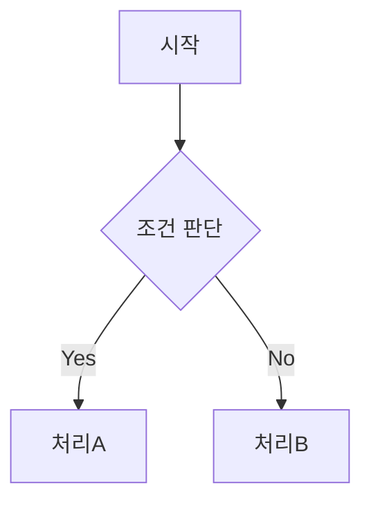
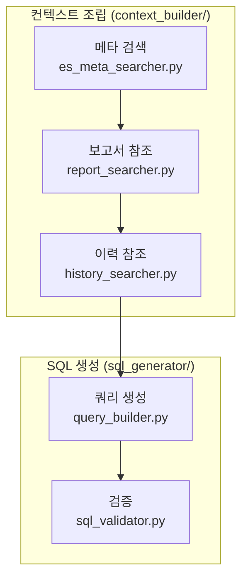
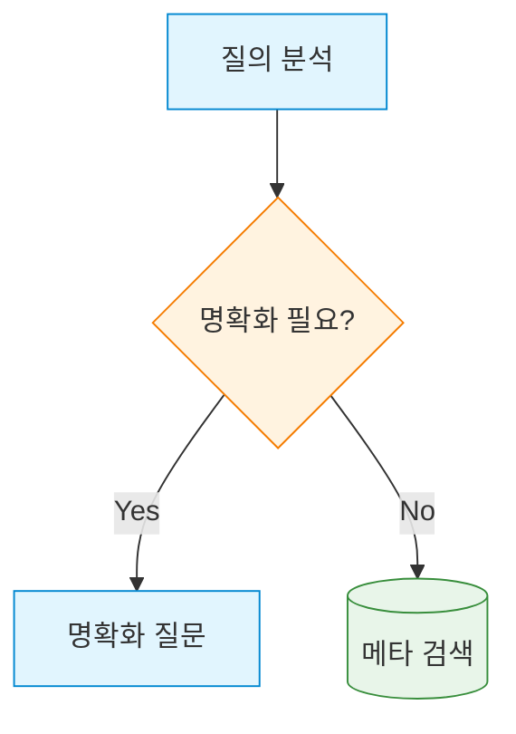

# Data Copilot 문서 작성 지침서

> 프로젝트 내 모든 산출물 문서(docs/) 작성 시 준수해야 할 형식, 구조, 품질 기준을 정의한다.

**버전**: 2.1
**최종 수정**: 2026-03-22
**대상 독자**: 본 프로젝트의 설계·구현·운영에 참여하는 모든 구성원 및 AI 서브에이전트

---

## 목차

1. [출력 형식 요구사항](#1-출력-형식-요구사항)
2. [문서 구조 표준](#2-문서-구조-표준)
3. [문서 유형별 작성 가이드](#3-문서-유형별-작성-가이드)
4. [용어 및 표기 규칙](#4-용어-및-표기-규칙)
5. [테이블 및 목록 작성 규칙](#5-테이블-및-목록-작성-규칙)
6. [코드 블록 및 예시 작성 규칙](#6-코드-블록-및-예시-작성-규칙)
7. [문서 간 상호 참조 규칙](#7-문서-간-상호-참조-규칙)
8. [버전 관리 및 변경 이력](#8-버전-관리-및-변경-이력)
9. [문서 품질 체크리스트](#9-문서-품질-체크리스트)
10. [금융 도메인 특화 작성 규칙](#10-금융-도메인-특화-작성-규칙)
11. [보안 관련 문서 작성 시 주의사항](#11-보안-관련-문서-작성-시-주의사항)
12. [AI 서브에이전트 산출물 문서 규칙](#12-ai-서브에이전트-산출물-문서-규칙)
13. [문서 최신화 정책](#13-문서-최신화-정책)
14. [안티패턴 및 흔한 실수](#14-안티패턴-및-흔한-실수)
15. [ASCII 다이어그램 작성 규칙](#15-ascii-다이어그램-작성-규칙)
16. [Mermaid 다이어그램 작성 규칙](#16-mermaid-다이어그램-작성-규칙)

---

## 1. 출력 형식 요구사항

> **이 절은 모든 문서 작성에 앞서 가장 먼저 숙지해야 할 내용이다.**

### 1.1 기본 형식

| 항목            | 규칙                                                                 |
|----------------|---------------------------------------------------------------------|
| 파일 형식       | 마크다운(Markdown, `.md`)                                             |
| 작성 언어       | 한국어 기본, 기술 용어는 영문 병기                                       |
| 영문 병기 형식   | `한국어(English)` — 예: 오케스트레이터(Orchestrator)                     |
| 서술 방향       | 추상적 설명 지양, **구체적 행동 지침(Actionable Guidance)** 중심           |
| 분량 기준       | 문서 유형별 상이 (1.3절 참고)                                           |
| 인코딩          | UTF-8 (BOM 없음)                                                     |
| 줄바꿈          | LF (`\n`) 사용. CR+LF 혼용 금지                                       |
| 줄 길이         | 본문 120자, 테이블·다이어그램 80칸 이내 권장                              |
| 구성도          | 가독성을 위해 Mermaid 그래프로 md 파일 안에 구현                         |

### 1.2 마크다운 문법 규칙

- **제목(Heading)**: `#`~`####`까지만 사용. `#####` 이하는 가독성 저하로 사용 금지
- **강조**: 중요 키워드는 `**굵게**`, 부가 설명은 `*기울임*`, 코드/명령어는 `` `백틱` ``
- **인용(Blockquote)**: 문서 서두의 요약(Abstract) 또는 주의사항에만 사용
- **수평선(`---`)**: 대단원(## 레벨) 사이 구분에만 사용. 남발 금지
- **HTML 태그**: 원칙적으로 사용 금지. 아래 허용 태그만 예외로 사용 가능
  - `<details><summary>`: 접기(Fold) 처리
  - 이 외 HTML 태그가 필요한 경우 문서 구조를 재설계하여 순수 마크다운으로 해결한다

### 1.3 문서 유형별 분량 기준

| 문서 유형              | 권장 분량 (A4 기준)   |
|-----------------------|---------------------|
| 아키텍처 설계 문서       | 20~25페이지          |
| 프로젝트 계획 문서       | 10~15페이지          |
| 설계 검토 문서           | 5~10페이지           |
| 마이그레이션 가이드       | 5~10페이지           |
| 보안 감사 문서           | 10~15페이지          |
| 데이터소스 관리 가이드    | 10~15페이지          |

위 분량은 권장 기준이며, 내용의 충실성이 분량보다 우선한다.
짧은 문서를 억지로 늘리거나, 긴 문서를 억지로 줄이지 않는다.

### 1.4 서술 원칙

- **현재 시제** 사용: "~한다", "~이다" (미래형 "~할 것이다" 지양)
- **능동태** 사용: "시스템이 검증한다" (피동태 "검증된다" 지양)
- **주어 명시**: "SQL 검증 노드가 구문을 검사한다" (주어 생략 지양)
- **한 문장 한 의미**: 접속사로 길게 이어붙이지 않음
- **수치 표현**: 구체적 숫자와 단위를 명시
  - 나쁜 예: "대량의 데이터를 빠르게 처리한다"
  - 좋은 예: "10,000건 이하의 결과를 3초 이내에 반환한다"

---

## 2. 문서 구조 표준

### 3.1 필수 구성 요소

모든 docs/ 문서는 아래 요소를 포함해야 한다:

```markdown
# 문서 제목

> 한 줄 요약 (Blockquote)

**버전**: X.Y
**최종 수정**: YYYY-MM-DD
**대상 독자**: 이 문서를 읽어야 하는 역할

---

## 목차

1. [첫 번째 장](#1-첫-번째-장)
2. [두 번째 장](#2-두-번째-장)
...

---

## 1. 첫 번째 장

(본문)

---

## 부록 (선택)

---

## 검토 이력 (서브에이전트 산출물인 경우 필수)

| 검토자            | 검토일      | 결과                              |
|-----------------|-----------|----------------------------------|
| (검토 에이전트명)  | YYYY-MM-DD | (검토 결과 요약)                   |

---

## 변경 이력

| 버전  | 날짜        | 변경 내용           | 작성자       |
|------|-----------|-------------------|------------|
| 1.0  | 2026-03-19 | 최초 작성           | 담당자명     |
```

### 3.2 제목 계층 규칙

| 레벨   | 용도                         | 예시                          |
|-------|----------------------------|------------------------------|
| `#`   | 문서 제목 (문서당 1개만)        | `# Data Copilot 아키텍처 설계` |
| `##`  | 대단원 (목차에 표시)            | `## 3. 시스템 구성`            |
| `###` | 소단원                        | `### 3.1 노드 설계`           |
| `####`| 세부 항목 (최하위)             | `#### 입력 전처리 노드`        |

- `#####` 이하 사용 금지. 세부 항목이 필요하면 **굵은 글씨** 또는 목록으로 대체한다.
- 제목에 번호를 매길 때는 `##` 레벨부터. `#`(문서 제목)에는 번호를 붙이지 않는다.

### 3.3 목차 작성 규칙

- `##` 레벨의 대단원만 목차에 포함한다 (소단원은 생략)
- 앵커 링크를 걸어 클릭 시 해당 절로 이동할 수 있게 한다
- 목차는 문서 앞부분, 메타 정보(버전/수정일) 바로 아래에 배치한다
- **앵커 링크 변환 규칙**: 제목 텍스트를 소문자로 변환하고, 공백은 `-`로,
  특수문자(괄호, 점 등)는 제거한다.
  - 예: `## 1. 출력 형식 요구사항` → `#1-출력-형식-요구사항`
  - 예: `## 부록 A. 문서 템플릿 목록` → `#부록-a-문서-템플릿-목록`

---

## 3. 문서 유형별 작성 가이드

### 4.1 아키텍처 설계 문서

**목적**: 시스템의 전체 구조, 컴포넌트 간 관계, 데이터 흐름을 정의한다.

**필수 포함 항목**:

| 항목                 | 설명                                                    |
|---------------------|---------------------------------------------------------|
| 시스템 개요           | 한 문단으로 시스템의 목적과 범위를 요약                      |
| 전체 구성도           | ASCII 다이어그램으로 시스템 전체 구조 표현                   |
| 컴포넌트 상세         | 각 컴포넌트의 책임, 입출력, 의존 관계                       |
| 데이터 흐름           | 요청부터 응답까지의 전체 데이터 흐름                         |
| 외부 시스템 연동      | ES, Qdrant, PostgreSQL 등 외부 시스템과의 연동 방식        |
| 에러 처리 전략        | 각 단계별 실패 시나리오와 복구 방법                         |
| 비기능 요구사항       | 성능, 보안, 가용성 관련 기준                               |

**작성 예시 — 컴포넌트 설명**:

```markdown
### 3.2 SQL 검증 노드(SQL Validation Node)

**책임**: SQL 생성 노드가 만든 쿼리의 안전성과 정확성을 검증한다.

**입력**: `GeneratedSQL` (SQL 문자열 + 메타데이터)
**출력**: `ValidatedSQL` (검증 통과) 또는 `ValidationError` (실패 사유)

**검증 항목**:
1. 구문 검증 — SQLGlot으로 파싱 가능 여부 확인
2. 보안 검증 — SELECT 외 DML/DDL 포함 여부 확인
3. PII 검증 — 개인정보 컬럼 직접 조회 여부 확인
4. 스키마 검증 — 참조 테이블·컬럼 실재 여부 확인
```

### 4.2 프로젝트 계획 문서

**목적**: 마일스톤, 작업 분배, 일정, 의존 관계를 정의한다.

**필수 포함 항목**:

- 프로젝트 개요 및 목표
- 마일스톤 정의 (Phase별 산출물 및 완료 기준)
- 서브에이전트 역할 분담 및 협업 흐름
- 위험 요소(Risk) 및 대응 전략
- 의존 관계 다이어그램

### 4.3 설계 검토(Design Review) 문서

**목적**: 설계안의 약점, 실패 시나리오, 대안을 비판적으로 분석한다.

**필수 포함 항목**:

- 검토 대상 문서 및 범위
- 발견된 이슈 목록 (심각도 분류: Critical / Major / Minor)
- 각 이슈에 대한 근거와 대안
- 합의된 조치사항(Action Item)

**이슈 기술 형식**:

```markdown
#### [Critical] SQL 인젝션 방어 누락

**현상**: SQL 생성 노드에서 사용자 입력이 직접 쿼리에 삽입될 수 있다.
**영향**: 악의적 입력으로 데이터 유출 또는 DB 손상 가능.
**근거**: `src/agents/nodes/sql_generator.py:45`에서 f-string으로 SQL을 조합한다.
**대안**:
1. 파라미터 바인딩(Parameterized Query) 방식으로 전환
2. SQLGlot AST 레벨에서 입력값 이스케이프 처리
**권장**: 대안 1 (표준 방식, 모든 DB 드라이버 지원)
```

### 4.4 마이그레이션 가이드

**목적**: 시스템 변경 시 안전한 전환 절차를 단계별로 안내한다.

**필수 포함 항목**:

- 변경 배경 및 목적
- 사전 조건(Prerequisites)
- 단계별 마이그레이션 절차 (체크리스트 형태)
- 롤백(Rollback) 절차
- 검증 방법

### 4.5 보안 감사(Security Audit) 문서

**목적**: 보안 취약점 분석 결과와 조치사항을 기록한다.

**필수 포함 항목**:

- 감사 범위 및 방법론
- 발견된 취약점 목록 (CVSS 또는 자체 심각도 기준)
- 각 취약점의 재현 조건, 영향, 조치 방안
- 조치 완료 현황 추적 테이블

### 4.6 데이터소스 관리 가이드

**목적**: ES, Qdrant, PostgreSQL 등 외부 데이터소스의 연동 설정과 운영 절차를 안내한다.

**필수 포함 항목**:

- 각 데이터소스의 용도 및 접근 방식
- 연결 설정(Connection Configuration)
- 스키마/인덱스 구조
- 장애 대응 절차

---

## 4. 용어 및 표기 규칙

### 5.1 기술 용어 표기

**원칙**: 최초 등장 시 한국어(영문) 형태로 병기하고, 이후에는 한국어만 사용한다.

```markdown
[올바른 예]
SQL 검증 노드(SQL Validation Node)는 생성된 쿼리를 검사한다.
이후 SQL 검증 노드는 보안 규칙도 확인한다.

[잘못된 예]
SQL Validation Node는 생성된 쿼리를 검사한다.  ← 영문만 사용
```

### 5.2 프로젝트 고유 용어 사전

문서 전체에서 **동일한 용어를 일관되게** 사용한다. 아래는 프로젝트 내 표준 용어이다:

| 표준 용어                           | 비표준 (사용 금지)            | 의미                              |
|-----------------------------------|---------------------------|----------------------------------|
| 파이프라인(Pipeline)                | 워크플로우, 플로우             | LangGraph 그래프 전체 실행 흐름     |
| 노드(Node)                         | 스텝, 단계, 스테이지           | LangGraph 그래프의 단일 처리 단위   |
| 서브에이전트(Sub-Agent)              | 하위 에이전트, 자식 에이전트    | 특정 전문 작업을 수행하는 AI 에이전트 |
| 오케스트레이터(Orchestrator)         | 메인 에이전트, 컨트롤러        | 서브에이전트를 조율하는 상위 에이전트 |
| 컨텍스트 수집(Context Collection)    | 정보 수집, 데이터 수집         | ES/Qdrant/SQL 이력 조회 단계       |
| 명확화 질문(Clarification)           | 되묻기, 확인 질문              | 모호한 요청에 대한 사용자 확인       |
| 골든셋(Golden Set)                   | 정답 셋, 테스트 셋            | 평가용 정답 데이터 세트              |
| 정보계(Informational DB)             | 분석 DB, DW                  | 읽기 전용 데이터 추출 대상 DB       |

### 5.3 약어 규칙

- 약어는 최초 등장 시 전체 명칭과 함께 표기: `PII(Personally Identifiable Information)`
- 널리 알려진 약어는 설명 없이 사용 가능: SQL, API, DB, JSON, REST
- 프로젝트 고유 약어는 문서 서두에 약어표를 배치한다

### 5.4 숫자 및 단위 표기

| 항목           | 규칙                                    | 예시                    |
|--------------|---------------------------------------|------------------------|
| 금액           | 천 단위 쉼표 + 단위(원, 만원, 억원)       | 1,234,567원, 12.3억원   |
| 비율           | 소수점 이하 1~2자리 + %                  | 3.5%, 12.34%           |
| 건수           | 천 단위 쉼표 + "건"                      | 1,234건                 |
| 날짜           | YYYY-MM-DD (문서 내) 또는 YYYY년 M월     | 2026-03-19, 2026년 3월  |
| 시간           | HH:MM:SS 24시간제                       | 14:30:00               |
| 파일 크기       | KB, MB, GB (1024 기준)                  | 256MB                   |
| 응답 시간       | ms 또는 초                              | 350ms, 2.5초            |

---

## 5. 테이블 및 목록 작성 규칙

### 6.1 마크다운 테이블

- 헤더 행과 구분선(`|---|`)은 필수
- 셀 내용이 길어지면 테이블 대신 정의 목록 또는 소제목 방식으로 전환
- 셀 내 줄바꿈이 필요하면 `<br>` 대신 테이블을 분리하거나 목록으로 전환

**올바른 예**:

```markdown
| 노드명          | 입력               | 출력               | 실패 시 동작           |
|---------------|------------------|------------------|---------------------|
| 입력 전처리      | 사용자 원문 텍스트   | 정규화된 텍스트      | 에러 메시지 반환       |
| 의도 분류        | 정규화된 텍스트     | 의도 라벨 + 신뢰도   | 명확화 질문 분기       |
```

### 6.2 목록 작성

- **순서가 의미 있는 경우**: 번호 목록(`1. 2. 3.`)
  - 절차, 우선순위, 단계별 설명
- **순서가 무관한 경우**: 글머리 기호(`-`)
  - 특성 나열, 조건 목록
- 중첩은 **최대 2단계**까지만 허용 (3단계 이상은 가독성 저하)

```markdown
[올바른 예 — 2단계까지]
1. 컨텍스트 수집
   - ES 메타 검색
   - 과거 SQL 이력 조회
2. SQL 생성
   - 템플릿 기반 생성
   - LLM 기반 생성

[잘못된 예 — 3단계 이상]
1. 컨텍스트 수집
   - ES 메타 검색
     - 테이블 레이아웃
       - 컬럼명         ← 깊이 초과, 가독성 저하
```

---

## 6. 코드 블록 및 예시 작성 규칙

### 7.1 코드 블록

- 반드시 언어 식별자를 명시한다: ` ```python `, ` ```sql `, ` ```json ` 등
- ASCII 다이어그램은 언어 식별자 없이 ` ``` `만 사용한다
- 인라인 코드(`` ` ``)는 파일명, 변수명, 명령어 등 짧은 코드 참조에만 사용한다

```markdown
[올바른 예]
SQL 생성 시 `sqlglot.parse()` 함수를 사용한다.

[잘못된 예]
SQL 생성 시 sqlglot.parse() 함수를 사용한다.  ← 백틱 누락
```

### 7.2 코드 예시 작성 원칙

- **실행 가능한 코드**를 제시한다. 의사 코드(Pseudocode)는 최소화
- `...` 또는 `pass`로 생략하는 경우 반드시 주석으로 생략 사유를 명시
- 보안상 민감한 값(API 키, 접속 정보 등)은 플레이스홀더로 대체

```python
# 올바른 예
client = AsyncAnthropic(api_key="<YOUR_API_KEY>")

# 잘못된 예
client = AsyncAnthropic(api_key="sk-ant-api03-xxxxx")  # 실제 키 노출
```

### 7.3 SQL 예시 작성 규칙

- SQL 키워드는 대문자: `SELECT`, `FROM`, `WHERE`, `JOIN`
- 테이블명·컬럼명은 실제 스키마와 일치하거나, 가상 예시임을 명시
- 개인정보 컬럼이 포함된 예시에서는 마스킹 처리를 반드시 보여준다

```sql
-- 올바른 예: 마스킹 포함
SELECT
    CONCAT(LEFT(cust_name, 1), '**') AS 고객명,
    acct_type                         AS 계좌유형,
    balance                           AS 잔액
FROM customer_account
WHERE open_date >= '2026-01-01'
LIMIT 100;
```

---

## 7. 문서 간 상호 참조 규칙

### 8.1 내부 문서 참조

같은 docs/ 디렉토리 내 문서를 참조할 때는 상대 경로를 사용한다:

```markdown
[올바른 예]
자세한 내용은 [아키텍처 설계 문서](architecture.md)의 3절을 참고한다.
보안 규칙은 [보안 감사 문서](security-audit.md#sql-인젝션-방어)에 정의되어 있다.

[잘못된 예]
자세한 내용은 architecture.md를 참고한다.  ← 링크 없음
```

### 8.2 소스 코드 참조

소스 코드를 참조할 때는 파일 경로와 줄 번호를 포함한다:

```markdown
[올바른 예]
SQL 검증 로직은 `src/agents/nodes/sql_validator.py:45-78`에 구현되어 있다.

[잘못된 예]
SQL 검증 로직은 코드에 있다.  ← 위치 불명
```

### 8.3 외부 참조

- 외부 문서(RFC, 라이브러리 문서 등)는 URL과 접근일을 함께 명시한다
- 사내 시스템 참조 시 시스템명과 경로를 명시한다

```markdown
[올바른 예]
LangGraph 공식 문서 참고: https://langchain-ai.github.io/langgraph/ (2026-03-19 접근)
```

### 8.4 참조 무결성

- 문서 내 앵커 링크(`#절-제목`)는 실제 제목과 일치해야 한다
- 다른 문서 참조 시 해당 문서의 존재 여부를 확인한다
- 삭제된 문서를 참조하는 링크는 즉시 갱신 또는 제거한다

---

## 8. 버전 관리 및 변경 이력

### 9.1 버전 번호 체계

`Major.Minor` 형식을 사용한다:

| 변경 유형                      | 버전 변경       | 예시            |
|------------------------------|---------------|----------------|
| 최초 작성                      | 1.0            | 1.0             |
| 구조 변경 없는 내용 추가/수정     | Minor +0.1     | 1.0 → 1.1      |
| 문서 구조 변경 또는 대규모 재작성  | Major +1.0     | 1.1 → 2.0      |

### 9.2 변경 이력 테이블

모든 문서 말미에 변경 이력 테이블을 유지한다:

```markdown
## 변경 이력

| 버전  | 날짜        | 변경 내용                                  | 작성자           |
|------|-----------|------------------------------------------|----------------|
| 1.0  | 2026-03-19 | 최초 작성                                  | project-planner |
| 1.1  | 2026-03-20 | 3절 SQL 검증 노드 에러 처리 흐름 추가         | nl-sql-developer|
```

### 9.3 문서 파일명 규칙

| 규칙                          | 예시                            |
|-----------------------------|-------------------------------|
| 영문 소문자 + 하이픈 구분        | `architecture.md`              |
| 의미를 담은 명사형              | `security-audit.md`            |
| 버전 번호는 파일명에 넣지 않음    | `project-plan.md` (O)          |
|                              | `project-plan-v2.md` (X)       |

---

## 9. 문서 품질 체크리스트

문서 작성 완료 후 아래 항목을 점검한다.

### 10.1 구조 점검

- [ ] `#` 문서 제목이 1개만 존재하는가?
- [ ] 메타 정보(버전, 수정일, 대상 독자)가 있는가?
- [ ] 목차가 있고, 앵커 링크가 정상 작동하는가?
- [ ] 제목 계층이 `#` → `##` → `###` → `####` 순서를 지키는가?
  - `##` 바로 아래 `####`가 오는 등 레벨 건너뛰기 없는가?
- [ ] 변경 이력 테이블이 있는가?

### 10.2 내용 점검

- [ ] 추상적 설명이 아니라 구체적 행동 지침인가?
- [ ] 모든 판단/분기에 "어떤 조건일 때 어떻게 하는지"가 명시되어 있는가?
- [ ] 외부 시스템(ES, Qdrant, PostgreSQL) 참조 시 접근 방식이 명시되어 있는가?
- [ ] 에러/실패 시나리오와 대응 방안이 포함되어 있는가?
- [ ] 보안 관련 내용에서 PII 노출이 없는가?

### 10.3 형식 점검

- [ ] 기술 용어가 최초 등장 시 한국어(영문) 형태로 병기되어 있는가?
- [ ] ASCII 다이어그램이 15절의 규칙을 준수하는가?
- [ ] 코드 블록에 언어 식별자가 있는가?
- [ ] 테이블의 헤더/구분선이 정상인가?
- [ ] 목록 중첩이 2단계 이내인가?

### 10.4 참조 점검

- [ ] 내부 문서 참조 링크가 유효한가?
- [ ] 소스 코드 참조 시 파일 경로와 줄 번호가 있는가?
- [ ] 외부 URL 참조 시 접근일이 명시되어 있는가?

---

## 10. 금융 도메인 특화 작성 규칙

### 11.1 사용자 관점 서술

이 프로젝트의 최종 사용자는 **IT 지식이 없는 은행 일반 직원**이다.
사용자 대면 문서(응답 포맷, UI 문구 등)를 기술할 때는 아래 원칙을 따른다:

| 원칙                         | 올바른 예                                  | 잘못된 예                            |
|----------------------------|------------------------------------------|-----------------------------------|
| 기술 용어 배제                | "조회 조건에 기간을 추가했습니다"              | "WHERE 절에 날짜 필터를 적용했습니다"   |
| 업무 용어 사용                | "여신 실행 금액"                            | "loan_exec_amt 컬럼 합계"           |
| 결과를 보고서처럼 정리         | "2026년 3월 신규 여신: 1,234건, 567.8억원"  | "count=1234, sum=56780000000"     |

### 11.2 금융 계수산출식 기술

금융 지표(연체율, BIS비율, LCR, NIM 등)의 산출식을 문서에 기록할 때:

1. **출처 명시**: 산출식의 근거(업무 매뉴얼, 감독규정 등)를 반드시 기재
2. **수식 표현**: 마크다운 내 수식은 텍스트로 표현 (LaTeX 사용 금지)

```markdown
[올바른 예]
연체율(%) = (연체 원금 잔액 / 총 대출 원금 잔액) × 100
출처: 업무 매뉴얼 제3장 2절 (Qdrant 문서ID: manual-003-02)

[잘못된 예]
연체율 = \frac{연체원금}{총대출원금} \times 100   ← LaTeX 문법
```

3. **변수 정의**: 산출식에 사용된 모든 변수의 의미와 데이터 출처를 명시

### 11.3 유사 테이블 구분 기술

정보계 DB에는 유사한 이름·용도의 테이블이 다수 존재한다.
문서에서 특정 테이블을 언급할 때는 아래 정보를 함께 기재한다:

```markdown
| 테이블명            | 용도                        | 갱신 주기   | 데이터 범위      |
|-------------------|-----------------------------|-----------|----------------|
| LOAN_BALANCE_DAILY | 여신 잔액 일별 스냅샷          | 일 1회     | 최근 3년         |
| LOAN_BALANCE_MON   | 여신 잔액 월말 스냅샷          | 월 1회     | 전체 이력         |
| LOAN_BALANCE_RT    | 여신 잔액 실시간(준실시간)      | 수시       | 당일만           |
```

---

## 11. 보안 관련 문서 작성 시 주의사항

### 12.1 민감 정보 기재 금지

문서에 아래 정보를 **절대 포함하지 않는다**:

- 실제 DB 접속 정보 (호스트, 포트, 사용자명, 비밀번호)
- API 키, 토큰, 시크릿
- 실제 고객 데이터 (이름, 계좌번호, 주민등록번호 등)
- 내부 IP 주소, 네트워크 구성 상세

```markdown
[올바른 예]
PostgreSQL 접속 정보는 환경 변수 `POSTGRES_DSN`에서 로드한다.
설정 방법은 `.env.example` 파일을 참고한다.

[잘못된 예]
PostgreSQL 접속: host=10.0.1.50, port=5432, user=admin, password=P@ssw0rd
```

### 12.2 보안 규칙 참조

보안 관련 내용을 기술할 때는 반드시 `.claude/rules/data-security.md`의 규칙을 참조하고,
해당 규칙의 절 번호를 명시한다:

```markdown
SQL 생성 시 SELECT 외 DML/DDL은 허용하지 않는다.
(참조: data-security.md § SQL 생성 제약)
```

### 12.3 예시 데이터

문서 내 예시에 사용하는 데이터는 **가상 데이터**임을 명시한다:

```markdown
> 아래 예시는 가상 데이터이며, 실제 고객 정보와 무관합니다.

| 고객명   | 계좌유형  | 잔액          |
|---------|---------|--------------|
| 홍**    | 보통예금  | 1,234,567원   |
```

---

## 12. AI 서브에이전트 산출물 문서 규칙

### 13.1 서브에이전트별 산출물 문서 표준

각 서브에이전트가 생성하는 문서는 아래 표준을 따른다:

| 에이전트            | 산출물                          | 필수 포함 항목                                |
|-------------------|-------------------------------|---------------------------------------------|
| project-planner   | `project-plan.md`              | 마일스톤, 에이전트 역할, 일정, 위험 요소          |
| pipeline-designer | 아키텍처 내 파이프라인 절          | 그래프 구성도, 노드 명세, 상태 전이              |
| design-critic     | `design-review.md`             | 이슈 목록, 심각도, 근거, 대안                   |
| doc-writer        | 각종 문서                       | 본 지침서의 모든 규칙 준수                      |
| schema-architect  | 스키마 관련 절                   | 테이블 용도, 갱신 주기, 유사 테이블 구분 기준     |
| security-guard    | `security-audit.md`            | 취약점 목록, 심각도, 재현 조건, 조치 방안         |
| code-reviewer     | 리뷰 코멘트                     | 파일 경로, 줄 번호, 이슈 설명, 수정 제안         |

### 13.2 산출물 교차 검증

- 서브에이전트가 생성한 문서는 **다른 에이전트의 교차 검증**을 거친다
- 검증 결과는 문서 내 "검토 이력" 절에 기록한다:

```markdown
### 검토 이력

| 검토자            | 검토일      | 결과                              |
|-----------------|-----------|----------------------------------|
| design-critic   | 2026-03-19 | Major 이슈 2건 발견 → 1.1에서 수정  |
| security-guard  | 2026-03-19 | 보안 이슈 없음                     |
```

### 13.3 에이전트 작성자 표기

서브에이전트가 작성한 문서의 변경 이력에는 에이전트 이름을 작성자로 기재한다:

```markdown
| 1.0  | 2026-03-19 | 최초 작성                     | pipeline-designer  |
| 1.1  | 2026-03-19 | design-critic 지적사항 반영    | pipeline-designer  |
```

---

## 13. 문서 최신화 정책

### 14.1 즉시 최신화 대상

아래 변경이 발생하면 **해당 커밋과 동시에** 관련 문서를 최신화한다:

| 변경 유형                           | 최신화 대상 문서                    |
|-----------------------------------|----------------------------------|
| LangGraph 그래프 구조 변경           | `architecture.md`                 |
| 노드 추가/삭제/인터페이스 변경         | `architecture.md`                 |
| 외부 시스템 연동 방식 변경             | `datasource-management-guide.md`  |
| 보안 규칙 변경                       | `security-audit.md`               |
| 마일스톤/일정 변경                    | `project-plan.md`                 |

### 14.2 정기 점검

- **월 1회**: 모든 docs/ 문서의 참조 링크 유효성 점검
- **마일스톤 완료 시**: 해당 마일스톤 관련 문서의 전체 리뷰 및 최신화

### 14.3 최신화 여부 표시

문서 상단의 **최종 수정** 날짜가 마지막 관련 코드 커밋일보다 이전이면
해당 문서는 최신화가 필요한 상태이다.

```markdown
[최신 상태]
**최종 수정**: 2026-03-19   (최근 관련 커밋: 2026-03-19)

[최신화 필요]
**최종 수정**: 2026-03-10   (최근 관련 커밋: 2026-03-19) ← 9일 차이
```

---

## 14. 안티패턴 및 흔한 실수

### 15.1 문서 구조 안티패턴

| 안티패턴                            | 문제점                          | 올바른 접근                       |
|-----------------------------------|-------------------------------|--------------------------------|
| 문서 제목(`#`)이 여러 개              | 문서 정체성 혼란                 | `#`은 1개만, 나머지는 `##` 이하    |
| 제목 레벨 건너뛰기 (`##` → `####`)    | 접근성·파싱 문제                 | 순차적 레벨 사용                   |
| 목차 없는 긴 문서                    | 탐색 불가                       | `##` 기준 목차 필수               |
| 변경 이력 없음                       | 문서 신뢰도 저하                 | 변경 이력 테이블 필수              |

### 15.2 내용 안티패턴

| 안티패턴                            | 문제점                          | 올바른 접근                       |
|-----------------------------------|-------------------------------|--------------------------------|
| "적절히 처리한다"                    | 행동 지침 불명확                 | 구체적 조건과 동작 명시            |
| "필요 시 확인한다"                   | 판단 기준 부재                   | 어떤 경우에 확인하는지 명시         |
| 코드 없이 "구현한다"만 기술           | 실행 불가                       | 핵심 코드 예시 또는 인터페이스 제시  |
| 에러 시나리오 누락                   | 장애 대응 불가                   | 실패 조건과 복구 방법 포함         |

### 15.3 형식 안티패턴

| 안티패턴                     | 문제점               | 올바른 접근                      |
|-----------------------------|---------------------|--------------------------------|
| ASCII 다이어그램 패딩 미적용   | 정렬 깨짐            | 15절의 폭 계산 규칙 적용          |
| 코드 블록에 언어 식별자 누락   | 구문 강조 미작동      | 언어 식별자(python 등) 명시       |
| 인라인 코드에 백틱 누락       | 코드와 본문 구분 불가  | 백틱으로 감싸기: `변수명`          |
| 한 셀에 여러 문장 넣기        | 가독성 저하           | 셀은 간결하게, 상세는 본문에       |

### 15.4 보안 안티패턴

| 안티패턴                            | 문제점                          | 올바른 접근                       |
|-----------------------------------|-------------------------------|--------------------------------|
| 실제 DB 접속 정보 기재               | 보안 사고                       | 환경 변수 참조 방식으로 기술        |
| 실제 고객 데이터 예시                 | PII 유출                       | 가상 데이터 + 마스킹 예시          |
| SQL 예시에서 PII 컬럼 직접 조회       | 보안 규칙 위반 예시 전파          | 마스킹 처리된 예시 사용            |

---

## 부록 A. 문서 템플릿 목록

프로젝트에서 자주 사용하는 문서 유형의 시작 템플릿이다.
새 문서 작성 시 아래 구조를 기본으로 활용한다.

### A.1 설계 문서 템플릿

````markdown
# [시스템/컴포넌트명] 설계 문서

> 한 줄 요약

**버전**: 1.0
**최종 수정**: YYYY-MM-DD
**대상 독자**: 역할

---

## 목차
1. [개요](#1-개요)
2. [시스템 구성](#2-시스템-구성)
3. [상세 설계](#3-상세-설계)
4. [에러 처리](#4-에러-처리)
5. [비기능 요구사항](#5-비기능-요구사항)

---

## 1. 개요
## 2. 시스템 구성
## 3. 상세 설계
## 4. 에러 처리
## 5. 비기능 요구사항

---

## 변경 이력
| 버전 | 날짜 | 변경 내용 | 작성자 |
|-----|-----|---------|-------|
| 1.0 | YYYY-MM-DD | 최초 작성 | |
````

### A.2 설계 검토 문서 템플릿

````markdown
# [검토 대상] 설계 검토

> 한 줄 요약

**버전**: 1.0
**최종 수정**: YYYY-MM-DD
**검토 대상 문서**: [문서명](링크)

---

## 목차
1. [검토 범위](#1-검토-범위)
2. [이슈 요약](#2-이슈-요약)
3. [상세 이슈](#3-상세-이슈)
4. [조치사항](#4-조치사항)

---

## 1. 검토 범위
## 2. 이슈 요약
| 심각도 | 건수 |
|-------|-----|
| Critical | |
| Major | |
| Minor | |

## 3. 상세 이슈
### [Critical] 이슈 제목
**현상**:
**영향**:
**근거**:
**대안**:
**권장**:

## 4. 조치사항

---

## 변경 이력
| 버전 | 날짜 | 변경 내용 | 작성자 |
|-----|-----|---------|-------|
| 1.0 | YYYY-MM-DD | 최초 작성 | |
````

---

## 부록 B. ASCII 다이어그램 폭 계산 연습

### B.1 연습 문제

아래 내용을 담은 박스를 만들되, 두 박스의 외곽 너비를 동일하게 맞춰보자.

- 박스 1: "입력 전처리 노드" (한글 7글자 = 입,력,전,처,리,노,드 + 공백 2개)
- 박스 2: "Preprocessing Node" (영문 13글자 + 공백 1개 + 영문 4글자 = 18글자)

**폭 계산** (좌우 패딩 공백 각 1칸 포함):
- 박스 1 텍스트 폭: 한글 7글자 × 2칸 + 공백 2개 = 16칸 → 좌우 패딩 포함 = 1 + 16 + 1 = 18칸
- 박스 2 텍스트 폭: 영문 18글자 × 1칸 = 18칸 → 좌우 패딩 포함 = 1 + 18 + 1 = 20칸
- 최대 폭 = 20칸 → 박스 내부 폭을 20칸으로 통일 (좌 패딩 1칸 + 내용 + 우측 패딩으로 조정)
- 박스 1: 20칸 − 1(좌패딩) − 16(텍스트) = 3칸(우측 패딩)
- 박스 2: 20칸 − 1(좌패딩) − 18(텍스트) = 1칸(우측 패딩)

**결과**:

```
┌────────────────────┐
│ 입력 전처리 노드   │  ← 1 + 16 + 3 = 20칸
└────────────────────┘
┌────────────────────┐
│ Preprocessing Node │  ← 1 + 18 + 1 = 20칸
└────────────────────┘
```

### B.2 다단 박스 연습

```
┌──────────────────┐  ┌──────────────────┐  ┌──────────────────┐
│ 의도 분류 노드   │  │ SQL 생성 노드    │  │ 결과 포맷팅      │
│ Intent Classifier│  │ SQL Generator    │  │ Result Formatter │
└──────────────────┘  └──────────────────┘  └──────────────────┘
```

검증 (박스 내부 폭 = `─` 18개 = 18칸):

- "의도 분류 노드" = 한글 6글자 × 2칸 + 공백 2개 = 14칸 → 좌패딩 1 + 14 + 우패딩 3 = 18칸
- "Intent Classifier" = 영문 16글자 × 1칸 = 16칸 → 좌패딩 1 + 16 + 우패딩 1 = 18칸
- "SQL 생성 노드" = 영문 3글자 + 공백 1 + 한글 2글자 × 2칸 + 공백 1 + 한글 2글자 × 2칸 = 13칸 → 좌패딩 1 + 13 + 우패딩 4 = 18칸
- 모든 박스 내부를 18칸으로 맞추고, 한글 행에 우측 패딩을 추가하여 정렬

---

## 15. ASCII 다이어그램 작성 규칙

> **모든 구성도, 흐름도, 와이어프레임은 아래 규칙을 필수 준수한다.**
> **D2Coding 폰트 기준으로 Markdown Preview에서 정렬이 찌그러짐 없이 표시되어야 한다.**

### 15.1 문자 폭 기준

| 문자 종류                                         | 차지하는 칸 수 |
|--------------------------------------------------|-------------|
| 영문자(A-Z, a-z)                                  | 1칸          |
| 숫자(0-9)                                         | 1칸          |
| 반각 특수문자, 박스 문자(─ │ ┌ ┐ └ ┘ ├ ┤ ┬ ┴ ┼ ▼ → ◆) | 1칸          |
| 전각 특수문자                                      | 2칸          |
| 한글 1글자                                        | 2칸          |
| 공백(스페이스)                                     | 1칸          |

### 15.2 정렬 계산 원칙

**폭 계산 공식**: 전체 칸 수 = (한글 글자 수 × 2) + (영문/숫자/기호 글자 수 × 1)

모든 행의 │ 문자 위치(열 번호)가 일치해야 한다. 박스 내부는 공백 패딩으로 폭을 맞춘다.

**예시 — 올바른 정렬 계산**:

```
┌─────────────────────┐   ┌─────────────────────┐
│  오케스트레이터     │   │  서브에이전트       │
│  Orchestrator       │   │  Sub-Agent          │
└─────────────────────┘   └─────────────────────┘
```

위 예시의 폭 계산:
- "오케스트레이터" = 7글자 × 2칸 = 14칸 + 좌우 패딩
- "Orchestrator" = 12글자 × 1칸 = 12칸 + 좌우 패딩
- 양쪽 박스 내부 총 칸 수를 동일하게 맞춤

### 15.3 박스 문자 사용 규칙

```
[단일 선 박스 — 일반 컴포넌트]
┌─────────┐
│  내용   │
└─────────┘

[이중 선 박스 — 시스템 경계 또는 강조 영역]
╔═════════╗
║  내용   ║
╚═════════╝

[연결 기호]
→ : 단방향 흐름 (왼쪽→오른쪽, 위→아래)
← : 역방향 흐름
↔ : 양방향 흐름
▼ : 아래로 향하는 흐름
│ : 수직 연결선
─ : 수평 연결선
┬ : 상단 분기
┴ : 하단 합류
├ : 좌측 분기
┤ : 우측 합류
┼ : 교차점
◆ : 판단/분기 노드(다이아몬드 대체)
```

### 15.4 흐름도 작성 패턴

**수직 흐름(권장 — 위에서 아래로)**:

```
┌──────────────┐
│  시작 노드   │
└──────┬───────┘
       │
       ▼
  ◆ 조건 판단 ◆
  ┌────┴────┐
  │         │
  ▼         ▼
┌─────┐  ┌─────┐
│ YES │  │ NO  │
└──┬──┘  └──┬──┘
   │        │
   ▼        ▼
┌─────┐  ┌─────┐
│처리A│  │처리B│
└──┬──┘  └──┬──┘
   │        │
   └───┬────┘
       │
       ▼
┌──────────────┐
│  종료 노드   │
└──────────────┘
```

**수평 흐름(파이프라인 표현 시)**:

```
┌────────┐    ┌────────┐    ┌────────┐    ┌────────┐
│ 입력   │───→│ 처리A  │───→│ 처리B  │───→│ 출력   │
└────────┘    └────────┘    └────────┘    └────────┘
```

### 15.5 다이어그램 자가 검증 체크리스트

작성 완료 후 아래 5개 항목을 **반드시** 확인한다:

1. **│ 문자 정렬**: 각 행의 `│` 문자가 동일한 열(Column)에 위치하는가?
2. **박스 너비 일치**: 한글이 포함된 행과 영문만 있는 행의 박스 너비가 시각적으로 동일한가?
3. **연결선 연속성**: `─`, `┬`, `┼`, `┴` 등이 끊기지 않고 이어지는가?
4. **코드블록 감싸기**: 반드시 ` ``` ` 코드블록으로 감싸서 고정폭 렌더링을 보장하는가?
5. **폰트 검증**: D2Coding 폰트로 렌더링 시 정렬이 유지되는가?

### 15.6 금지 사항

| 금지 항목                                        | 이유                                |
|------------------------------------------------|-----------------------------------|
| 한글·영문 혼용 박스에서 패딩 없이 나열             | 정렬 깨짐                           |
| 탭 문자(`\t`) 사용                               | 에디터마다 탭 폭이 달라 정렬 깨짐     |
| 박스 문자 없이 단순 하이픈(`---`) 사용             | 시각적 품질 저하                     |
| 80칸 초과 너비의 다이어그램                       | 좁은 화면에서 가로 스크롤 발생        |

---

## 16. Mermaid 다이어그램 작성 규칙

> **구성도, 흐름도, 관계도는 Mermaid를 우선 사용한다.**
> ASCII 다이어그램은 터미널·로그·코드 주석 등 렌더러가 없는 환경에서만 사용한다.

### 16.1 기본 문법

모든 Mermaid 다이어그램은 ` ```mermaid ` 언어 식별자가 포함된 코드블록으로 작성한다.

````markdown

````

### 16.2 다이어그램 유형별 사용 기준

| 용도 | Mermaid 유형 | 사용 예시 |
| --- | --- | --- |
| 파이프라인 흐름 | `graph TD` / `graph LR` | LangGraph 노드 흐름 |
| 호출 순서 | `sequenceDiagram` | 사용자→에이전트→DB 호출 순서 |
| 상태 전이 | `stateDiagram-v2` | 대출 상태 변화 |
| 클래스 관계 | `classDiagram` | Pydantic 모델 구조 |
| 테이블 관계 | `erDiagram` | 정보계 DB 테이블 관계도 |
| 프로젝트 일정 | `gantt` | 마일스톤 일정 표현 |

### 16.3 노드 형태 규칙

```
A[사각형]      — 일반 처리 노드
B{다이아몬드}   — 조건 분기
C([둥근 사각])  — 시작/종료
D[(DB)]        — 데이터소스
E((원형))      — 이벤트/트리거
```

### 16.4 라벨 작성 규칙

- **한글 라벨 필수**: 사용자가 비IT 인력이므로 노드 라벨은 한글로 작성한다
- **영문 병기**: 핵심 기술 용어는 `<br/>`로 줄바꿈하여 병기한다
  - 예: `A[오케스트레이터<br/>Orchestrator]`
- **노드 ID는 영문**: 일부 렌더러의 한글 ID 호환성 문제를 방지한다
  - 좋은 예: `orch[오케스트레이터]`
  - 나쁜 예: `오케스트레이터[오케스트레이터]`
- **엣지 라벨**: 분기 조건을 `-->|라벨|` 형태로 명시한다
  - 예: `B -->|승인| C`, `B -->|반려| D`
- **아키텍처 구성도의 보조 정보 포함**: IT 관점에서 흐름을 한눈에 파악할 수 있도록, 단순 역할명만 기재하지 말고 관련 프로그램명·모듈명·기술 스택을 `<br/>`로 병기한다
  - 나쁜 예: `A[메타 검색]`
  - 좋은 예: `A[메타 검색<br/>es_meta_searcher.py]`
  - 좋은 예: `A[메타 검색<br/>ElasticSearch · es_meta_searcher.py]`
- **보조 정보 우선순위**: ① 소스 파일명/모듈명 ② 사용 기술·프레임워크 ③ 포트/엔드포인트

### 16.5 흐름 방향 규칙

| 표현 대상          | 권장 방향  | 지시어      |
|-------------------|----------|------------|
| 파이프라인 흐름     | 위→아래   | `graph TD` |
| 시퀀스·타임라인     | 왼→오     | `graph LR` |
| 계층 구조          | 위→아래   | `graph TD` |

### 16.6 복잡도 제한

- 한 다이어그램에 **노드 20개 이하**로 제한한다
- 초과 시 `subgraph`로 논리적 단위를 묶거나 다이어그램을 분리한다
- **노드 통합 시 보조설명 활용**: 유사 노드를 하나로 통합할 때, 통합된 세부 항목은 `<br/>`로 나열하거나 subgraph 타이틀에 명시한다
- `subgraph` 사용 예시:

````markdown

````

### 16.7 스타일링 규칙

- `classDef`를 사용하여 노드 유형을 시각적으로 구분한다
- 프로젝트 표준 스타일 정의:

````markdown

````

- `theme` 지시어는 렌더러별 지원이 상이하므로 **사용 금지**한다

### 16.8 금지 사항

| 금지 항목                          | 이유                                      |
|----------------------------------|------------------------------------------|
| 노드 ID에 한글 사용                | 일부 렌더러 호환성 문제                      |
| `click` 이벤트 사용               | 정적 문서에서 동작하지 않음                   |
| 외부 이미지(`img`) 삽입            | 폐쇄망 환경에서 로드 불가                    |
| 80자 초과 노드 라벨               | 렌더링 시 잘림 또는 레이아웃 붕괴             |
| `theme` / `init` 지시어 사용      | 렌더러별 지원 상이, 기본 테마만 사용          |
| ` ```mermaid ` 없이 코드블록 작성  | Mermaid로 인식되지 않아 텍스트로 표시됨       |

### 16.9 ASCII vs Mermaid 선택 기준

| 상황                                        | 선택         |
|--------------------------------------------|-------------|
| GitHub·VSCode 등 Mermaid 렌더러가 있는 환경   | **Mermaid** |
| 터미널·로그·코드 주석 내 간단한 도식            | **ASCII**   |
| 폐쇄망에서 렌더러 없이 확인해야 하는 경우       | **ASCII**   |
| 복잡한 조건 분기·다중 경로 표현                 | **Mermaid** |

### 16.10 자가 검증 체크리스트

작성 완료 후 아래 항목을 **반드시** 확인한다:

1. **렌더링 확인**: VSCode의 Markdown Preview에서 다이어그램이 정상 렌더링되는가?
2. **노드 수**: 단일 다이어그램 내 노드가 20개를 초과하지 않는가?
3. **한글 라벨**: 모든 노드 라벨이 한글(또는 한글+영문 병기)로 작성되었는가?
4. **노드 ID**: 모든 노드 ID가 영문으로 작성되었는가?
5. **엣지 라벨**: 분기 조건에 라벨이 명시되어 있는가?
6. **코드블록**: ` ```mermaid ` 언어 식별자가 포함되어 있는가?

---

## 변경 이력

| 버전  | 날짜        | 변경 내용                                           | 작성자           |
|------|-----------|---------------------------------------------------|----------------|
| 1.0  | 2026-03-19 | 최초 작성                                            | doc-writer      |
| 1.1  | 2026-03-19 | 부록B 폭 계산 오류 수정, 분량 기준 유형별 분리,          | doc-writer      |
|      |           | 앵커 링크 규칙 추가, 검토 이력 위치 명시, HTML 허용 태그 명확화 |                 |