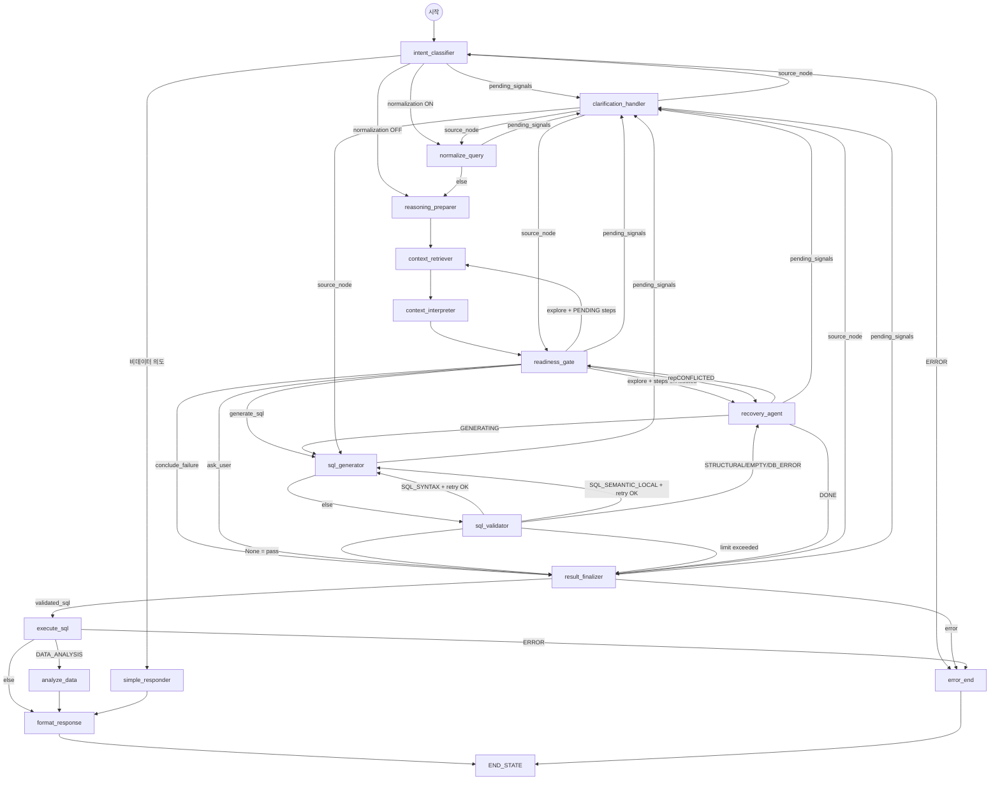

# Data Copilot — LangGraph 에이전트 아키텍처 설계 문서

> 은행 임직원의 자연어 데이터 추출/분석 요청을 LangGraph 파이프라인(Pipeline)으로 처리하는 AI 에이전트의 전체 구조, 컴포넌트 간 관계, 데이터 흐름을 정의한다.

**버전**: 2.2
**최종 수정**: 2026-04-03
**대상 독자**: 본 프로젝트의 설계·구현·운영에 참여하는 모든 구성원 및 AI 서브에이전트(Sub-Agent)

---

## 목차

1. [시스템 개요](#1-시스템-개요)
2. [LangGraph 그래프 설계](#2-langgraph-그래프-설계)
3. [정확한 요구사항 분석을 위한 설계 아이디어](#3-정확한-요구사항-분석을-위한-설계-아이디어)
4. [데이터 정합성 보장을 위한 설계 아이디어](#4-데이터-정합성-보장을-위한-설계-아이디어)
5. [노드별 상세 설계](#5-노드별-상세-설계)
6. [커넥터 아키텍처](#6-커넥터-아키텍처)
7. [향후 고도화 방향](#7-향후-고도화-방향)

---

## 1. 시스템 개요

Data Copilot은 은행 임직원이 **자연어로 데이터 추출/분석을 요청**하면,
사내 다양한 참조 정보를 기반으로 SQL을 생성하여 데이터를 추출하거나
데이터 기반 분석 결과를 반환하는 **LangGraph 기반 AI 에이전트**이다.

v2.0에서 **3계층 16노드 에이전틱 파이프라인**으로 전면 재설계되었다.
입력 정제(sanitize)는 `runner.py`에서 그래프 진입 전에 1회 수행하며,
그래프 내부에는 전처리 노드가 존재하지 않는다.

```
┌─────────────────────────────────────────────────────────────┐
│                    사용자 (은행 직원)                        │
│               "이번 달 신규 고객 수 알려줘"                 │
└────────────────────────┬────────────────────────────────────┘
                         │ WebSocket / REST API
                         ▼
┌─────────────────────────────────────────────────────────────┐
│                FastAPI 서버 (main.py)                        │
│         프롬프트 인젝션 감지 · PII 마스킹 · 세션 관리       │
└────────────────────────┬────────────────────────────────────┘
                         │
                         ▼
┌─────────────────────────────────────────────────────────────┐
│        runner.py — sanitize(NFKC, 인젝션 감지, 길이 제한)   │
└────────────────────────┬────────────────────────────────────┘
                         │
                         ▼
┌─────────────────────────────────────────────────────────────┐
│          LangGraph 파이프라인 (pipeline.py) — 16노드         │
│                                                             │
│  ┌─────────── Interpret 계층 ─────────────────────┐         │
│  │ intent_classifier → normalize_query           │         │
│  └──────────────────────┬────────────────────────┘         │
│                         │                                   │
│          ┌──────────────┴──────────────┐                    │
│          ▼                             ▼                    │
│  ┌─ clarification_handler ──┐   ┌─── Reason 계층 (에이전틱) ──┐  │
│  │ 통합 명확화 노드    │   │ reasoning_preparer            │  │
│  │                     │   │ → context_retriever            │  │
│  │ T1~T5 트리거        │   │ → context_interpreter       │  │
│  │ AmbiguitySignal     │   │ → readiness_gate            │  │
│  │ source_node 복귀    │←──│ → sql_generator             │  │
│  └────────────────────┘   │ → sql_validator              │  │
│                            │ → recovery_agent             │  │
│                            │ → result_finalizer           │  │
│                            └──────────┬──────────────────┘  │
│                                       │                     │
│                            ┌──────────┴──────────────────┐  │
│                            │  Present 계층               │  │
│                            │  execute_sql                │  │
│                            │  → [분석?] → analyze_data   │  │
│                            │  → simple_responder         │  │
│                            │  → format_response          │  │
│                            │  error_end                  │  │
│                            └─────────────────────────────┘  │
└─────────────────────────────────────────────────────────────┘
                         │
   ┌──────────┬──────────┬──────────┬──────────┐
   ▼          ▼          ▼          ▼          ▼
┌──────────┐┌──────────┐┌──────────┐┌──────────┐┌──────────┐
│Elastic   ││ MongoDB  ││PostgreSQL││  Qdrant  ││  Neo4j   │
│Search    ││메타·코드 ││정보계    ││업무매뉴얼││온톨로지  │
│보고서SQL ││용어사전  ││·이력DB   ││SQL이력   ││JOIN경로  │
└──────────┘└──────────┘└──────────┘└──────────┘└──────────┘
```

---

## 2. LangGraph 그래프 설계

### 2.1 설계 원칙

| 원칙 | 설명 |
|------|------|
| **단일 공유 상태** | `PipelineState` 하나를 모든 노드(Node)가 읽고 쓰며, 노드 간 데이터 전달 문제를 원천 차단한다 |
| **3계층 분리** | Interpret(이해) → Reason(추론) → Present(표현)로 관심사를 분리한다 |
| **에이전틱 추론 루프** | Reason 계층은 reasoning_preparer-fetcher-gate-generator-validator-recovery 순환으로 자율 탐색한다 |
| **통합 명확화 (Unified Clarification)** | `AmbiguitySignal` + `pending_signals`/`resolved_signals` 패턴으로 5개 트리거(T1~T5)를 단일 `clarification_handler` 노드에서 처리하고 `source_node`로 복귀한다 |
| **조건부 분기** | 9곳의 `_route_after_*` 라우팅 함수로 동적 분기한다 |
| **Fail-fast** | SQL 검증 실패·에러 발생 시 즉시 `error_end`로 분기하여 불필요한 LLM 호출을 방지한다 |
| **노드 독립성** | 각 노드는 순수 함수(입력 State → 출력 dict)로 구현하여 단위 테스트가 가능하다 |
| **커넥터 추상화** | Dummy/실제 모드를 설정만으로 전환할 수 있다 (폐쇄망 배포 대비) |
| **LLM 프로바이더 추상화** | `UnifiedLLMClient`가 Anthropic/OpenAI 호환 API를 동일 인터페이스로 래핑한다 |

### 2.2 그래프 정의 (StateGraph)

```python
# src/agents/graph/pipeline.py — 핵심 구조

workflow = StateGraph(PipelineState)

# ── Interpret 계층 (2노드) ──
workflow.add_node("intent_classifier",  intent_classifier_node)  # 이력 해소 + 의도 분류 통합
workflow.add_node("normalize_query",     normalize_query_node)     # 8-Slot 정규화

# ── 통합 명확화 (1노드) ──
workflow.add_node("clarification_handler",     clarification_handler_node)     # T1~T5 통합 명확화

# ── Reason 계층 (8노드, 에이전틱 루프) ──
workflow.add_node("reasoning_preparer",  reasoning_preparer_node)  # 규칙 기반 실행 계획 수립 (LLM 미사용)
workflow.add_node("context_retriever",     context_retriever_node)     # 도구 기반 검색 실행
workflow.add_node("context_interpreter", context_interpreter_node) # 검색 결과 해석, 지식 승격
workflow.add_node("readiness_gate",      readiness_gate_node)      # 준비도 판정 (SSOT)
workflow.add_node("sql_generator",       sql_generator_node)       # SQL 생성 (dialect 라우팅)
workflow.add_node("sql_validator",       sql_validator_node)       # 3-레이어 검증
workflow.add_node("recovery_agent",      recovery_agent_node)      # ReAct 스타일 복구
workflow.add_node("result_finalizer",    result_finalizer_node)    # 최종 상태 결정

# ── Present 계층 (5노드) ──
workflow.add_node("execute_sql",         execute_sql_node)         # DB 쿼리 실행
workflow.add_node("analyze_data",        analyze_data_node)        # 데이터 분석 + 시각화
workflow.add_node("format_response",     format_response_node)     # 보고서 포맷팅
workflow.add_node("simple_responder",    simple_responder_node)    # 비데이터 의도 경량 응답
workflow.add_node("error_end",           _handle_error)            # 에러 메시지 생성

workflow.set_entry_point("intent_classifier")
```

**노드 명명 규칙**: 그래프 노드 이름 = 파일명 = 함수명(`_node` 접미사 제외).
예: `"context_retriever"` → `context_retriever.py` → `context_retriever_node()`

**노드 디렉토리 구조:**

```
src/agents/nodes/
├── interpret/
│   ├── intent_classifier.py    # intent_classifier (이력 해소 + 의도 분류 통합)
│   ├── query_normalizer.py      # normalize_query
│   ├── clarification_handler.py # clarification_handler (통합 명확화)
│   └── 미사용_intent_classifier.py # (미사용) intent_classifier로 통합
├── reason/
│   ├── reasoning_preparer.py    # reasoning_preparer
│   ├── context_retriever.py       # context_retriever
│   ├── context_interpreter.py   # context_interpreter
│   ├── readiness_gate.py        # readiness_gate
│   ├── sql_generator.py         # sql_generator
│   ├── sql_validator.py         # sql_validator
│   ├── recovery_agent.py        # recovery_agent
│   ├── result_finalizer.py      # result_finalizer
│   └── tools.py                 # 도구 함수 모음
├── present/
│   ├── sql_executor.py          # execute_sql
│   ├── analyzer.py              # analyze_data
│   ├── formatter.py             # format_response
│   └── simple_responder.py      # simple_responder (비데이터 의도 경량 응답)
├── system_prompts.py
└── thinking_modes.py
```

### 2.3 조건부 분기 (Conditional Edges)

9개 라우팅 함수가 파이프라인의 동적 흐름을 결정한다.



**라우팅 함수 상세:**

#### (1) `_route_after_intent_classifier` — 이력 해소 + 의도 분류 후

| 조건 | 분기 대상 |
|------|-----------|
| `pending_signals` 존재 | `clarification_handler` |
| `status == ERROR` | `error_end` |
| 비데이터 의도 (CASUAL_TALK, META_QUESTION) | `simple_responder` |
| 데이터 의도 + normalization ON | `normalize_query` |
| 데이터 의도 + normalization OFF | `reasoning_preparer` |

#### (2) `_route_after_normalize` — 정규화 후

| 조건 | 분기 대상 |
|------|-----------|
| `pending_signals` 존재 | `clarification_handler` |
| 그 외 | `reasoning_preparer` |

#### (3) `_route_after_readiness_gate` — 준비도 판정 후

`evaluate_readiness(state.reason)` SSOT 판정 결과에 따른 분기:

| Verdict | 조건 | 분기 대상 |
|---------|------|-----------|
| `explore` | PENDING 스텝 잔존 | `context_retriever` (추가 탐색) |
| `explore` | PENDING 소진 | `recovery_agent` (recovery 전환) |
| `replan` | — | `recovery_agent` |
| `generate_sql` | — | `sql_generator` |
| `conclude_failure` | — | `result_finalizer` |
| `ask_user` | — | `result_finalizer` |
| — | `pending_signals` 존재 | `clarification_handler` |

#### (4) `_route_after_sql_generator` — SQL 생성 후

| 조건 | 분기 대상 |
|------|-----------|
| `pending_signals` 존재 (Cross-DB INFER 등) | `clarification_handler` |
| 그 외 | `sql_validator` |

#### (5) `_route_after_sql_validator` — SQL 검증 후 (FailureType 기반)

5가지 분기:

| FailureType | 조건 | 분기 대상 |
|-------------|------|-----------|
| `None` (통과) | — | `result_finalizer` (conclude_success) |
| `SQL_SYNTAX` | `generate_attempts < MAX_GENERATES` | `sql_generator` (fix_syntax) |
| `SQL_SYNTAX` | 한도 초과 | `result_finalizer` (conclude_failure) |
| `SQL_SEMANTIC_LOCAL` | `should_escalate_to_structural()` | `recovery_agent` (replan) |
| `SQL_SEMANTIC_LOCAL` | `generate_attempts < MAX_GENERATES` | `sql_generator` (fix_local) |
| `SQL_STRUCTURAL`, `EMPTY_RESULT`, `DB_ERROR`, `NO_KNOWLEDGE`, `NO_TABLE`, `TERM_UNRESOLVABLE`, `GENERATION_FAILED` | — | `recovery_agent` (replan) |
| 기타 | — | `result_finalizer` (conclude_failure) |

#### (6) `_route_after_recovery_agent` — 복구 에이전트 후

| 조건 | 분기 대상 |
|------|-----------|
| `pending_signals` 존재 | `clarification_handler` |
| `phase == GENERATING` | `sql_generator` |
| `phase == DONE` | `result_finalizer` |
| CONFLICTED + bounce 한도 이내 | `readiness_gate` |
| CONFLICTED + bounce 한도 초과 + score >= THRESHOLD | `sql_generator` (force-generate) |
| CONFLICTED + bounce 한도 초과 + score 미달 | `result_finalizer` (failure) |

#### (7) `_route_after_result_finalizer` — 최종 상태 결정 후

| 조건 | 분기 대상 |
|------|-----------|
| `pending_signals` 존재 | `clarification_handler` |
| `error_message` 존재 | `error_end` |
| `validated_sql` 존재 | `execute_sql` |
| 그 외 | `error_end` |

#### (8) `_route_after_execution` — SQL 실행 후

| 조건 | 분기 대상 |
|------|-----------|
| `status == ERROR` | `error_end` |
| `intent == DATA_ANALYSIS` | `analyze_data` |
| 그 외 | `format_response` |

#### `_route_after_clarify` — 통합 명확화 후 (source_node 복귀)

마지막 `resolved_signals[-1].source_node`로 복귀한다.
유효한 복귀 대상: `intent_classifier`, `normalize_query`,
`sql_generator`, `readiness_gate`, `result_finalizer`.

**통합 명확화 (Unified Clarification) 상세:**

`clarification_handler` 노드는 5개 트리거 지점(T1~T5)에서 발생하는 모든 명확화를 단일 흐름으로 처리한다:

| 트리거 | 발생 노드 | 사유 예시 |
|--------|-----------|-----------|
| T1 | `intent_classifier` | 대화 이력 UNSURE |
| T2 | `intent_classifier` | 의도 불분명 (AMBIGUOUS) |
| T3 | `normalize_query` | 8-Slot 파싱 불확실 |
| T4 | `sql_generator` | Cross-DB dialect INFER |
| T5 | `result_finalizer` | 사용자 확인 필요 |

각 트리거는 `AmbiguitySignal`을 `pending_signals`에 추가하고,
`clarification_handler`가 소비하여 LangGraph `interrupt`로 사용자 응답을 대기한 후
`resolved_signals`에 누적하고 `source_node`로 복귀한다.

### 2.4 공유 상태 (PipelineState + ReasoningState)

v2.0에서 **2계층 중첩 구조**로 재설계되었다.
`PipelineState`가 파이프라인 전체를, `ReasoningState`가 Reason 계층 내부를 담당한다.

```python
# src/agents/state/state.py

class PipelineState(BaseModel):
    # ── 공통 ──
    user_input: str                          # 원본 사용자 입력
    session_id: str                          # 세션 추적용
    original_query: str                      # 불변 원본 (감사 추적용)
    conversation_history: list[dict[str, str]]  # 멀티턴 대화 이력

    # ── Interpret 계층 ──
    preprocessed_input: str                  # runner.py에서 sanitize 후 설정 (노드 아님)
    intent: IntentType                       # 6가지 의도 (DATA_EXTRACTION, DATA_ANALYSIS,
                                             #   CLARIFICATION_NEEDED, GENERAL_QUESTION,
                                             #   CASUAL_TALK, META_QUESTION)
    intent_confidence: float                 # 분류 신뢰도 (0.0~1.0)
    query_category: str                      # 쿼리 카테고리 (여신, 수신 등)
    normalized_query: NormalizedQuery | None  # 8-Slot 정규화 결과

    # ── Unified Clarification ──
    pending_signals: list[AmbiguitySignal]   # 미처리 시그널 (덮어쓰기)
    resolved_signals: Annotated[             # 처리 완료 누적 (operator.add)
        list[AmbiguitySignal], operator.add]

    # ── 레거시 명확화 (이관 후 제거 예정) ──
    clarification_question: str
    clarification_response: str
    awaiting_clarification: bool
    clarification_turns: int

    # ── Reason 계층 (에이전틱 추론 — 중첩) ──
    reason: ReasoningState                   # ← 별도 모델로 중첩

    # ── Present 계층 ──
    context: ContextInfo                     # 수집된 참조 정보
    sql_result: SQLResult                    # SQL 실행 결과
    analysis_result: AnalysisResult          # 분석 결과
    visualization: VisualizationData         # 시각화 데이터
    formatted_response: str                  # 최종 사용자 응답

    # ── 상태 관리 ──
    status: QueryStatus                      # 현재 처리 상태
    error_message: str                       # 에러 메시지

    # ── 추론 추적 ──
    trace_log: list[TraceEntry]              # 노드별 추론 과정 기록
```

```python
class ReasoningState(BaseModel):
    """에이전틱 추론 루프의 내부 상태 (PipelineState.reason)."""

    # ── 진행 상태 ──
    phase: Phase                             # PLANNING→EXPLORING→VERIFYING→
                                             # GENERATING→VALIDATING→REPLANNING→DONE

    # ── 플래너 산출물 ──
    query_decomposition: dict                # 질의 분해 결과
    hypotheses: list[Hypothesis]             # 탐색 가설 목록
    current_hypothesis: Hypothesis | None    # 현재 활성 가설
    execution_plan: list[ExecutionStep]      # 탐색 실행 계획

    # ── 누적 지식 ──
    knowledge_items: list[KnowledgeItem]     # 탐색 중 축적된 지식 단위
    explored_use_cases: list[dict]           # 검색된 활용사례 SQL
    candidate_tables: list[CandidateTable]   # 후보 테이블 (ES/DB 파싱 결과)
    searched_queries: list[str]              # 중복 검색 방지용
    discovered_facts: list[str]              # 도구 실행 결과 해석 누적
    code_map: dict[str, CodeMeta]            # 코드 컬럼별 코드값 매핑

    # ── 실패 기록 ──
    dead_ends: list[DeadEnd]                 # 실패한 탐색 경로

    # ── SQL ──
    generated_sql: str | None                # LLM 생성 SQL
    validated_sql: str | None                # 검증 통과 SQL

    # ── SQL 검증 상세 ──
    validation_checks: dict[str, Any]        # 체크 항목별 판정 사유

    # ── 실패 맥락 ──
    failure_type: FailureType | None         # 실패 유형 (라우팅 분기 키)
    failure_reason: str | None               # 실패 상세 사유

    # ── 루프 제어 ──
    loop_guard: LoopGuard                    # total_tool_calls, replan_count,
                                             # generate_attempts, local_fix_count

    # ── Recovery 제어 ──
    exploration_phase: "initial" | "recovery" # 탐색 단계
    recovery_rounds: int                     # 복구 라운드 수
    last_verdict: str | None                 # 마지막 ReadinessVerdict
    recovery_entry_source: str | None        # "readiness_gate" | "sql_validator"
    conflicted_bounce_count: int             # CONFLICTED bounce 횟수
    is_force_generated: bool                 # force-generate 여부

    # ── 추론 메모 ──
    inference_notes: list[str]               # 추론 과정 메모 (규칙 기반 판단 근거)

    # ── 최종 출력 ──
    final_status: FinalStatus                # PENDING/SUCCESS/FAILURE
    exploration_summary: str                 # 탐색 과정 요약 텍스트
```

---

## 3. 정확한 요구사항 분석을 위한 설계 아이디어

요구사항에 명시된 **"정확한 분석"** 을 달성하기 위해 적용한 핵심 아이디어 7가지를 기술한다.

### 3.1 다중 소스 컨텍스트 수집 (Multi-Source RAG)

```
사용자 질의: "이번 달 담보대출 연체 현황 보여줘"
                    │
    ┌───────────────┼──────────────────────────┐
    ▼               ▼               ▼          ▼
 ES 메타검색     보고서 SQL       과거 SQL    Qdrant
    │               │               │          │
 TB_LOAN_INFO    연체율 추이      유사 SQL    연체 관리
 컬럼 정의       보고서 SQL       검증된 패턴 분류기준
    │               │               │          │
    └───────────────┴───────────────┴──────────┘
                    │
            ContextInfo (통합)
                    │
            SQL 생성 프롬프트에 전부 주입
```

**왜 이렇게 했는가:**

- 단일 소스(예: 테이블 메타만)로는 불완전한 IT 메타를 보완할 수 없다
- 과거 SQL 이력은 **"이미 검증된 패턴"** 을 제공하여 LLM의 환각을 줄인다
- 보고서 SQL은 **복잡한 계수산출식**(연체율, BIS비율 등)의 정확한 산출 방법을 제공한다
- 업무 매뉴얼은 **업무 규정**(연체 분류 기준 등)을 제공하여 조건식 정확도를 높인다

v2.0에서는 이 수집이 `context_retriever` + `context_interpreter` 2단계로 분리되었다.
`context_retriever`가 도구 기반으로 ES/Qdrant/DB 검색을 실행하고,
`context_interpreter`가 결과를 해석하여 `KnowledgeItem`으로 승격한다.
`readiness_gate`가 준비도를 판정하여 추가 탐색 또는 SQL 생성으로 분기한다.

### 3.1.1 검색 쿼리 전략 (SearchKeywords) — 2026-03-20 추가

기존에 `preprocessed_input`을 4개 소스에 동일하게 전달하던 구조에서,
**소스별 특화 쿼리를 생성하는 전략 계층**을 추가하였다.
현재는 `NormalizedQuery.search_keywords` (`src/agents/models/normalization.py`의 `SearchKeywords` 모델)와
`src/services/query_normalizer.py`의 후처리 로직으로 구현되어 있다.

```
NormalizedQuery 정규화 과정에서 search_keywords 자동 생성

preprocessed_input
  ├─ Step 1: 도메인 용어 매칭 (150+개 금융 용어 사전)
  ├─ Step 2: 구조화 엔티티 추출 (테이블명, 컬럼명, 카테고리)
  ├─ Step 3: 불용어 제거 (조사·어미·요청동사 60+개)
  ├─ Step 4: 동의어 확장 ("여신"→"대출","론","대여금")
  ├─ Step 5: 유사 테이블 신호어 수집
  └─ Step 6: 소스별 쿼리 특화
       ├─ ES table:   domain_cd 주입 + 테이블명 부스트 + 시간어 제거
       ├─ ES report:  시간 표현 제거 + 카테고리 보강
       ├─ History DB:  핵심 키워드 + 동의어 확장 + 테이블명 (15개 제한)
       └─ Qdrant:      원본 유지 + 도메인 설명 보강 (벡터 의미 강화)
```

**domain_cd 주입**: ES table_meta의 `table_name`이 keyword 타입이라 부분 검색이 불가하므로,
카테고리에서 추론한 `domain_cd`(LON, DEP, CUS, CRD, TRX 등)를 쿼리 선두에 주입하여
535개 테이블에서 도메인 필터링 효과를 얻는다.

**검증 결과 (골든셋 90건 E2E)**:
- ES table_meta: 98.9% (89/90)
- Qdrant sql_history: 85.6% (77/90)
- Qdrant biz_manual: 88.9% (80/90)
- 종합: 91.1% (246/270)

### 3.2 금융 도메인 사전 (Domain Dictionary)

```yaml
# resources/domain/business_dictionary.yaml

- term: 담보대출
  aliases: [담보여신, 유담보대출, 주담대, 주택담보대출]
  table_name: TB_LOAN_INFO
  column_name: LOAN_TYPE_CD
  condition: "LOAN_TYPE_CD = '02'"
  category: 여신
```

**해결하는 문제:**

| 문제 | 도메인 사전의 해결 방식 |
|------|----------------------|
| 사용자가 "주담대"라고 말하면? | aliases로 "담보대출"과 동일하게 인식한다 |
| 코드값 '02'가 뭔지 LLM이 모르면? | condition으로 정확한 WHERE절을 직접 제공한다 |
| 어떤 테이블을 써야 하는지 모호하면? | table_name으로 테이블을 사전에 지정한다 |
| "이번 달"이 SQL에서 어떻게 표현? | 시간 용어도 사전에 포함한다 (DATE_TRUNC 패턴) |

**흐름:**

```
사용자 입력 → lookup_terms() → 매칭된 DomainTerm 목록
                                      │
                          format_domain_context()
                                      │
                                      ▼
            SQL 생성 프롬프트의 "매칭된 도메인 용어"
            섹션에 주입
```

현재 **9개 카테고리, 150+개 용어**를 등록하고 있으며,
각 용어에는 **동의어(aliases)**, **테이블/컬럼 매핑**, **SQL 조건식**이 포함되어 있어
LLM이 코드값이나 테이블명을 추론하지 않고 **사전에서 정확한 값을 받아 사용**한다.

### 3.3 유사 테이블 구분 전략

정보계(Informational DB) DB에는 유사 도메인의 테이블이 다수 존재하는 문제가 있다.
(예: TB_LOAN_INFO vs TB_LOAN_OVERDUE_STAT — 둘 다 "대출 연체" 관련)

**적용한 구분 전략:**

1. **테이블 메타에 갱신주기 포함** — "일배치" vs "월배치" vs "실시간"으로 용도를 구분한다
2. **테이블 설명에 용도 명시** — "월말 기준 집계" 같은 힌트를 프롬프트에 전달한다
3. **보고서 SQL 참조** — 기존 보고서가 사용하는 테이블이 가장 신뢰도 높다
4. **도메인 사전의 table_name** — "연체율" 용어는 TB_LOAN_OVERDUE_STAT으로 직접 매핑한다

```
"연체율 추이 보여줘"
    │
    ├─ 도메인 사전: "연체율" → TB_LOAN_OVERDUE_STAT
    ├─ 보고서 SQL: "연체율 추이" 보고서 → 해당 테이블
    └─ ES 메타: 두 테이블 모두 반환, 설명+갱신주기로
       LLM이 판단
```

### 3.4 불완전한 IT 메타 보완 전략

행내에는 테이블/컬럼 설명이 불충분한 경우가 많다. 이를 보완하기 위한 다층 추론 전략을 적용한다.

```
                컬럼 설명이 불충분한 경우
                       │
    ┌──────────────────┼──────────────────┐
    ▼                  ▼                  ▼
1순위: 보고서 SQL  2순위: 과거 SQL    3순위: 컬럼명 패턴
해당 컬럼이 어떤   유사 요청에서      _CD → 코드
조건/집계로 사용   이 컬럼을 어떻게   _DT → 일자
되었는지 참조      사용했는지 참조    _AMT → 금액
    │                  │               _YN → Y/N 플래그
    └──────────────────┴───────────────────┘
                       │
          프롬프트에 모든 참조 정보를 주입하여
          LLM이 종합적으로 판단하도록 함
```

**코드 메타 자동 매핑:**

```python
# ES에서 코드 메타를 검색하여 도메인 용어에 자동 추가
# "01" → "신용대출", "02" → "담보대출" 등의 매핑을
# SQL 생성 프롬프트에 직접 주입
for code_val, code_desc in codes.items():
    domain_terms[code_desc] = f"{field} = '{code_val}'"
```

#### 3.4.1 테이블 설명 자동 보강 (Table Description Enrichment)

테이블 설명(table_description)은 보통 1~2줄의 엔티티 집합 정의만 되어 있어
SQL 생성 시 테이블의 용도와 특성을 정확히 파악하기 어렵다.
이를 해결하기 위해 **테이블 설명 자동 보강** 단계를 컨텍스트 수집에 추가했다.

**좋은 테이블 설명의 세 가지 관점:**

| 관점 | 설명 | 예시 |
|------|------|------|
| 엔티티 집합 정의 | 테이블에 어떤 데이터가 있는지 | "고객별 개별 대출 건의 현재 상태를 저장" |
| 기능적 정의 | 데이터가 어디에 어떻게 쓰이는지 | "여신 업무 전반에서 기본 참조 데이터로 활용" |
| 데이터 발생규칙 | 데이터가 언제 생성되어 적재되는지 | "일배치로 갱신, 대출 실행 시 행 생성" |

**보강 흐름:**

```
 컨텍스트 수집 (context_retriever → context_interpreter)
     │
     ├─ [1] ES/MongoDB에서 테이블 메타 수집
     │
     ├─ [2] 테이블 설명 보강 (table_meta_enricher.py)
     │       │
     │       ├─ 충분성 판단: 길이 ≥ 20자 AND
     │       │   3관점 키워드 포함?
     │       │   ├─ YES → 보강 생략
     │       │   └─ NO  → LLM 보강 호출 (병렬)
     │       │
     │       └─ 보조 정보 수집:
     │           ├─ 컬럼 정보 (이름, 타입, 설명, PII)
     │           ├─ 해당 테이블 참조 보고서 SQL
     │           └─ 해당 테이블 참조 과거 SQL
     │
     ├─ [3] 유사 테이블 그룹 감지
     │
     └─ KnowledgeItem으로 승격 (enriched_description 포함)
```

**SQL 생성 프롬프트에서의 활용:**

```markdown
### TB_LOAN_INFO - 여신(대출) 정보 테이블
[상세 설명] 고객별 개별 대출 건의 현재 상태를 저장하는
테이블로, 한 행이 하나의 대출 계약을 나타낸다. 대출
유형별 실행 현황 조회, 연체 관리 등 여신 업무 전반에서
기본 참조 데이터로 활용된다. 일배치로 매일 갱신되며,
대출 실행 시 행이 생성된다.
갱신주기: 일배치
컬럼: ...
```

**설계 결정:**

- 보강은 탐색 단계에서 수행한다 (SQL 생성 전)
- 불충분한 테이블만 선별하여 LLM을 호출한다 → 토큰 비용 최소화
- 여러 테이블을 `asyncio.gather`로 병렬 보강한다 → 지연 시간 최소화
- LLM 실패 시 원본 설명을 유지한다 → fail-safe

### 3.5 계수산출식 추론 전략

금융 지표(연체율, BIS비율 등)는 정확한 산출식이 필수이다.

**추론 경로 (우선순위):**

```
"연체율 보여줘"
    │
    ▼
1순위: 도메인 사전
    └─ "연체율" → description에 산출식 포함
    │
    ▼ (사전에 없는 경우)
2순위: 업무 매뉴얼 (Qdrant)
    └─ "연체 관리 기준" 문서에서 산출식 확인
    │
    ▼ (매뉴얼에도 없는 경우)
3순위: 보고서 SQL (ES)
    └─ "연체율 추이" 보고서 SQL에서 산출식 역추출
    │
    ▼ (모든 소스에서 확인 불가)
4순위: 사용자에게 확인 요청 (clarification_handler → AmbiguitySignal)
    └─ "연체율 산출 방식을 확인해주시겠어요?
        1) 연체금액 / 총 대출금액
        2) 연체건수 / 총 대출건수
        3) 다른 산출 방식"
```

### 3.6 의도 분류의 세분화

단순 "추출/분석" 이분법이 아닌, **6가지 의도 + 신뢰도 기반** 분류를 수행한다:

```python
# src/models/enums.py

class IntentType(str, Enum):
    DATA_EXTRACTION = "data_extraction"            # "~건수", "~금액", "~뽑아줘"
    DATA_ANALYSIS = "data_analysis"                # "~분석", "~비교", "~추이"
    CLARIFICATION_NEEDED = "clarification_needed"  # "데이터 뽑아줘" (모호)
    GENERAL_QUESTION = "general_question"           # "여신 심사 절차 알려줘"
    CASUAL_TALK = "casual_talk"                    # "안녕", "고마워" (잡담)
    META_QUESTION = "meta_question"                # "넌 뭘 할 수 있어?" (시스템 질문)
```

**핵심:** `intent_confidence`가 낮으면(< 0.7) 추측하지 않고 명확화 질문으로 분기한다.
이는 **"틀린 SQL을 생성하느니 질문하는 게 낫다"** 는 설계 철학을 반영한다.

비데이터 의도(CASUAL_TALK, META_QUESTION, GENERAL_QUESTION, CLARIFICATION_NEEDED)는
`clarification_handler`로 라우팅되어 사용자에게 안내 메시지를 제공하거나 명확화를 수행한다.

### 3.7 SQL 생성 프롬프트의 다층 컨텍스트 주입

SQL 생성 시 LLM에 제공하는 프롬프트 구조:

```
┌──────────────────────────────────────────────┐
│           시스템 프롬프트 구성                 │
├──────────────────────────────────────────────┤
│  1. 절대 규칙 (10개)                          │
│     SELECT 전용, 단일 쿼리, PII 보호 등       │
│                                              │
│  2. 테이블 정보 (ES 메타 + LLM 보강)          │
│     테이블명, 원본 설명, 갱신주기              │
│     [상세 설명] LLM 보강 3관점 설명            │
│     컬럼명, 타입, 설명, PII 여부               │
│                                              │
│  3. 보고서 SQL (ES 보고서 저장소)              │
│     유사 보고서의 검증된 SQL                    │
│                                              │
│  4. 과거 SQL 이력 (이력 DB)                   │
│     유사 요청에 사용된 기존 SQL                 │
│                                              │
│  5. 업무 매뉴얼 (Qdrant)                     │
│     관련 업무 규정, 산출식, 프로세스             │
│                                              │
│  6. 매칭된 도메인 용어 (도메인 사전)            │
│     용어 → 테이블, 컬럼, SQL 조건식 매핑        │
│                                              │
│  7. 도메인 용어 매핑 (코드 메타 포함)           │
│     "신용대출" → LOAN_TYPE_CD = '01'           │
│     "이번 달" → >= DATE_TRUNC(...)             │
│                                              │
│  8. 유사 테이블 구분 가이드                    │
│     유사 테이블 그룹별 구분 기준과 신호어        │
│                                              │
│  9. 구조적 힌트 (StructuralHints)             │
│     활용사례 SQL에서 추출한 조인·집계·날짜 패턴  │
│                                              │
│ 10. 검증 피드백 (재생성 시에만)                │
│     이전 SQL의 failure_type + 수정 지시         │
│                                              │
│ 11. 확인된 지식 항목 (KnowledgeItem)           │
│     탐색 중 축적된 CONFIRMED 지식               │
└──────────────────────────────────────────────┘
                    +
┌──────────────────────────────────────────────┐
│           사용자 메시지                        │
│  "이번 달 담보대출 연체 현황 보여줘"            │
└──────────────────────────────────────────────┘
                    ↓
               LLM 응답: 순수 SQL
```

---

## 4. 데이터 정합성 보장을 위한 설계 아이디어

### 4.1 3중 SQL 검증 체계

```
        사용자 입력
            │
    ┌───────▼──────────┐
    │  1차: 입력 정제    │  SQL/프롬프트 인젝션 감지
    │  (runner.py)      │  11개 SQL 패턴 + 프롬프트 패턴
    └───────┬──────────┘
            │
    ┌───────▼──────────┐
    │  2차: SQL 검증    │  ← 핵심 검증 단계
    │  (sql_validator)  │
    │                   │  a) 금지 패턴 검사 (17개 패턴)
    │                   │  b) sqlglot 구문 파싱 (PostgreSQL)
    │                   │  c) PII 컬럼 직접 노출 검사
    │                   │  d) LIMIT 존재 확인 (집계 예외)
    │                   │  e) 시스템 카탈로그 접근 차단
    │                   │  f) FailureType 기반 분류
    └───────┬──────────┘
            │
    ┌───────▼──────────┐
    │  3차: 커넥터 검증  │  실행 직전 SELECT 재확인
    │  (InfoDBConnector)│  CTE(WITH) 시작도 허용
    └───────┬──────────┘
            │
            ▼
       DB 실행 (읽기 전용 계정)
```

### 4.2 골든셋(Golden Set) 기반 다차원 정확도 평가

SQL 정합성을 **4개 차원**으로 측정한다:

```
┌─────────────────────────────────────────────┐
│              평가 차원 4가지                  │
├───────────────┬─────────────────────────────┤
│ 1. 의도 분류  │ 사용자 요청의 의도를 정확히   │
│   (intent)    │ 파악했는가?                   │
├───────────────┼─────────────────────────────┤
│ 2. 테이블 선택│ 올바른 테이블을 사용했는가?    │
│   (table)     │                             │
├───────────────┼─────────────────────────────┤
│ 3. SQL 패턴   │ 올바른 집계/조건/조인          │
│   (pattern)   │ 구조인가?                    │
├───────────────┼─────────────────────────────┤
│ 4. SQL 구문   │ 유효한 SQL 문법인가?          │
│   (syntax)    │ (sqlglot 파싱)               │
└───────────────┴─────────────────────────────┘

종합 판정:
  의도 ✓ AND 테이블 ✓ AND (패턴 ✓ OR 구문 ✓) = PASS
```

**골든셋 15건** 구성:

| 난이도 | 건수 | 예시 |
|--------|------|------|
| easy | 5건 | 단순 COUNT, SUM 집계 |
| medium | 6건 | GROUP BY + 다중 조건, JOIN |
| hard | 4건 | 계수산출식, 분기 비교, 다중 JOIN + 정렬 |

### 4.3 대용량 데이터 보호

```python
# 1) LIMIT 강제 — 비집계 쿼리에 LIMIT이 없으면 검증 실패
if "LIMIT" not in sql_upper and not _is_aggregate_query(sql_upper):
    errors.append("LIMIT 절이 필요합니다")

# 2) 결과 행 수 상한 — 설정 파일로 제어 (기본 10,000건)
max_rows = settings.max_query_rows
if len(rows) > max_rows:
    rows = rows[:max_rows]

# 3) 대용량 테이블 날짜 조건 강제 — 프롬프트 규칙으로 지정
# "TB_TRANSACTION 테이블은 반드시 TXN_DT 날짜 조건을 포함해야 함"
```

### 4.4 PII 보호 이중 장치

```
        SQL 생성 단계                 결과 반환 단계
            │                             │
  ┌─────────▼──────────┐       ┌──────────▼─────────┐
  │ 프롬프트 규칙       │       │ PII 마스킹          │
  │ "PII 컬럼 직접     │       │ 응답 텍스트에서      │
  │  SELECT 금지"       │       │ 주민번호, 전화번호   │
  └─────────┬──────────┘       │ 등 패턴 감지 후      │
            │                  │ 마스킹               │
  ┌─────────▼──────────┐       └──────────┬──────────┘
  │ SQL 검증기         │                  │
  │ PII_COLUMNS 목록과  │       010-1234-5678
  │ 대조하여 차단       │       → 01*****78
  └────────────────────┘
```

**PII 마스킹 대상** (`src/utils/security.py`):

- 주민등록번호, 카드번호, 계좌번호(하이픈 포함), 전화번호, 이메일

**SQL 검증 PII 차단 대상** (`src/agents/nodes/reason/sql_validator.py`):

- 직접 노출 금지: 주민번호(8개 변형), 카드번호(3개), 계좌번호(5개), 비밀번호(5개), CVC(4개), 외국인등록번호(2개) — 총 27개 컬럼명
- 마스킹 필요: 전화번호(6개), 이메일(3개), 생년월일(4개), 주소(5개), 고객명(2개) — 총 20개 컬럼명

### 4.5 에러 격리 및 사용자 안전 응답

```python
# 모든 LLM 호출 노드에 적용된 패턴:
try:
    response = await client.messages.create(...)
except Exception as e:
    logger.error("오류", error=str(e))  # 내부 로그에만 기록
    return {
        "status": QueryStatus.ERROR,
        "error_message": "사용자 친화적 메시지",  # 기술 정보 노출 없음
    }
```

### 4.6 파이프라인 추론 추적 (Pipeline Trace)

각 노드가 수행한 주요 결정·판단을 `TraceEntry`로 기록하여 추론 과정의 투명성을 제공한다.

**데이터 모델:**

```python
# src/models/trace.py

class TraceEntry(BaseModel):
    node: str       # 노드 이름 (이력해소, 의도분류, SQL생성, ...)
    action: str     # 수행한 작업 요약
    detail: str     # 상세 내용 (선택)
    timestamp: str  # UTC ISO 형식 자동 생성
```

**각 노드가 기록하는 추적 항목:**

| 노드 | 기록 내용 | 예시 |
|------|----------|------|
| intent_classifier | 이력 해소 + 분류 결과 | CONTINUE + DATA_EXTRACTION (97%) |
| normalize_query | 8-Slot 정규화 결과 | 대상: 고객, 기간: 이번 달, ... |
| reasoning_preparer | 실행 계획 수립 | 가설 2건, 실행 계획 3스텝 |
| context_retriever | 도구 실행 결과 | ES 테이블 3건, SQL 이력 2건 |
| context_interpreter | 지식 승격 결과 | KnowledgeItem 5건 CONFIRMED |
| readiness_gate | 준비도 판정 | generate_sql (score: 0.82) |
| sql_generator | 사용 테이블 + dialect | 사용 테이블: TB_CUST_INFO (PostgreSQL) |
| sql_validator | 검증 결과 | 3-레이어 검증 통과 |
| recovery_agent | 복구 전략 | 가설 교체, 추가 탐색 실행 |
| result_finalizer | 최종 상태 | SUCCESS, validated_sql 확정 |
| execute_sql | 결과 건수 + 실행 시간 | 쿼리 실행 완료 (342건, 15.2ms) |
| analyze_data | 인사이트 건수 + 시각화 | 데이터 분석 완료 (인사이트 3건, 시각화: bar_chart) |
| format_response | 보고서 정리 완료 | 보고서 형태로 결과 정리 완료 |

**3가지 노출 경로:**

1. **사용자 응답** — 포맷팅된 결과 끝에 `<details>` 접기로 "조회 과정 요약"을 표시한다
2. **REST API** — `include_trace: true` 파라미터 시 `trace` 배열을 반환한다
3. **CLI** — 실행 결과 아래에 추론 과정 목록을 출력한다

---

## 5. 노드별 상세 설계

### 5.1 통합 이력 해소 + 의도 분류 노드 (intent_classifier)

**책임**: 대화 이력 해소와 의도 분류를 단일 LLM 호출로 수행한다. 비데이터 의도는 `simple_responder`로 라우팅한다.

> **v3.2 변경:** 기존 `resolve_history` + `classify_intent` 2개 노드를 `intent_classifier` 단일 노드로 통합.
> 내부적으로 `services/intent_classifier.py`를 호출한다.

| 항목 | 내용 |
|------|------|
| 파일 | `src/agents/nodes/interpret/intent_classifier.py` |
| 입력 | `user_input`, `conversation_history` |
| 출력 | `preprocessed_input` (이력 반영), `intent`, `intent_confidence`, `query_category`, `pending_signals` |
| 이력 판정 | CONTINUE(이전 대화 연속) / NEW(신규 질의) / UNSURE(모호 → T1 트리거) |
| 의도 분류 | `DATA_EXTRACTION`, `DATA_ANALYSIS`, `CASUAL_TALK`, `META_QUESTION`, `AMBIGUOUS` |
| 분기 | UNSURE/AMBIGUOUS → `clarification_handler`, CASUAL_TALK/META_QUESTION → `simple_responder`, DATA → `normalize_query` |
| 폴백 | LLM 실패 시 → Legacy 분류기로 폴백 |

### 5.3 쿼리 정규화 노드 (normalize_query)

**책임**: 사용자 입력을 8개 Slot 구조로 정규화하여 후속 노드에 구조화된 입력을 제공한다.

| 항목 | 내용 |
|------|------|
| 파일 | `src/agents/nodes/interpret/query_normalizer.py` |
| 입력 | `preprocessed_input`, `intent` |
| 출력 | `normalized_query: NormalizedQuery`, `pending_signals` (불확실 시 T3 트리거) |
| 8-Slot | INTENT(의도), ENTITY(대상), MEASURE(측정값), DIMENSION(차원), FILTER(필터), TIME(시간), MODIFIER(수식어), OUTPUT_HINT(출력) |
| 조건 | `settings.normalization_enabled` 가 True일 때만 실행한다 |

### 5.4 통합 명확화 노드 (clarification_handler)

**책임**: 5개 트리거(T1~T5)에서 발생하는 모든 명확화를 단일 노드에서 처리한다.

| 항목 | 내용 |
|------|------|
| 파일 | `src/agents/nodes/interpret/clarification_handler.py` |
| 입력 | `pending_signals` |
| 출력 | `resolved_signals` (누적), `pending_signals` (비움) |
| 패턴 | `AmbiguitySignal`을 소비 → LangGraph `interrupt`로 사용자 응답 대기 → `resolved_signals`에 ASK/INFER 결정 누적 |
| 복귀 | `resolved_signals[-1].source_node`로 복귀 (6개 유효 대상) |
| 규칙 | 질문 2~3개, 선택지 형태, 기술 용어 금지 |

### 5.5 추론 준비 노드 (reasoning_preparer)

**책임**: normalized_query로부터 실행 계획(execution_plan)을 규칙 기반으로 결정적(deterministic)으로 생성한다. LLM을 호출하지 않으며 도구도 사용하지 않는다.

| 항목 | 내용 |
|------|------|
| 파일 | `src/agents/nodes/reason/reasoning_preparer.py` |
| 입력 | `preprocessed_input`, `normalized_query`, `intent` |
| 출력 | `reason.query_decomposition`, `reason.hypotheses`, `reason.execution_plan`, `reason.knowledge_items` (초기) |
| 특성 | 규칙 기반 (no LLM, no tools) — normalized_query에서 execution_plan을 결정적으로 생성한다 |
| 분기 | 항상 `context_retriever`로 직행한다 (직접 에지) |

### 5.6 검색 실행 노드 (context_retriever)

**책임**: reasoning_preparer의 `execution_plan`에 따라 도구(ES, Qdrant, DB)를 호출하여 검색을 수행한다.

| 항목 | 내용 |
|------|------|
| 파일 | `src/agents/nodes/reason/context_retriever.py` |
| 입력 | `reason.execution_plan`, `reason.searched_queries` |
| 출력 | `reason.candidate_tables`, `reason.explored_use_cases`, `reason.code_map`, `reason.discovered_facts`, `reason.loop_guard` (tool_calls 증가) |
| 도구 | `search_table_meta`, `search_use_cases`, `search_code_meta`, `sample_data`, `search_manual` 등 (`tools.py`) |
| 후속 | 항상 `context_interpreter`로 이동한다 |

### 5.7 컨텍스트 해석 노드 (context_interpreter)

**책임**: 검색 결과를 해석하여 `KnowledgeItem`의 상태를 승격(promote)한다.

| 항목 | 내용 |
|------|------|
| 파일 | `src/agents/nodes/reason/context_interpreter.py` |
| 입력 | `reason.knowledge_items`, `reason.candidate_tables`, `reason.explored_use_cases` |
| 출력 | `reason.knowledge_items` (상태 승격), `reason.discovered_facts` |
| 승격 | UNRESOLVED → INFERRED / CONFIRMED (증거 기반) |
| 후속 | 항상 `readiness_gate`로 이동한다 |

### 5.8 준비도 판정 노드 (readiness_gate)

**책임**: 현재 축적된 지식의 준비도를 평가하여 다음 행동을 결정한다.

| 항목 | 내용 |
|------|------|
| 파일 | `src/agents/nodes/reason/readiness_gate.py` |
| 입력 | `reason` (전체 ReasoningState) |
| 출력 | `reason.last_verdict` |
| SSOT | `evaluate_readiness()` (`src/services/confidence_scorer.py`) 단일 판정 함수 |
| Verdict | `explore` / `generate_sql` / `replan` / `conclude_failure` / `ask_user` |

### 5.9 SQL 생성 노드 (sql_generator)

**책임**: 축적된 지식(knowledge_items), 구조적 힌트(StructuralHints), 후보 테이블(candidate_tables)을 기반으로 LLM이 SQL을 생성한다.

| 항목 | 내용 |
|------|------|
| 파일 | `src/agents/nodes/reason/sql_generator.py` |
| 입력 | `preprocessed_input`, `reason.knowledge_items`, `reason.candidate_tables`, `reason.failure_type`/`failure_reason` (재생성 시) |
| 출력 | `reason.generated_sql`, `reason.loop_guard` (generate_attempts 증가) |
| LLM | 설정 모델 (timeout 30초, max_tokens 2,000) |
| Dialect | 설정에 따라 PostgreSQL / Sybase IQ / Impala 구문을 생성한다 |
| 재시도 | 진입 시 `generate_attempts`를 증가시키고 `failure_type` + `failure_reason`을 프롬프트에 주입한다 |
| 후처리 | 마크다운 코드 블록 제거하여 순수 SQL을 추출한다 |

### 5.10 SQL 검증 노드 (sql_validator)

**책임**: 생성된 SQL의 안전성과 유효성을 검증하고, 실패 시 FailureType을 분류한다.

| 항목 | 내용 |
|------|------|
| 파일 | `src/agents/nodes/reason/sql_validator.py` |
| 입력 | `reason.generated_sql` |
| 출력 | `reason.validated_sql` 또는 `reason.failure_type` + `reason.failure_reason` |
| 검증 항목 | 금지패턴(17개), 구문파싱(sqlglot), PII 컬럼(27개), LIMIT 강제, 시스템 카탈로그 차단 |
| FailureType | `None`(통과), `SQL_SYNTAX`, `SQL_SEMANTIC_LOCAL`, `SQL_STRUCTURAL`, `EMPTY_RESULT`, `DB_ERROR`, `NO_KNOWLEDGE`, `NO_TABLE`, `TERM_UNRESOLVABLE`, `GENERATION_FAILED` |
| 분기 | FailureType에 따라 6가지 경로로 라우팅된다 (2.3절 참고) |

### 5.11 복구 에이전트 노드 (recovery_agent)

**책임**: SQL 생성/검증 실패 시 ReAct 스타일로 가설을 교체하거나 추가 탐색을 수행한다.

| 항목 | 내용 |
|------|------|
| 파일 | `src/agents/nodes/reason/recovery_agent.py` |
| 입력 | `reason` (전체 ReasoningState), `reason.failure_type`, `reason.dead_ends` |
| 출력 | `reason.phase`, `reason.current_hypothesis`, `reason.execution_plan`, `reason.dead_ends`, `reason.recovery_rounds` |
| 전략 | 현재 가설 FAILED 처리 → PENDING 가설 활성화 → 새 execution_plan 수립, 가설 소진 시 DONE |
| 진입점 | `recovery_entry_source`: `"readiness_gate"` 또는 `"sql_validator"` |
| 분기 | GENERATING → `sql_generator`, DONE → `result_finalizer`, CONFLICTED → `readiness_gate` |

### 5.12 최종 상태 결정 노드 (result_finalizer)

**책임**: Reason 계층의 최종 상태를 결정하고 Present 계층으로 전환한다.

| 항목 | 내용 |
|------|------|
| 파일 | `src/agents/nodes/reason/result_finalizer.py` |
| 입력 | `reason` (전체 ReasoningState) |
| 출력 | `reason.final_status`, `reason.exploration_summary`, `context` (ContextInfo 복원), `error_message` (실패 시) |
| 상태 | `FinalStatus.SUCCESS` → `execute_sql`, `FinalStatus.FAILURE` → `error_end` |
| T5 | 사용자 확인이 필요한 경우 `pending_signals`를 생성하여 `clarification_handler`로 분기한다 |

### 5.13 SQL 실행 노드 (execute_sql)

**책임**: 검증 통과한 SQL을 정보계 DB에서 실행한다.

| 항목 | 내용 |
|------|------|
| 파일 | `src/agents/nodes/present/sql_executor.py` |
| 입력 | `reason.validated_sql` |
| 출력 | `sql_result` (SQLResult: columns, rows, row_count, execution_time_ms) |
| 안전장치 | SELECT/WITH 문 재확인, 결과 행 수 상한(10,000건) |

### 5.14 분석 노드 (analyze_data)

**책임**: 추출된 데이터를 기반으로 요약, 인사이트, 통계를 산출하고 시각화 차트를 생성한다.

| 항목 | 내용 |
|------|------|
| 파일 | `src/agents/nodes/present/analyzer.py` + `src/services/visualization/chart_generator.py` |
| 입력 | `sql_result`, `user_input` |
| 출력 | `analysis_result` (summary, insights, statistics), `visualization` (VisualizationData) |
| LLM | 설정 모델 (JSON 구조 응답 + 시각화 판단 + SVG 생성) |
| 재시도 | `llm_call_with_parse_retry`로 JSON 파싱 실패 시 재시도, 최종 실패 시 텍스트 폴백한다 |
| 시각화 | 3단계 하이브리드 — LLM 판단 → LLM SVG 생성 → 템플릿 폴백 (5.17절 참고) |

### 5.15 포맷팅 노드 (format_response)

**책임**: SQL 실행 결과 또는 분석 결과를 사용자 친화적인 보고서 형태로 변환한다.

| 항목 | 내용 |
|------|------|
| 파일 | `src/agents/nodes/present/formatter.py` |
| 입력 | `sql_result`, `user_input`, `trace_log` |
| 출력 | `formatted_response` |
| 규칙 | 기술용어 금지, 금액 단위 변환, 코드값→이름 변환, 표 형태 |
| 추론 추적 | 응답 끝에 `<details>` 접기로 "조회 과정 요약"을 추가한다 |

### 5.16 에러 종료 노드 (error_end)

**책임**: 에러 상태를 사용자 친화적 메시지로 변환한다.

| 항목 | 내용 |
|------|------|
| 파일 | `src/agents/graph/pipeline.py` (`_handle_error` 함수) |
| 입력 | `error_message`, `reason.loop_guard.generate_attempts` |
| 출력 | `formatted_response`, `status` (ERROR) |
| 메시지 | SQL 재시도 소진 시 전용 메시지, 그 외 일반 에러 + 다시 표현 안내 |

### 5.17 분석결과 자동 시각화

분석 의도(`data_analysis`)로 분류된 요청에 대해, 데이터 특성에 따라
LLM이 시각화 필요 여부를 판단하고 SVG 차트를 자동 생성한다.

**설계 원칙:**

- **LLM 주도 판단**: 시각화가 가독성을 높이는 경우에만 생성한다 (단순 1~2행 집계는 생략)
- **하이브리드 생성**: 고성능 LLM → 직접 SVG, 소형 로컬 LLM → 템플릿 폴백
- **보안 우선**: LLM 생성 SVG는 신뢰할 수 없는 입력으로 취급하여 새니타이징(Sanitizing)이 필수이다

**시각화 흐름:**

```
analyze_data 노드
    │
    ├─ [1] 데이터 분석 (DATA_ANALYSIS 프롬프트)
    │       → AnalysisResult
    │
    ├─ [2] 시각화 필요 판단 (행 수 ≥ 3 일 때만)
    │       │
    │       └─ LLM 호출 (VISUALIZATION_JUDGMENT)
    │           → CHART_TYPE + CHART_TITLE
    │
    ├─ [3-A] LLM 직접 SVG 생성 (고성능 모델)
    │       │
    │       └─ LLM 호출 (VISUALIZATION_SVG_GENERATION)
    │           → 순수 <svg>...</svg> 코드
    │
    └─ [3-B] 템플릿 폴백 (LLM SVG 실패 시)
            │
            └─ chart_generator.py
                → 서버사이드 SVG 생성
```

**차트 유형 판단 기준:**

| 데이터 특성 | 차트 유형 | 예시 |
|------------|----------|------|
| 시계열 + 수치 1개 | `line_chart` | 월별 대출 건수 추이 |
| 카테고리 + 수치 비교 | `bar_chart` | 지점별 실적 비교 |
| 전체 대비 구성 비율 | `pie_chart` | 여신 유형별 비중 |
| 복수 수치 카테고리 비교 | `stacked_bar` | 부서별 건수·금액 비교 |
| 단일 집계값 (1~2행) | `none` | 총 고객 수: 1,234명 |

**프론트엔드 렌더링:**

```
WebSocket 응답 JSON
    │
    ├─ "message": "마크다운 보고서 텍스트"
    │
    └─ "visualization": {
           "type": "svg",
           "code": "<svg>...</svg>",
           "chart_type": "bar_chart",
           "title": "지점별 실적 비교"
       }
         │
         ▼
    sanitizeSVG()
    ├─ <script>, <foreignObject> 등 제거
    ├─ on* 이벤트 핸들러 속성 제거
    ├─ javascript: URL 차단
    └─ xlink:href 내 javascript: 차단
         │
         ▼
    .viz-container 에 SVG 렌더링 + 다운로드 버튼
```

**보안 고려사항:**

| 계층 | 방어 |
|------|------|
| 서버 (템플릿 생성) | `html.escape()`로 레이블을 이스케이프한다 |
| LLM 프롬프트 | `<script>` 태그, `on*` 이벤트, `javascript:` URL 금지 규칙을 명시한다 |
| 클라이언트 | `sanitizeSVG()` — DOMParser 기반 화이트리스트 새니타이징을 수행한다 |

**폐쇄망 대응:**

소형 로컬 LLM은 복잡한 SVG를 안정적으로 생성하기 어려울 수 있다.
이를 위해 `chart_generator.py`가 템플릿 기반 폴백을 제공한다:

- LLM은 **차트 유형 + 제목만 판단**한다 (VISUALIZATION_JUDGMENT — 2줄 출력, 소형 모델도 가능)
- SVG 코드는 **Python 서버사이드에서 생성**한다 (외부 라이브러리 의존성 없음)
- 지원 차트: 막대(bar), 꺾은선(line), 원형(pie)

---

## 6. 커넥터 아키텍처

```
                    ConnectorManager (싱글턴)
                            │
 ┌──────────┬───────────┬───┼───────┬──────────┬──────────┐
 ▼          ▼           ▼   ▼       ▼          ▼          ▼
Elastic   MongoDB     InfoDB      HistoryDB  Qdrant     Neo4j
Search    Connector   Connector   Connector  Connector  Connector
Connector (메타·코드  (정보계     (이력 DB)  (업무매뉴얼 (온톨로지
(보고서SQL  용어사전)    외부:PG              SQL이력    그래프
 하위호환            내부:Sybase             벡터)     테이블관계
 table_meta)          +Impala)                         JOIN경로)
 │          │           │         │          │          │
 │  use_dummy=True/False (전체 공통)          │          │
 │          │           │         │          │          │
 ▼          ▼           ▼         ▼          ▼          ▼
Dummy      Dummy       Dummy     Dummy      Dummy      Dummy
 or         or          or        or         or         or
실제 ES   실제 Mongo  실제 PG/  실제 PG   실제       실제
연결       연결       Sybase/   연결      Qdrant     Neo4j
                      Impala              연결       연결
```

**설정 파일 하나로 Dummy↔실제 전환:**

```python
# src/connectors/manager.py

manager = get_connector_manager(use_dummy=True)   # 개발환경
manager = get_connector_manager(use_dummy=False)  # 폐쇄망 배포
```

**LLM 프로바이더 전환:**

```python
# src/utils/llm/client.py
# 환경 변수 LLM_PROVIDER로 전환

client = get_llm_client()
# llm_provider="anthropic"       → AsyncAnthropic
# llm_provider="openai_compatible" → AsyncOpenAI (Groq, OpenRouter 등)
```

### 6.1 인프라 변경 사항 (2026-03-20)

**ES nori 한글 분석기 적용:**

```text
devtools/scripts/seed_elasticsearch.py
  SHARD_SETTINGS에 korean analyzer 정의 (nori_tokenizer + nori_readingform)
  모든 text 필드: "analyzer": "standard" → "analyzer": "korean"

devtools/docker/docker-compose.dev.yml
  elasticsearch 서비스에서 nori 플러그인이 포함된 이미지를 사용
```

**효과:** "여신" 검색 2건→29건, "대출" 0건→7건, "고객" 0건→41건 (535개 테이블 기준)

**Qdrant 임베딩 모델 통일:**

```text
시딩 (seed_qdrant.py):   sentence-transformers/paraphrase-multilingual-MiniLM-L12-v2
조회 (qdrant_connector.py): intfloat/multilingual-e5-small → 시딩 모델과 동일하게 수정
```

차원(384)은 같았으나 임베딩 공간이 달라 유사도 검색 품질이 저하되고 있었음. 수정 후 정상화.

---

## 7. 향후 고도화 방향

| 영역 | 현재 상태 | 고도화 방향 |
|------|----------|------------|
| 에이전틱 추론 루프 | **v2.0 구현 완료** — 8노드 Reason 계층 (reasoning_preparer→fetcher→interpreter→gate→generator→validator→recovery→finalizer) | 멀티에이전트 분산 추론, 병렬 가설 탐색 |
| 통합 명확화 | **v2.0 구현 완료** — AmbiguitySignal + pending/resolved 패턴, T1~T5 트리거, source_node 복귀 | 컨텍스트 기반 자동 추론 비율 향상 (ASK 감소) |
| 이력 해소 | **v2.0 구현 완료** — intent_classifier 노드 (CONTINUE/NEW/UNSURE + 의도 분류 통합) | 장기 세션 대화 문맥 요약 |
| 8-Slot 정규화 | **v2.0 구현 완료** — normalize_query 노드 | Slot 정확도 개선, 복합 질의 분리 |
| SQL 재생성 | **v2.0 구현 완료** — FailureType 기반 분기 (6가지), recovery_agent ReAct 복구 | 자동 수정 전략 다양화 (부분 AST 수정) |
| 벡터 검색 (SQL 이력) | **v2.0 구현 완료** — Qdrant sql_history 컬렉션 (10,000건+), context_retriever에서 활용 | 임베딩 모델 고도화, 하이브리드 검색 |
| 유사 테이블 구분 | **구현 완료** — 5개 그룹, 신호어 기반 점수 + CandidateTable.selection_status | 임베딩 유사도 기반 테이블 추천으로 고도화 |
| 테이블 설명 보강 | **구현 완료** — 3관점 충분성 판단 + LLM 보강 + Semaphore 병렬 | 보강 결과 캐싱(Redis), 사용자 피드백으로 품질 개선 |
| LLM 포맷 재시도 | **구현 완료** — `llm_call_with_parse_retry` 공용 유틸리티 | 프로바이더별 최적 포맷 힌트 자동 선택 |
| 캐싱 | 설정만 존재 (Redis 미연동) | Redis 기반 동일 질의 캐싱 + 보강 설명 캐싱 |
| 분석결과 시각화 | **구현 완료** — LLM 판단 + SVG 생성 + 템플릿 폴백 | 인터랙티브 차트, 추가 차트 유형, PNG/PDF 내보내기 |
| 모델 교체 | Anthropic + OpenAI 호환 (설정으로 변경 가능) | 폐쇄망 로컬 LLM 대응 프롬프트 최적화 |
| 프로그램 저장소 | 미구현 | 프로그램 코드에서 SQL 패턴 추출 |
| Fast-Path | **v2.1에서 제거됨** — reasoning_preparer는 항상 context_retriever로 직행. 향후 캐시 기반 즉시 응답 계층으로 대체 검토 | 캐시 기반 즉시 응답 계층 추가 |
| planner → reasoning_preparer 리네임 | **v2.1 완료** — LLM 미사용 규칙 기반 노드로 전환, 노드명을 역할에 맞게 변경 | — |
| Dialect 라우팅 | **v2.0 구현 완료** — PostgreSQL/Sybase IQ/Impala 지원 | 폐쇄망 타겟 DB별 프롬프트 최적화 |

---

## 변경 이력

| 버전 | 날짜 | 변경 내용 | 작성자 |
|-----|------|---------|-------|
| 1.0 | 2026-03-19 | 최초 작성 | pipeline-designer |
| 1.1 | 2026-03-19 | 시각화, 추론 추적, 멀티턴 명확화 등 반영 | pipeline-designer |
| 1.2 | 2026-03-19 | 문서 작성 가이드 준수 형태로 전면 갱신: 메타 정보·목차·변경 이력 추가, 용어 영문 병기, 소스 코드 줄 번호 반영, 인젝션 패턴 수·PII 컬럼 수 등 코드 불일치 수정, LLM 프로바이더 추상화·포맷 재시도 등 누락 내용 보완 | doc-writer |
| 2.0 | 2026-04-01 | v2.0 3계층 파이프라인 전면 재설계 반영: 10노드→16노드, Interpret/Reason/Present 3계층 분리, 에이전틱 추론 루프(planner-fetcher-interpreter-gate-generator-validator-recovery-finalizer), 통합 명확화(clarification_handler + AmbiguitySignal + T1~T5), PipelineState+ReasoningState 2계층 중첩 상태, resolve_history·normalize_query 노드 추가, preprocessor 제거(runner.py로 이관), IntentType 6종(CASUAL_TALK/META_QUESTION 추가), FailureType 기반 SQL 검증 라우팅, Fast-Path·Dialect 라우팅, 노드 디렉토리 구조 반영 | doc-writer |
| 2.1 | 2026-04-02 | 구현 코드 정합성 반영: planner→reasoning_preparer 리네임(규칙 기반, LLM 미사용), Fast-Path 메커니즘 제거(직접 에지로 변경), fast_path_triggered 상태 필드 제거, inference_notes 필드 추가, 라우팅 함수 10→8곳으로 정정(_route_after_planner 제거), sql_validator에서 explore_after_fast_path 분기 제거, 커넥터 아키텍처에 MongoDB·Neo4j 추가 | doc-writer |
| 2.2 | 2026-04-03 | 구현 정합성 전면 재검증: server.py→main.py 정정, 라우팅 함수 8→9곳 정정(_route_after_execution 포함), 노드 디렉토리에서 존재하지 않는 history_resolver.py/intent_classifier.py 제거, search_query_builder.py→SearchKeywords(normalization.py) 반영, 8-Slot 명칭 정정(INTENT/ENTITY/MEASURE/DIMENSION/FILTER/TIME/MODIFIER/OUTPUT_HINT), chart_generator.py 경로 정정(services/visualization/), ES Dockerfile 참조 제거, services/history_resolver.py 참조 제거 | doc-writer |
