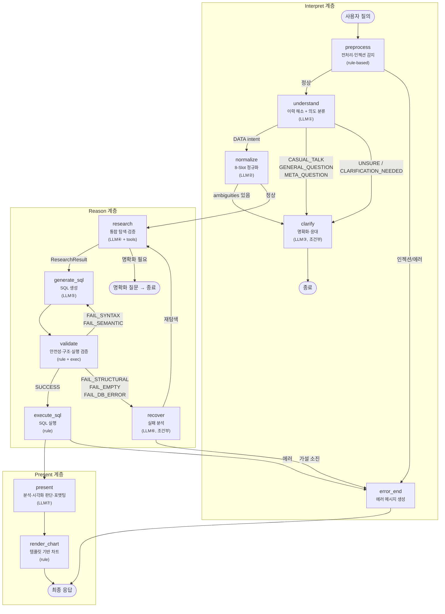
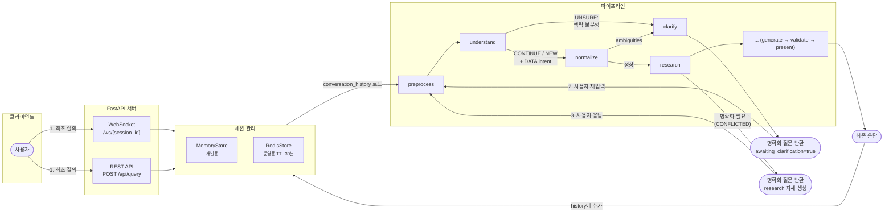
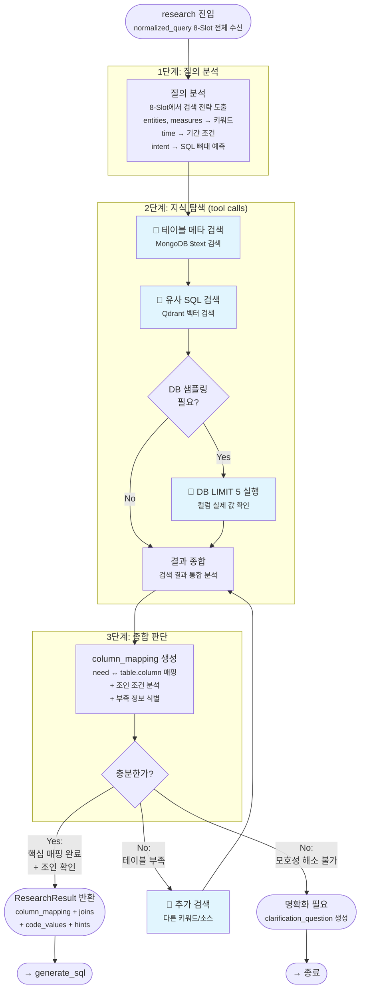
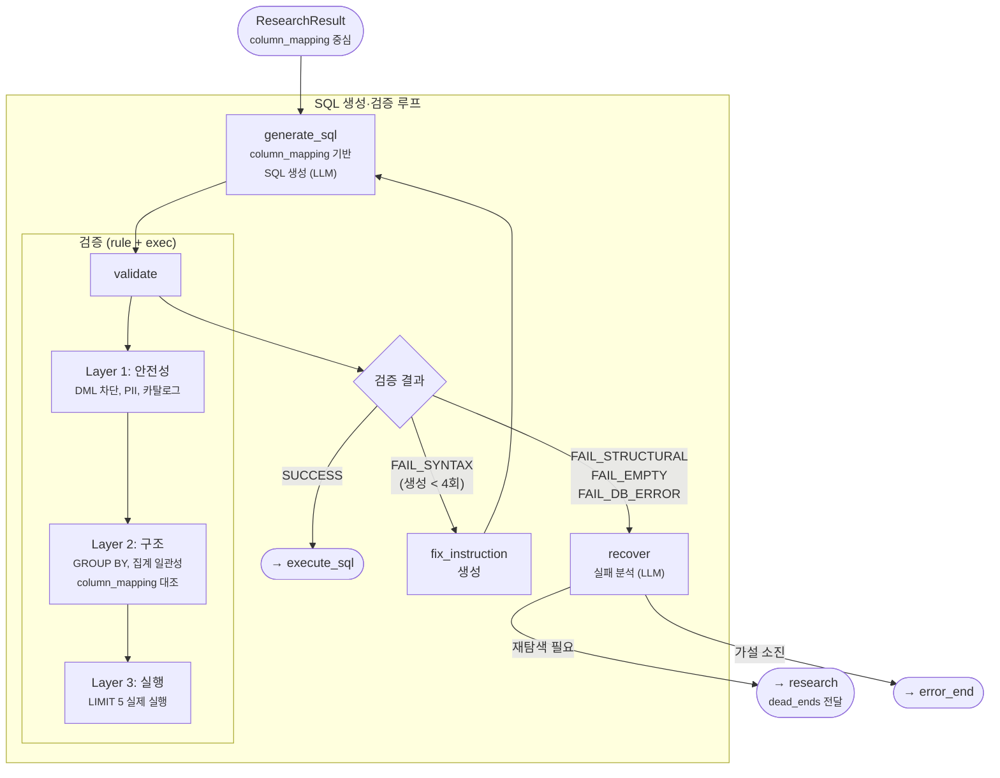
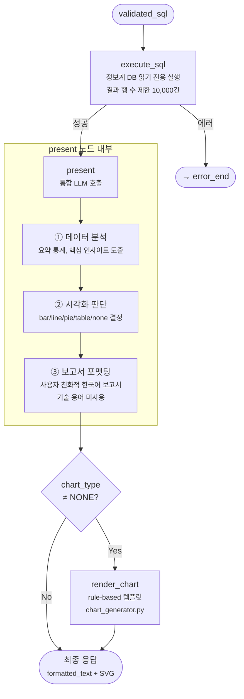
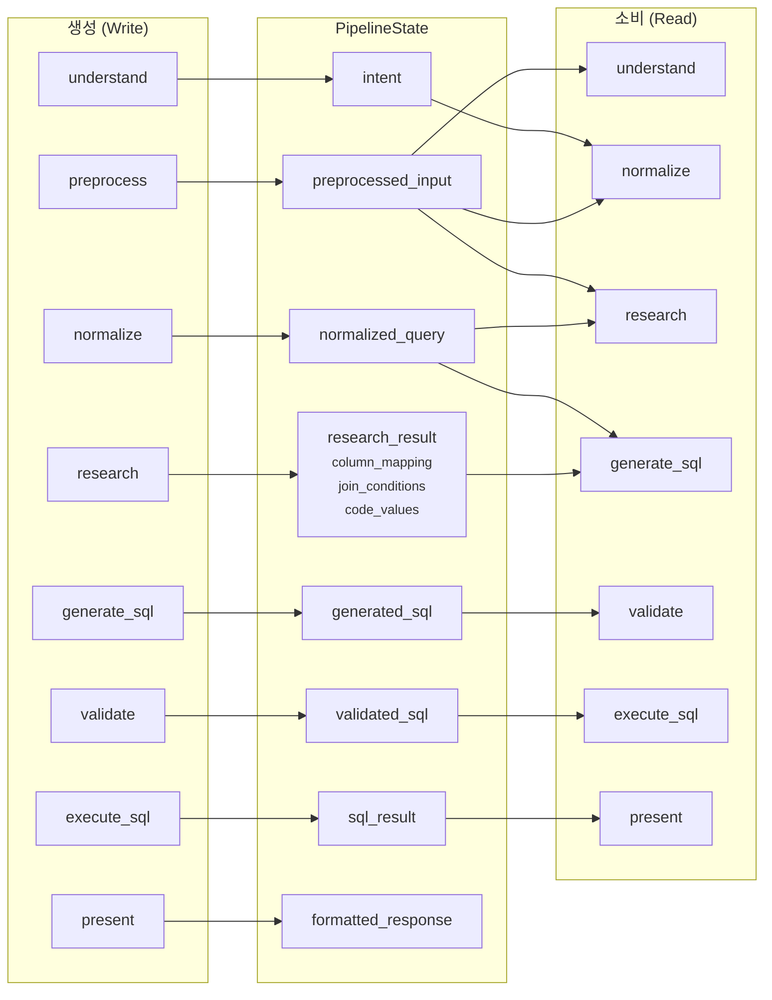

# Large-Model Pipeline Architecture — 재설계 제안서

> **Version 1.0** (2026-03-28)
> 추론 가능한 중대형 오픈소스 모델(Solar Pro 2 70B, Qwen3.5 397B, GPT OSS 120B)을
> 전제로, 현재 파이프라인의 구조적 문제를 해소하는 재설계안.

---

## 1. 현재 설계의 핵심 문제

### 1.1 문제 진단

현재 파이프라인은 **1개 질의 처리에 최소 9회, 최대 15+회의 LLM 호출**을 수행한다.

```text
현재 LLM 호출 맵 (1개 질의 처리)

Interpret (4회)
  ① history_resolver    — 3-way 분류 (CONTINUE/NEW/UNSURE)
  ② intent_classifier    — 6-way 분류 (Intent Gate)
  ③ query_normalizer P1  — 8-Slot 추출
  ④ query_normalizer P2  — 교차 검증 (선택적)

Reason (5~9회)
  ⑤ planner             — 가설 생성 + 실행계획 (LLM은 초기 검색에만)
  ⑥ context_explorer    — 배치 해석 (탐색 스텝당 1~3회)
  ⑦ table_verifier      — 테이블 충족성 검증
  ⑧ sql_generator       — SQL 생성
  ⑨ sql_validator L2b   — 의미 검증 (선택적)
  ⑩ recovery_planner    — 재계획 (실패 시)

Present (3~4회)
  ⑪ analyzer            — 통계·인사이트 생성
  ⑫ viz_judgment         — 차트 유형 판단
  ⑬ viz_svg             — SVG 생성 (선택적)
  ⑭ formatter           — 보고서 포맷팅
```

### 1.2 왜 문제인가

**문제 A: 정보 파편화**

각 LLM 호출이 state의 좁은 슬라이스만 받는다. sql_generator는 `normalized_query`의 8슬롯 중
4개만 `query_decomposition`으로 받고, `intent`, `time`, `output_hint`을 모른다.
table_verifier가 만든 `column_mapping`은 sql_generator에 도달하지 않는다.

**문제 B: 동일 추론의 반복**

"CUST_NO를 COUNT한다"는 사실이 planner(지식 초기화) → explorer(컬럼 발견) →
verifier(매핑 검증) → generator(SQL 작성)에서 **4번 독립적으로 추론**된다.
각 단계의 LLM이 이전 단계의 결론을 자기 방식으로 다시 해석해야 한다.

**문제 C: 문맥 단절**

각 LLM 호출은 독립된 메시지로 실행된다. planner가 "이 테이블이 유력하다"고 판단한 근거는
knowledge_items의 `evidence` 필드에 텍스트로 압축되어 다음 노드에 전달된다.
원래의 풍부한 추론 맥락(왜 그렇게 판단했는지)이 소실된다.

**문제 D: 과도한 세분화**

history_resolver(3-way 분류)와 intent_classifier(6-way 분류)는
추론 가능한 모델이라면 **한 번의 호출로 동시에 수행**할 수 있다.
query_normalizer의 Phase 2(교차 검증)도 Phase 1이 충분히 정확하면 불필요하다.

### 1.3 현재 설계에서 유지할 것

| 컨셉 | 이유 |
| ----- | ---- |
| **3계층 구분** (Interpret → Reason → Present) | 관심사 분리가 명확하고 디버깅·테스트에 유리 |
| **ConfidenceStatus 5단계 전이** | 점진적 확신 모델이 데이터 분석가의 사고와 정확히 대응 |
| **DeadEnd + 실패 기록** | 같은 실수를 반복하지 않는 핵심 메커니즘 |
| **LoopGuard** | 프로덕션 안정성에 필수적인 안전장치 |
| **8-Slot NormalizedQuery** | 질의의 구조적 이해를 위한 좋은 스키마 |
| **StructuralHints** | 과거 SQL 참조 패턴이 SQL 정확도에 직접 기여 |
| **Rule-based 검증** (Layer 1, 2a) | LLM 없이 빠르고 확실한 안전성·구조 검증 |

---

## 2. 재설계 원칙

### P1. 충분한 컨텍스트, 적은 호출 (Full Context, Fewer Calls)

각 LLM 호출에 **해당 단계에서 필요한 전체 맥락**을 제공한다.
좁은 슬라이스를 주고 재추론을 기대하는 대신, 이미 확보된 정보를 구조적으로 전달한다.

### P2. 단일 진실 원천 (Single Source of Truth)

같은 사실을 여러 필드에 저장하지 않는다.
`normalized_query`는 직접 참조하고, `column_mapping`은 한 곳에서 생성·소비한다.

### P3. 모델의 추론 능력 신뢰 (Trust the Reasoning)

70B+ 모델은 복합 판단이 가능하다. "3-way 분류"와 "6-way 분류"를 분리하지 않고
하나의 풍부한 컨텍스트에서 통합 판단하게 한다.

### P4. 외부 상호작용은 분리, 순수 추론은 통합 (Separate I/O, Merge Thinking)

도구 호출(ES 검색, DB 샘플링), SQL 실행 등 외부 I/O가 필요한 단계는 분리한다.
순수 LLM 추론만 하는 단계는 가능한 한 통합한다.

### P5. 점진적 전환 가능 (Incremental Migration)

현재 파이프라인과 **병렬 운용**할 수 있도록 설계한다.
한 번에 전체를 교체하지 않고, 계층별로 전환하면서 A/B 비교가 가능해야 한다.

---

## 3. 재설계 — Interpret 계층

### 3.1 AS-IS: 4개 LLM 호출

```text
preprocess (rule) → history_resolver (LLM①) → intent_classifier (LLM②)
  → normalizer_P1 (LLM③) → normalizer_P2 (LLM④, 선택)
  → clarify (LLM⑤, 조건부)
```

각 호출이 **이전 호출의 출력 1개만** 받는 직렬 구조.
history_resolver는 `conversation_history`만, intent_classifier는 `preprocessed_input`만,
normalizer는 `preprocessed_input`만 본다.

### 3.2 TO-BE: 2개 LLM 호출

```text
preprocess (rule, 변경 없음)
  → understand (LLM①) — 이력 해소 + 의도 분류 + 데이터/비데이터 판단
  → normalize (LLM②, DATA intent만) — 8-Slot 정규화 (단일 Phase)
  → clarify (LLM③, 조건부) — 변경 없음
```

#### `understand` 노드 — 통합 질의 이해

**입력:**

```text
[대화 이력] (최근 4턴)
[현재 입력]: {preprocessed_input}
```

**출력 (JSON):**

```json
{
  "is_continuation": true,
  "resolved_query": "이전 맥락이 병합된 독립 질의",
  "intent": "data_extraction",
  "confidence": 0.92,
  "needs_clarification": false
}
```

**이것이 가능한 이유:**

history_resolver의 3-way 분류(CONTINUE/NEW/UNSURE)와
intent_classifier의 6-way 분류는 **동일 입력(사용자 질의 + 대화 이력)**을 보고 판단한다.
70B+ 모델은 이 두 판단을 한 번의 추론에서 동시에 수행할 수 있다.
실제로 사람도 "이 질문이 이전 대화와 이어지는지"와 "데이터 요청인지 잡담인지"를
별도로 판단하지 않고 한 번에 파악한다.

**비판적 검토:**

- **찬성:** LLM 호출 2회 절약. 문맥 단절 없음 (history와 intent를 동시에 봄).
  `CONTINUE`인데 `CASUAL_TALK`인 경우("안녕, 아까 그 데이터 다시 보여줘") 같은
  복합 판단을 한 번에 처리 가능.
- **반대:** 출력 스키마가 복잡해짐 (history_decision + intent + query 재작성).
  하나가 틀리면 전체가 틀릴 수 있음 (history를 잘못 판단하면 intent도 틀림).
  디버깅 시 "history 판단이 틀렸는지 intent 판단이 틀렸는지" 분리가 어려움.
- **완화:** `is_continuation=UNSURE`일 때만 별도 명확화 경로로 빠지는 안전장치 유지.
  디버깅은 출력 JSON의 각 필드를 trace_log에 분리 기록하여 대응.

#### `normalize` 노드 — 단일 Phase 정규화

**변경점:**
- Phase 2(교차 검증) 삭제 — 397B/120B 모델은 Phase 1에서 충분히 정확
- `understand`에서 이미 `resolved_query`를 생성했으므로, normalizer는 이를 입력으로 사용
  (현재는 `preprocessed_input`을 사용하여 history 맥락이 반영되지 않는 경우 있음)

**비판적 검토:**

- **찬성:** LLM 1회 절약. Phase 2의 R1~R12 규칙은 rule-based 후처리로 대체 가능
  (현재도 `_post_process_normalized()`에서 일부 수행).
- **반대:** Phase 2가 잡아내는 미묘한 불일치(DIMENSION이 있는데 MEASURE의 agg가 NONE 등)를
  놓칠 수 있음. 다만 이는 Phase 1 프롬프트에 규칙을 직접 포함하면 해소 가능.
- **전환 전략:** Phase 2를 설정으로 on/off 할 수 있는 현재 구조를 유지.
  70B 모델에서 Phase 1만으로 충분한지 A/B 테스트 후 결정.

### 3.3 Interpret 계층 — 절감 효과

| 항목 | AS-IS | TO-BE | 절감 |
| ---- | ----- | ----- | ---- |
| LLM 호출 수 | 3~4회 | 1~2회 | **50~60%** |
| state 필드 | intent + intent_confidence + query_category + normalized_query | intent + normalized_query | **2개 감소** |
| 문맥 전달 | 각 호출에 단편 전달 | understand에 전체 맥락 | 단절 해소 |

---

## 4. 재설계 — Reason 계층

### 4.1 AS-IS: 5~9개 LLM 호출, 8개 노드

```text
planner (LLM) → explorer (LLM×N) → verifier (LLM) → evaluator (rule)
  → generator (LLM) → validator (rule+LLM) → recovery (LLM)
  → finalizer (rule)
```

**핵심 문제 재확인:**
- planner가 `normalized_query`를 `query_decomposition`으로 축소 (4/8 슬롯 유실)
- explorer의 배치 해석이 knowledge_items에 플랫하게 축적 (관계 없음)
- verifier의 column_mapping이 generator에 도달하지 않음
- generator가 10개 섹션의 중복 정보를 교차 대조해야 함
- evaluator(rule)와 verifier(LLM)가 비슷한 "준비 됐나?" 판단을 중복

### 4.2 TO-BE: 3~5개 LLM 호출, 5개 노드

```text
research (tool-augmented LLM) → generate_sql (LLM) → validate (rule+exec)
  → recover (LLM, 실패 시) → finalize (rule)
```

#### `research` 노드 — 통합 탐색·검증

현재 **planner + context_explorer + table_verifier + confidence_evaluator** 4개 노드를
하나의 tool-augmented LLM 호출로 통합한다.

**핵심 아이디어:**

현재 구조에서 각 노드가 하는 일을 분석가 관점에서 보면:
- planner: "무엇을 찾아야 하는지" 계획 → **생각하기**
- explorer: 실제로 ES/Qdrant/DB를 검색 → **찾기**
- verifier: "이걸로 되는지" 확인 → **생각하기**
- evaluator: "충분한지" 판단 → **생각하기**

"생각하기" 3번 + "찾기" 1번인데, 추론 가능한 모델이면 **"찾으면서 동시에 생각"**할 수 있다.

**설계:**

```python
class ResearchResult(BaseModel):
    """research 노드의 최종 산출물."""

    # 핵심: 질의 요구사항 ↔ 테이블.컬럼 검증된 매핑
    column_mapping: list[ColumnMapping]

    # 보조 지식: column_mapping에 담을 수 없는 것
    code_values: dict[str, list[str]]     # {"STATUS_CD": ["01=정상", "02=해지"]}
    date_conditions: list[str]            # ["STD_DT >= '20260301'"]

    # 조인 분석
    join_needed: bool = False
    join_conditions: list[JoinCondition]  # [{left_table, left_col, right_table, right_col}]

    # 참고 정보
    structural_hints: StructuralHints
    reference_sqls: list[str]

    # 탐색 메타
    confidence: float = 0.0
    reasoning: str = ""
    dead_ends: list[DeadEnd]
```

**실행 흐름:**

```text
research 노드 내부 흐름:

1. normalized_query(전체 8슬롯)를 분석하여 검색 전략 수립
   → "고객, 지점, 신규, 이번 달" 키워드 도출

2. 도구 호출: MongoDB 테이블 메타 검색
   → candidate_tables 획득

3. 도구 호출: Qdrant SQL 이력 검색
   → 유사 SQL + structural_hints 획득

4. 도구 호출: DB 샘플링 (필요 시)
   → 컬럼 실제 데이터 확인

5. 종합 판단: column_mapping 생성
   → need↔table.column 매핑 + 조인 분석 + 부족 정보 식별

6. 자체 판단: 충분한가?
   → Yes: ResearchResult 반환
   → No: 추가 도구 호출 (2~4 반복) 또는 명확화 필요 표시
```

**현재 대비 차이점:**

| 관점 | AS-IS (4노드) | TO-BE (1노드) |
| ---- | ------------- | ------------- |
| 검색 전략 | planner가 LLM으로 계획 → explorer가 순차 실행 | 모델이 검색하면서 전략을 적응적으로 조정 |
| 매핑 검증 | verifier가 별도 LLM 호출 | 검색 결과를 보면서 동시에 검증 |
| 준비도 판단 | evaluator(rule) + planner(LLM 재계획) | 모델이 "충분한지" 스스로 판단하고 필요 시 추가 검색 |
| 문맥 보존 | 각 노드 간 state 직렬화로 맥락 손실 | 단일 대화에서 추론 체인 유지 |

**비판적 검토:**

- **찬성 (강력):**
  - LLM 3~6회 → 1회 (tool calls 포함) 절약
  - 검색 결과를 보면서 판단하는 **적응적 탐색**이 가능 (현재는 계획→실행이 분리)
  - column_mapping이 탐색과 동시에 생성되므로 별도 verifier 불필요
  - 단일 추론 체인에서 "왜 이 테이블을 골랐는지"의 reasoning이 자연스럽게 생성

- **반대 (심각하게 고려):**
  - **토큰 비용 증가**: tool call이 반복되면 대화가 길어져 입력 토큰이 급증.
    현재 구조에서는 각 호출이 필요한 정보만 받지만, 통합 호출에서는 전체 검색 결과가 누적됨.
  - **디버깅 어려움**: 하나의 긴 추론 체인에서 어디서 잘못됐는지 찾기 어려움.
    현재 노드별 분리가 디버깅·A/B 테스트에 유리한 것은 사실.
  - **제어 어려움**: 모델이 도구를 "적절히" 호출한다는 보장이 없음.
    과도한 검색(토큰 낭비) 또는 부족한 검색(정보 누락)이 발생할 수 있음.
  - **LoopGuard 적용**: 현재의 `MAX_TOOL_CALLS=20` 같은 안전장치를
    tool-augmented 단일 호출 내에서도 유지해야 함.

- **완화:**
  - 도구 호출 횟수에 하드 리밋 설정 (현재 LoopGuard와 동일 개념)
  - 각 도구 호출 결과를 trace_log에 기록하여 디버깅 지원
  - 토큰 예산 관리: 검색 결과를 요약하여 컨텍스트 윈도우 관리

#### `generate_sql` 노드 — 구조화된 입력, 단순 출력

**research의 산출물(ResearchResult)을 직접 받아 SQL을 생성한다.**

**입력 (TO-BE):**

```text
<query>
지점별 이번 달 신규 고객 수 알려줘
</query>

<normalized>
intent: AGGREGATE
time: {type: RELATIVE, resolve: THIS_MONTH}
output_hint: {format: NONE}
</normalized>

<column_mapping>
| 필요 정보 | 테이블 | 컬럼 | 확신도 | 비고 |
|-----------|--------|------|--------|------|
| 고객 수(COUNT) | TB_ADW_CSC101M | CUST_NO | 확실 | |
| 지점(GROUP BY) | TB_ADW_CSC101M | BLNG_BRCD | 확실 | |
| 지점명(표시) | TB_ADW_COM001M | BR_NM | 확실 | JOIN 필요 |
| 기간 조건 | TB_ADW_CSC101M | RGST_DT | 확실 | 이번 달 기준 |
</column_mapping>

<join_conditions>
TB_ADW_CSC101M.BLNG_BRCD = TB_ADW_COM001M.BRCD
</join_conditions>

<supplementary>
- code:CUST_STAT_CD → 01=정상, 02=해지
- date:RGST_DT 형식 → char(8), 'YYYYMMDD'
</supplementary>

<reference_sql>
SELECT B.BR_NM, COUNT(*) AS 고객수
FROM TB_ADW_CSC101M A
JOIN TB_ADW_COM001M B ON A.BLNG_BRCD = B.BRCD
WHERE A.STD_DT = '20260228'
GROUP BY B.BR_NM
</reference_sql>

<dialect>postgresql</dialect>
```

**AS-IS 대비 변화:**

| AS-IS (10섹션) | TO-BE (7섹션) | 변화 |
| -------------- | ------------- | ---- |
| 사용자 질의 | `<query>` | 유지 |
| 질의 분해 (4슬롯만) | `<normalized>` (전체 8슬롯 중 핵심만) | **intent, time, output_hint 추가** |
| confirmed_terms (플랫 나열) | — | **삭제** (column_mapping으로 대체) |
| 사용할 테이블 (컬럼+샘플) | — | **삭제** (column_mapping에 흡수) |
| 조인 경로 | `<join_conditions>` | 구조화 |
| 구조적 힌트 | — | research 내부에서 소비, generator에는 미전달 |
| 활용사례 SQL | `<reference_sql>` | 유지 (1건만, 가장 유사한 것) |
| 실패한 접근 | `<dead_ends>` (재시도 시만) | 조건부 |
| fix_section | `<fix>` (재시도 시만) | 조건부 |
| SQL 문법 규칙 | `<dialect>` + 시스템 프롬프트 | 정적 규칙은 시스템에 유지 |

**핵심: column_mapping이 SQL 골격을 직접 안내한다.**

LLM은 column_mapping 테이블을 보고:
1. SELECT: CUST_NO → COUNT, BR_NM → 표시
2. FROM: TB_ADW_CSC101M (주 테이블)
3. JOIN: TB_ADW_COM001M ON BLNG_BRCD = BRCD
4. WHERE: RGST_DT로 이번 달 필터
5. GROUP BY: BLNG_BRCD (+ BR_NM)

를 **교차 대조 없이** 도출할 수 있다.

**비판적 검토:**

- **찬성:** 정보 중복 제거. normalized의 intent/time이 전달되어 SQL 뼈대 판단 개선.
  column_mapping이 "이 컬럼을 쓰라"는 명시적 지시이므로 환각 감소.
- **반대:** structural_hints를 generator에 안 주면, 과거 SQL 패턴(날짜 함수 사용법, ALIAS 패턴 등)의
  힌트가 사라짐. reference_sql 1건으로 충분한지?
- **완화:** reference_sql을 "가장 유사한 SQL 1~2건"으로 유지하되,
  structural_hints의 핵심 정보(date_filters 형식, 코드값)는 `<supplementary>`에 포함.

#### `validate` 노드 — LLM Layer 2b 제거

**변경점:**

- Layer 1 (안전성): 유지 — rule-based, SQL 인젝션·PII·카탈로그 차단
- Layer 2a (구조): 유지 — rule-based, GROUP BY 존재·집계 일관성
- **Layer 2b (의미 검증): 제거** — LLM이 query_decomposition과 SQL을 대조하던 것
- Layer 3 (실행): 유지 — LIMIT 5 실제 실행

**Layer 2b 제거 근거:**

research 단계에서 이미 column_mapping을 검증했고,
generate_sql이 이를 직접 참조하여 SQL을 생성했다.
"사용자가 원한 것과 SQL이 일치하는가"는 이미 column_mapping이 보장한다.
별도 LLM 호출로 재검증하는 것은 과잉.

**비판적 검토:**

- **반대:** column_mapping이 정확해도 sql_generator가 이를 무시하고 잘못된 SQL을 생성할 수 있음.
  Layer 2b는 "생성된 SQL이 정말 요구사항과 맞는지" 독립 검증.
- **완화:** Layer 2a의 rule-based 검증을 강화하여 "column_mapping의 모든 need가 SQL에 반영되었는지"를
  프로그래밍적으로 검증. LLM 없이도 `column_mapping.need` ↔ `SQL AST의 SELECT/WHERE`
  매칭을 sqlglot으로 수행 가능.

#### `recover` 노드 — 변경 최소

**현재 recovery_planner의 핵심 로직 유지.**

단, 재시도 시 research에 피드백하는 경로 추가:
- `FAIL_SYNTAX`, `FAIL_SEMANTIC_LOCAL` → generate_sql 재시도 (fix_instruction 전달)
- `FAIL_STRUCTURAL`, `FAIL_EMPTY`, `FAIL_DB_ERROR` → **research 재실행** (dead_end 전달)

현재는 recovery_planner가 새 hypothesis를 생성하고 explorer로 다시 보내는데,
TO-BE에서는 research에 `dead_ends`를 전달하여 같은 실수를 피하게 한다.

### 4.3 Reason 계층 — 절감 효과

| 항목 | AS-IS | TO-BE | 절감 |
| ---- | ----- | ----- | ---- |
| LLM 호출 수 | 5~9회 | 2~3회 | **55~65%** |
| 노드 수 | 8개 | 5개 | 3개 감소 |
| state 중복 필드 | query_decomposition, confirmed_join_path, cache_refs 등 | 제거 | 3+ 필드 |
| 정보 전달 경로 | 10섹션 중복 주입 | column_mapping 중심 단일 구조 | 중복 60%↓ |

---

## 5. 재설계 — Present 계층

### 5.1 AS-IS: 4개 LLM 호출

```text
execute_sql (rule) → analyzer (LLM⑪) → viz_judgment (LLM⑫)
  → viz_svg (LLM⑬) → formatter (LLM⑭)
```

### 5.2 TO-BE: 1~2개 LLM 호출

```text
execute_sql (rule, 변경 없음)
  → present (LLM①) — 분석 + 시각화 판단 + 포맷팅 통합
  → render_chart (rule) — 템플릿 기반 차트 생성
```

#### `present` 노드 — 통합 표현

현재 analyzer(통계·인사이트) → viz_judgment(차트 유형) → formatter(보고서)가
**같은 데이터를 3번 읽고 각각 다른 관점에서 처리**한다.
추론 가능한 모델이라면 한 번에:

1. 데이터를 분석하여 핵심 인사이트를 도출하고
2. 적절한 시각화 유형을 판단하고
3. 사용자 친화적 보고서로 포맷팅

할 수 있다.

**비판적 검토:**

- **찬성:** LLM 3회 → 1회. 분석과 포맷팅이 일관됨 (분석에서 발견한 인사이트를 그대로 포맷에 반영).
- **반대:** 출력이 매우 길어질 수 있음 (분석 결과 + 시각화 판단 + 포맷된 보고서).
  실패 시 전체를 재시도해야 함 (분리되어 있으면 실패한 부분만 재시도 가능).
- **완화:** 출력을 구조화된 JSON으로 (`{analysis, chart_type, formatted_text}`).
  SVG 생성은 분리하여 rule-based chart_generator로 처리 (현재 Tier 2 폴백을 기본으로).

---

## 6. 재설계 — State 구조

### 6.1 PipelineState (TO-BE)

```python
class PipelineState(BaseModel):
    """재설계 파이프라인 상태."""

    # ── 공통 (변경 없음) ──
    user_input: str = ""
    session_id: str = ""
    conversation_history: list[dict[str, str]]

    # ── Interpret (간소화) ──
    preprocessed_input: str = ""
    intent: IntentType = IntentType.UNKNOWN
    normalized_query: Optional[NormalizedQuery] = None  # ◀ Any → 타입화
    clarification_question: str = ""
    awaiting_clarification: bool = False
    clarification_turns: int = 0

    # ── Reason (재구조화) ──
    research: ResearchResult = Field(default_factory=ResearchResult)  # ◀ NEW
    generated_sql: Optional[str] = None
    validated_sql: Optional[str] = None
    sql_validation_result: Optional[SqlValidationResult] = None
    dead_ends: list[DeadEnd] = Field(default_factory=list)
    loop_guard: LoopGuard = Field(default_factory=LoopGuard)

    # ── Present (변경 없음) ──
    sql_result: SQLResult = Field(default_factory=SQLResult)
    analysis_result: AnalysisResult = Field(default_factory=AnalysisResult)
    visualization: VisualizationData = Field(default_factory=VisualizationData)
    formatted_response: str = ""

    # ── 관리 (변경 없음) ──
    status: QueryStatus = QueryStatus.PENDING
    error_message: str = ""
    trace_log: list[TraceEntry] = Field(default_factory=list)
```

### 6.2 제거된 필드

| 필드 | 제거 이유 |
| ---- | --------- |
| `intent_confidence` | understand 노드에서 trace_log에 기록, state 불필요 |
| `query_category` | intent로 충분, trace_log에 기록 |
| `clarification_response` | 다운스트림 참조 0건 |
| `reason: ReasoningState` (전체) | `ResearchResult` + 플랫 필드로 대체 |
| `context: ContextInfo` | `ResearchResult`에 흡수 |
| `query_decomposition` | normalized_query 직접 참조 |
| `confirmed_join_path` | ResearchResult.join_conditions |
| `knowledge_items` | ResearchResult.column_mapping + supplementary |
| `hypotheses`, `current_hypothesis` | research 노드 내부 추론으로 흡수 |
| `execution_plan`, `current_step_index` | research 노드 내부 흡수 |
| `candidate_tables` | research 내부 → column_mapping으로 결과만 노출 |
| `table_resolution` | research 내부 흡수 |
| `cache_refs` | 미사용 |
| `phase` | 노드 자체가 단계를 표현, 별도 Phase 불필요 |

### 6.3 ResearchResult — Reason의 새 핵심 산출물

```python
class ColumnMapping(BaseModel):
    """질의 요구사항 ↔ 테이블.컬럼 검증 매핑."""
    need: str           # "고객 수(COUNT)"
    table: str          # "TB_ADW_CSC101M"
    column: str         # "CUST_NO"
    confidence: str     # "확실" | "추정"
    role: str = ""      # "SELECT" | "GROUP_BY" | "FILTER" | "JOIN" | "DISPLAY"

class JoinCondition(BaseModel):
    """구조화된 조인 조건."""
    left_table: str
    left_column: str
    right_table: str
    right_column: str
    join_type: str = "INNER"

class ResearchResult(BaseModel):
    """research 노드의 통합 산출물."""
    column_mapping: list[ColumnMapping] = Field(default_factory=list)
    join_conditions: list[JoinCondition] = Field(default_factory=list)
    code_values: dict[str, list[str]] = Field(default_factory=dict)
    date_conditions: list[str] = Field(default_factory=list)
    structural_hints: StructuralHints = Field(default_factory=StructuralHints)
    reference_sqls: list[str] = Field(default_factory=list)
    confidence: float = 0.0
    reasoning: str = ""
```

**비판적 검토:**

- **찬성:** `ReasoningState`의 24개 필드가 `ResearchResult`의 8개 필드로 축소.
  "같은 사실이 여러 형태로 저장"되는 문제가 구조적으로 불가능.
  `column_mapping`이 단일 진실 원천.

- **반대 (심각):**
  - `ReasoningState`의 풍부한 중간 상태(knowledge_items의 UNRESOLVED→CONFIRMED 전이,
    hypothesis의 PENDING→ACTIVE→FAILED 전이)가 사라짐.
    탐색 과정의 **투명성과 디버깅 능력**이 대폭 감소.
  - `DeadEnd`의 세밀한 실패 기록(tried_tables, rejected_tables, failure_type)이
    research 노드 내부에 갇혀서 외부에서 접근 불가.
  - 현재의 `confidence_evaluator`가 제공하는 **수치적 준비도 판단**이 사라짐.
    research 노드의 "자체 판단"에 의존하게 되는데, 이 판단의 신뢰도를 어떻게 검증하나?

- **완화:**
  - research 노드의 tool call 로그를 `trace_log`에 상세 기록.
    "어떤 검색을 했고 → 무엇을 발견했고 → 왜 이 매핑을 선택했는지" 재구성 가능.
  - `ResearchResult.confidence`를 rule-based로 산출
    (column_mapping의 "확실" 비율 × reference_sql 존재 여부 등).
  - `dead_ends`는 state 최상위로 유지하여 recover → research 간 전달 보장.

---

## 7. 전체 파이프라인 비교

### 7.1 AS-IS

```text
preprocess → history_resolver(LLM) → intent_classifier(LLM) → normalizer(LLM×2)
  → [clarify(LLM)]
  → planner(LLM) → explorer(LLM×N) → verifier(LLM) → evaluator(rule)
  → generator(LLM) → validator(rule+LLM) → [recovery(LLM)]
  → finalizer(rule)
  → executor(rule) → analyzer(LLM) → viz_judgment(LLM) → [viz_svg(LLM)]
  → formatter(LLM)

노드: 17개  |  LLM 호출: 9~15회  |  State 필드: 45+개
```

### 7.2 TO-BE

```text
preprocess → understand(LLM) → normalize(LLM)
  → [clarify(LLM)]
  → research(LLM+tools) → generate_sql(LLM) → validate(rule+exec)
  → [recover(LLM)]
  → executor(rule) → present(LLM) → render_chart(rule)

노드: 10개  |  LLM 호출: 4~6회  |  State 필드: ~20개
```

### 7.3 비교 요약

| 차원 | AS-IS | TO-BE | 개선 |
| ---- | ----- | ----- | ---- |
| LLM 호출 수 | 9~15회 | 4~6회 | **55~60% 절감** |
| 노드 수 | 17개 | 10개 | **41% 감소** |
| State 필드 | 45+개 | ~20개 | **55% 감소** |
| 정보 중복 | 동일 사실 5~7형태 | 1~2형태 | **80% 감소** |
| sql_generator 입력 | 10섹션, 교차 대조 필요 | 7섹션, column_mapping 중심 | 직관적 |
| normalized_query 활용 | 4/8 슬롯만 전달 | 전체 8슬롯 직접 접근 | 완전 활용 |
| 디버깅 용이성 | 노드별 분리로 우수 | 통합으로 감소 | **트레이드오프** |

---

## 8. 파이프라인 흐름 다이어그램

### 8.1 노드 수준 전체 흐름

TO-BE 파이프라인의 전체 노드 연결을 보여준다.



### 8.2 세션 관리 및 멀티턴 흐름

대화 이력과 명확화 왕복을 포함한 세션 레벨 흐름이다.



**멀티턴 상태 전이:**

| 턴 | 사용자 입력 | understand 판정 | 결과 |
| -- | ---------- | -------------- | ---- |
| 1 | "데이터 좀 뽑아줘" | NEW + CLARIFICATION_NEEDED | clarify → 명확화 질문 |
| 2 | "이번달 여신 잔액" | CONTINUE + DATA_EXTRACTION | normalize → research → SQL 생성 |
| 3 | "그거 지점별로 나눠줘" | CONTINUE + DATA_EXTRACTION | resolved_query에 이전 맥락 합성 → 재실행 |
| 4 | "고마워" | NEW + CASUAL_TALK | clarify → 간단 응대 |

### 8.3 Reason 계층 — research 노드 상세 흐름

research 노드 내부의 tool-augmented 추론 루프를 보여준다.



**tool call 제한:**

| 제한 | 값 | 초과 시 |
| ---- | -- | ------ |
| 총 도구 호출 | 15회 | 현재까지의 결과로 강제 종료 |
| 단일 소스 재검색 | 3회 | 해당 소스 더 이상 검색 안 함 |
| 전체 토큰 예산 | 32K (입력+출력) | 검색 결과 요약 후 계속 |

### 8.4 SQL 생성·검증·복구 루프

generate_sql → validate → recover의 순환 구조를 보여준다.



**검증 실패 유형별 라우팅:**

| 검증 결과 | 조건 | 라우팅 |
| --------- | ---- | ------ |
| SUCCESS | — | → execute_sql |
| FAIL_SYNTAX | 생성 < 4회 | → generate_sql (fix_instruction) |
| FAIL_SYNTAX | 생성 ≥ 4회 | → recover |
| FAIL_STRUCTURAL | — | → recover → research 재실행 |
| FAIL_EMPTY | — | → recover → research 재실행 |
| FAIL_DB_ERROR | — | → recover → research 재실행 |

### 8.5 Present 계층 상세 흐름



### 8.6 데이터 흐름 — State 필드 라이프사이클

각 state 필드가 어디서 생성되고 어디서 소비되는지를 보여준다.



---

## 9. 리스크 분석

### 8.1 가장 큰 리스크: research 노드의 tool 사용 품질

research 노드가 "언제 어떤 도구를 호출할지"를 LLM이 판단한다.
이것이 현재의 planner(실행계획 생성) + explorer(순차 실행)보다 나은 결과를 내는지는
**모델과 프롬프트에 크게 의존**한다.

| 시나리오 | 현재 구조 | 제안 구조 | 위험도 |
| -------- | --------- | --------- | ------ |
| 모델이 도구를 과도하게 호출 | LoopGuard가 제한 | 도구 호출 횟수 제한 필요 | 중간 |
| 모델이 도구를 호출하지 않음 | 실행계획이 강제 | 프롬프트 가이드에 의존 | 높음 |
| 도구 결과를 잘못 해석 | batch_interpret LLM이 별도 해석 | research LLM이 직접 해석 | 중간 |
| 검색 결과가 방대 | 배치 단위로 분할 | 컨텍스트 윈도우 초과 위험 | 높음 |

**완화:**
- research 프롬프트에 **반드시 호출해야 하는 도구 최소 시퀀스**를 명시
  ("먼저 테이블 메타를 검색하고, 그 다음 유사 SQL을 검색하세요")
- 도구 결과 요약기(summarizer)를 rule-based로 구현하여 컨텍스트 관리
- research가 실패하면 현재 구조(planner+explorer)로 폴백하는 **이중 경로**

### 8.2 두 번째 리스크: understand 노드의 복합 출력

history_resolution + intent_classification + query_rewriting을 한 번에 출력하면
하나가 틀릴 때 전체가 틀리는 **연쇄 실패** 위험.

**완화:**
- 출력 JSON의 각 필드를 독립적으로 검증하는 rule-based 후처리
- `intent=UNKNOWN` 또는 `is_continuation=null` 시 현재 구조로 폴백

---

## 10. 전환 전략

### 10.1 단계별 전환 (Phase 1~3)

```text
Phase 1: Interpret 통합 (리스크 낮음)
  ├─ understand 노드 구현 (history_resolver + intent_classifier 통합)
  ├─ normalizer Phase 2 비활성화 테스트
  └─ A/B 비교: 현재 3~4 호출 vs understand 1호출

Phase 2: Present 통합 (리스크 낮음)
  ├─ present 노드 구현 (analyzer + viz_judgment + formatter 통합)
  ├─ chart_generator를 기본 시각화로 승격
  └─ A/B 비교

Phase 3: Reason 재설계 (리스크 높음, Phase 1-2 검증 후)
  ├─ research 노드 프로토타입 (tool-augmented)
  ├─ generate_sql 프롬프트 재설계 (column_mapping 중심)
  ├─ State 마이그레이션 (ReasoningState → ResearchResult)
  └─ 전체 E2E A/B 비교
```

### 10.2 각 Phase의 롤백 전략

| Phase | 롤백 방법 |
| ----- | --------- |
| Phase 1 | `settings.use_unified_interpret: bool = False`로 기존 3노드 경로 복구 |
| Phase 2 | `settings.use_unified_present: bool = False`로 기존 4노드 경로 복구 |
| Phase 3 | `settings.use_research_node: bool = False`로 기존 Reason 루프 복구 |

---

## 11. 종합 권고

### 이 재설계가 적합한 경우

- 타겟 모델이 **Qwen3.5 397B / GPT OSS 120B** 급으로 tool-augmented reasoning이 안정적
- SQL 정확도 향상이 **토큰 비용 증가**보다 중요
- 파이프라인 유지보수 복잡도를 줄이는 것이 팀 생산성에 기여

### 이 재설계가 부적합한 경우

- 타겟 모델이 **Solar Pro 2 70B**에서 tool calling 품질이 불안정
- 토큰 비용이 가장 중요한 제약 (research의 긴 대화가 비용 증가)
- 현재 파이프라인의 디버깅·추적 능력을 포기할 수 없음

### 최종 권고

**Phase 1(Interpret 통합)부터 시작하라.** 리스크가 가장 낮고, 효과가 즉시 측정 가능하며,
Phase 3(Reason 재설계)의 실현 가능성을 판단하는 데 필요한 경험을 축적할 수 있다.
Phase 1에서 "70B 모델이 복합 판단을 한 번에 잘 하는가"를 검증한 후,
Phase 3의 research 노드를 진행할지 결정한다.
