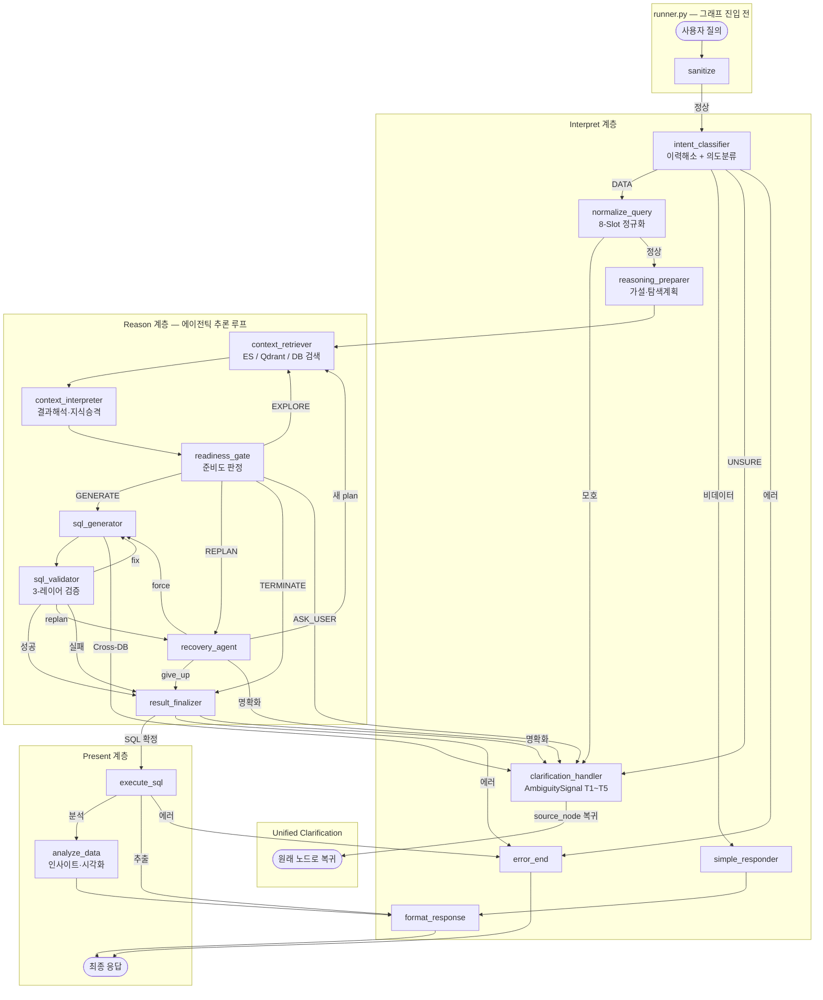
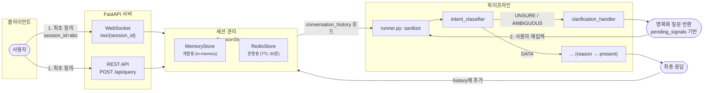
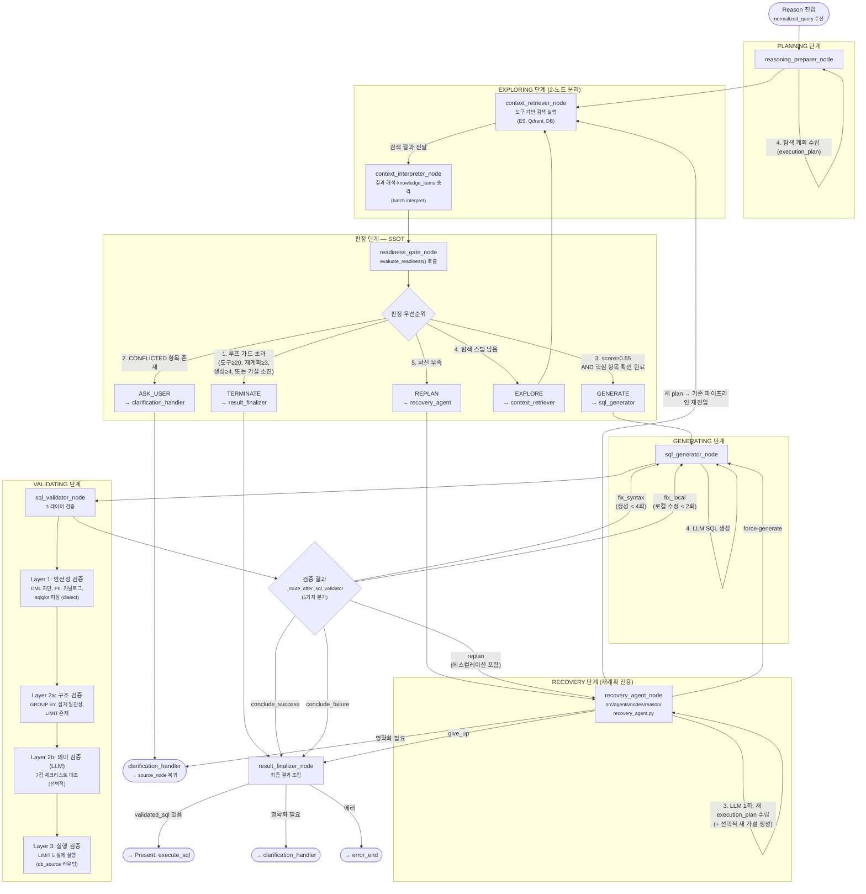

# Pipeline Architecture — Data Copilot

> **Version 3.3** (2026-04-02)
> 이 문서는 실제 구현 코드(`src/agents/graph/pipeline.py`)를 기반으로 작성되었으며,
> 사용자 질의 입력부터 최종 응답까지의 전체 처리 흐름을 기술한다.

---

## 1. 아키텍처 개요

3계층(interpret → reason → present) 단일 LangGraph 파이프라인으로 구성된다.

| 계층 | 역할 | 노드 |
|------|------|------|
| **Interpret** | 사용자 의도 해석 | intent_classifier, normalize_query |
| **Interpret** *(명확화)* | 통합 명확화 | clarification_handler (T1~T5 트리거, 모든 계층에서 진입) |
| **Reason** | 에이전틱 추론 루프 | reasoning_preparer, context_retriever, context_interpreter, readiness_gate, sql_generator, sql_validator, recovery_agent, result_finalizer |
| **Present** | 결과 생성 및 표현 | execute_sql, analyze_data, format_response, simple_responder, error_end |

> **Note:** 전처리(sanitize)는 그래프 노드가 아닌 `runner.py`에서 그래프 진입 전에 수행된다. 그래프의 진입점은 `intent_classifier`이다.

**핵심 소스 파일:**

| 파일 | 역할 |
|------|------|
| `src/agents/graph/pipeline.py` | 그래프 빌더 + 라우팅 함수 전체 |
| `src/agents/graph/runner.py` | 파이프라인 실행 진입점 (sanitize 전처리 포함) |
| `src/agents/state/state.py` | PipelineState, ReasoningState 정의 |
| `src/services/confidence_scorer.py` | 행동 판정 SSOT (evaluate_readiness) |
| `src/agents/nodes/reason/context_retriever.py` | 도구 기반 컨텍스트 검색 (ES, Qdrant, DB) |
| `src/agents/nodes/reason/context_interpreter.py` | 검색 결과 해석, knowledge_items 승격 |
| `src/agents/nodes/reason/recovery_agent.py` | 실패 후 재계획 전용 (execution_plan 재수립) |
| `src/agents/nodes/interpret/clarification_handler.py` | 통합 명확화 노드 (AmbiguitySignal 기반) |

---

## 2. 파이프라인 그래프 — 노드 수준 개요

전체 노드 연결을 한눈에 보여주는 그래프이다.



---

## 3. 세션 관리 및 멀티턴 흐름

대화 이력과 명확화 왕복을 포함한 세션 레벨 흐름이다.



**멀티턴 상태 전이:**

| 턴 | 사용자 입력 | intent_classifier 판정 | 결과 |
|----|-----------|---------------------|------|
| 1 | "데이터 좀 뽑아줘" | SKIP (이력 없음) → AMBIGUOUS | 명확화 질문 |
| 2 | "이번달 여신 잔액" | CONTINUE (명확화 응답) → DATA_EXTRACTION | 이전 맥락 + 현재 입력 합성 → 정규화 진행 |
| 3 | "그거 지점별로 나눠줘" | CONTINUE (지시대명사) → DATA_EXTRACTION | 이전 결과 + "지점별" 추가 → 재실행 |
| 4 | "오늘 날씨 어때?" | NEW → CASUAL_TALK | simple_responder → 정형 응답 |

**intent_classifier 내부 흐름:**

intent_classifier는 이력 해소와 의도 분류를 단일 LLM 호출로 통합한다.

1. 대화 이력 없음 → `SKIP` (이력 해소 LLM 호출 생략)
2. 이력 있음 → 룰 기반 게이트 → 필요 시 LLM 호출:
   - 지시대명사 ("그", "거기", "아까") → LLM 호출
   - 수정 표현 ("추가로", "빼고") → LLM 호출
   - 짧은 입력 (≤10자) → LLM 호출
   - 명확화 응답 패턴 ("1번", "2)") → LLM 호출
3. 이력 판정: `CONTINUE` / `NEW` / `UNSURE`
4. 의도 분류: `DATA_EXTRACTION` / `DATA_ANALYSIS` / `CASUAL_TALK` / `META_QUESTION` / `AMBIGUOUS`

**세션 스토어 구현:**

| 구현체 | 키 | TTL | 용도 |
|--------|-----|-----|------|
| `MemoryStore` | dict key = session_id | FIFO (100건) | 개발/테스트 |
| `RedisStore` | `session:{sid}:history` | 슬라이딩 30분 | 운영 |
| `RedisStore` | `session:{sid}:clarify` | 고정 5분 | 명확화 상태 |

---

## 4. Reason 계층 — 에이전틱 추론 상세 흐름

Reason 계층은 탐색-판정-생성-검증-복구의 순환 루프를 통해 SQL을 점진적으로 완성한다.

### 4.1 상태 모델 (ReasoningState)

`src/agents/state/state.py`의 `ReasoningState`가 추론 루프 전체 상태를 관리한다.

**Phase 전이:**
```
PLANNING → EXPLORING → VERIFYING → GENERATING → VALIDATING → REPLANNING → DONE
```

**핵심 필드:**

| 필드 | 타입 | 역할 |
|------|------|------|
| `phase` | `str` (7가지) | 현재 추론 단계 |
| `knowledge_items` | `list[KnowledgeItem]` | 수집된 지식 (테이블, 컬럼, 조건 매핑) |
| `hypotheses` | `list[Hypothesis]` | 탐색 가설 (상태: PENDING/ACTIVE/SUCCESS/FAILED) |
| `execution_plan` | `list[ExecutionStep]` | 탐색 도구 실행 계획 |
| `candidate_tables` | `list[CandidateTable]` | 후보 테이블 목록 |
| `dead_ends` | `list[DeadEnd]` | 실패한 가설 기록 |
| `loop_guard` | `LoopGuard` | 루프 제어 카운터 |
| `exploration_phase` | `str` (initial/recovery) | 현재 탐색 페이즈 (context_retriever vs recovery_agent 경유) |
| `recovery_entry_source` | `str` | recovery_agent 진입 출발 노드 |
| `conflicted_bounce_count` | `int` | CONFLICTED 항목으로 인한 clarify 왕복 횟수 |
| `is_force_generated` | `bool` | 루프 가드 한계 도달로 인한 강제 생성 여부 |
| `pending_signals` | `list[AmbiguitySignal]` | clarification_handler 대기 중인 모호성 시그널 |
| `resolved_signals` | `list[AmbiguitySignal]` | clarification_handler에서 해소 완료된 시그널 |

**지식 항목(KnowledgeItem) 상태 전이:**
```
UNRESOLVED → CANDIDATE → PROBABLE → CONFIRMED
                                  ↘ CONFLICTED → (사용자 확인)
```

### 4.2 상세 추론 흐름 다이어그램



### 4.3 확신도(Confidence Score) 계산

`services/confidence_scorer.py`의 `calculate_readiness()`가 0.0~1.0 점수를 산출한다.

**3차원 가중 평균:**

| 차원 | 가중치 | 계산 방식 |
|------|--------|----------|
| **용어 해소율** (term_resolution) | 50% | `CONFIRMED/PROBABLE 항목 수 / 전체 knowledge_items 수` |
| **유사 SQL 매칭** (use_case_match) | 30% | `탐색된 use_cases 중 최대 similarity 값` |
| **조인 경로 확인** (join_path) | 20% | `다중 테이블이면 조인 경로 확인 여부, 단일 테이블이면 1.0` |

**임계값:**
- `≥ 0.65` + 핵심 항목 전부 확인 → **GENERATE**
- `≤ 0.30` → **REPLAN** (가설 자체 교체)

### 4.4 루프 가드 (LoopGuard)

무한 루프를 방지하는 카운터 기반 안전장치이다 (`state.py`).

| 카운터 | 한계 | 초과 시 |
|--------|------|--------|
| `total_tool_calls` | 20 | `should_terminate()` = True → TERMINATE |
| `replan_count` | 3 | 동일 |
| `generate_attempts` | 4 | 동일 |
| `local_fix_count` | 2 | `should_escalate_to_structural()` → REPLAN 에스컬레이션 |

**should_terminate() 조건:**
```python
total_tool_calls >= 20
OR replan_count >= 3
OR generate_attempts >= 4
OR final_status == "failure"
OR (pending 가설 없음 AND current_hypothesis 없음)
```

### 4.5 SQL 검증 실패 유형별 라우팅

`_route_after_sql_validator()` (pipeline.py)이 실패 유형에 따라 5가지 경로로 분기한다.

| 검증 결과 | 조건 | 라우팅 | 설명 |
|----------|------|--------|------|
| `SUCCESS` | — | → result_finalizer | SQL 확정 |
| `FAIL_SYNTAX` | generate_attempts < MAX_GENERATES | → sql_generator (`fix_syntax`) | 구문 오류 수정 재시도 |
| `FAIL_SEMANTIC_LOCAL` | local_fix < MAX_LOCAL_FIXES | → sql_generator (`fix_local`) | GROUP BY 누락 등 로컬 수정 |
| `FAIL_SEMANTIC_LOCAL` | local_fix ≥ MAX_LOCAL_FIXES | → recovery_agent (`replan`) | 에스컬레이션: 가설 자체 교체 |
| `FAIL_STRUCTURAL` | — | → recovery_agent (`replan`) | 테이블/컬럼 불일치 |
| `FAIL_EMPTY` | — | → recovery_agent (`replan`) | 결과 0건 |
| `FAIL_DB_ERROR` | — | → recovery_agent (`replan`) | DB 실행 오류 |
| 기타 / 한계 초과 | — | → result_finalizer (`conclude_failure`) | 최종 실패 처리 |

---

## 5. Interpret 계층 상세

### 5.1 전처리 (runner.py — 그래프 진입 전)

> **v3.1 변경:** `preprocess` 노드가 제거되고, 전처리(sanitize)가 `runner.py`의 그래프 호출 전 단계로 이동하였다.
> 그래프의 진입점은 `intent_classifier`이다.

LLM 호출 없이 입력을 정규화하고 보안 위협을 사전 차단한다.

- 유니코드 NFKC 정규화
- 입력 길이 제한 (500자)
- SQL 인젝션 감지 (키워드 + 패턴)
- 프롬프트 인젝션 감지 (13종 패턴)
- 공백 정규화

### 5.2 이력 해소 + 의도 분류 (intent_classifier_node)

> **v3.2 변경:** 기존 `resolve_history` + `classify_intent` 2개 노드가 `intent_classifier` 단일 노드로 통합되었다.
> 위치: `src/agents/nodes/interpret/intent_classifier.py`
> 내부적으로 `services/intent_classifier.py`를 호출한다.

intent_classifier는 이력 해소와 의도 분류를 단일 LLM 호출로 수행한다.
비데이터 의도(CASUAL_TALK, META_QUESTION)는 `simple_responder`로 라우팅된다.

**의도 분류 결과:**

```text
DATA_EXTRACTION — 데이터 추출 요청 → normalize_query
DATA_ANALYSIS   — 데이터 분석 요청 → normalize_query
CASUAL_TALK     — 인사/잡담 → simple_responder
META_QUESTION   — 시스템 기능 질문 → simple_responder
AMBIGUOUS       — 모호 → clarification_handler
```

**폴백:** LLM 실패 시 → Legacy 분류기로 폴백

### 5.3 질의 정규화 (normalize_query_node)

자연어를 8-Slot 구조화 모델(`NormalizedQuery`)로 변환한다.

| 슬롯 | 설명 | 예시 |
|------|------|------|
| INTENT | 질의 유형 | AGGREGATE, RANK, COMPARE, TREND |
| ENTITY | 대상 엔티티 | {"term": "대출", "type": "DIRECT"} |
| MEASURE | 측정 지표 | {"term": "건수", "agg_function": "COUNT"} |
| DIMENSION | 분류 축 | {"term": "지점", "role": "GROUP"} |
| FILTER | 조건 | {"column": "상태", "op": "EQUALS", "value": "정상"} |
| TIME | 시간 범위 | {"type": "RELATIVE", "base_period": "이번달"} |
| MODIFIER | 후처리 | {"type": "RANK", "direction": "DESC", "limit": 10} |
| OUTPUT_HINT | 출력 형식 | {"format": "SPEC_SHEET", "doc_type": "연체명세"} |

**2-Phase 파이프라인:**
- Phase 1: LLM 슬롯 추출 + 후처리 (동의어 사전 확장, search_keywords 자동 생성)
- Phase 2 (선택): LLM 교차 검증 (R1~R12 규칙)

### 5.4 통합 명확화 (clarification_handler_node)

> **v3.1 변경:** 기존 `clarify` 노드가 `clarification_handler`로 대체되었다.
> `AmbiguitySignal` + `pending_signals`/`resolved_signals` 패턴을 사용하여
> 모든 계층에서 단일 명확화 노드로 통합되었다.
> 위치: `src/agents/nodes/interpret/clarification_handler.py`

파이프라인 전체에서 발생하는 모호성을 단일 노드에서 처리한다. 해소 후 `source_node`로 복귀한다.

**트리거 포인트 (T1~T5):**

| 트리거 | 출발 노드 | 조건 | 동작 |
| ------ | --------- | ---- | ---- |
| T1 | intent_classifier | UNSURE (맥락 불분명) | 이전 대화 맥락 관련 명확화 질문 |
| T2 | intent_classifier | AMBIGUOUS (의도 불분명) | intent별 명확화 질문 |
| T3 | normalize_query | ambiguities 발견 | 슬롯 모호성 기반 타겟 질문 |
| T4 | readiness_gate | CONFLICTED 항목 존재 | 충돌하는 지식 항목에 대한 사용자 확인 |
| T5 | sql_generator / recovery_agent / result_finalizer | 교차 DB 감지, 가설 충돌 등 | Reason 계층 내 모호성 해소 |

**AmbiguitySignal 패턴:**

각 노드가 모호성을 감지하면 `AmbiguitySignal`을 생성하여 `pending_signals`에 추가한다.
`clarification_handler`는 pending signal을 기반으로 명확화 질문을 생성하고,
사용자 응답 수신 후 해당 signal을 `resolved_signals`로 이동시킨 뒤 `source_node`로 복귀한다.

**프롬프트:** clarification_handler는 규칙 기반으로 동작하며 프롬프트를 사용하지 않는다 (기존 `clarifier_system/user.txt`는 미사용 처리됨).

---

## 6. Present 계층 상세

### 6.1 SQL 실행 (execute_sql_node)

- 이중 방어: 실행 전 `validate_sql_safety()` 재검증
- 읽기 전용 계정 사용 (SELECT 전용)
- 결과 행 수 제한 (기본 10,000건)
- 실행 시간 측정 → `sql_result.execution_time_ms`

### 6.2 데이터 분석 (analyze_data_node)

`intent == DATA_ANALYSIS`인 경우에만 실행되는 3단계 프로세스:

1. **통계 분석**: LLM이 summary, insights[], statistics{} 생성
2. **시각화 판정**: LLM이 차트 유형 결정 (bar/line/pie/table/none)
3. **SVG 생성**: 3-Tier 폴백
   - Tier 1: LLM 직접 SVG 생성
   - Tier 2: 규칙 기반 chart_generator
   - Tier 3: 생략 (NONE)

### 6.3 결과 포맷팅 (format_response_node)

SQL 결과를 사용자 친화적 한국어 보고서로 변환한다.

- 기술 용어 최소화 (SQL, JOIN, WHERE 등 미사용)
- 숫자 포맷: 금액(만원/억원), 비율(%), 건수
- 날짜: "2026년 3월" 형태
- 조건 설명: 자연어로 풀어서 설명
- 데이터 부재 시: 원인 분석 + 대안 제시

---

## 7. 라우팅 함수 요약

`pipeline.py`에 정의된 모든 라우팅 함수의 분기 조건을 정리한다.

| 함수 | 입력 조건 | 분기 |
|------|----------|------|
| `_route_after_intent_classifier` | `pending_signals / intent 유형` | → clarification_handler / simple_responder / normalize_query / reasoning_preparer / error_end |
| `_next_after_intent` | `normalization_enabled` | → normalize_query / reasoning_preparer |
| `_route_after_normalize` | `pending_signals` | → clarification_handler / reasoning_preparer |
| `_route_after_readiness_gate` | `evaluate_readiness()` 반환값 | → context_retriever / sql_generator / recovery_agent / result_finalizer / clarification_handler |
| `_route_after_sql_generator` | `pending_signals` | → sql_validator / clarification_handler |
| `_route_after_sql_validator` | `validation_checks` | → 5가지 분기 (4.5절 참조): conclude_success / fix_syntax / fix_local / replan / conclude_failure |
| `_route_after_recovery_agent` | `phase` (EXPLORING/GENERATING/DONE) | → context_retriever / sql_generator / result_finalizer / clarification_handler |
| `_route_after_result_finalizer` | `pending_signals / error_message / validated_sql` | → clarification_handler / error_end / execute_sql |
| `_route_after_clarify` | `source_node` (해소된 signal) | → source_node로 복귀 |
| `_route_after_execution` | `status == ERROR / intent 유형` | → error_end / analyze_data / format_response |

---

## 8. 상태 모델 — 전체 레퍼런스

> **정본(SSOT):** `src/agents/state/state.py`
> 이 섹션은 정본의 스냅샷이며, 코드와 불일치 시 코드가 우선한다.

### 8.1 구조 개요

```
PipelineState (최상위)
├── 공통 ─────────── user_input, session_id, conversation_history
├── Interpret ────── preprocessed_input, intent, intent_confidence,
│                    query_category, normalized_query,
│                    clarification_question, clarification_response,
│                    clarification_turns
├── Reason ───────── reason: ReasoningState (중첩)
│   ├── 진행 상태 ── phase
│   ├── 플래너 ───── query_decomposition, hypotheses, current_hypothesis,
│   │                execution_plan
│   ├── 누적 지식 ── knowledge_items, explored_use_cases, candidate_tables,
│   │                searched_queries, structural_hints
│   ├── 실패 기록 ── dead_ends
│   ├── SQL ──────── generated_sql, validated_sql, validation_checks
│   ├── 루프 제어 ── loop_guard, is_force_generated
│   ├── 탐색 페이즈 ── exploration_phase, recovery_entry_source,
│   │                  conflicted_bounce_count
│   ├── 명확화 ────── pending_signals, resolved_signals
│   └── 최종 출력 ── final_status, exploration_summary
├── Present ──────── context, sql_result, analysis_result, visualization,
│                    formatted_response
└── 관리 ─────────── status, error_message, trace_log
```

### 8.2 PipelineState 필드 상세

**중요도 기준:** 핵심 = 라우팅 판단 또는 5+파일 참조 / 중간 = 3~4파일 / 낮음 = 1~2파일

#### 공통

| 필드 | 타입 | 용도 | 참조 파일 수 | 중요도 |
| ---- | ---- | ---- | ------------ | ------ |
| `user_input` | `str` | 사용자 원본 입력 (정제 전) | 13 | 핵심 |
| `session_id` | `str` | 세션 식별자 (멀티턴 추적) | 4 | 핵심 |
| `conversation_history` | `list[dict]` | 이전 대화 턴 목록 `{role, content}` | 5 | 핵심 |

#### Interpret 계층

| 필드 | 타입 | 용도 | 참조 파일 수 | 중요도 |
| ---- | ---- | ---- | ------------ | ------ |
| `preprocessed_input` | `str` | 정제된 입력 (NFKC, 공백 정규화, 길이 제한) | 17 | 핵심 |
| `intent` | `IntentType` | 사용자 의도 분류 결과 | 6 | 핵심 |
| `intent_confidence` | `float` | 의도 분류 확신도 (0.0~1.0) | 2 | **낮음** |
| `query_category` | `str` | 의도 세부 카테고리 (LLM reason 필드) | 3 | **낮음** |
| `normalized_query` | `Any` | 8-Slot 정규화 결과 (`NormalizedQuery`) | 8 | 핵심 |
| `clarification_question` | `str` | 사용자에게 보낼 명확화 질문 | 5 | 핵심 |
| `clarification_response` | `str` | 명확화 질문에 대한 사용자 답변 | 3 | 중간 |
| `clarification_turns` | `int` | 명확화 왕복 횟수 (최대 제한용) | 6 | 중간 |

#### Reason 계층 (ReasoningState)

| 필드 | 타입 | 용도 | 참조 파일 수 | 중요도 |
| ---- | ---- | ---- | ------------ | ------ |
| `phase` | `Phase` | 추론 단계 (7단계) | 8 | 핵심 |
| `query_decomposition` | `dict` | 질의 분해 결과 (플래너 산출물) | 5 | 중간 |
| `hypotheses` | `list[Hypothesis]` | 탐색 가설 목록 | 5 | 핵심 |
| `current_hypothesis` | `Optional[Hypothesis]` | 현재 활성 가설 | 5 | 핵심 |
| `execution_plan` | `list[ExecutionStep]` | 탐색 도구 실행 계획 | 4 | 핵심 |
| `knowledge_items` | `list[KnowledgeItem]` | 탐색으로 축적된 지식 | 8 | 핵심 |
| `explored_use_cases` | `list[dict]` | 탐색된 활용사례 | 5 | 중간 |
| `candidate_tables` | `list[CandidateTable]` | 후보 테이블 목록 | 6 | 핵심 |
| `searched_queries` | `list[str]` | 실행한 검색 쿼리 목록 (중복 방지) | 5 | 중간 |
| `structural_hints` | `StructuralHints` | 유사 SQL에서 추출한 구조 힌트 (12가지) | 5 | 핵심 |
| `dead_ends` | `list[DeadEnd]` | 실패한 탐색 경로 기록 | 4 | 중간 |
| `generated_sql` | `Optional[str]` | 생성된 SQL (검증 전) | 4 | 핵심 |
| `validated_sql` | `Optional[str]` | 검증 통과 SQL (실행 대상) | 5 | 핵심 |
| `validation_checks` | `dict` | 3-레이어 검증 상세 결과 | 4 | 핵심 |
| `loop_guard` | `LoopGuard` | 루프 제어 카운터 (4종) | 6 | 핵심 |
| `final_status` | `Literal["success","failure","pending"]` | 추론 최종 결과 | 3 | 핵심 |
| `exploration_summary` | `str` | 탐색 과정 요약 텍스트 | 3 | 중간 |

#### Present 계층

| 필드 | 타입 | 용도 | 참조 파일 수 | 중요도 |
| ---- | ---- | ---- | ------------ | ------ |
| `context` | `ContextInfo` | CONFIRMED 테이블 메타 + 참조 정보 | 6 | 핵심 |
| `sql_result` | `SQLResult` | SQL 실행 결과 (columns, rows, row_count) | 5 | 핵심 |
| `analysis_result` | `AnalysisResult` | 데이터 분석 결과 (summary, insights, statistics) | 3 | 중간 |
| `visualization` | `VisualizationData` | 시각화 데이터 (svg_code, chart_type, title) | 3 | 중간 |
| `formatted_response` | `str` | 사용자에게 반환할 최종 응답 텍스트 | 6 | 핵심 |

#### 상태 관리

| 필드 | 타입 | 용도 | 참조 파일 수 | 중요도 |
| ---- | ---- | ---- | ------------ | ------ |
| `status` | `QueryStatus` | 파이프라인 처리 상태 (13단계) | 10+ | 핵심 |
| `error_message` | `str` | 에러 메시지 (사용자 노출용) | 6 | 핵심 |
| `trace_log` | `list[TraceEntry]` | 추론 과정 추적 로그 | 10+ | 핵심 |

### 8.3 열거형 (Enum) 정의

#### IntentType — 사용자 의도 유형

| 값 | 설명 | 라우팅 |
| --- | ---- | ------ |
| `DATA_EXTRACTION` | 데이터 추출 요청 | → normalize_query → reason |
| `DATA_ANALYSIS` | 데이터 분석 요청 | → normalize_query → reason → analyze_data |
| `CLARIFICATION_NEEDED` | 모호한 데이터 요청 | → clarification_handler → END |
| `GENERAL_QUESTION` | 업무 일반 질문 | → clarification_handler → END |
| `CASUAL_TALK` | 인사, 잡담 | → clarification_handler → END |
| `META_QUESTION` | 시스템/데이터 메타 질문 | → clarification_handler → END |
| `UNKNOWN` | 미분류 (초기값) | — |

#### QueryStatus — 파이프라인 처리 상태

```
PENDING → PREPROCESSING → INTENT_CLASSIFIED → QUERY_NORMALIZED
  → (Reason 내부 처리) → SQL_VALIDATED → EXECUTED
  → ANALYZED → FORMATTED → COMPLETED
  ├→ ERROR (어디서든 전환 가능)
  ├→ AWAITING_CLARIFICATION (어디서든 전환 가능)
  └→ SQL_RETRY (sql_generator 재시도 중)
```

#### Phase — Reason 추론 단계

```
PLANNING → EXPLORING → VERIFYING → GENERATING → VALIDATING → REPLANNING → DONE
```

#### ConfidenceStatus — 지식 항목 상태

```
UNRESOLVED → CANDIDATE → PROBABLE → CONFIRMED
                                  ↘ CONFLICTED → (사용자 확인)
```

#### ValidationOverall — SQL 검증 결과

| 값 | 설명 | 후속 라우팅 |
| --- | ---- | ---------- |
| `SUCCESS` | 검증 통과 | → result_finalizer |
| `FAIL_SYNTAX` | 구문 오류 | → sql_generator (재시도) |
| `FAIL_SEMANTIC_LOCAL` | 의미 오류 (로컬 수정 가능) | → sql_generator 또는 recovery_agent |
| `FAIL_STRUCTURAL` | 구조적 불일치 | → recovery_agent |
| `FAIL_EMPTY` | 결과 0건 | → recovery_agent |
| `FAIL_DB_ERROR` | DB 실행 오류 | → recovery_agent |

#### FailureType — 탐색 실패 유형

`no_use_case` / `no_table` / `term_unresolvable` / `sql_syntax` / `sql_semantic_local` / `sql_structural` / `empty_result` / `db_error`

### 8.4 서브타입 구조

```
KnowledgeItem          — key, value, confidence, status(ConfidenceStatus), source, evidence[], is_critical
Hypothesis             — hypothesis_id, description, based_on_use_case, missing_terms[], priority, strategy, status
ExecutionStep          — step, tool, input, purpose, expected_output, status, result_ref, insight
CandidateTable         — table_name, schema_name, db_source, role, relevant_columns[], column_alt_names{},
│                        join_keys[], missing_coverage[], key_date_columns[], observed_date_columns[],
│                        sample_rows[], inferred_* (5 fields), inference_confidence
├── KeyDateColumn      — column_name, suffix, source
└── ObservedDateColumn — column_name, date_range, date_pattern
DeadEnd                — hypothesis_id, reason, tried_tables[], rejected_tables[], tried_terms[], failure_type
ColumnMapping          — need, table, column, confidence
TableResolution        — can_resolve, column_mapping[], missing_info[], join_needed, join_path, main_table, reasoning
LoopGuard              — total_tool_calls, replan_count, generate_attempts, local_fix_count
SqlValidationResult    — layer1~3_status, layer2_passed[], layer2_failed[], layer2_failure_type, layer3_row_count,
                         layer3_is_sane, overall(ValidationOverall)
StructuralHints        — join_patterns[], code_columns{}, agg_expressions[], date_filters[],
                         source_tables[], select_columns[], group_by_columns[], order_by_columns[],
                         limit_value, has_distinct, has_subquery, has_having
ContextInfo            — table_metas[], past_sqls[], report_sqls[], manual_references[], domain_terms{},
                         table_disambiguation_guide, vector_past_sqls[], failed_sources[]
SQLResult              — columns[], rows[], row_count, execution_time_ms
AnalysisResult         — summary, insights[], statistics{}
VisualizationData      — svg_code, chart_type(VisualizationType), title
TraceEntry             — node, action, detail, timestamp
```

### 8.5 필드 비판적 분석 — 중복·미사용·타입 문제

#### ISSUE-1: `cache_refs` — 사실상 미사용 (Dead Code)

**현상:** `ReasoningState.cache_refs`는 state.py 정의 외 **참조 0건**. 쓰는 코드가 없다.

**판정:** 삭제 후보.

**반론:** Redis 캐시 통합 시 "탐색 결과를 캐시 키로 저장 → 재사용" 용도로 설계된 것일 수 있다. 향후 캐시 전략 구현 시 필요할 가능성.

**권장:** 현재로서는 삭제. 필요 시 재추가가 1줄이므로 리스크 없음.

---

#### ISSUE-2: `intent_confidence` — 쓰기만 하고 읽지 않음

**현상:** intent_classifier에서 값을 기록하지만 (2곳), **라우팅이나 다운스트림에서 참조하는 곳이 0건**. `_route_after_intent_classifier()`는 `state.intent` 값만 보고 분기한다.

**판정:** 현재 불필요.

**반론:** 확신도 기반 "낮은 확신 시 명확화 질문" 로직을 추가한다면 핵심 필드가 된다. 또한 trace/evaluation에서 품질 분석용으로 활용 가능.

**권장:** 유지하되, 라우팅에 활용하지 않는 한 "진단용(diagnostic)" 필드로 명시. 활용 계획이 없으면 삭제 검토.

---

#### ISSUE-3: `query_category` — `intent`와 역할 경계 모호

**현상:** `intent`가 `DATA_EXTRACTION` 등 대분류, `query_category`가 LLM이 반환한 원문 카테고리(`"DATA_QUERY"` 등). 그런데 query_category를 참조하는 곳은 intent_classifier(쓰기)와 insight_builder(읽기) **2곳뿐**.

**판정:** intent로 충분하며 query_category는 중복.

**반론:** intent는 파이프라인 코드가 사용하는 enum이고, query_category는 LLM 원문 응답을 보존하는 것. LLM 응답 디버깅이나 프롬프트 튜닝 시 원문이 필요할 수 있다.

**권장:** trace_log에 기록하는 것으로 대체 가능. state 필드로 유지할 필요성 낮음.

---

#### ISSUE-4: `normalized_query: Any` — 타입 안전성 위반

**현상:** 실제로는 `NormalizedQuery` 인스턴스가 들어가지만, 타입이 `Any`로 선언되어 있다. 모든 참조처에서 `hasattr(nq, "ambiguities")`, `getattr(nq, "time_range", None)` 같은 방어 코드를 쓰고 있다.

**판정:** `Optional[NormalizedQuery]`로 변경해야 한다.

**반론:** `NormalizedQuery`가 `src/models/normalization.py`에 있어서 순환 import 위험이 있을 수 있다. 실제로 state.py는 `src.models.*`에서 이미 다수 import하고 있으므로 추가해도 문제없어 보이지만, 확인 필요.

**권장:** 순환 import 검증 후 타입 교체. `TYPE_CHECKING` 가드 사용 가능.

---

#### ISSUE-5: `clarification_response` — 실질적으로 사용되지 않음

**현상:** runner.py에서 명확화 응답 시 값을 기록하고, intent_classifier에서 빈 문자열로 리셋한다. **다운스트림에서 이 값을 읽어서 사용하는 곳이 0건**. 명확화 응답은 `user_input` → `preprocessed_input`으로 흘러가기 때문.

**판정:** 불필요.

**반론:** 세션 스토어에서 "마지막 명확화 응답이 뭐였는지" 추적하는 데 유용할 수 있다. 디버깅·감사 추적 용도.

**권장:** trace_log에 기록하는 것으로 대체 가능. state 최상위 필드로 둘 필요성 낮음.

---

#### ISSUE-6: `table_resolution` — 사용 범위가 매우 좁음

**현상:** table_verifier.py에서만 쓰기/읽기. 다른 노드에서 참조 0건.

**판정:** 현재는 table_verifier 전용 로컬 상태에 가까움.

**반론:** table_resolution의 `column_mapping`, `missing_info`는 sql_generator에서 매핑 검증에 활용할 수 있다. 현재 활용하지 않을 뿐 설계 의도는 크로스 노드 공유.

**권장:** 유지. 다만 sql_generator에서 실제로 활용하도록 연결하지 않으면 의미 없음.

---

#### ISSUE-7: `visualization`와 `analysis_result` 분리 — 타당한가?

**현상:** `VisualizationData`(svg_code, chart_type, title)와 `AnalysisResult`(summary, insights, statistics)가 별도 최상위 필드. 두 모델 모두 analyze_data 노드에서 생성되며, main.py에서 각각 읽음.

**판정:** 현재 구조가 타당.

**이유:** 분석과 시각화는 독립적 관심사. DATA_EXTRACTION에서는 analysis_result 없이 visualization만 생성할 수 있고(향후), 분석 결과에 시각화가 항상 동반되지 않음. 병합하면 오히려 불필요한 결합이 생긴다.

---

#### ISSUE-8: 비정형 `dict` 필드 다수 — 타입 안전성 저하

**현상:** `query_decomposition: dict`, `explored_use_cases: list[dict]`가 비정형 dict로 선언. 어떤 키가 들어오는지 코드를 읽어야만 알 수 있다.

**판정:** Pydantic 모델로 정형화하는 것이 이상적.

**반론:** 이 필드들은 LLM이 생성한 JSON을 그대로 저장하는 경우가 많아서, 스키마가 유동적. 정형화하면 LLM 응답 파싱 실패 시 파이프라인이 깨질 수 있다.

**권장:** 최소한 TypedDict 또는 docstring으로 기대 스키마를 문서화. 완전 정형화는 LLM 응답 안정화 이후.

---

#### ISSUE-9: `rejected_tables` — DeadEnd 전용

**현상:** `DeadEnd.rejected_tables`만 존재. 특정 가설 실패 시의 제외 테이블 기록용.

**판정:** 현행 유지. `ReasoningState`에서는 제거되었으며 `DeadEnd` 서브타입 내에서만 사용된다.

---

### 8.6 분석 요약

| 분류 | 필드 | 권장 조치 |
| ---- | ---- | --------- |
| **삭제 후보** | `cache_refs` | 참조 0건, 즉시 삭제 가능 |
| **삭제/이관 검토** | `clarification_response` | trace_log 이관 후 삭제 가능 |
| **삭제/이관 검토** | `query_category` | trace_log 이관 후 삭제 가능 |
| **활용 계획 필요** | `intent_confidence` | 라우팅에 활용하지 않으면 진단용으로 격하 또는 삭제 |
| **타입 수정** | `normalized_query: Any` | `Optional[NormalizedQuery]`로 변경 |
| **타입 수정** | `query_decomposition: dict` 등 | TypedDict 또는 Pydantic 모델로 정형화 |
| **현행 유지** | 나머지 전체 | 적절한 사용 빈도와 설계 의도 확인됨 |

---

## 9. 프롬프트 관리

모든 프롬프트는 `resources/prompts/` 하위 3계층 디렉토리에 외부 파일로 관리된다.
`src/agents/nodes/prompts/system_prompts.py`에서 모듈 상수로 로딩한다.

**명명 규칙:** `{노드파일명}[_{하위기능}][_{phase}]_{역할}.txt`

| 디렉토리 | 파일 수 | 예시 |
|----------|---------|------|
| `interpret/` | 13 | `intent_classifier_system.txt`, `query_normalizer_phase1_user.txt` + 미사용 7건 |
| `reason/` | 8 | `context_interpreter_system.txt`, `sql_generator_system.txt`, `sql_generator_fix_section.txt`, `sql_validator_system.txt`, `recovery_agent_system.txt` + 미사용 3건 |
| `present/` | 6 | `analyzer_system.txt`, `analyzer_viz_judgment_system.txt` 등 (formatter 프롬프트는 rule-based 전환으로 삭제됨) |

> **v3.1 추가 프롬프트:**
> - `context_interpreter_system.txt` — 검색 결과 해석·지식 승격용
> - `recovery_agent_system.txt` — 재계획 전용 recovery_agent 시스템 프롬프트 (v3.2: ReAct → Plan-and-Execute)
> - `미사용_table_comparison_system.txt` — (미사용) 유사 테이블 비교 — context_interpreter로 통합

---

## 10. 커넥터 아키텍처

`ConnectorManager` 싱글턴이 6종 외부 시스템 연결을 관리한다.

| 커넥터 | 용도 | Dummy 모드 |
|--------|------|-----------|
| MongoDB | 테이블/컬럼 메타, 코드 메타, 비즈용어 사전 (메타 검색 주 소스) | 샘플 데이터 반환 |
| ElasticSearch | 보고서 SQL 검색 전용 (table_meta/code_meta는 하위 호환용 보존) | 샘플 데이터 반환 |
| Info DB (PostgreSQL) | 정보계 SQL 실행 (읽기 전용) | 샘플 결과 반환 |
| History DB (PostgreSQL) | 과거 SQL 이력 검색 | 샘플 SQL 반환 |
| Qdrant | 업무 매뉴얼 + SQL 이력 벡터 검색 | 샘플 문서 반환 |
| Redis | 세션 캐시 | MemoryStore 폴백 |

**폐쇄망 전환:** `.env`의 `USE_DUMMY=false` + 각 커넥터 접속 정보 설정으로 전환.
상세: `docs/guides/migration-guide.md` 참조.

---

## 변경 이력

| 버전 | 날짜 | 주요 변경 |
|------|------|----------|
| **3.3** | 2026-04-02 | `planner` → `reasoning_preparer` 리네이밍. Fast-Path 바이패스 메커니즘 제거 (`fast_path_triggered`, `explore_after_fast_path` 삭제). 확신도 임계값 0.75 → 0.65 변경. 미존재 상태 필드 정리 (`confirmed_join_path`, `sampled_tables`, `rejected_tables`, `sql_fix_instruction`, `sql_validation_result`, `fast_path_triggered`, `awaiting_clarification` 제거). 라우팅 함수명 수정 (`_route_after_clarification_handler` → `_route_after_clarify`). |
| **3.2** | 2026-04-02 | `recovery_agent`를 ReAct 내부 루프에서 재계획 전용 노드로 변경. 도구 실행·결과 해석·판정을 제거하고 LLM 1회 호출로 새 execution_plan만 수립. 출구를 `context_retriever`(기존 파이프라인 재진입)로 변경. 프롬프트 재작성, config에서 ReAct 전용 설정 3개 삭제. |
| **3.1** | 2026-04-01 | 노드 리네이밍 반영: `preprocess` 제거 (runner.py sanitize로 이동), `context_explorer` → `context_retriever` + `context_interpreter` 분리, `confidence_evaluator` → `readiness_gate`, `recovery_planner` → `recovery_agent` (ReAct), `clarify` → `clarification_handler` (AmbiguitySignal 패턴, T1~T5 트리거). `_route_after_sql_validator` 분기 명칭 정리. 신규 상태 필드 추가 (`exploration_phase`, `recovery_entry_source`, `conflicted_bounce_count`, `is_force_generated`, `pending_signals`, `resolved_signals`). 신규 프롬프트 3종 추가. |
| **3.0** | 2026-03-25 | 3계층 파이프라인 재설계, 전체 문서 신규 작성 |
| **2.0** | 2026-03-20 | 아키텍처 재설계 문서화 |
| **1.0** | 2026-03-15 | 초기 버전 |
