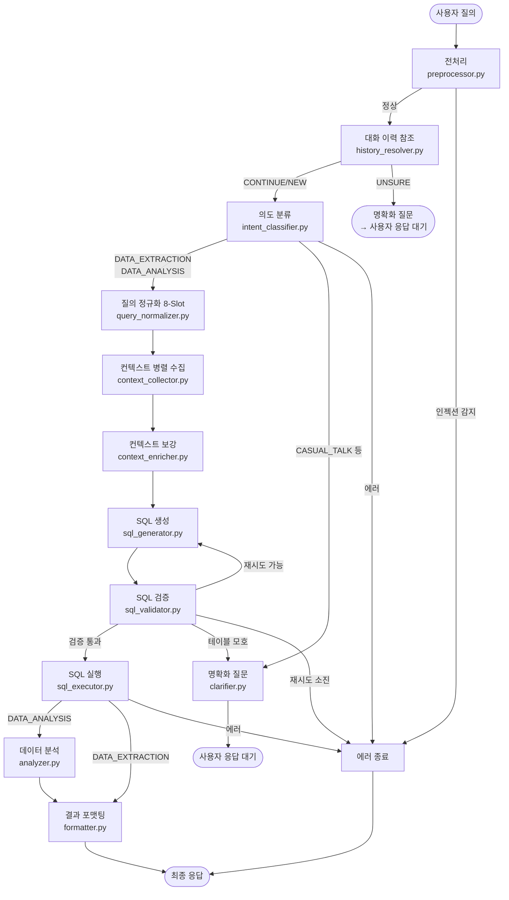
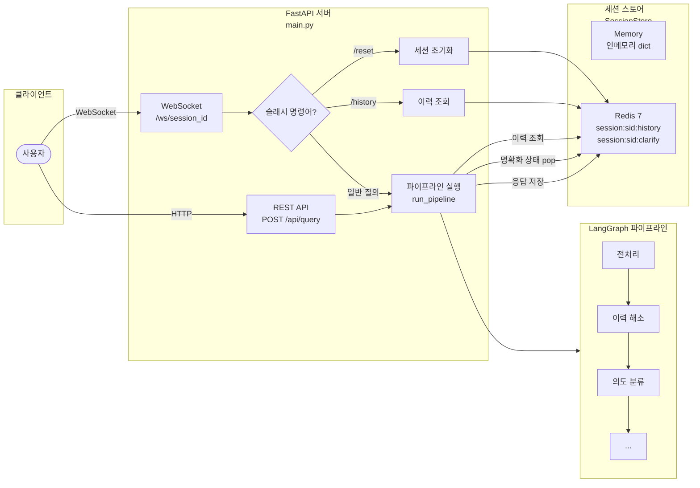
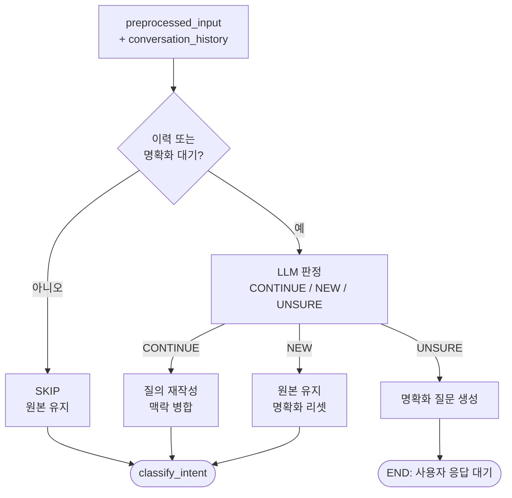
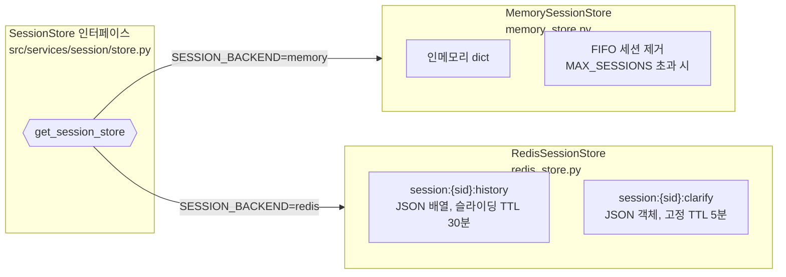

# Pipeline Architecture — Data Copilot

> **Version 2.2** (2026-03-24)
> 이 문서는 실제 구현 코드를 기반으로 작성되었으며, 사용자 질의 입력부터 최종 응답까지의 전체 처리 흐름을 기술한다.

---

## 1. 전체 파이프라인 그래프



**세션 관리 및 멀티턴 흐름:**



**핵심 설계 원칙:**

- 13개 노드 + 1개 에러 핸들러 = 총 14개 노드, 6개 조건부 라우팅 지점
- 모든 노드는 `PipelineState` 를 읽고 변경 사항만 `dict` 로 반환 (불변 패턴)
- 각 노드 간 라우팅은 LangGraph `conditional_edges` 로 구현
- 비동기 전용 (`async/await`) — 모든 I/O 작업이 non-blocking

---

## 2. 노드별 상세 처리 흐름

### 2.1 전처리 (preprocess)

```
📥 입력: user_input (자연어 문자열, 최대 500자)
📤 출력: preprocessed_input, status

처리 순서 (보안 검사 전용, 명확화 합성은 2.2에서 처리):
  1. 유니코드 NFKC 정규화 (ｓｅｌｅｃｔ → select)
  2. 연속 공백 단일화
  3. 입력 길이 검증 (500자 초과 → ERROR)
  4. 프롬프트 인젝션 감지 (영어/한국어/간접 주입 패턴)
  5. SQL 인젝션 감지 (13개 패턴)
     - DML/DDL, 세미콜론 연쇄, UNION SELECT
     - SQL 주석 (-- 및 /*), 시간 지연 함수
     - 파일 I/O, 시스템 카탈로그, 확장 저장 프로시저
```

**보안 방어 예시:**
```
입력: "고객 정보 조회; DROP TABLE TB_CUST--"
  → NFKC 정규화: 전각 문자 반각 변환
  → SQL 인젝션 패턴 매칭: ";\s*DROP" 감지
  → 결과: ERROR ("허용되지 않는 패턴")
```

---

### 2.2 대화 이력 해소 (resolve_history)

이전 대화를 참조하는 후속 질의, 명확화 응답, 독립 질의를 판별하여 파이프라인 경로를 결정한다. 명확화 응답 합성도 이 노드에서 통합 처리한다.

```
📥 입력: preprocessed_input, conversation_history, awaiting_clarification
📤 출력: preprocessed_input (재작성 또는 원본), awaiting_clarification, status

┌─────────────────────────────────────────────────────────────┐
│  Step 1: 규칙 기반 게이트 (LLM 호출 필요 여부 판단)            │
│                                                              │
│  이력 없음 && 명확화 대기 아님 → SKIP (LLM 호출 없이 통과)     │
│  이력 있음 또는 명확화 대기 중 → Step 2로 진행                  │
│                                                              │
│  감지 패턴 (디버깅용 사유 기록):                                │
│  ├─ 지시대명사: "그", "거기서", "아까", "그 중에서"              │
│  ├─ 추가/수정: "추가로", "빼고", "대신", "나눠서"               │
│  ├─ 번호 선택: "1번", "2)", "3"                               │
│  ├─ 짧은 입력: 10자 이하                                      │
│  └─ 이력 존재: 위 패턴 없어도 LLM 맥락 판단                    │
├─────────────────────────────────────────────────────────────┤
│  Step 2: LLM 판정 (JSON 출력, 포맷 실패 시 재시도)             │
│                                                              │
│  프롬프트: history_resolve.txt + history_resolve_user.txt     │
│  입력: 최근 4턴 대화 이력 + 현재 입력                           │
│  출력: {"decision": "CONTINUE|NEW|UNSURE", "query": "..."}   │
│                                                              │
│  판정 기준:                                                    │
│  ├─ CONTINUE: 이전 맥락 이어짐 (후속 질의, 명확화 답변)         │
│  ├─ NEW: 독립 질의 (새 주제, 인사, "됐어")                     │
│  └─ UNSURE: 맥락 불확실 (중간에 인사 턴 끼어 있는 경우 등)      │
├─────────────────────────────────────────────────────────────┤
│  Step 3: 판정별 행동                                           │
│                                                              │
│  SKIP     → 원본 유지, 다음 노드로 진행                        │
│  CONTINUE → 재작성된 질의로 교체, 명확화 상태 리셋, 진행         │
│  NEW      → 원본 유지, 명확화 상태 리셋, 진행                   │
│  UNSURE   → 맥락 인지형 명확화 질문 생성 → END (사용자 응답 대기)│
└─────────────────────────────────────────────────────────────┘
```

**UNSURE 시 명확화 질문 예시:**
```
이전 대화: "이번 달 신규 고객 수 알려줘" → "1,234명" → "안녕" → "무엇을 도와드릴까요?"
현재 입력: "지점별은?"

→ "혹시 이전에 대화했던 '이번 달 신규 고객 수 알려줘'에 이어서 질문하신 건가요?
   1) 네, 이전 내용에 이어서 진행해주세요
   2) 아니요, 새로운 데이터를 찾고 있어요
   3) 직접 입력할게요"
```

**멀티턴 이력 해소 흐름도:**



---

### 2.3 의도 분류 (classify_intent)

2단계 분류 체계로 자연어 질의의 처리 경로를 결정한다.

```
📥 입력: preprocessed_input
📤 출력: intent (IntentType), intent_confidence, query_category

┌─────────────────────────────────────────────────────┐
│  Stage 1: Intent Gate (5-Category)                   │
│                                                      │
│  LLM에게 JSON 출력 요청:                              │
│  { "category": "DATA_QUERY",                         │
│    "confidence": "HIGH",                             │
│    "reason": "..." }                                 │
│                                                      │
│  카테고리:                                            │
│  ├─ DATA_QUERY     → Stage 2로 진행                   │
│  ├─ CASUAL_TALK    → 명확화 노드로 라우팅               │
│  ├─ META_QUESTION  → 명확화 노드로 라우팅               │
│  ├─ CLARIFICATION  → 명확화 노드로 라우팅               │
│  └─ AMBIGUOUS      → 명확화 노드로 라우팅               │
├─────────────────────────────────────────────────────┤
│  Stage 2: Sub-classification (DATA_QUERY만)          │
│                                                      │
│  규칙 기반 키워드 매칭:                                 │
│  분석 신호어 {"분석","추이","트렌드","비교","대비",       │
│             "증감","변화","통계","상관","예측"}           │
│  ├─ 신호어 포함 → DATA_ANALYSIS                       │
│  └─ 미포함     → DATA_EXTRACTION                     │
└─────────────────────────────────────────────────────┘
```

**폴백 전략:** Intent Gate LLM 호출 실패 시 → 기존 `INTENT_CLASSIFICATION` 프롬프트 + `llm_call_with_parse_retry` 로 재시도

**분류 예시:**
| 입력 | Stage 1 | Stage 2 | 최종 의도 |
|------|---------|---------|-----------|
| "이번 달 신규 고객 수" | DATA_QUERY | 신호어 없음 | DATA_EXTRACTION |
| "지점별 대출 추이 분석해줘" | DATA_QUERY | "분석","추이" | DATA_ANALYSIS |
| "안녕하세요" | CASUAL_TALK | - | CASUAL_TALK |
| "고객 테이블에 어떤 컬럼이 있어?" | META_QUESTION | - | META_QUESTION |
| "대출" (모호) | AMBIGUOUS | - | CLARIFICATION_NEEDED |

---

### 2.4 질의 정규화 — 8-Slot (normalize_query)

자연어를 구조화된 8개 슬롯으로 분해하여 컨텍스트 수집과 SQL 생성의 정확도를 높인다.

```
📥 입력: preprocessed_input
📤 출력: NormalizedQuery (Pydantic 모델)

내부 2-Phase LLM 파이프라인:
  Phase 1: 8-Slot 분해
    ├─ 약어 확장 (ABBREVIATION_MAP): "수대" → "수신대출", "여잔" → "여신잔액"
    ├─ 동의어 사전 주입 (NORMALIZATION_SYNONYMS)
    ├─ LLM 호출 → JSON 출력
    └─ 구조 검증: Enum 값 자동 보정 (대소문자 정규화)

  Phase 2: 교차 검증 R1~R12 (선택적, normalization_phase2_enabled)
    ├─ R1: INTENT-MEASURE 정합성
    ├─ R2: DIMENSION-MEASURE 정합성
    ├─ ...
    ├─ R12: AMBIGUITY 감지
    └─ LLM이 Phase 1 결과를 교차 검증하여 수정

  후처리:
    ├─ AGGREGATE + GROUP BY 없음 → 측정값에 SUM 추가
    ├─ RANK 수정자에 by 필드 필수
    ├─ output_hint.expected_columns → meta_search에 병합
    ├─ 검색 키워드 불용어 제거 + 중복 제거
    └─ sql_history 벡터 검색 쿼리 합성
```

**8-Slot 스키마 상세:**

| # | Slot | 역할 | 주요 Enum 값 | 예시 |
|---|------|------|-------------|------|
| 1 | **INTENT** | 질의 유형 | EXTRACT, AGGREGATE, COMPARE, TREND, RANK, DISTRIBUTE, EXIST_CHECK, DEDUP, PIVOT | primary: "AGGREGATE" |
| 2 | **ENTITY** | 대상 테이블/도메인 | DIRECT, INDIRECT, IMPLIED | term: "고객", type: "DIRECT" |
| 3 | **MEASURE** | 측정값 + 집계함수 | SUM, AVG, COUNT, COUNT_DISTINCT, MAX, MIN, NONE, UNKNOWN | term: "대출금액", agg: "SUM" |
| 4 | **DIMENSION** | 분류 축 | GROUP, PARTITION, FILTER, DISPLAY | term: "지점", role: "GROUP" |
| 5 | **FILTER** | 조건 | EQUALS, NOT_EQUALS, IN, BETWEEN, GREATER, LESS, LIKE | target: "상태", type: "EQUALS", values: ["정상"] |
| 6 | **TIME** | 시간 범위 | NONE, ABSOLUTE, RELATIVE | type: "RELATIVE", base_period.label: "이번 달" |
| 7 | **MODIFIER** | 결과 가공 | SORT, LIMIT, RANK | type: "SORT", direction: "DESC", limit: 10 |
| 8 | **OUTPUT_HINT** | 출력 형식 | TABLE, PIVOT, CHART, NONE | format: "TABLE", expected_columns: [...] |

**정규화 입출력 예시:**
```
입력: "지점별 이번 달 신규 여신 건수 상위 10개"

NormalizedQuery:
  intent:     { primary: "RANK", secondary: ["AGGREGATE"] }
  entities:   [{ term: "여신", type: "INDIRECT", normalized_term: "대출" }]
  measures:   [{ term: "건수", agg_function: "COUNT", measure_type: "RAW" }]
  dimensions: [{ term: "지점", role: "GROUP", granularity: "UNKNOWN" }]
  filters:    [{ target: "신규", filter_type: "EQUALS", values: ["Y"] }]
  time:       { type: "RELATIVE", base_period: { label: "이번 달", resolve: "CURRENT_MONTH" } }
  modifiers:  [{ type: "RANK", direction: "DESC", limit: 10, by: "건수" }]
  output_hint: { format: "TABLE" }
  search_keywords:
    meta_search: ["여신", "대출", "지점", "건수"]
    sql_history_search: "지점별 이번 달 신규 여신 건수 순위 대출"
```

**소형 LLM 대응 설계:**
- Phase 2 교차 검증으로 Phase 1 오류를 보완 (대형 모델에서는 Phase 2 비활성화하여 비용/지연 최적화)
- Enum 자동 보정: 대소문자 불일치를 자동 수정

---

### 2.5 컨텍스트 병렬 수집 (collect_context)

6개 데이터 소스에서 SQL 생성에 필요한 참조 정보를 동시에 수집한다.

```
📥 입력: preprocessed_input, normalized_query
📤 출력: ContextInfo (테이블 메타, 과거 SQL, 보고서 SQL, 업무 매뉴얼, 도메인 용어)

                    ┌── SearchQueryBuilder ──┐
                    │  소스별 최적화 쿼리 생성   │
                    └──────────┬──────────────┘
                               │
        ┌──────────────────────┼──────────────────────┐
        │                      │                      │
        ▼                      ▼                      ▼
  ┌──────────┐          ┌──────────┐          ┌──────────┐
  │ asyncio.gather (6개 소스 완전 병렬)              │
  ├──────────┤          ├──────────┤          ├──────────┤
  │ES 테이블  │          │ES 보고서  │          │이력 DB   │
  │메타 검색  │          │SQL 검색   │          │과거 SQL  │
  ├──────────┤          ├──────────┤          ├──────────┤
  │Qdrant    │          │Qdrant    │          │ES 코드   │
  │업무 매뉴얼│          │SQL History│          │메타 로드  │
  │(벡터검색) │          │(하이브리드)│          │(도메인사전)│
  └──────────┘          └──────────┘          └──────────┘
        │                      │                      │
        └──────────────────────┼──────────────────────┘
                               ▼
                    ┌── 후처리 Stage ──┐
                    │ 1. 테이블 설명 보강 │
                    │ 2. 유사 테이블 감지 │
                    └─────────────────┘
```

#### 2.5.1 검색 쿼리 전략 빌더 (SearchQueryBuilder)

각 소스의 검색 메커니즘에 최적화된 쿼리를 생성한다:

| 소스 | 검색 방식 | 쿼리 전략 |
|------|-----------|-----------|
| **ES table_meta** | 전문 검색 | domain_cd 주입 + 테이블명 2회 부스트 + 핵심 키워드 (시간 표현 제외) |
| **ES report_sql** | 전문 검색 | 원본 입력 유지 + 시간 표현 제거 + 카테고리 보강 |
| **이력 DB** | ILIKE | 핵심 키워드 + 동의어 확장 + 테이블명 (상위 15개) |
| **Qdrant biz_manual** | Dense 벡터 검색 | 자연어 유지 + 도메인 용어 정식 명칭 + 설명 보강 |
| **Qdrant sql_history** | 하이브리드(Dense+Sparse) | NormalizedQuery 슬롯에서 합성된 비즈니스 목적 문장 |
| **ES code_meta** | 전체 로드 | 코드값 → 도메인 용어 매핑 (캐시 활용) |

**검색 쿼리 전략 예시:**
```
입력: "지점별 이번 달 신규 고객 수"

도메인 사전 매칭:
  → "고객" → category: "고객", table: "TB_CUST_INFO"
  → "지점" → category: "조직"

소스별 쿼리:
  ES table:   "CUS TB_CUST_INFO TB_CUST_INFO 고객 지점 신규"
  ES report:  "지점별 신규 고객 수 고객 조직"
  History DB: "고객 지점 신규 TB_CUST_INFO"
  Qdrant:     "지점별 이번 달 신규 고객 수 고객 고객정보 관리 테이블 조직"
  sql_history: "지점별 이번 달 신규 고객 수 집계 고객별"
```

#### 2.5.2 Qdrant sql_history 하이브리드 검색 + Reranking

```
┌───────────────────────────────────────────────────────┐
│              Qdrant 하이브리드 검색                      │
│                                                        │
│  Dense 검색 (BGE-M3, 1024dim)                          │
│  ├─ 의미적 유사도 기반                                   │
│  └─ Top-N 후보 반환                                     │
│                                                        │
│  Sparse 검색 (BM25)                                    │
│  ├─ 키워드 매칭 기반                                     │
│  └─ Top-N 후보 반환                                     │
│                                                        │
│  RRF (Reciprocal Rank Fusion)                          │
│  └─ 두 결과를 순위 기반으로 병합                           │
├───────────────────────────────────────────────────────┤
│              BGE-Reranker-v2-m3                         │
│                                                        │
│  CPU 최적화 4단계:                                      │
│  1. ONNX Runtime O3 그래프 최적화 (1.5~2.0x)            │
│  2. INT8 동적 양자화 — 모델 75% 경량화 (누적 2.5~3.5x)   │
│  3. 입력 길이 정렬 — 패딩 낭비 최소화 (누적 2.8~4.0x)    │
│  4. 사전 필터링 — 하위 후보 제거 (누적 4~6x)             │
│                                                        │
│  Cross-Encoder 방식:                                    │
│  (query, document) 쌍을 동시 분석                       │
│  → sigmoid 정규화된 유사도 스코어                         │
│  → Top-K 최종 반환                                      │
└───────────────────────────────────────────────────────┘
```

---

### 2.6 컨텍스트 보강 (enrich_context)

`collect_context` 후 별도 노드로 실행된다. ES에서 가져온 테이블 설명이 불충분할 경우 LLM으로 3-View 보강하고, 유사 테이블 구분 가이드를 생성한다.

**구현**: `src/agents/nodes/context_enricher.py` → `src/services/table_meta_enricher.py`

#### 2.6.1 테이블 설명 보강 (Table Meta Enrichment)

ES에서 가져온 테이블 설명이 불충분할 경우 LLM으로 3-View 보강:

```
충분성 판단 기준:
  1. 설명 길이 ≥ 20자
  2. 3가지 관점 모두 커버:
     - 엔티티 집합 정의: "데이터", "정보", "내역" 등 키워드 포함
     - 기능적 정의:     "사용", "활용", "조회" 등 키워드 포함
     - 데이터 발생규칙: "생성", "적재", "배치" 등 키워드 포함

불충분한 테이블 → LLM 보강:
  입력: 원본 설명, 컬럼 요약, 관련 보고서/과거 SQL
  출력: 3-View 통합 설명

보강 예시:
  원본: "고객 정보"
  보강: "개인/법인 고객의 기본 인적사항(성명, 생년월일, 연락처, 주소 등)과
         고객 등급·세그먼트 정보를 저장하는 마스터 테이블.
         CRM, 여신심사, 마케팅 캠페인 등에서 고객 식별·분류에 활용.
         신규 계좌 개설 시 실시간 생성되며, 정보 변경 시 일 배치로 갱신."

동시성 제어: asyncio.Semaphore (LLM concurrency limit)
타임아웃: llm_context_timeout 초과 시 원본 설명 유지
```

#### 2.6.2 유사 테이블 구분 가이드

정보계 DB에는 용도가 다른 유사 테이블이 다수 존재한다. 컨텍스트 수집 단계에서 유사 테이블 그룹을 감지하고, SQL 생성 프롬프트에 구분 가이드를 주입한다:

```
유사 테이블 그룹 예시:

[고객] 고객 정보 유사 테이블
├─ TB_CUST_INFO:    고객 마스터 [일배치]  → 적합: 현재 고객 정보 조회
├─ TB_CUST_HIST:    고객 이력 [일배치]    → 적합: 과거 시점 고객 정보
└─ TB_CUST_STAT:    고객 통계 [월배치]    → 적합: 월별 고객 통계/추이
구분 기준: "현재 고객 기본정보는 INFO, 변경 이력은 HIST, 월별 집계는 STAT"

프롬프트 주입 형태:
  "## 유사 테이블 구분 가이드 (중요!)
   아래 테이블들은 비슷한 데이터를 담고 있지만 용도가 다릅니다.
   반드시 구분 기준을 확인하고 적합한 테이블만 사용하세요.
   ..."
```

---

### 2.7 SQL 생성 (generate_sql)

수집된 컨텍스트와 도메인 지식을 기반으로 LLM이 SQL을 생성한다.

```
📥 입력: preprocessed_input, context (ContextInfo), normalized_query
📤 출력: generated_sql, sql_retry_count

프롬프트 구성:
  [System Prompt]
  ├─ SQL_GENERATION_RULES (기본 생성 규칙)
  ├─ 테이블 정보 (보강된 설명, 컬럼, PII 마킹, 갱신주기)
  ├─ 과거 SQL (벡터 검색 우선 → 키워드 검색 보충, 중복 제거, 최대 8건)
  ├─ 보고서 SQL (최대 3건)
  ├─ 업무 매뉴얼 참조 (최대 3건)
  ├─ 도메인 사전 매칭 결과
  ├─ 코드값 도메인 용어 (ES code_meta)
  ├─ [검증 피드백 섹션] ← 재시도 시에만 포함
  ├─ [질의 구조 분석 결과] ← NormalizedQuery 슬롯 자연어 요약
  └─ [유사 테이블 구분 가이드] ← 유사 그룹 감지 시에만 포함

  [User Message]
  └─ preprocessed_input (전처리된 사용자 질의)

SQL 후처리:
  └─ 마크다운 코드 블록 제거: ```sql ... ``` → 순수 SQL
```

**재시도 시 피드백 주입 예시:**
```
[이전 시도에서 발견된 오류 — 반드시 수정하세요]
실패한 SQL:
SELECT * FROM TB_CUST_INFO

발견된 문제:
1. LIMIT 절이 없습니다. 대량 데이터 조회를 방지하기 위해 LIMIT을 포함해주세요
```

**정규화 결과 프롬프트 주입 예시:**
```
[질의 구조 분석 결과]
- 질의 유형: AGGREGATE
  (부가 유형: RANK)
- 명확화된 질의: 지점별 이번 달 신규 대출 건수를 많은 순서대로 10개
- 대상 엔티티: 여신(INDIRECT)
- 측정값: 건수(COUNT)
- 분류 축: 지점(GROUP)
- 시간 범위: RELATIVE (이번 달)
- 결과 가공: RANK DESC (상위 10건)
```

---

### 2.8 SQL 검증 (validate_sql)

생성된 SQL의 안전성과 정확성을 다층 검증한다.

```
📥 입력: generated_sql, preprocessed_input, context
📤 출력: validated_sql 또는 sql_validation_errors + validation_feedback

검증 레이어 (순차 실행):
  ┌─────────────────────────────────────────────────────┐
  │ Layer 0: 기본 검증                                    │
  │  ├─ 비어있는 SQL 검사                                  │
  │  ├─ SELECT 또는 WITH(CTE)로 시작하는지 검증             │
  │  └─ 유니코드 정규화 (전각 → 반각)                       │
  ├─────────────────────────────────────────────────────┤
  │ Layer 1: 금지 패턴 검사 (13개)                         │
  │  ├─ DML/DDL 키워드 (\b 워드 경계)                      │
  │  ├─ EXEC/CALL 프로시저 실행                             │
  │  ├─ 시스템 카탈로그 (information_schema, pg_*, sys.*)    │
  │  ├─ 다중 쿼리 (세미콜론 연쇄)                            │
  │  ├─ 파일 I/O (OUTFILE, DUMPFILE, LOAD_FILE)           │
  │  ├─ 시간 지연 (SLEEP, WAITFOR, BENCHMARK, PG_SLEEP)   │
  │  ├─ SQL 주석 (-- 및 /*) ← 키워드 분할 우회 방어          │
  │  ├─ xp_ 확장 저장 프로시저                               │
  │  └─ UNION SELECT                                     │
  ├─────────────────────────────────────────────────────┤
  │ Layer 2: SQL 구문 파싱                                 │
  │  └─ SQLGlot.parse(sql, dialect="postgres")            │
  ├─────────────────────────────────────────────────────┤
  │ Layer 3: PII 컬럼 보호                                 │
  │  ├─ 직접 노출 금지: 주민번호, 카드번호, 계좌번호, 비밀번호,│
  │  │   CVC, 외국인등록번호 (24개 변형 컬럼명)               │
  │  └─ 마스킹 필수: 전화번호, 이메일, 생년월일, 주소, 고객명  │
  │      (20개 변형 컬럼명) — resources/security/pii_columns.yaml│
  ├─────────────────────────────────────────────────────┤
  │ Layer 4: LIMIT 검증                                    │
  │  ├─ 집계 쿼리 → LIMIT 불필요 (자동 감지)                 │
  │  │   집계 판별: COUNT/SUM/AVG/MIN/MAX + GROUP BY         │
  │  │   또는 SELECT 절에 집계 함수만 존재하는 경우             │
  │  └─ 비집계 쿼리 → LIMIT 필수                             │
  ├─────────────────────────────────────────────────────┤
  │ Layer 5: 테이블 적절성 검증                              │
  │  ├─ SQL에서 테이블명 추출 (FROM/JOIN 절 파싱)             │
  │  ├─ 유사 테이블 그룹 매칭                                │
  │  ├─ 신호어 기반 적합도 점수 계산                          │
  │  └─ 판정:                                               │
  │     ├─ PASS:     적절한 테이블 선택                       │
  │     ├─ WARNING:  부적합 가능성 → 재생성 피드백             │
  │     └─ AMBIGUOUS: 모호 → 명확화 질문 생성                 │
  └─────────────────────────────────────────────────────┘
```

**검증 라우팅 결과:**

```
검증 통과 (PASS)
  → validated_sql 설정 → execute_sql 진행

검증 실패 (errors 존재)
  → sql_retry_count < 2 → generate_sql 로 복귀 (피드백 포함)
  → sql_retry_count ≥ 2 → error_end (재시도 소진)

테이블 모호 (AMBIGUOUS)
  → clarify 노드로 분기 (사용자에게 테이블 용도 확인)
  → clarification_turns ≥ 2 → 그대로 실행 진행

테이블 부적합 (WARNING)
  → 재생성 피드백에 대안 테이블 제안 포함
  → "TB_CUST_INFO 대신 TB_CUST_HIST를 사용하세요. 이유: ..."
```

---

### 2.9 SQL 실행 (execute_sql)

```
📥 입력: validated_sql
📤 출력: SQLResult { columns, rows, row_count, execution_time_ms }

처리 순서:
  1. 방어적 재검증 (validate_sql_safety — defense-in-depth)
  2. ConnectorManager.info_db.execute_query() 호출
     └─ 읽기 전용 PostgreSQL 계정 (SELECT 전용)
  3. 실행 시간 측정
  4. 결과 행 수 제한 (max_query_rows, 기본 10,000건)
  5. SQLResult 구성

에러 처리:
  └─ 내부 예외 메시지를 사용자에게 노출하지 않음
     → "데이터 조회 중 오류가 발생했습니다. 잠시 후 다시 시도해주세요."
```

---

### 2.10 데이터 분석 (analyze_data)

`DATA_ANALYSIS` 의도인 경우에만 실행되며, 데이터 분석 + 시각화 생성을 수행한다.

```
📥 입력: sql_result, user_input
📤 출력: AnalysisResult { summary, insights[], statistics{}, visualization_code, visualization_type }

┌─────────────────────────────────────────────────────┐
│  Stage 1: LLM 데이터 분석                              │
│                                                      │
│  System: DATA_ANALYSIS 프롬프트                       │
│  User:   사용자 요청 + 조회 데이터 (최대 100행)          │
│  Output: JSON { summary, insights[], statistics{} }  │
│                                                      │
│  파싱 전략:                                           │
│  ├─ llm_call_with_parse_retry() 재시도                │
│  ├─ 코드 펜스 자동 제거 (```json ... ```)              │
│  └─ 최종 실패 시 텍스트 폴백 (LLM 응답을 summary로)     │
├─────────────────────────────────────────────────────┤
│  Stage 2: 시각화 판단 (row_count ≥ 3일 때만)           │
│                                                      │
│  LLM에게 판단 요청:                                    │
│  ├─ CHART_TYPE: bar/line/pie/table/none               │
│  └─ CHART_TITLE: "월별 매출 추이"                      │
│                                                      │
│  판정 실패 시 → 시각화 건너뜀 (NONE)                    │
├─────────────────────────────────────────────────────┤
│  Stage 3: SVG 차트 생성 (3-Tier 폴백)                  │
│                                                      │
│  Tier 1 (LLM): Claude 등 고성능 모델이 SVG 직접 생성   │
│  ├─ 코드 펜스/XML 태그 자동 정리                        │
│  ├─ <svg>...</svg> 범위만 추출                         │
│  └─ 유효한 SVG 태그 존재 확인                           │
│                                                      │
│  Tier 2 (템플릿): LLM 실패 시 규칙 기반 차트 생성       │
│  └─ chart_generator.generate_chart_from_result()      │
│                                                      │
│  Tier 3 (건너뜀): 모두 실패 → VisualizationType.NONE   │
└─────────────────────────────────────────────────────┘
```

**시각화 유형 결정 기준:**

| 차트 유형 | 적합한 데이터 패턴 |
|-----------|-------------------|
| `bar_chart` | 카테고리별 비교 (지점별 매출, 상품별 건수) |
| `line_chart` | 시계열 추이 (월별 변화, 일별 추이) |
| `pie_chart` | 구성비/비율 (유형별 비중) |
| `stacked_bar` | 그룹 내 세분류 비교 |
| `table_only` | 이미 표 형태가 최적인 데이터 |
| `none` | 단일 값, 2행 미만, 시각화 불필요 |

---

### 2.11 결과 포맷팅 (format_response)

```
📥 입력: sql_result, analysis_result (선택), user_input, trace_log
📤 출력: formatted_response

포맷팅 규칙 (RESULT_FORMATTING 프롬프트):
  ├─ 기술 용어(SQL, JOIN, WHERE) 사용 최소화
  ├─ "보고서"처럼 정리하여 전달
  ├─ 숫자 포맷팅: 금액(만원, 억원), 비율(%), 건수
  ├─ 날짜 표현: "2024년 3월" (자연스러운 형태)
  ├─ 조회 조건을 자연어로 설명
  └─ 데이터 없음 시: 원인 추정 + 대안 제시

LLM 입출력:
  System: RESULT_FORMATTING
  User:   "[사용자 요청]\n{user_input}\n[조회 결과]\n{결과 테이블, 최대 50행}"

후처리:
  └─ trace_log → <details> 접기 형태로 응답 끝에 추가
     "<details><summary>조회 과정 요약</summary>
      1. 입력 정규화 완료
      2. '데이터 추출' 의도로 분류
      3. SQL 생성: 사용 테이블 TB_CUST_INFO
      4. 보안·구문·테이블 검증 통과
      5. 보고서 형태로 결과 정리 완료
      </details>"
```

---

### 2.12 명확화 (clarify)

```
📥 입력: preprocessed_input, intent, conversation_history
📤 출력: clarification_question, awaiting_clarification=True → END

LLM 프롬프트:
  System: CLARIFICATION
  User:   preprocessed_input + 최근 4턴 대화 이력

출력 형태:
  "다음 중 어떤 데이터를 원하시나요?
   1) 이번 달 신규 여신 건수
   2) 이번 달 여신 실행 금액
   3) 이번 달 여신 잔액 현황"

멀티턴 흐름:
  1. clarify 노드 → awaiting_clarification=True → END
  2. WebSocket/REST 레이어가 사용자 응답 수신
  3. clarification_response 에 채워 파이프라인 재실행
  4. preprocess 노드가 합성: "[원래 질의]\n추가 조건: [응답]"
  5. clarification_turns +1 (최대 2회, 초과 시 그대로 진행)
```

---

### 2.13 에러 종료 (error_end)

```
분기별 메시지:
  ├─ 재시도 소진:
  │   "죄송합니다. 여러 번 시도했지만 안전한 SQL을 생성하지 못했습니다.
  │    요청을 좀 더 구체적으로 다시 입력해주시겠어요?"
  │
  └─ 일반 에러:
      "죄송합니다. {error_message}
       다시 시도하시거나, 요청을 좀 더 구체적으로 입력해주세요."

원칙: 내부 기술 에러 메시지는 절대 사용자에게 노출하지 않음
```

---

## 3. 공유 상태 모델 (PipelineState)

모든 노드가 읽고 쓰는 단일 상태 객체 (Pydantic BaseModel):

```
PipelineState
├── 입력/세션 ──────────────────────────────────────
│   user_input: str                    # 원본 사용자 입력
│   session_id: str                    # WebSocket 세션 ID
│   conversation_history: list[dict]   # 멀티턴 대화 이력
│   preprocessed_input: str            # 전처리된 입력
│
├── 의도 분류 ──────────────────────────────────────
│   intent: IntentType                 # 최종 의도 (7종)
│   intent_confidence: float           # 신뢰도 0.0~1.0
│   query_category: str                # Intent Gate 카테고리 (5종)
│
├── 질의 정규화 ────────────────────────────────────
│   normalized_query: NormalizedQuery  # 8-Slot 구조화 결과
│
├── 멀티턴 명확화 ──────────────────────────────────
│   clarification_question: str        # 명확화 질문
│   clarification_response: str        # 사용자 응답
│   awaiting_clarification: bool       # 대기 플래그
│   clarification_turns: int           # 왕복 횟수 (최대 2)
│
├── 컨텍스트 ───────────────────────────────────────
│   context: ContextInfo
│   ├── table_metas: list[TableMeta]        # ES 테이블 메타 (보강 포함)
│   ├── past_sqls: list[str]                # 이력 DB 키워드 검색
│   ├── report_sqls: list[str]              # ES 보고서 SQL
│   ├── manual_references: list[str]        # Qdrant 업무 매뉴얼
│   ├── domain_terms: dict[str, str]        # 코드값 도메인 용어
│   ├── table_disambiguation_guide: str     # 유사 테이블 구분 가이드
│   └── vector_past_sqls: list[str]         # Qdrant 벡터 검색 SQL
│
├── SQL 생성/검증 ──────────────────────────────────
│   generated_sql: str                 # LLM 생성 SQL
│   validated_sql: str                 # 검증 통과 SQL
│   sql_validation_errors: list[str]   # 검증 오류 목록
│   sql_retry_count: int               # 재시도 횟수 (최대 2)
│   validation_feedback: str           # 재생성용 피드백
│   table_selection_verdict: str       # pass/warning/ambiguous
│   table_selection_warnings: list[str]
│
├── 실행 결과 ──────────────────────────────────────
│   sql_result: SQLResult
│   ├── columns: list[str]
│   ├── rows: list[dict]
│   ├── row_count: int
│   └── execution_time_ms: float
│
├── 분석 결과 ──────────────────────────────────────
│   analysis_result: AnalysisResult
│   ├── summary: str
│   ├── insights: list[str]
│   └── statistics: dict
│
├── 시각화 ────────────────────────────────────────
│   visualization: VisualizationData
│   ├── type: str                      # "svg" 등
│   ├── code: str                      # SVG/HTML 코드
│   ├── chart_type: str                # bar/line/pie/table/none
│   └── title: str                     # 차트 제목
│
└── 최종 출력/상태 ─────────────────────────────────
    formatted_response: str            # 최종 응답 (보고서 형태)
    status: QueryStatus                # 15단계 처리 상태
    error_message: str
    trace_log: list[TraceEntry]        # 추론 추적 로그
```

---

## 4. 서비스 진입점 및 통신 구조

### 4.1 세션 스토어 (SessionStore)

대화 이력과 명확화 상태를 백엔드(Memory/Redis)에 저장·조회·삭제한다. `SESSION_BACKEND` 설정으로 전환한다.



**인터페이스 메서드:**

| 메서드 | 설명 | Redis 동작 |
| --- | --- | --- |
| `get_history(sid)` | 대화 이력 조회 | GET + JSON 파싱 |
| `append_history(sid, entry)` | 이력 1건 추가 + TTL 갱신 | SET(슬라이딩 TTL), 최대 20턴 유지 |
| `get_clarification(sid)` | 명확화 상태 조회 + **삭제(pop)** | GETDEL |
| `set_clarification(sid, state)` | 명확화 상태 저장 | SET(고정 TTL 5분) |
| `clear_session(sid)` | 이력 + 명확화 모두 삭제 | DEL 2개 키 |
| `ensure_session(sid)` | 세션 초기화 (Memory: FIFO, Redis: no-op) | — |
| `health_check()` | 스토어 상태 확인 | PING |

**TTL 정책:**

| 데이터 | TTL | 갱신 방식 | 이유 |
| --- | --- | --- | --- |
| history | 30분 | 슬라이딩 (매 메시지마다) | 활성 대화 유지, 30분 무응답 시 자동 만료 |
| clarify | 5분 | 고정 (저장 시 1회) | 명확화 응답 대기 후 5분 내 미응답 시 만료 |

### 4.2 WebSocket 통신 (실시간 챗봇)

```
Browser ←──WebSocket──→ FastAPI (/ws/{session_id})
                              │
                              ├─ session_id 형식 검증 (영숫자+하이픈+밑줄, 128자)
                              │
                              ├─ 슬래시 명령어 (파이프라인 진입 전 처리)
                              │   ├─ /reset   → store.clear_session() → "대화가 초기화되었습니다"
                              │   └─ /history → store.get_history() → 이력 번호 매기기 출력
                              │
                              ├─ 프롬프트 인젝션 감지
                              │
                              ├─ store.append_history(user 메시지)
                              ├─ 파이프라인 실행: run_pipeline(
                              │     conversation_history = store.get_history(),
                              │     clarification_state  = store.get_clarification(),  // pop
                              │   )
                              ├─ awaiting_clarification → store.set_clarification()
                              ├─ store.append_history(assistant 응답)
                              │
                              └─ 응답 전송:
                                  {
                                    "type": "response" | "system" | "error",
                                    "message": "...",
                                    "visualization": { ... }  // 선택적
                                  }
```

### 4.3 REST API (멀티턴 지원)

WebSocket과 동일한 SessionStore를 사용하여 멀티턴 대화를 지원한다. `session_id` 미전달 시 UUID 자동 생성(1회성 대화).

```
POST /api/query
  Request:  { "query": "...", "session_id": "...", "include_trace": false }
  Response: { "session_id": "...", "response": "...", "visualization": {...}, "trace": [...] }

  특수 명령: query="/reset" → 세션 초기화 → {"response": "대화가 초기화되었습니다."}

GET /health
  Response: { "status": "ok|degraded", "connectors": { "es": true, "info_db": true, ... } }
```

---

## 5. 커넥터 구조

```
ConnectorManager (싱글턴)
├── es: ElasticSearchConnector
│   ├── search_table_meta(query)     → 테이블/컬럼 메타
│   ├── search_report_sql(query)     → 보고서 SQL 템플릿
│   └── search_code_meta(query)      → 코드값 매핑
│
├── info_db: InfoDBConnector (PostgreSQL, 읽기 전용)
│   └── execute_query(sql)           → 데이터 추출 결과
│
├── history_db: HistoryDBConnector (PostgreSQL)
│   └── search_similar_sql(query)    → 과거 유사 SQL 이력
│
├── qdrant: QdrantConnector
│   ├── search_manual(query)          → 업무 매뉴얼 (Dense 검색)
│   └── search_sql_history(query)     → SQL 이력 (Dense+Sparse 하이브리드)
│
└── [폐쇄망 전용 커넥터]
    ├── SybaseConnector               → Sybase IQ 16.1 (ODBC)
    ├── ImpalaConnector               → Impala (Cloudera CDP, LDAP 인증)
    ├── HiveConnector                 → Hive
    └── MongoConnector                → MongoDB (메타 저장소 대안)

구현 위치: src/connectors/impl/*.py
인터페이스: src/connectors/interfaces.py (공통 추상 클래스)

Dummy Mode (settings.use_dummy=True):
  모든 커넥터가 하드코딩된 샘플 데이터를 반환 (외부 의존성 제거)

라이프사이클:
  Startup  → connect_all()   (모든 커넥터 초기화, 멱등)
  Runtime  → health_check_all()
  Shutdown → disconnect_all() (정상 종료)
```

---

## 6. LLM 호출 추상화

```
LLM Client (Provider Abstraction)
├── Anthropic 백엔드 (기본)
│   └── AsyncAnthropic → Claude API
│
└── OpenAI Compatible 백엔드 (폐쇄망/로컬 LLM)
    └── OpenAI SDK → Groq, OpenRouter, 로컬 모델 (7B~70B)

통합 인터페이스:
  client.messages.create(
    model, max_tokens, system, messages, timeout
  ) → LLMResponse

재시도 전략 (llm_call_with_parse_retry):
  ┌──────────────────────────────────────────────┐
  │ 1차 시도: system + messages → parse_fn 파싱   │
  │ 파싱 실패 시:                                  │
  │   → 포맷 교정 힌트(format_hint) 주입            │
  │   → 2차 시도                                   │
  │ 2차도 실패 시:                                  │
  │   → ParseError 예외 (last_response 포함)        │
  └──────────────────────────────────────────────┘

계측:
  ├─ 프롬프트/응답 요약 추출
  ├─ 토큰 수 (input/output)
  ├─ 지연 시간 (ms)
  └─ EvaluationTracker 연동
```

---

## 7. 프롬프트 관리 체계

모든 프롬프트는 외부 파일(`resources/prompts/*.txt`)에서 로드되며, 코드 변경 없이 교체 가능:

| 프롬프트 변수 | 파일 | 용도 | 유형 |
| ------------- | ------ | ------ | ------ |
| `INTENT_GATE` | intent_gate.txt | 5-Category 의도 분류 | system |
| `HISTORY_RESOLVE` | history_resolve.txt | 대화 이력 해소 (CONTINUE/NEW/UNSURE 판정) | system |
| `HISTORY_RESOLVE_USER` | history_resolve_user.txt | 이력 해소 유저 템플릿 | user |
| `HISTORY_RESOLVE_FORMAT_HINT` | history_resolve_format_hint.txt | 이력 해소 포맷 교정 힌트 | hint |
| `INTENT_GATE_USER` | intent_gate_user.txt | 의도 분류 유저 템플릿 | user |
| `INTENT_CLASSIFICATION` | intent_classification.txt | 레거시 의도 분류 | system |
| `INTENT_FORMAT_HINT` | intent_format_hint.txt | 의도 분류 포맷 교정 힌트 | hint |
| `NORMALIZATION_PHASE1` | normalization_phase1.txt | 8-Slot 분해 | system |
| `NORMALIZATION_PHASE1_USER` | normalization_phase1_user.txt | Phase 1 유저 템플릿 | user |
| `NORMALIZATION_PHASE2` | normalization_phase2.txt | 교차 검증 R1~R12 | system |
| `NORMALIZATION_PHASE2_USER` | normalization_phase2_user.txt | Phase 2 유저 템플릿 | user |
| `CLARIFICATION` | clarification.txt | 명확화 질문 생성 | system |
| `SQL_GENERATION_RULES` | sql_generation.txt | SQL 생성 규칙 | system |
| `TABLE_DESCRIPTION_ENRICHMENT` | table_enrichment.txt | 테이블 설명 보강 프롬프트 | user |
| `ENRICHMENT_SYSTEM` | enrichment_system.txt | 설명 보강 시스템 프롬프트 | system |
| `ENRICHMENT_FORMAT_HINT` | enrichment_format_hint.txt | 설명 보강 포맷 교정 힌트 | hint |
| `DATA_ANALYSIS` | data_analysis.txt | 데이터 분석 | system |
| `ANALYSIS_USER` | analysis_user.txt | 분석 유저 템플릿 | user |
| `ANALYSIS_FORMAT_HINT` | analysis_format_hint.txt | 분석 포맷 교정 힌트 | hint |
| `RESULT_FORMATTING` | result_formatting.txt | 결과 보고서화 | system |
| `FORMATTING_USER` | formatting_user.txt | 포맷팅 유저 템플릿 | user |
| `VISUALIZATION_JUDGMENT` | visualization_judgment.txt | 차트 유형 판단 | system |
| `VIZ_JUDGMENT_FORMAT_HINT` | viz_judgment_format_hint.txt | 시각화 판단 포맷 교정 힌트 | hint |
| `VISUALIZATION_SVG_GENERATION` | visualization_svg.txt | SVG 직접 생성 | system |
| `VIZ_SVG_SYSTEM` | viz_svg_system.txt | SVG 생성 시스템 프롬프트 | system |

**커스터마이징 계층:**
```
resources/
├── prompts/          # 프롬프트 파일 (위 테이블)
├── domain/           # 도메인 지식
│   ├── domain_dictionary.yaml    # 금융 용어 사전
│   ├── similar_tables.yaml       # 유사 테이블 그룹
│   ├── domain_synonyms.yaml      # 정규화 동의어
│   ├── domain_categories.yaml    # 카테고리→domain_cd 매핑
│   └── stopwords.yaml            # 한국어 불용어
├── security/         # 보안 규칙
│   └── pii_columns.yaml          # PII 컬럼 정의
└── elasticsearch/    # ES 검색 설정
    └── synonyms.txt              # 검색 동의어
```

---

## 8. 계측 및 추적 (Instrumentation)

### 8.1 EvaluationTracker

외부 의존성 없이 전체 파이프라인 실행을 자기 완결적으로 추적한다:

```
EvaluationTrace (JSON 파일로 저장)
├── run_id, start_time, end_time
├── user_input, session_id
├── final_intent, final_status
├── node_path: [preprocess, classify_intent, normalize_query, ...]
│
├── nodes: list[NodeRecord]
│   └── { node_name, input_summary, output_summary, duration_ms, status }
│
├── llm_calls: list[LLMCallRecord]
│   └── { node, prompt_summary, response_text, model, tokens, latency_ms }
│
├── decisions: list[DecisionRecord]
│   └── { decision_type, chosen, alternatives, confidence, reason }
│       예: { type: "intent_classification",
│             chosen: "DATA_EXTRACTION",
│             alternatives: ["DATA_ANALYSIS", "CLARIFICATION"],
│             confidence: 0.92 }
│
├── context_retrievals: list[ContextRetrievalRecord]
│   └── { source, query, results_count, results_summary, latency_ms }
│
└── sql: SQLRecord
    └── { generated_sql, validated, validation_errors, retry_count,
          execution_success, row_count, execution_time_ms }

저장 경로: evaluation/traces/{run_id}.json
```

### 8.2 Instrumented Pipeline

`contextvars` 기반으로 트래커를 투명하게 전파:

```
build_pipeline(tracker) 호출 시:
  ├─ setup_tracker_injection(tracker) → contextvars 에 등록
  └─ 각 노드를 instrument_node() 래퍼로 감싸기
      ├─ 노드 진입: start_node()
      ├─ 노드별 입력 요약 추출
      ├─ 노드 실행
      ├─ 노드별 출력/결정 요약 추출
      └─ 노드 종료: end_node()

하위 서비스(search_context_assembler, LLM client, reranker)는
get_current_tracker() 로 트래커에 접근 — 함수 시그니처 오염 없음
```

---

## 9. 보안 아키텍처

```
┌──────────────────────────────────────────────────────────┐
│                   보안 레이어 구조                          │
│                                                           │
│  Layer 1: 입력 경계 (preprocess)                           │
│  ├─ 유니코드 NFKC 정규화 (전각 우회 차단)                    │
│  ├─ 프롬프트 인젝션 감지 (영어/한국어/간접 주입)               │
│  ├─ SQL 인젝션 패턴 차단 (13개 컴파일된 정규식)               │
│  └─ 입력 길이 제한 (DoS 방어)                               │
│                                                           │
│  Layer 2: SQL 생성 제약 (sql_generator)                    │
│  └─ 프롬프트에 보안 규칙 내장 (SELECT 전용, LIMIT 필수 등)    │
│                                                           │
│  Layer 3: SQL 검증 (sql_validator)                         │
│  ├─ 금지 패턴 재검사 (DML/DDL, 시스템 카탈로그, UNION 등)     │
│  ├─ SQLGlot 구문 파싱 검증                                  │
│  ├─ PII 컬럼 직접 노출 차단 (24+20개 컬럼명 변형)             │
│  └─ LIMIT 강제 (비집계 쿼리)                                 │
│                                                           │
│  Layer 4: 실행 방어 (sql_executor)                          │
│  ├─ 방어적 재검증 (defense-in-depth)                         │
│  ├─ 읽기 전용 DB 계정                                       │
│  └─ 결과 행 수 제한 (10,000건)                               │
│                                                           │
│  Layer 5: 출력 보호 (main.py)                               │
│  ├─ PII 마스킹 (저장 및 전송 전)                              │
│  ├─ 내부 에러 메시지 비노출                                   │
│  └─ session_id 형식 검증 (경로 순회 차단)                      │
│                                                           │
│  Layer 6: 감사 추적                                         │
│  ├─ 모든 SQL 생성/실행 이력 로깅                              │
│  ├─ EvaluationTracker JSON 기록                              │
│  └─ 로그에 PII 미포함 (마스킹 후 로깅)                        │
└──────────────────────────────────────────────────────────┘
```

---

## 10. End-to-End 실행 예시

### 예시 1: 단순 데이터 추출

```
사용자: "이번 달 신규 고객 수 알려줘"

[preprocess]
  → NFKC 정규화, 인젝션 검사 통과
  → preprocessed_input: "이번 달 신규 고객 수 알려줘"

[classify_intent]
  → Intent Gate: { category: "DATA_QUERY", confidence: "HIGH" }
  → 분석 신호어 없음 → DATA_EXTRACTION

[normalize_query]
  → Phase 1 LLM: 8-Slot 분해
    intent:    { primary: "AGGREGATE" }
    entities:  [{ term: "고객", type: "DIRECT" }]
    measures:  [{ term: "수", agg_function: "COUNT" }]
    filters:   [{ target: "신규", filter_type: "EQUALS" }]
    time:      { type: "RELATIVE", base_period: { resolve: "CURRENT_MONTH" } }
    search_keywords:
      meta_search: ["고객", "신규"]
      sql_history_search: "이번 달 신규 고객 수 집계"

[collect_context] (6개 소스 병렬)
  → ES table_meta: TB_CUST_INFO (고객 마스터, 15개 컬럼)
  → ES report_sql: "SELECT COUNT(*) FROM TB_CUST_INFO WHERE ..." (유사 보고서)
  → 이력 DB: 과거 유사 SQL 2건
  → Qdrant manual: "신규 고객 정의: REG_DT가 해당 기간 내인 고객"
  → Qdrant sql_history: "SELECT COUNT(*) ... WHERE REG_DT >= ..." (Top-3)
  → ES code_meta: 도메인 용어 17건
  → 테이블 설명 보강: 3-View 설명 생성
  → 유사 테이블 그룹: [고객] 그룹 감지 → 구분 가이드 주입

[generate_sql]
  → LLM 프롬프트: 테이블 정보 + 과거 SQL + 매뉴얼 + 정규화 결과
  → 생성: "SELECT COUNT(*) FROM TB_CUST_INFO WHERE REG_DT >= '2026-03-01'"

[validate_sql]
  → 금지 패턴: 통과
  → 구문 파싱: 통과
  → PII 검사: 통과
  → LIMIT: 집계 쿼리 → 불필요 (통과)
  → 테이블 검증: PASS

[execute_sql]
  → 실행: { columns: ["count"], rows: [{"count": 1234}], row_count: 1, time: 45ms }

[format_response]  ← DATA_EXTRACTION이므로 analyze 건너뜀
  → LLM 포맷팅:
    "이번 달(2026년 3월) 신규 고객은 총 **1,234명**입니다.

     <details><summary>조회 과정 요약</summary>
     1. 입력 정규화 완료: '이번 달 신규 고객 수...'
     2. '데이터 추출' 의도로 분류 (신뢰도 95%)
     3. 8-Slot 정규화 완료: 유형=AGGREGATE, 엔티티=['고객'], 측정값=['수']
     4. SQL 생성: 사용 테이블 TB_CUST_INFO
     5. 보안·구문·테이블 검증 통과
     6. 보고서 형태로 결과 정리 완료
     </details>"
```

### 예시 2: 분석 + 시각화

```
사용자: "지점별 이번 달 대출 실행 금액 추이 분석해줘"

→ classify_intent: DATA_ANALYSIS (신호어: "추이", "분석")
→ normalize_query: TREND intent, 엔티티: "대출", 측정값: "실행 금액"(SUM)
→ collect_context: TB_LOAN_EXEC, 유사 보고서 SQL, 업무 매뉴얼 참조
→ generate_sql: "SELECT BRANCH_NM, SUM(EXEC_AMT) ... GROUP BY BRANCH_NM ORDER BY ..."
→ validate_sql: PASS
→ execute_sql: 25행 반환 (지점별 대출 실행 금액)
→ analyze_data:
  ├─ LLM 분석: { summary: "...", insights: ["강남지점이 전체의 15%...", ...] }
  ├─ 시각화 판단: CHART_TYPE: bar, TITLE: "지점별 대출 실행 금액"
  └─ SVG 생성: Tier 1 (LLM) → 성공 → <svg>...</svg>
→ format_response: 보고서 형태 + 인사이트 + SVG 차트

WebSocket 응답:
  {
    "type": "response",
    "message": "지점별 이번 달 대출 실행 금액 현황...",
    "visualization": {
      "type": "svg",
      "code": "<svg>...</svg>",
      "chart_type": "bar",
      "title": "지점별 대출 실행 금액"
    }
  }
```

### 예시 3: 명확화 → 재진입

```
사용자: "고객 대출"

[classify_intent]
  → Intent Gate: { category: "AMBIGUOUS", confidence: "LOW" }
  → CLARIFICATION_NEEDED

[clarify]
  → LLM: "어떤 대출 정보를 보고 싶으신가요?
           1) 고객별 대출 건수
           2) 고객별 대출 잔액 현황
           3) 고객별 대출 상환 내역"
  → awaiting_clarification=True → END

사용자: "2번"

[preprocess] (재진입)
  → 합성: "고객 대출\n추가 조건: 고객별 대출 잔액 현황"
  → clarification_turns: 1

[classify_intent]
  → DATA_QUERY → DATA_EXTRACTION
  → 이후 정상 흐름 진행
```

### 예시 4: SQL 재생성 루프

```
[generate_sql] (1차)
  → "SELECT CUST_NM, JUMIN_NO FROM TB_CUST_INFO LIMIT 100"

[validate_sql]
  → PII 검사 실패: "개인정보 컬럼 'JUMIN_NO'은 조회할 수 없습니다"
  → sql_retry_count=1 < 2 → generate_sql 복귀
  → validation_feedback:
    "실패한 SQL: SELECT CUST_NM, JUMIN_NO FROM TB_CUST_INFO LIMIT 100
     발견된 문제: 1. 개인정보 컬럼 'JUMIN_NO'은 조회할 수 없습니다"

[generate_sql] (2차, 피드백 포함)
  → "[이전 시도에서 발견된 오류 — 반드시 수정하세요] ..."
  → "SELECT CUST_NM FROM TB_CUST_INFO LIMIT 100"

[validate_sql]
  → 통과 → execute_sql 진행
```

---

## 11. 답변 품질 향상 전략 요약

| # | 전략 | 적용 단계 | 효과 |
|---|------|-----------|------|
| 1 | **8-Slot 질의 정규화** | normalize_query | 자연어 모호성을 구조화된 슬롯으로 분해하여 SQL 생성 정확도 향상 |
| 2 | **2-Phase LLM 교차 검증** | normalize_query | Phase 1 오류를 Phase 2에서 교차 검증 (소형 LLM 보완) |
| 3 | **도메인 용어 사전 + 동의어 확장** | search_query_builder | "여신"→"대출", "수신"→"예금" 등 금융 도메인 특화 매칭 |
| 4 | **6-소스 병렬 컨텍스트 수집** | collect_context | 다양한 참조 정보를 병렬로 수집하여 SQL 생성 품질 향상 |
| 5 | **하이브리드 벡터 검색 + Reranking** | Qdrant sql_history | Dense+Sparse 검색으로 재현율↑, Cross-Encoder 재순위로 정밀도↑ |
| 6 | **테이블 설명 3-View 보강** | table_meta_enricher | 불충분한 메타를 엔티티/기능/발생규칙 관점으로 보강 |
| 7 | **유사 테이블 구분 가이드** | similar_table_resolver | 용도가 다른 유사 테이블을 정확히 선택하도록 프롬프트에 가이드 주입 |
| 8 | **SQL 재생성 피드백 루프** | generate_sql ↔ validate_sql | 검증 실패 원인을 프롬프트에 주입하여 자가 수정 (최대 2회) |
| 9 | **다층 SQL 보안 검증** | validate_sql | 5개 레이어의 순차 검증으로 안전하지 않은 SQL 차단 |
| 10 | **3-Tier 시각화 폴백** | analyze_data | LLM SVG → 템플릿 차트 → 건너뜀 (어떤 환경에서도 안전한 응답) |
| 11 | **소형 LLM 대응 설계** | 전체 파이프라인 | llm_call_with_parse_retry, 포맷 힌트 재시도, Phase 2 교차 검증 |
| 12 | **검색 쿼리 소스별 특화** | search_query_builder | ES/Qdrant/PostgreSQL 각각의 검색 메커니즘에 최적화된 쿼리 생성 |
| 13 | **대화 이력 해소** | resolve_history | 후속 질의를 이전 맥락과 병합하여 독립 질의로 재작성, 명확화 응답 판별 통합 |
| 14 | **멀티턴 명확화** | clarify ↔ resolve_history | 모호한 질의에 대해 선택지 제시 후 사용자 응답을 이력 해소 노드에서 판별 |
| 15 | **세션 스토어 (Redis/Memory)** | SessionStore | 대화 이력·명확화 상태를 TTL 기반으로 관리, 서버 재시작에도 세션 유지 |
| 16 | **추론 과정 투명성** | trace_log | 각 노드의 판단 근거를 기록하여 사용자에게 접기 형태로 제공 |
| 17 | **프롬프트 외부화** | resources/prompts/ | 코드 변경 없이 프롬프트 교체 가능 (폐쇄망 배포 시 소형 모델 최적화) |
| 18 | **NormalizedQuery → SQL History 검색 합성** | query_normalizer | 구조화된 슬롯에서 비즈니스 목적 문장을 합성하여 벡터 검색 정확도 향상 |

---

## 12. 배포 전환 (온라인 → 폐쇄망)

```
설정파일 변경만으로 전환:

온라인 환경                     폐쇄망 환경
─────────────────────        ─────────────────────
LLM_PROVIDER=anthropic       LLM_PROVIDER=openai_compatible
LLM_MODEL=claude-sonnet-4    LLM_MODEL=local-7b-model
ANTHROPIC_API_KEY=sk-...     OPENAI_API_BASE=http://local:8080
                             OPENAI_API_KEY=dummy

EMBEDDING_MODEL=BAAI/bge-m3  EMBEDDING_CACHE_PATH=/models/bge-m3
RERANKER_MODEL=BAAI/...      RERANKER_CACHE_PATH=/models/reranker
RERANKER_BACKEND=onnx         RERANKER_BACKEND=onnx

ES_HOST=es.internal:9200      ES_HOST=es.local:9200
QDRANT_HOST=qdrant:6333       QDRANT_HOST=qdrant.local:6333
INFO_DB_HOST=postgres:5432    INFO_DB_HOST=sybase-iq:2638 (커넥터 교체)

소형 LLM 대응:
  ├─ normalization_phase2_enabled=True (교차 검증 활성화)
  ├─ llm_call_with_parse_retry (포맷 오류 자동 재시도)
  └─ 3-Tier 시각화 폴백 (LLM SVG 실패 → 템플릿)
```
