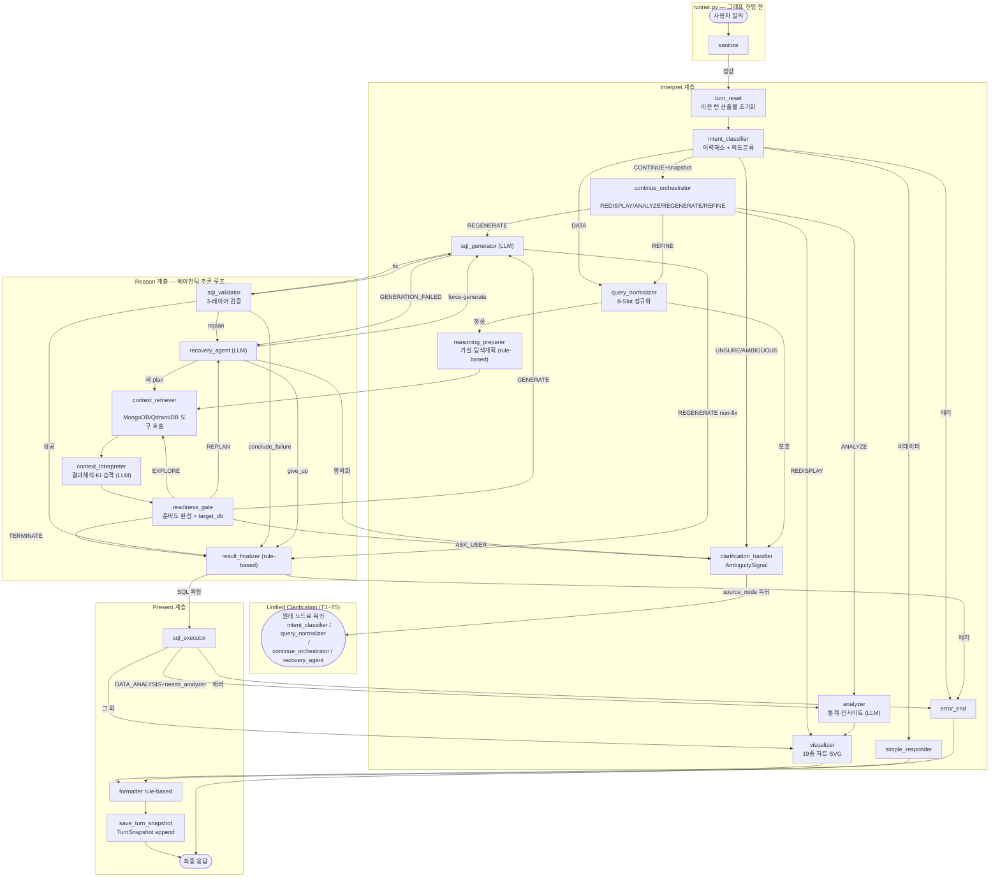
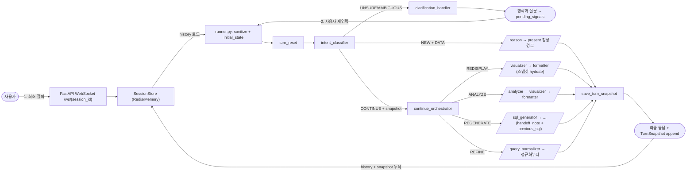
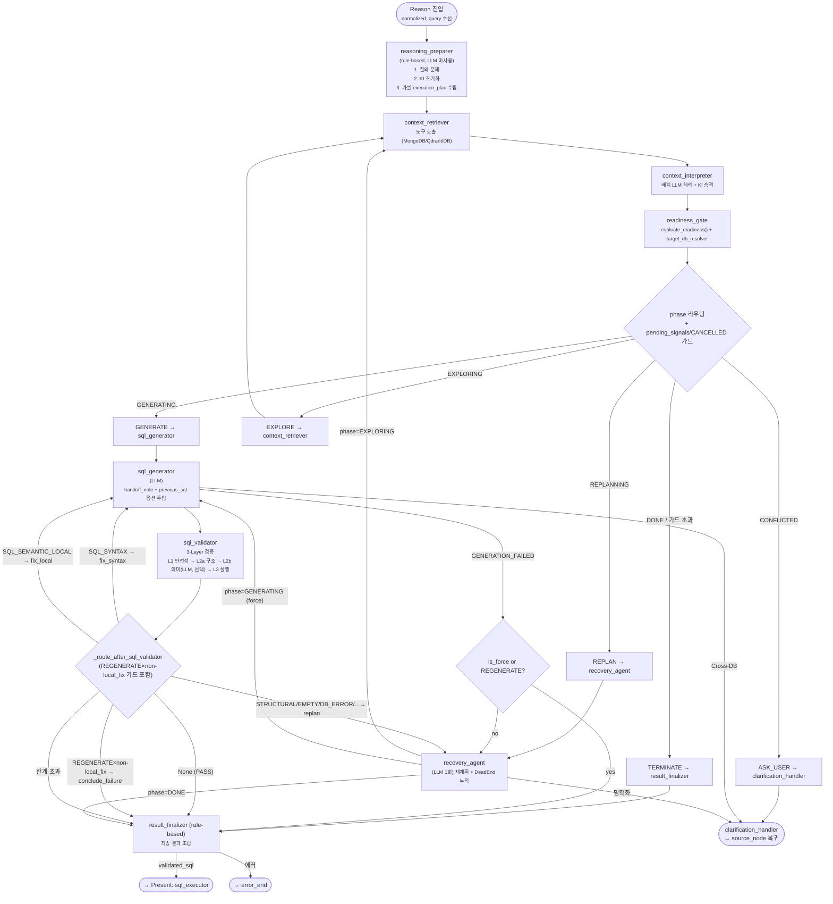

# Pipeline Architecture — Data Copilot

> **Version 3.5** (2026-04-20)
> 본 문서는 실제 구현 코드(`src/agents/graph/pipeline.py`)를 기반으로
> 사용자 질의 입력부터 최종 응답까지 전체 처리 흐름을 기술한다.

## 목차

- [1. 아키텍처 개요](#1-아키텍처-개요) — 3계층 노드 인벤토리(전체 19노드) + 핵심 소스 파일
- [2. 파이프라인 그래프](#2-파이프라인-그래프--노드-수준-개요) — Mermaid 전체 그래프
- [3. 세션 관리 및 멀티턴 흐름](#3-세션-관리-및-멀티턴-흐름) — CONTINUE 4-Way 오케스트레이터 포함
- [4. Reason 계층 상세](#4-reason-계층--에이전틱-추론-상세-흐름) — 추론 루프, ReasoningState, 검증 라우팅
- [5. Interpret 계층 상세](#5-interpret-계층-상세) — turn_reset / intent_classifier / continue_orchestrator / query_normalizer / clarification_handler
- [6. Present 계층 상세](#6-present-계층-상세) — sql_executor / analyzer / visualizer / formatter / save_turn_snapshot
- [7. 라우팅 함수 요약](#7-라우팅-함수-요약) — `pipeline.py` 정의된 모든 라우팅 함수
- [8. 상태 모델](#8-상태-모델--전체-레퍼런스) — PipelineState / ReasoningState 필드 정본 스냅샷
- [9. 프롬프트 관리](#9-프롬프트-관리) — `resources/prompts/` 디렉토리 인덱스
- [10. 커넥터 아키텍처](#10-커넥터-아키텍처) — MongoDB / PostgreSQL / Qdrant / Redis
- [변경 이력](#변경-이력)

---

## 1. 아키텍처 개요

3계층(Interpret → Reason → Present)을 가진 단일 LangGraph 파이프라인이다. 그래프 진입점은
`turn_reset`이며, 이전 턴 산출물을 일괄 초기화한 뒤 `intent_classifier`로 진입한다.
전처리(sanitize)는 그래프 외부 `runner.py`가 담당한다.

| 계층 | 노드 | 역할 |
|------|------|------|
| **턴 경계** | `turn_reset` | 이전 턴 산출물 초기화 (단일 진실원: `PipelineState.turn_reset_updates()`) |
| **Interpret** | `intent_classifier` | 이력 해소 + 의도 분류 (단일 LLM 호출) |
| **Interpret** | `continue_orchestrator` | CONTINUE 의도 시 4-Way(REDISPLAY/ANALYZE/REGENERATE/REFINE) 라우팅 |
| **Interpret** | `query_normalizer` | 8-Slot `NormalizedQuery` 생성 (2-Phase) |
| **Interpret(명확화)** | `clarification_handler` | 통합 명확화 (T1~T5 트리거, source_node로 복귀) |
| **Reason** | `reasoning_preparer` | 규칙 기반 가설·실행계획 수립 (LLM 미사용) |
| **Reason** | `context_retriever` | MongoDB / Qdrant / DB 도구 호출 |
| **Reason** | `context_interpreter` | 결과 배치 해석 + KnowledgeItem 승격 |
| **Reason** | `readiness_gate` | 준비도 판정 + target_db 결정 |
| **Reason** | `sql_generator` | SQL 생성 (LLM) |
| **Reason** | `sql_validator` | 3-레이어 검증 (안전·구조·의미·실행) |
| **Reason** | `recovery_agent` | 실패 후 재계획 (LLM 1회) |
| **Reason** | `result_finalizer` | reason 종료 시 결과 조립 (rule-based) |
| **Present** | `sql_executor` | SQL 실행 (이중 안전성 검증) |
| **Present** | `analyzer` | 데이터 분석·인사이트 (DATA_ANALYSIS + needs_analyzer) |
| **Present** | `visualizer` | 시각화 판정 + SVG 생성 |
| **Present** | `formatter` | 사용자 친화 포맷 변환 (rule-based) |
| **Present** | `save_turn_snapshot` | 턴 종료 시 `TurnSnapshot` append (CONTINUE 재참조용) |
| **Present** | `simple_responder` | 비데이터 의도(CASUAL_TALK/META_QUESTION) 경량 응답 |
| **Terminal** | `error_end` | 에러·취소 사용자 친화 메시지 변환 |

> **노드 수:** 19개 (`turn_reset` + interpret 4 + reason 8 + present 5 + simple_responder + error_end).

**핵심 소스 파일:**

| 파일 | 역할 |
|------|------|
| `src/agents/graph/pipeline.py` | 그래프 빌더 + 라우팅 함수 전체 |
| `src/agents/graph/runner.py` | 파이프라인 실행 진입점 (sanitize 전처리 포함) |
| `src/agents/state/state.py` | `PipelineState`, `ReasoningState`, `turn_reset_updates()` |
| `src/services/confidence_scorer.py` | 행동 판정 SSOT (`evaluate_readiness`) |
| `src/agents/nodes/interpret/continue_orchestrator.py` | CONTINUE 4-Way 라우팅 + 스냅샷 hydration |
| `src/agents/nodes/interpret/intent_classifier.py` | 이력해소 + 의도분류 통합 노드 |
| `src/agents/nodes/interpret/clarification_handler.py` | AmbiguitySignal 기반 통합 명확화 |
| `src/agents/nodes/reason/context_retriever.py` | 도구 기반 컨텍스트 검색 |
| `src/agents/nodes/reason/context_interpreter.py` | 검색 결과 해석, knowledge_items 승격 |
| `src/agents/nodes/reason/recovery_agent.py` | 실패 후 재계획 전용 |
| `src/agents/nodes/present/visualizer.py` | 19종 시각화 판정·SVG 생성 |
| `src/agents/nodes/present/save_turn_snapshot.py` | 턴 스냅샷 append |

---

## 2. 파이프라인 그래프 — 노드 수준 개요



---

## 3. 세션 관리 및 멀티턴 흐름

대화 이력·명확화 왕복·CONTINUE 오케스트레이션을 포함한 세션 레벨 흐름이다.



### 3.1 멀티턴 상태 전이 예시

| 턴 | 사용자 입력 | intent_classifier | route | 결과 |
|----|-----------|---------------------|-------|------|
| 1 | "데이터 좀 뽑아줘" | NEW → AMBIGUOUS | — | 명확화 질문 |
| 2 | "이번달 여신 잔액" | NEW → DATA_EXTRACTION | — | 정상 reason→present |
| 3 | "그거 지점별로 나눠줘" | CONTINUE → DATA_EXTRACTION | REGENERATE | sql_generator 직행 (이전 SQL+handoff_note) |
| 4 | "표 말고 막대그래프" | CONTINUE → DATA_EXTRACTION | REDISPLAY | visualizer 직행 (sql/result 동일) |
| 5 | "지점별 추세 분석해줘" | CONTINUE → DATA_ANALYSIS | ANALYZE | analyzer 직행 (sql_executor 스킵) |
| 6 | "오늘 날씨 어때?" | NEW → CASUAL_TALK | — | simple_responder |

### 3.2 ContinueRoute 4-Way (Path F')

`ContinueRoute`(`src/models/enums.py`)는 CONTINUE 턴의 라우팅 카테고리를 정의한다.
판정 우선순위: **REDISPLAY → ANALYZE → REGENERATE → REFINE** (하류 비용 낮은 순).

| Route | 목적지 | 스냅샷 hydration | handoff_note 섹션 |
|-------|--------|------------------|-------------------|
| `REDISPLAY` | `visualizer` | `result_data` + `visualization` 복원 | `### 시각화 지시` |
| `ANALYZE` | `analyzer` | `result_data` → `sql_result` 복원 (SQL 재실행 스킵) | `### 분석 지시` |
| `REGENERATE` | `sql_generator` | `NormalizedQuery`/KI/`query_decomposition`/`target_db` 전량 + `previous_turn_sql` | `### SQL 생성 지시` |
| `REFINE` | `query_normalizer` | hydration **건너뜀** (정규화 결과 오염 방지) | `### 연속 처리 의도` |

> 모든 route는 **하류 노드로만** 향한다. 상류 회귀가 없으므로 순환 위험 없음.
> 판정 실패 시 `error_end`로 즉시 종료한다.

### 3.3 세션 스토어

| 구현체 | 키 | TTL | 용도 |
|--------|-----|-----|------|
| `MemoryStore` | dict key = session_id | FIFO (100건) | 개발/테스트 |
| `RedisStore` | `session:{sid}:history` | 슬라이딩 30분 | 운영 |
| `RedisStore` | `session:{sid}:clarify` | 고정 5분 | 명확화 상태 |

---

## 4. Reason 계층 — 에이전틱 추론 상세 흐름

Reason 계층은 탐색-판정-생성-검증-복구 순환 루프를 통해 SQL을 점진적으로 완성한다.

### 4.1 ReasoningState 모델

`src/agents/state/state.py:531`의 `ReasoningState`가 추론 루프 전체 상태를 관리한다.
W/R 약어: PRP=reasoning_preparer, FET=context_retriever, INT=context_interpreter,
RDG=readiness_gate, GEN=sql_generator, VAL=sql_validator, RCV=recovery_agent, FIN=result_finalizer.

**Phase 전이 (`Phase` enum):**

```
PLANNING → EXPLORING → GENERATING → VALIDATING → REPLANNING → DONE
```

**핵심 필드:**

| 카테고리 | 필드 | 타입 | 역할 |
|----------|------|------|------|
| 진행 | `phase` | `Phase` | 현재 추론 단계 |
| 플래너 | `query_decomposition` | `dict` | 질의 분해 결과 |
| 플래너 | `hypotheses`, `current_hypothesis` | `list[Hypothesis]`, `Optional` | 탐색 가설 |
| 플래너 | `execution_plan` | `list[ExecutionStep]` | 도구 실행 계획 |
| 누적지식 | `knowledge_items` | `list[KnowledgeItem]` | 수집된 지식 (UNRESOLVED→…→CONFIRMED) |
| 누적지식 | `explored_use_cases` | `list[UseCaseEntry]` | 유사 SQL |
| 누적지식 | `explored_tables` | `list[TableMeta]` | 후보 테이블 (관찰 데이터·샘플 포함) |
| 누적지식 | `explored_biz_manuals` | `list[BizManualEntry]` | 업무 매뉴얼 |
| 누적지식 | `explored_biz_terms` | `list[BizTermEntry]` | 비즈 용어 |
| 누적지식 | `explored_codes` | `dict[str, CodeMeta]` | 코드 메타 |
| 누적지식 | `executed_tool_keys` | `set[str]` | 도구 실행 중복 방지 |
| 누적지식 | `discovered_facts` | `list[str]` | 도구 결과 텍스트 누적 |
| 실패 | `dead_ends` | `list[DeadEnd]` | 실패 가설 기록 |
| 타깃 DB | `target_db` | `str` | 결정된 DB 코드 (SSOT) |
| 타깃 DB | `target_db_decision` | `TargetDbDecision\|None` | 결정 근거(상태/선택/탈락) |
| SQL | `generated_sql`, `validated_sql` | `Optional[str]` | 생성·검증 통과 SQL |
| SQL | `sql_explanation` | `str` | LLM이 추출한 1줄 설명 |
| SQL | `previous_turn_sql`, `previous_turn_sql_explanation` | `str` | CONTINUE hydration 전용 (REGENERATE 시 `{previous_sql}` 주입) |
| SQL | `pending_assumptions` | `list[str]` | SQL 생성 가정 (성공 시 resolved_signals 전환) |
| 검증 | `validation_checks` | `dict` | Layer2b 체크 항목별 결과 |
| 검증 | `validation_summary` | `str` | LLM 종합 판단 (formatter/insight_builder 참조) |
| 검증 | `confidence_score` | `float` | Layer2b 신뢰도 |
| 실패맥락 | `failure_type`, `failure_reason` | `FailureType\|None`, `str\|None` | pipeline 라우팅·DeadEnd reason |
| 실패맥락 | `fix_history` | `list[str]` | local_fix 누적 (재시도 프롬프트) |
| 루프 | `loop_guard` | `LoopGuard` | 4종 카운터 |
| 회복 | `exploration_phase` | `Literal["initial","recovery"]` | 탐색 페이즈 |
| 회복 | `recovery_rounds`, `recovery_entry_source` | `int`, `str\|None` | 회복 횟수·진입 원인 |
| 회복 | `is_force_generated` | `bool` | 한계 도달 강제 생성 플래그 |
| 결과 | `final_status`, `exploration_summary` | `FinalStatus`, `str` | 최종 상태·요약 |

**KnowledgeItem 상태 전이 (`ConfidenceStatus`):**

```
UNRESOLVED → CANDIDATE → PROBABLE → CONFIRMED
                                  ↘ CONFLICTED → (사용자 확인)
```

### 4.2 추론 흐름 다이어그램



### 4.3 확신도 계산

`services/confidence_scorer.py`의 `calculate_readiness()`가 0.0~1.0 점수를 산출한다.

| 차원 | 가중치 | 계산 방식 |
|------|--------|----------|
| 용어 해소율 | 50% | `(CONFIRMED+PROBABLE) / 전체 KI` |
| 유사 SQL 매칭 | 30% | 탐색된 use_cases 중 최대 similarity |
| 조인 경로 확인 | 20% | 다중 테이블 시 조인 경로 확인 여부 (단일은 1.0) |

**임계값:** `≥0.65` + 핵심 KI 확정 → GENERATE / `≤0.30` → REPLAN.

### 4.4 LoopGuard

| 카운터 | 한계 | 효과 |
|--------|------|------|
| `total_tool_calls` | `MAX_TOOL_CALLS=20` | `should_terminate()` |
| `replan_count` | `MAX_REPLANS=3` | 동일 |
| `generate_attempts` | `MAX_GENERATES=4` | 동일 (0이면 무제한) |
| `local_fix_count` | `MAX_LOCAL_FIXES=2` | `should_escalate_to_structural()` → REPLAN 에스컬레이션 |

### 4.5 SQL 검증 실패 라우팅 (6 분기)

`_route_after_sql_validator()` (`pipeline.py:231`)가 8종 `FailureType`을 6 목적지로 분기한다.

| failure_type | 추가 조건 | 라우팅 |
|--------------|----------|--------|
| `None` | — | `conclude_success` → result_finalizer |
| `SQL_SYNTAX` | `generate_attempts < MAX_GENERATES` 그리고 에스컬레이션 미도달 | `fix_syntax` → sql_generator |
| `SQL_SEMANTIC_LOCAL` | local_fix 한도 미도달 | `fix_local` → sql_generator |
| `SQL_SEMANTIC_LOCAL` | `should_escalate_to_structural()=True` | `replan` → recovery_agent |
| `SQL_STRUCTURAL` / `EMPTY_RESULT` / `DB_ERROR` / `NO_KNOWLEDGE` / `NO_TABLE` / `TERM_UNRESOLVABLE` / `GENERATION_FAILED` | — | `replan` → recovery_agent |
| 기타 / 한계 초과 | — | `conclude_failure` → result_finalizer |

> **REGENERATE × non-local_fix 가드 (Phase 3 §14.3.5):** `state.route == REGENERATE`이고
> 실패가 `SQL_SYNTAX` / `SQL_SEMANTIC_LOCAL` 외이면 `recovery_agent` 진입 없이
> 즉시 `conclude_failure`로 직행한다. REGENERATE 전제(직전 턴 재료 그대로 재작성)가 깨진 신호이기 때문이다.

---

## 5. Interpret 계층 상세

### 5.1 turn_reset (그래프 진입점)

`PipelineState.turn_reset_updates()`를 단일 진실원으로 호출하여 turn-scope 19개 필드를
초기화한다. 세션 지속 필드(`session_id`, `conversation_history`, `user_input`,
`original_query`, `preprocessed_input`, `turn_id`, `turn_snapshots`)는 보존한다.
interrupt 재개(`Command(resume=...)`) 경로는 LangGraph resume semantics에 의해 이 노드를
타지 않으므로 명확화 대기 상태가 보장된다.

### 5.2 sanitize (`runner.py` — 그래프 외부)

LLM 호출 없이 NFKC 정규화·길이 제한(500자)·SQL/프롬프트 인젝션 감지(13종 패턴)·
공백 정규화를 수행한다.

### 5.3 intent_classifier (이력 해소 + 의도 분류 통합)

`src/agents/nodes/interpret/intent_classifier.py`가 `services/intent_classifier.py`에 위임한다.
이력 해소(`HistoryDecision`: CONTINUE/NEW/UNSURE/SKIP)와 의도 분류(`IntentType`)를
**단일 LLM 호출**로 동시 수행한다.

**분류 결과 기반 라우팅 (`_route_after_intent_classifier`):**

| 조건 | 라우팅 |
|------|--------|
| `pending_signals` 존재 | `clarification_handler` |
| `status == CANCELLED/ERROR` | `error_end` |
| `status == CONTINUE_ORCHESTRATION_PENDING` | `continue_orchestrator` |
| `intent ∈ {CASUAL_TALK, META_QUESTION}` | `simple_responder` |
| 그 외 | `query_normalizer`(`normalization_enabled=True`) 또는 `reasoning_preparer` |

**룰 기반 게이트:** 이력이 있어도 지시대명사/수정 표현/짧은 입력/명확화 응답 패턴이
없으면 LLM 호출을 생략한다(SKIP).

### 5.4 continue_orchestrator (CONTINUE 4-Way)

CONTINUE 의도이고 `turn_snapshots`가 있을 때 활성화된다. 4-Way 라우팅 판정(LLM)을
수행하고 라우트별 hydration 후 `Command(goto=...)`를 반환하여 정적 엣지 없이 라우팅한다.

| 단계 | 동작 |
|------|------|
| 1. 스냅샷 직렬화 | `_serialize_snapshots()`가 `turn_snapshots`(+`reference_turns`)를 LLM 입력 포맷으로 변환 |
| 2. LLM 판정 | route(REDISPLAY/ANALYZE/REGENERATE/REFINE) + handoff_note 작성 |
| 3. handoff_note 섹션 검증 | 라우트별 필수 섹션(`### 시각화 지시` 등) 누락 시 재시도 또는 error_end |
| 4. hydration | 라우트별 state 복원 (REGENERATE는 reason 재료, REDISPLAY/ANALYZE는 result_data) |
| 5. Command(goto) | visualizer / analyzer / sql_generator / query_normalizer 직행 |

> **제약:** continue_orchestrator는 정적 엣지를 갖지 않는다 (설계 §4.3 제약 1).
> 판정 실패(LLM 파싱 오류·빈 스냅샷)는 즉시 error_end로 종료한다.

### 5.5 query_normalizer (8-Slot 정규화)

자연어를 8-Slot `NormalizedQuery`로 변환한다.

| 슬롯 | 예시 |
|------|------|
| INTENT | AGGREGATE / RANK / COMPARE / TREND |
| ENTITY | `{"term": "대출", "type": "DIRECT"}` |
| MEASURE | `{"term": "건수", "agg_function": "COUNT"}` |
| DIMENSION | `{"term": "지점", "role": "GROUP"}` |
| FILTER | `{"column": "상태", "op": "EQUALS", "value": "정상"}` |
| TIME | `{"type": "RELATIVE", "base_period": "이번달"}` |
| MODIFIER | `{"type": "RANK", "direction": "DESC", "limit": 10}` |
| OUTPUT_HINT | `{"format": "SPEC_SHEET", "doc_type": "연체명세"}` |

**2-Phase 파이프라인:** Phase 1(LLM 슬롯 추출 + 후처리) → Phase 2(선택, R1~R12 교차 검증).

### 5.6 clarification_handler (T1~T5 통합 명확화)

`AmbiguitySignal` + `pending_signals`/`resolved_signals` 패턴으로 모든 계층의 모호성을 단일
노드에서 처리한다. 해소 후 `source_node`로 복귀한다.

| 트리거 | 출발 노드 | 조건 |
|--------|----------|------|
| T1 | intent_classifier | UNSURE (맥락 불분명) |
| T2 | intent_classifier | AMBIGUOUS (의도 불분명) |
| T3 | query_normalizer | 슬롯 모호성 |
| T4 | readiness_gate | CONFLICTED 항목 존재 |
| T5 | sql_generator / recovery_agent / continue_orchestrator | Cross-DB·가설 충돌 등 |

**복귀 대상 (`_VALID_RETURN_TARGETS`):**
`intent_classifier`, `query_normalizer`, `recovery_agent`, `continue_orchestrator`.

clarification_handler는 규칙 기반이며 프롬프트를 사용하지 않는다.

---

## 6. Present 계층 상세

### 6.1 sql_executor

- 이중 방어: 실행 전 `validate_sql_safety()` 재검증
- 읽기 전용 계정 사용 (SELECT 전용)
- 결과 행 수 제한 (기본 10,000건)
- `target_db` 라우팅으로 DB 선택
- `sql_result.execution_time_ms` 기록

### 6.2 analyzer (조건부)

`intent == DATA_ANALYSIS`이고 `needs_analyzer == True`일 때만 실행된다.
명세 추출이 본 서비스의 주 업무이므로 analyzer는 **opt-in**(intent_classifier가 명시 분석
요청 — "분석/비교/추이/원인/평가" — 감지 시 True 세팅).

LLM 호출: 통계 분석(summary, insights, statistics 생성). 스트리밍은 `streaming_enabled=True`
시 토큰 delta 전송, `streaming_delivered`로 중복 방지.

### 6.3 visualizer

19종 시각화 유형(`VisualizationType`)을 판정하여 SVG를 생성한다.
analyzer 후행 또는 sql_executor 직행(분석 불필요 시) 두 진입 경로 모두 가진다.

| 단계 | 동작 |
|------|------|
| 시각화 판정 | LLM이 `viz_judgment` 프롬프트로 차트 유형 결정 |
| SVG 생성 | LLM이 `viz_svg` 프롬프트로 SVG 직접 생성 |
| 폴백 | 판정 NONE이면 SVG 생성 스킵 |

### 6.4 formatter (rule-based)

SQL 결과를 사용자 친화적 한국어 보고서로 변환한다. **LLM 호출 없음**(rule-based 전환 완료).

- 기술 용어 최소화 (SQL/JOIN/WHERE 미사용)
- 숫자 포맷: 금액(만원/억원), 비율(%), 건수
- 날짜: "2026년 3월" 형태
- 조건 설명: 자연어로 풀어서 설명
- `process_summary` 생성 (전구 아이콘 데이터)
- `result_data` 생성 (stream.end·메타데이터 저장)

### 6.5 save_turn_snapshot

`formatter` 직후 실행되어 현재 턴 산출물(NormalizedQuery, knowledge_items,
query_decomposition, target_db, generated_sql, sql_explanation, result_data,
visualization 등)을 `TurnSnapshot`으로 묶어 `turn_snapshots`에 append한다.
세션 지속 필드이므로 turn_reset 대상에 포함되지 않는다.

> **REDISPLAY skip 폐기 (Path F' §11.5):** REDISPLAY 경로도 visualization 갱신분 보존을 위해
> 저장한다.

### 6.6 simple_responder

`CASUAL_TALK` / `META_QUESTION` intent의 경량 정형 응답 노드. LLM 호출 없음.
`formatter`로 합류한다.

### 6.7 error_end

에러·취소 상태를 사용자 친화 메시지로 변환한다. `process_summary`도 여기서 직접 생성하여
프론트엔드 전구 아이콘에 노출한다. CANCELLED는 기존 메시지 보존, SQL 재시도 소진 시
별도 안내 메시지 사용.

---

## 7. 라우팅 함수 요약

`pipeline.py`에 정의된 모든 라우팅 함수의 분기 조건이다.

| 함수 | 입력 조건 | 분기 |
|------|----------|------|
| `_route_after_intent_classifier` | `pending_signals` / `status` / `intent` | clarification_handler / continue_orchestrator / simple_responder / query_normalizer / reasoning_preparer / error_end |
| `_route_after_normalize` | `pending_signals` / CANCELLED | clarification_handler / reasoning_preparer / error_end |
| `_route_after_readiness_gate` | `reason.phase` + 가드 | explore / generate_sql / recovery / conclude_failure / clarification_handler |
| `_route_after_sql_generator` | `failure_type` + `route` 가드 | sql_validator / clarification_handler / replan / conclude_failure |
| `_route_after_sql_validator` | `failure_type` + `route` + `loop_guard` | conclude_success / fix_syntax / fix_local / replan / conclude_failure (6분기) |
| `_route_after_recovery_agent` | `reason.phase` | context_retriever / sql_generator / result_finalizer / clarification_handler |
| `_route_after_result_finalizer` | `status` / `error_message` / `validated_sql` | sql_executor / error_end |
| `_route_after_clarify` | `resolved_signals[*].source_node` (현재 turn_id 필터) | `_VALID_RETURN_TARGETS` 중 하나 |
| `_route_after_execution` | `status` / `intent` / `needs_analyzer` | analyzer / visualizer / error_end |

> **`continue_orchestrator`는 라우팅 함수를 갖지 않는다.** `Command(goto=...)`로 직접 라우팅한다.

---

## 8. 상태 모델 — 전체 레퍼런스

> **정본(SSOT):** `src/agents/state/state.py`. 본 섹션은 정본의 스냅샷이며 코드와 불일치 시 코드가 우선한다.

### 8.1 구조 개요

```
PipelineState
├── 공통 ─────────── user_input, session_id, original_query, conversation_history
├── 턴 격리 ──────── turn_id
├── Interpret ────── preprocessed_input, analysis_query, intent, intent_confidence,
│                    query_category, is_continuation, needs_analyzer, continue_context,
│                    normalized_query
├── 명확화 ────────── pending_signals, resolved_signals
├── Reason ───────── reason: ReasoningState (중첩, 상세는 §4.1)
├── Present ──────── sql_result, analysis_result, visualization, formatted_response,
│                    result_data, process_summary
├── 스트리밍 ──────── streaming_enabled, streaming_delivered
├── 상태 ─────────── status, error_message
├── 추적 ─────────── trace_log
└── CONTINUE ──────── turn_snapshots (세션 지속), reference_turns, route, handoff_note,
                      current_user_message_seq
```

### 8.2 PipelineState 필드 (현행)

| 카테고리 | 필드 | 타입 | 용도 |
|----------|------|------|------|
| 공통 | `user_input` / `session_id` / `original_query` | `str` | 입력·세션·원본 보존 |
| 공통 | `conversation_history` | `list[dict]` | 이전 대화 (`role`/`content`) |
| 턴 격리 | `turn_id` | `str` | 매 턴 uuid4 (clarification 컨텍스트·라우팅) |
| Interpret | `preprocessed_input` | `str` | sanitize 완료 입력 |
| Interpret | `analysis_query` | `str` | DATA_ANALYSIS rewriter 입력 / CONTINUE 맥락 해소 후 질의 |
| Interpret | `intent` / `intent_confidence` / `query_category` | `IntentType` / `float` / `str` | 의도 분류 |
| Interpret | `is_continuation` / `continue_context` | `bool` / `str` | CONTINUE 맥락 힌트 |
| Interpret | `needs_analyzer` | `bool` | analyzer opt-in 플래그 |
| Interpret | `normalized_query` | `NormalizedQuery\|None` | 8-Slot 결과 |
| 명확화 | `pending_signals` / `resolved_signals` | `list[AmbiguitySignal]` | T1~T5 시그널 큐·누적 |
| Reason | `reason` | `ReasoningState` | 중첩 (§4.1) |
| Present | `sql_result` | `SQLResult` | columns/rows/row_count/execution_time_ms |
| Present | `analysis_result` | `AnalysisResult` | summary/insights/statistics |
| Present | `visualization` | `VisualizationData` | svg_code/chart_type/title |
| Present | `formatted_response` | `str` | 사용자 응답 텍스트 |
| Present | `result_data` / `process_summary` | `dict\|None` | stream.end 전송·턴 metadata |
| 스트리밍 | `streaming_enabled` / `streaming_delivered` | `bool` | analyzer/SVG 토큰 delta |
| 상태 | `status` / `error_message` | `QueryStatus` / `str` | 라우팅·에러 |
| 추적 | `trace_log` | `list[TraceEntry]` | 추론 과정 로깅 |
| CONTINUE | `turn_snapshots` | `list[TurnSnapshot]` (런타임 `Any`) | 세션 지속, save_turn_snapshot append |
| CONTINUE | `reference_turns` | `list[str]` | 참조 턴 라벨(intent_classifier 산출) |
| CONTINUE | `route` | `ContinueRoute\|None` | continue_orchestrator 판정 |
| CONTINUE | `handoff_note` | `str` | 하류 노드 프롬프트 주입 (`{handoff_note}`) |
| CONTINUE | `current_user_message_seq` | `int\|None` | TurnSnapshot 매핑 키 |

### 8.3 Enum 정의 (`src/models/enums.py` 정본)

| Enum | 값 |
|------|-----|
| `HistoryDecision` | CONTINUE / NEW / UNSURE / SKIP |
| `IntentType` | DATA_EXTRACTION / DATA_ANALYSIS / CLARIFICATION_NEEDED / GENERAL_QUESTION / CASUAL_TALK / META_QUESTION / UNKNOWN |
| `QueryStatus` | PENDING / PREPROCESSING / INTENT_CLASSIFIED / QUERY_NORMALIZED / AWAITING_CLARIFICATION / **CONTINUE_ORCHESTRATION_PENDING** / CONTEXT_COLLECTED / SQL_GENERATED / SQL_VALIDATED / SQL_RETRY / EXECUTED / ANALYZED / FORMATTED / COMPLETED / CANCELLED / ERROR |
| `ContinueRoute` | REDISPLAY / ANALYZE / REGENERATE / REFINE |
| `VisualizationType` | NONE / TABLE_ONLY / INFO_CARD / 정량 차트 10종 / 다이어그램 8종 |
| `ConfidenceLevel` | HIGH / MEDIUM / LOW |
| `ConfidenceStatus` | UNRESOLVED / CANDIDATE / PROBABLE / CONFIRMED / CONFLICTED |
| `FailureType` | NO_KNOWLEDGE / NO_TABLE / TERM_UNRESOLVABLE / SQL_SYNTAX / SQL_SEMANTIC_LOCAL / SQL_STRUCTURAL / EMPTY_RESULT / DB_ERROR / GENERATION_FAILED |
| `Phase` | PLANNING / EXPLORING / GENERATING / VALIDATING / REPLANNING / DONE |
| `HypothesisStatus` | PENDING / ACTIVE / SUCCESS / FAILED |
| `StepStatus` | PENDING / DONE / SKIPPED / FAILED |
| `SelectionStatus` | PENDING / SELECTED / REJECTED / REFERENCE |
| `FinalStatus` | pending / success / cancelled / failure / awaiting_clarification |
| `TargetDbStatus` | FORCED / SINGLE / AMBIGUOUS / NO_SELECTION |

### 8.4 서브타입 (현행)

```
KnowledgeItem          — key, value, confidence, status(ConfidenceStatus), source, evidence[],
                         is_critical, knowledge_id
Hypothesis             — hypothesis_id, description, based_on_use_case, missing_terms[], priority,
                         strategy, status, readiness_score, readiness_verdict
ExecutionStep          — step, tool, input, purpose, status, insight, raw_result, hypothesis_id
TableMeta              — table_name, alt_name, description, schema_name, db_source, subject_area,
                         hypothesis_id, columns[], key_date_columns[], observed_date_columns[],
                         sample_rows, inference_confidence, selection_status, selection_reason
ColumnInfo             — name, alt_name, description, col_type, is_pk, total_rows, non_null_count,
                         null_count, null_rate, distinct_count, min_val, max_val,
                         discovered_values[]
BizManualEntry         — biz_manual_id, content, score, source, point_id, source_step,
                         hypothesis_id, selection_status, selection_reason
BizTermEntry           — biz_term_id, term, definition, synonyms[], related_tables[], source,
                         source_step, hypothesis_id, selection_status, selection_reason
UseCaseEntry           — id, description, sql, domain, score, point_id, source_step,
                         hypothesis_id, relevant, eval_reason, enrichment_tables[],
                         enrichment_codes{}
CodeMeta               — column_name, column_desc, codes{}
DeadEnd                — hypothesis_id, failure_type(FailureType), reason, lessons_learned,
                         related_knowledge_keys[]
TargetDbDecision       — status(TargetDbStatus), target, chosen_tables[], dropped_tables[],
                         decision_rationale
LoopGuard              — total_tool_calls, replan_count, generate_attempts, local_fix_count
StructuralHints        — join_patterns[], code_columns{}, agg_expressions[], date_filters[],
                         source_tables[], select_columns[], group_by_columns[],
                         order_by_columns[], limit_value, has_distinct, has_subquery, has_having
SQLResult              — columns[], rows[], row_count, execution_time_ms
AnalysisResult         — summary, insights[], statistics{}
VisualizationData      — svg_code, chart_type(VisualizationType), title
TraceEntry             — node, action, detail, timestamp
TurnSnapshot           — (snapshot.py) user_input, normalized_query, knowledge_items,
                         query_decomposition, target_db, generated_sql, sql_explanation,
                         result_data, visualization, intent, needs_analyzer, user_message_seq
AmbiguitySignal        — turn_id, source_node, signal_type, question, options, answer
```

---

## 9. 프롬프트 관리

모든 프롬프트는 `resources/prompts/` 하위 3계층 디렉토리에 외부 파일로 관리된다.
`src/agents/nodes/system_prompts.py`에서 모듈 상수로 로딩한다.

**명명 규칙:** `{노드파일명}[_{하위기능}][_{phase}]_{역할}.txt` → 변수명은 UPPER_SNAKE_CASE.

| 디렉토리 | 활성 파일 | 노드 |
|----------|---------|------|
| `interpret/` | `intent_classifier_system/user.txt`, `query_normalizer_phase1/2_system/user.txt` | intent_classifier, query_normalizer |
| `interpret/` | continue_orchestrator 프롬프트 | continue_orchestrator |
| `reason/` | `context_interpreter_system.txt`, `sql_generator_system.txt`, `sql_generator_fix_section.txt`, `sql_validator_system.txt`, `recovery_agent_system.txt` | 각 노드 |
| `present/` | `analyzer_system/user.txt`, `analyzer_viz_judgment_system/user.txt`, `analyzer_viz_svg_system/user.txt` | analyzer, visualizer |

> **rule-based 노드(LLM 미사용):** `reasoning_preparer`, `readiness_gate`, `result_finalizer`,
> `formatter`, `simple_responder`, `clarification_handler`, `save_turn_snapshot`, `turn_reset`.
> 상세 매핑은 `prompt-node-service-mapping.md` 참조.

---

## 10. 커넥터 아키텍처

`ConnectorManager` 싱글턴이 4종 외부 시스템 연결을 관리한다 (Neo4j는 향후 검토).

| 커넥터 | 용도 | Dummy 모드 |
|--------|------|-----------|
| MongoDB | 테이블/컬럼 메타, 코드 메타, 비즈용어 사전 | 샘플 데이터 |
| Info DB (PostgreSQL → Sybase IQ/Impala) | 정보계 SQL 실행 (읽기 전용) | 샘플 결과 |
| History DB (PostgreSQL) | 과거 SQL 이력 ILIKE 검색 (보완) | 샘플 SQL |
| Qdrant | 업무 매뉴얼(Dense 1024-dim) + SQL 이력(Hybrid Dense+Sparse) | 샘플 문서 |
| Redis | 세션 스토어, 명확화 상태 | 인메모리 폴백 |

**ElasticSearch:** 미사용 (2026-04 제거). 메타는 MongoDB, SQL 이력은 Qdrant로 일원화.

**폐쇄망 전환:** `.env`의 `USE_DUMMY=false` + 각 커넥터 접속 정보 설정으로 전환.
상세: `docs/guides/migration-guide.md`, `docs/guides/closed-network-runbook.md` 참조.

---

## 변경 이력

| 버전 | 날짜 | 주요 변경 |
|------|------|----------|
| **3.5** | 2026-04-20 | **목차 추가**. 신규 노드 4개(`turn_reset`, `continue_orchestrator`, `visualizer`, `save_turn_snapshot`) 전 섹션 반영. 노드 인벤토리 19개로 갱신, Mermaid 그래프 재작성(CONTINUE 4-Way 분기 포함). PipelineState 필드 현행화(`turn_id`/`route`/`handoff_note`/`turn_snapshots`/`reference_turns`/`current_user_message_seq`/`analysis_query`/`needs_analyzer`/`continue_context`/`result_data`/`process_summary`/`streaming_*`). ReasoningState 보강(`target_db`/`target_db_decision`/`previous_turn_sql*`/`pending_assumptions`/`validation_summary`/`confidence_score`/`fix_history`/`explored_*`). 검증 라우팅 6분기로 갱신(REGENERATE×non-local_fix 가드 포함). Present 계층 4노드 분리(sql_executor/analyzer/visualizer/formatter/save_turn_snapshot). ES 제거 명시. ISSUE-1~9 분석 섹션은 §8에서 분리(설계 분석은 `state-architecture.md`로 일원화). |
| **3.4** | 2026-04-13 | (이전 버전) `_route_after_sql_validator` 6 목적지 표기, Phase 라우팅 보강 |
| **3.3** | 2026-04-02 | `planner` → `reasoning_preparer` 리네이밍, Fast-Path 제거, 확신도 임계값 0.65 변경 |
| **3.2** | 2026-04-02 | `recovery_agent`를 재계획 전용으로 변경 (LLM 1회) |
| **3.1** | 2026-04-01 | 노드 리네이밍 (preprocess 제거, context_explorer→retriever+interpreter, confidence_evaluator→readiness_gate 등) |
| **3.0** | 2026-03-25 | 3계층 파이프라인 재설계, 전체 문서 신규 작성 |
| **2.0** | 2026-03-20 | 아키텍처 재설계 문서화 |
| **1.0** | 2026-03-15 | 초기 버전 |
