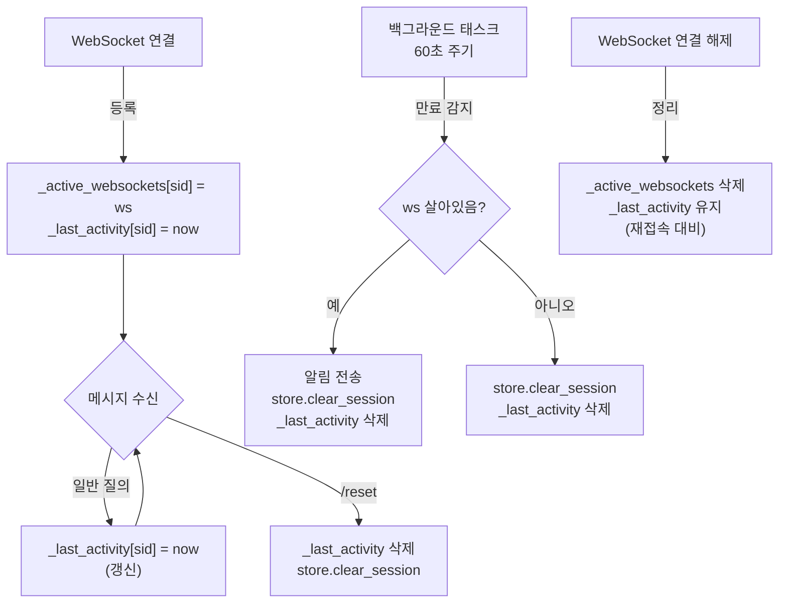

# 세션 TTL 만료 알림 전략

> **목적**: 대화 이력이 TTL 만료로 삭제될 때 사용자에게 사전 알림을 전송하여,
> 후속 질의 시 "왜 이전 맥락을 모르는지" 혼란을 방지한다.

**버전**: 1.0
**최종 수정**: 2026-03-24
**대상 독자**: 개발자, 아키텍트

---

## 1. 문제 정의

### 1.1 현재 상황

Redis TTL에 의해 세션 데이터가 자동 삭제되지만, 사용자에게 아무런 안내가 없다.

```
14:00  사용자: "신규 고객 수 알려줘" → 1,234명입니다
14:10  사용자: "그 중에서 VIP는?"   → VIP 89명입니다
        ... 30분 경과 ... (Redis: history 키 자동 삭제)
14:45  사용자: "지점별로 보여줘"
        → 시스템이 이전 맥락을 모름
        → "어떤 데이터를 보고 싶으신가요?" (명확화 질문)
        → 사용자: "왜 갑자기 못 알아듣지?"
```

### 1.2 사용자 영향

| 상황 | 사용자 기대 | 실제 동작 | 혼란 정도 |
| --- | --- | --- | --- |
| 30분 후 후속 질의 | 이전 맥락 유지 | 명확화 질문 | **높음** |
| 30분 후 독립 질의 | 정상 처리 | 정상 처리 | 없음 |
| 5분 후 명확화 답변 | 번호 선택 처리 | LLM이 이력 기반 판정 | **낮음** (대부분 정상) |

혼란이 발생하는 핵심 케이스는 **"이전 대화가 있었는데 만료된 후 후속 질의를 보내는 경우"** 단 하나이며, 사전 알림으로 방지 가능하다.

---

## 2. 검토한 대안

### 2.1 대안 A: 입력 시 감지 (resolve_history에서)

사용자가 메시지를 보냈을 때, 이력이 비어있고 후속 패턴이 감지되면 안내.

```
사용자 입력 → resolve_history: history=[] + 후속 패턴 → "이전 대화가 종료되었습니다"
```

**장점:**
- 구현 단순 (백그라운드 태스크 불필요)
- WebSocket/REST 모두 동작

**단점:**
- "이전에 이력이 있었는지" 구분 불가 → 첫 대화의 모호한 질의와 구분 안 됨
- 이를 해결하려면 플래그 저장 필요 → TTL 무한 회귀 문제
  - `had_session` 플래그 TTL 60분? → 61분 후 같은 문제
  - 영구 저장? → 모든 세션 플래그를 영원히 보관
- 안내가 응답에 섞여서 나옴 (사전 인지 불가)

**평가: 근본적 한계로 부적합**

### 2.2 대안 B: main.py 플래그 추적

서버 메모리에 `_had_activity[session_id]` 플래그를 유지.

```python
if _had_activity[sid] and len(history) == 0:
    → "이전 대화가 종료되었습니다"
```

**장점:**
- "이전에 이력이 있었는지" 판단 가능

**단점:**
- 독립 질의에도 불필요한 알림 발생 (main.py는 후속/독립 구분 불가)
- 서버 재시작 시 플래그 소실
- 다중 워커 시 불일치
- REST에서 작동 안 함 (연결 간 상태 없음)

**평가: 오탐 + 상태 관리 복잡도로 부적합**

### 2.3 대안 C: 만료 시점에 사전 알림 (선택)

FastAPI 백그라운드 태스크가 TTL 만료를 감지하고, WebSocket이 살아있으면 알림 전송.

```
14:40  백그라운드 태스크: 만료 감지
       → ws.send_json("장시간 입력이 없어 대화 이력이 초기화되었습니다.")
       → store.clear_session()

14:45  사용자 복귀, 채팅창에 알림이 이미 보임
       사용자: "서울지점만"
       → 명확화 질문 (사용자는 맥락 없음을 이미 인지)
```

**장점:**
- 사용자가 **입력 전에** 만료를 인지 → 혼란 없음
- "이전에 이력이 있었는지" 확실히 판단 가능 (활동 시간 직접 추적)
- 독립 질의에 불필요한 알림 없음 (알림은 만료 시점에 이미 나갔음)
- 플래그 TTL 회귀 문제 없음
- 구현 단순 (asyncio.create_task + dict 2개)

**단점:**
- WebSocket 전용 (REST는 서버 푸시 불가)
- WebSocket 연결이 이미 끊겼으면 알림 전송 불가 → 무해 (데이터 정리만 수행)
- 체크 주기(1분)에 따라 최대 1분 오차 → 실용상 문제 없음

**평가: 가장 자연스러운 UX, WebSocket 한정이지만 주 사용 채널**

---

## 3. 선택: 대안 C (만료 시점 사전 알림)

### 3.1 선택 근거

| 기준 | A (입력 시) | B (플래그) | **C (사전 알림)** |
| --- | --- | --- | --- |
| 첫 대화 구분 | X | O | **O** |
| 독립 질의 오탐 | O (패턴 기반) | O (항상 알림) | **X** |
| 상태 관리 복잡도 | 낮음 | 높음 | **중간** |
| UX 자연스러움 | 낮음 (응답에 섞임) | 낮음 (응답에 섞임) | **높음** (사전 인지) |
| REST 지원 | O | X | **X** (REST는 별도) |
| WebSocket 지원 | O | O | **O** |

REST에서는 세션 만료가 발생해도 다음 요청 시 자연스럽게 처리된다 (명확화 질문 또는 정상 진행). REST 사용자는 명시적으로 `session_id`를 관리하는 개발자이므로 만료 안내의 필요성이 낮다.

### 3.2 역할 분리

```
Redis TTL         → 데이터 자동 정리 (만료된 키 삭제)
FastAPI 태스크    → 사용자 알림 (만료 감지 + WebSocket 전송)
resolve_history   → 맥락 판단 (CONTINUE/NEW/UNSURE, 만료 알림 관여 안 함)
```

---

## 4. 상세 설계

### 4.1 필요 상태

```python
# main.py에 추가
_active_websockets: dict[str, WebSocket] = {}   # session_id → WebSocket 연결
_last_activity: dict[str, float] = {}            # session_id → 마지막 활동 시간 (Unix)
```

- `_active_websockets`: 만료 시 알림을 보낼 대상을 찾기 위한 매핑
- `_last_activity`: 만료 여부를 판단하기 위한 시간 기록

### 4.2 상태 생명주기



### 4.3 백그라운드 태스크

```python
async def _session_expiry_checker():
    """세션 만료를 주기적으로 체크하고 알림을 전송한다."""
    store = get_session_store()
    while True:
        await asyncio.sleep(60)  # 1분 주기
        now = time.time()
        expired = [
            sid for sid, ts in _last_activity.items()
            if now - ts > settings.session_ttl
        ]
        for sid in expired:
            ws = _active_websockets.get(sid)
            if ws:
                try:
                    await ws.send_json({
                        "type": "system",
                        "message": "장시간 입력이 없어 "
                                   "대화 이력이 초기화되었습니다.",
                    })
                except Exception:
                    pass  # 전송 실패 무시 (이미 끊긴 연결)
            await store.clear_session(sid)
            _last_activity.pop(sid, None)
```

### 4.4 알림 메시지 유형

| TTL 유형 | 메시지 | 시점 |
| --- | --- | --- |
| 이력 만료 (30분) | "장시간 입력이 없어 대화 이력이 초기화되었습니다." | 만료 감지 시 (최대 1분 오차) |
| 명확화 만료 (5분) | "응답 대기 시간이 초과되었습니다. 다시 질문해주세요." | 만료 감지 시 |

### 4.5 명확화 만료 처리

명확화 TTL은 5분으로 짧으므로, 백그라운드 태스크에서 별도 추적한다.

```python
_clarify_timestamps: dict[str, float] = {}  # 명확화 상태 저장 시점

# _run_ws_pipeline에서 명확화 상태 저장 시:
if pipeline_result.awaiting_clarification:
    await store.set_clarification(sid, {...})
    _clarify_timestamps[sid] = time.time()

# 백그라운드 태스크에서:
clarify_expired = [
    sid for sid, ts in _clarify_timestamps.items()
    if now - ts > settings.session_clarify_ttl
]
for sid in clarify_expired:
    ws = _active_websockets.get(sid)
    if ws:
        try:
            await ws.send_json({
                "type": "system",
                "message": "응답 대기 시간이 초과되었습니다. "
                           "다시 질문해주세요.",
            })
        except Exception:
            pass
    _clarify_timestamps.pop(sid, None)
    # history는 유지, clarify만 정리 (Redis TTL이 이미 삭제)
```

### 4.6 WebSocket 연결 해제 시 처리

```python
# websocket_endpoint finally 블록
finally:
    _active_websockets.pop(session_id, None)
    # _last_activity는 삭제하지 않음
    # → 재접속 시 만료 판단 가능, TTL 체커가 정리
```

`_last_activity`를 연결 해제 시 삭제하지 않는 이유: 사용자가 재접속할 수 있으므로, 백그라운드 태스크가 만료 시 정리하도록 위임한다.

### 4.7 REST API 처리

REST는 서버 푸시가 불가하므로 **별도 알림 없이 기존 파이프라인 흐름으로 처리**한다.

```
REST 사용자: session_id를 전달 → 이력 만료 시 → 정상 흐름
  → 독립 질의: 정상 처리 (알림 불필요)
  → 후속 질의: classify_intent → AMBIGUOUS → 명확화 질문 (자연스러운 응대)
```

REST 사용자는 명시적으로 `session_id`를 관리하는 개발자이므로, 세션 만료는 API 스펙으로 인지하고 있다.

---

## 5. 엣지 케이스 분석

### 5.1 WebSocket 연결 중 만료

```
시나리오: 사용자가 탭을 열어두고 30분 자리 비움
처리:
  1. 백그라운드 태스크가 만료 감지
  2. ws.send_json() → 채팅창에 알림 표시
  3. store.clear_session() → 데이터 정리
  4. 사용자 복귀 시 알림이 이미 보임 → 새 질의 시작
결과: 정상
```

### 5.2 WebSocket 연결 끊긴 후 만료

```
시나리오: 사용자가 브라우저를 닫고 30분 경과
처리:
  1. WebSocketDisconnect → _active_websockets에서 제거
  2. 백그라운드 태스크가 만료 감지
  3. ws=None → 알림 전송 스킵
  4. store.clear_session() → 데이터 정리
  5. 사용자 재접속 시 → 이력 없음, 새 대화
결과: 정상 (알림은 못 받지만, 어차피 자리에 없었음)
```

### 5.3 만료 직전에 메시지 도착

```
시나리오: 29분 59초에 메시지 도착
처리:
  1. _last_activity[sid] = now (갱신)
  2. Redis: append_history → 슬라이딩 TTL 리셋
  3. 백그라운드 태스크: 다음 체크에서 만료 아님
결과: 정상 (만료 방지)
```

### 5.4 /reset 후 백그라운드 태스크 충돌

```
시나리오: 사용자가 /reset → 28분 후 백그라운드 태스크가 이전 타임스탬프로 만료 감지
처리:
  /reset 시 _last_activity.pop(sid) → 백그라운드 태스크가 해당 sid를 체크하지 않음
결과: 정상 (충돌 없음)
```

### 5.5 서버 재시작

```
시나리오: 서버 재시작 → _active_websockets, _last_activity 모두 소실
처리:
  - Redis 데이터는 유지 (TTL 계속 적용)
  - 사용자 재접속 시 새 WebSocket 연결 → 이력이 있으면 정상 대화
  - 만료 알림은 서버 재시작 전 세션에 대해 전송 불가
결과: 허용 가능 (알림 누락이지만, 서버 재시작은 드문 이벤트)
```

### 5.6 다중 워커 환경

```
시나리오: uvicorn --workers 4
처리:
  - WebSocket 연결은 특정 워커에 바인딩 → 해당 워커의 _active_websockets에만 존재
  - 백그라운드 태스크는 워커마다 독립 실행 → 자기 워커의 연결만 체크
  - Redis 데이터는 공유 → clear_session이 중복 호출될 수 있지만 멱등
결과: 정상 (각 워커가 자기 연결만 관리)
```

---

## 6. 구현 범위

| # | 작업 | 위치 | 설명 |
| --- | --- | --- | --- |
| 1 | `_active_websockets` 매핑 | main.py | WebSocket 연결/해제 시 등록/삭제 |
| 2 | `_last_activity` 추적 | main.py | 매 메시지 수신 시 갱신 |
| 3 | `_clarify_timestamps` 추적 | main.py | 명확화 상태 저장 시 기록 |
| 4 | `_session_expiry_checker` 태스크 | main.py | lifespan에서 시작, 1분 주기 체크 |
| 5 | `/reset` 시 타임스탬프 정리 | main.py | `_last_activity`, `_clarify_timestamps` 삭제 |
| 6 | WebSocket 해제 시 정리 | main.py | `_active_websockets` 삭제, `_last_activity` 유지 |
| 7 | Redis 장애 폴백 | redis_store.py | 각 메서드 try/except → 빈 이력 폴백 |

### 6.1 변경 영향 범위

```
main.py           — 상태 변수 3개 + 백그라운드 태스크 1개 + 기존 핸들러 소폭 수정
redis_store.py     — try/except 추가
pipeline 코드      — 변경 없음
resolve_history    — 변경 없음
```

파이프라인 내부 로직은 일절 변경하지 않으며, **서버 레이어(main.py)에서만 처리**한다.

---

## 7. 프론트엔드 연동 고려사항

프론트엔드(React)에서 `type: "system"` 메시지를 수신하여 적절히 표시해야 한다.

```json
// 서버 → 클라이언트 WebSocket 메시지 유형
{"type": "response", "message": "..."}       // 일반 응답
{"type": "status",   "message": "처리 중..."} // 처리 중 알림
{"type": "error",    "message": "..."}       // 에러
{"type": "system",   "message": "..."}       // 시스템 알림 (세션 만료 등)
```

프론트엔드 처리 예시:
```
type=system → 채팅창에 회색 배경 시스템 메시지로 표시
             (사용자/시스템 말풍선과 시각적으로 구분)
```
