# Pipeline Trace: session-1774565791726

- **입력**: 지난 1년간 예금신규가 가장 많은 지점 TOP 3 알려줘
- **상태**: error
- **총 소요**: 123808ms
- **LLM**: 27회, 68698토큰

## Execution Flow

```mermaid
sequenceDiagram
    title Pipeline Execution Timeline

    participant User
    participant preprocess as preprocess<br/>(interpret)
    participant resolvehistory as resolve_history<br/>(interpret)
    participant 이력해소 as 이력해소<br/>(reason)
    participant classifyintent as classify_intent<br/>(interpret)
    participant intentclassifier as intent_classifier<br/>(reason)
    participant normalizequery as normalize_query<br/>(interpret)
    participant querynormalizer as query_normalizer<br/>(reason)
    participant reasonplan as reason_plan<br/>(reason)
    participant reasonexplore as reason_explore<br/>(reason)
    participant reasonevaluate as reason_evaluate<br/>(reason)
    participant reasonrecover as reason_recover<br/>(reason)
    participant reasonfinalize as reason_finalize<br/>(reason)
    participant LLM
    participant Tool

    User->>+preprocess: [1] preprocess 시작
    deactivate preprocess
    preprocess->>+resolvehistory: [3] resolve_history 시작
    이력해소->>+LLM: [4] LLM(gemini-3.1-flash-lite-preview) 1214tok
    LLM-->>-이력해소: 응답 2505ms
    deactivate resolvehistory
    resolvehistory->>+classifyintent: [6] classify_intent 시작
    classifyintent->>+LLM: [7] LLM(gemini-3.1-flash-lite-preview) 1132tok
    LLM-->>-classifyintent: 응답 2305ms
    Note over intentclassifier: [8] ⚡ intent_classification: data_analysis (95%)
    deactivate classifyintent
    classifyintent->>+normalizequery: [10] normalize_query 시작
    normalizequery->>+LLM: [11] LLM(gemini-3.1-flash-lite-preview) 8480tok
    LLM-->>-normalizequery: 응답 3804ms
    normalizequery->>+LLM: [12] LLM(gemini-3.1-flash-lite-preview) 2447tok
    LLM-->>-normalizequery: 응답 3990ms
    Note over querynormalizer: [13] ⚡ normalization_result: RANK (0%)
    deactivate normalizequery
    normalizequery->>+reasonplan: [15] reason_plan 시작
    reasonplan->>+Tool: [16] embedding_encode('지난 1년간 예금신규가 가장 많은 지점 TOP 3…
    Tool-->>-reasonplan: 결과 13991ms
    reasonplan->>+Tool: [17] reranker('지난 1년간 예금신규가 가장 많은 지점 TOP 3 알려줘')→5…
    Tool-->>-reasonplan: 결과 3672ms
    reasonplan->>+LLM: [18] LLM(gemini-3.1-flash-lite-preview) 4332tok
    LLM-->>-reasonplan: 응답 4252ms
    deactivate reasonplan
    reasonplan->>+reasonexplore: [20] reason_explore 시작
    reasonexplore->>+Tool: [21] embedding_encode('지난 1년간 예금신규가 가장 많은 지점 TOP 3…
    Tool-->>-reasonexplore: 결과 391ms
    reasonexplore->>+Tool: [22] reranker('지난 1년간 예금신규가 가장 많은 지점 TOP 3 알려줘 202…
    Tool-->>-reasonexplore: 결과 5720ms
    reasonexplore->>+LLM: [23] LLM(gemini-3.1-flash-lite-preview) 4485tok
    LLM-->>-reasonexplore: 응답 4089ms
    reasonexplore->>+Tool: [24] search_use_cases('지난 1년간 예금신규가 가장 많은 지점 TOP 3…
    Tool-->>-reasonexplore: 결과 6198ms
    reasonexplore->>+LLM: [25] LLM(gemini-3.1-flash-lite-preview) 3190tok
    LLM-->>-reasonexplore: 응답 2578ms
    reasonexplore->>+Tool: [26] search_table_meta('TB_ADW_DEP201P')→1건
    Tool-->>-reasonexplore: 결과 30ms
    reasonexplore->>+LLM: [27] LLM(gemini-3.1-flash-lite-preview) 2960tok
    LLM-->>-reasonexplore: 응답 2281ms
    reasonexplore->>+Tool: [28] search_table_meta('TB_ADW_COM001M')→1건
    Tool-->>-reasonexplore: 결과 6ms
    reasonexplore->>+LLM: [29] LLM(gemini-3.1-flash-lite-preview) 3042tok
    LLM-->>-reasonexplore: 응답 2708ms
    reasonexplore->>+Tool: [30] search_table_meta('TB_ADW_DEP219M')→1건
    Tool-->>-reasonexplore: 결과 4ms
    reasonexplore->>+LLM: [31] LLM(gemini-3.1-flash-lite-preview) 3151tok
    LLM-->>-reasonexplore: 응답 2611ms
    reasonexplore->>+Tool: [32] search_table_meta('TB_ADW_DEP220M')→1건
    Tool-->>-reasonexplore: 결과 5ms
    reasonexplore->>+LLM: [33] LLM(gemini-3.1-flash-lite-preview) 3063tok
    LLM-->>-reasonexplore: 응답 2836ms
    reasonexplore->>+Tool: [34] search_table_meta('TB_ADW_DEP212L')→1건
    Tool-->>-reasonexplore: 결과 4ms
    reasonexplore->>+LLM: [35] LLM(gemini-3.1-flash-lite-preview) 3191tok
    LLM-->>-reasonexplore: 응답 3076ms
    reasonexplore->>+Tool: [36] search_table_meta('TB_ADW_DEP218M')→1건
    Tool-->>-reasonexplore: 결과 5ms
    reasonexplore->>+LLM: [37] LLM(gemini-3.1-flash-lite-preview) 3136tok
    LLM-->>-reasonexplore: 응답 2654ms
    reasonexplore->>+Tool: [38] search_table_meta('TB_ADW_DEP213L')→1건
    Tool-->>-reasonexplore: 결과 4ms
    reasonexplore->>+LLM: [39] LLM(gemini-3.1-flash-lite-preview) 3093tok
    LLM-->>-reasonexplore: 응답 4261ms
    reasonexplore->>+Tool: [40] search_table_meta('TB_ADW_DEP211M')→1건
    Tool-->>-reasonexplore: 결과 4ms
    reasonexplore->>+LLM: [41] LLM(gemini-3.1-flash-lite-preview) 3141tok
    LLM-->>-reasonexplore: 응답 2015ms
    reasonexplore->>+Tool: [42] search_table_meta('TB_ADW_DEP209M')→1건
    Tool-->>-reasonexplore: 결과 7ms
    reasonexplore->>+LLM: [43] LLM(gemini-3.1-flash-lite-preview) 3106tok
    LLM-->>-reasonexplore: 응답 2523ms
    reasonexplore->>+Tool: [44] search_table_meta('TB_ADW_DEA208M')→1건
    Tool-->>-reasonexplore: 결과 7ms
    reasonexplore->>+LLM: [45] LLM(gemini-3.1-flash-lite-preview) 3120tok
    LLM-->>-reasonexplore: 응답 2794ms
    reasonexplore->>+Tool: [46] search_table_meta('TB_ADW_DEP210M')→1건
    Tool-->>-reasonexplore: 결과 6ms
    reasonexplore->>+LLM: [47] LLM(gemini-3.1-flash-lite-preview) 3140tok
    LLM-->>-reasonexplore: 응답 2556ms
    reasonexplore->>+Tool: [48] search_table_meta('TB_ADW_DEP217M')→1건
    Tool-->>-reasonexplore: 결과 6ms
    reasonexplore->>+LLM: [49] LLM(gemini-3.1-flash-lite-preview) 562tok
    LLM-->>-reasonexplore: 응답 1857ms
    reasonexplore->>+LLM: [50] LLM(gemini-3.1-flash-lite-preview) 659tok
    LLM-->>-reasonexplore: 응답 1389ms
    reasonexplore->>+LLM: [51] LLM(gemini-3.1-flash-lite-preview) 603tok
    LLM-->>-reasonexplore: 응답 1650ms
    reasonexplore->>+LLM: [52] LLM(gemini-3.1-flash-lite-preview) 686tok
    LLM-->>-reasonexplore: 응답 2030ms
    reasonexplore->>+LLM: [53] LLM(gemini-3.1-flash-lite-preview) 619tok
    LLM-->>-reasonexplore: 응답 1671ms
    reasonexplore->>+LLM: [54] LLM(gemini-3.1-flash-lite-preview) 654tok
    LLM-->>-reasonexplore: 응답 1527ms
    reasonexplore->>+LLM: [55] LLM(gemini-3.1-flash-lite-preview) 654tok
    LLM-->>-reasonexplore: 응답 1610ms
    deactivate reasonexplore
    reasonexplore->>+reasonevaluate: [57] reason_evaluate 시작
    Note over reasonevaluate: [58] ⚡ readiness_verdict: replan (29%)
    deactivate reasonevaluate
    reasonevaluate->>+reasonrecover: [60] reason_recover 시작
    deactivate reasonrecover
    reasonrecover->>+reasonexplore: [62] reason_explore 시작
    reasonexplore->>+Tool: [63] embedding_encode('관련 테이블(DEP219M, DEP220M 등)의…
    Tool-->>-reasonexplore: 결과 205ms
    reasonexplore->>+Tool: [64] reranker('관련 테이블(DEP219M, DEP220M 등)의 메타데이터를 …
    Tool-->>-reasonexplore: 결과 2563ms
    reasonexplore->>+LLM: [65] LLM(gemini-3.1-flash-lite-preview) 3896tok
    LLM-->>-reasonexplore: 응답 3596ms
    reasonexplore->>+Tool: [66] search_use_cases('관련 테이블(DEP219M, DEP220M 등)의…
    Tool-->>-reasonexplore: 결과 2826ms
    deactivate reasonexplore
    reasonexplore->>+reasonevaluate: [68] reason_evaluate 시작
    Note over reasonevaluate: [69] ⚡ readiness_verdict: replan (29%)
    deactivate reasonevaluate
    reasonevaluate->>+reasonrecover: [71] reason_recover 시작
    deactivate reasonrecover
    reasonrecover->>+reasonexplore: [73] reason_explore 시작
    reasonexplore->>+Tool: [74] embedding_encode('보고서 SQL 검색으로 테이블/조인 구조 참고')…
    Tool-->>-reasonexplore: 결과 137ms
    reasonexplore->>+Tool: [75] reranker('보고서 SQL 검색으로 테이블/조인 구조 참고')→5건
    Tool-->>-reasonexplore: 결과 1736ms
    reasonexplore->>+Tool: [76] search_use_cases('보고서 SQL 검색으로 테이블/조인 구조 참고')…
    Tool-->>-reasonexplore: 결과 1911ms
    deactivate reasonexplore
    reasonexplore->>+reasonevaluate: [78] reason_evaluate 시작
    Note over reasonevaluate: [79] ⚡ readiness_verdict: replan (29%)
    deactivate reasonevaluate
    reasonevaluate->>+reasonrecover: [81] reason_recover 시작
    deactivate reasonrecover
    reasonrecover->>+reasonexplore: [83] reason_explore 시작
    reasonexplore->>+Tool: [84] embedding_encode('매뉴얼에서 업무 규정/산출식 확인 후 재탐색')→…
    Tool-->>-reasonexplore: 결과 152ms
    reasonexplore->>+Tool: [85] reranker('매뉴얼에서 업무 규정/산출식 확인 후 재탐색')→5건
    Tool-->>-reasonexplore: 결과 4059ms
    reasonexplore->>+Tool: [86] search_use_cases('매뉴얼에서 업무 규정/산출식 확인 후 재탐색')→…
    Tool-->>-reasonexplore: 결과 4254ms
    reasonexplore->>+LLM: [87] LLM(gemini-3.1-flash-lite-preview) 942tok
    LLM-->>-reasonexplore: 응답 2010ms
    deactivate reasonexplore
    reasonexplore->>+reasonevaluate: [89] reason_evaluate 시작
    Note over reasonevaluate: [90] ⚡ readiness_verdict: conclude_failure (29%)
    deactivate reasonevaluate
    reasonevaluate->>+reasonfinalize: [92] reason_finalize 시작
    deactivate reasonfinalize
```



## Node Timing

```mermaid
gantt
    title Node Execution Gantt
    dateFormat X
    axisFormat %s

    section interpret
    preprocess : 0.0, 0.1s
    resolve_history : 0.1, 3.8s
    classify_intent : 3.8, 6.1s
    normalize_query : 6.1, 13.9s
    section reason
    reason_plan :crit, 13.9, 40.5s
    reason_explore :crit, 40.5, 95.7s
    reason_evaluate : 95.7, 95.8s
    reason_recover : 95.8, 95.9s
    reason_explore : 95.9, 105.6s
    reason_evaluate : 105.6, 105.7s
    reason_recover : 105.7, 107.6s
    reason_explore : 107.6, 114.5s
    reason_evaluate : 114.5, 114.6s
    reason_recover : 114.6, 114.7s
    reason_explore : 114.7, 124.4s
    reason_evaluate : 124.4, 124.5s
    reason_finalize : 124.5, 124.6s
```

## Event Detail

| Seq | Type | Node | Summary | Detail (In/Out) | Duration | Status |
|----:|------|------|-------|-----------------|--------:|--------|
| 1 | ▶ node_start | preprocess | preprocess 시작 | - | - | - |
| 2 | ■ node_end | preprocess | preprocess 완료 | - | 1ms | success |
| 3 | ▶ node_start | resolve_history | resolve_history 시작 | - | - | - |
| 4 | 🤖 llm_call | 이력해소 | LLM(gemini-3.1-flash-lite-preview) 1214t… | gemini-3.1-flash-lite-preview 1178+36tok '{   'decision': 'NEW',   'quer…' | 2505ms | - |
| 5 | ■ node_end | resolve_history | resolve_history 완료 | - | 3652ms | success |
| 6 | ▶ node_start | classify_intent | classify_intent 시작 | - | - | - |
| 7 | 🤖 llm_call | classify_intent | LLM(gemini-3.1-flash-lite-preview) 1132t… | gemini-3.1-flash-lite-preview 1058+74tok '{   'category': 'DATA_ANALYSIS…' | 2305ms | - |
| 8 | ⚡ decision | intent_classifier | intent_classification: data_analysis (95… | data_analysis (95%) category=DATA_ANALYSIS, TOP 3 … | - | - |
| 9 | ■ node_end | classify_intent | classify_intent 완료 | - | 2307ms | success |
| 10 | ▶ node_start | normalize_query | normalize_query 시작 | - | - | - |
| 11 | 🤖 llm_call | normalize_query | LLM(gemini-3.1-flash-lite-preview) 8480t… | gemini-3.1-flash-lite-preview 7771+709tok '{   'original_query': '지난 1년간 …' | 3804ms | - |
| 12 | 🤖 llm_call | normalize_query | LLM(gemini-3.1-flash-lite-preview) 2447t… | gemini-3.1-flash-lite-preview 1684+763tok '{   'original_query': '지난 1년간 …' | 3990ms | - |
| 13 | ⚡ decision | query_normalizer | normalization_result: RANK (0%) | RANK (0%) entities=['예금', '지점'], measure… | - | - |
| 14 | ■ node_end | normalize_query | normalize_query 완료 | - | 7797ms | success |
| 15 | ▶ node_start | reason_plan | reason_plan 시작 | - | - | - |
| 16 | 🔧 tool_call | reason_plan | embedding_encode('지난 1년간 예금신규가 가장 많은 지점 … | embedding_encode: '지난 1년간 예금신규가 가장 많은 지점 TOP 3 알려…' → 1건 | 13991ms | success |
| 17 | 🔧 tool_call | reason_plan | reranker('지난 1년간 예금신규가 가장 많은 지점 TOP 3 알려… | reranker: '지난 1년간 예금신규가 가장 많은 지점 TOP 3 알려…' → 5건 | 3672ms | success |
| 18 | 🤖 llm_call | reason_plan | LLM(gemini-3.1-flash-lite-preview) 4332t… | gemini-3.1-flash-lite-preview 3638+694tok '{   'unresolved_terms': [     …' | 4252ms | - |
| 19 | ■ node_end | reason_plan | reason_plan 완료 | - | 26552ms | success |
| 20 | ▶ node_start | reason_explore | reason_explore 시작 | - | - | - |
| 21 | 🔧 tool_call | reason_explore | embedding_encode('지난 1년간 예금신규가 가장 많은 지점 … | embedding_encode: '지난 1년간 예금신규가 가장 많은 지점 TOP 3 알려…' → 1건 | 391ms | success |
| 22 | 🔧 tool_call | reason_explore | reranker('지난 1년간 예금신규가 가장 많은 지점 TOP 3 알려… | reranker: '지난 1년간 예금신규가 가장 많은 지점 TOP 3 알려…' → 5건 | 5720ms | success |
| 23 | 🤖 llm_call | reason_explore | LLM(gemini-3.1-flash-lite-preview) 4485t… | gemini-3.1-flash-lite-preview 3761+724tok '{   'insight': '지점별 예금 계좌 및 잔액…' | 4089ms | - |
| 24 | 🔧 tool_call | reason_explore | search_use_cases('지난 1년간 예금신규가 가장 많은 지점 … | search_use_cases: '지난 1년간 예금신규가 가장 많은 지점 TOP 3 알려…' → 5건 | 6198ms | success |
| 25 | 🤖 llm_call | reason_explore | LLM(gemini-3.1-flash-lite-preview) 3190t… | gemini-3.1-flash-lite-preview 2845+345tok '{   'insight': 'TB_ADW_DEP201P…' | 2578ms | - |
| 26 | 🔧 tool_call | reason_explore | search_table_meta('TB_ADW_DEP201P')→1건 | search_table_meta: 'TB_ADW_DEP201P' → 1건 | 30ms | success |
| 27 | 🤖 llm_call | reason_explore | LLM(gemini-3.1-flash-lite-preview) 2960t… | gemini-3.1-flash-lite-preview 2611+349tok '{   'insight': '지점의 명칭과 관할 정보를…' | 2281ms | - |
| 28 | 🔧 tool_call | reason_explore | search_table_meta('TB_ADW_COM001M')→1건 | search_table_meta: 'TB_ADW_COM001M' → 1건 | 6ms | success |
| 29 | 🤖 llm_call | reason_explore | LLM(gemini-3.1-flash-lite-preview) 3042t… | gemini-3.1-flash-lite-preview 2721+321tok '{   'insight': '조회한 TB_ADW_DEP…' | 2708ms | - |
| 30 | 🔧 tool_call | reason_explore | search_table_meta('TB_ADW_DEP219M')→1건 | search_table_meta: 'TB_ADW_DEP219M' → 1건 | 4ms | success |
| 31 | 🤖 llm_call | reason_explore | LLM(gemini-3.1-flash-lite-preview) 3151t… | gemini-3.1-flash-lite-preview 2767+384tok '{   'insight': 'DEP미수령예금 테이블(T…' | 2611ms | - |
| 32 | 🔧 tool_call | reason_explore | search_table_meta('TB_ADW_DEP220M')→1건 | search_table_meta: 'TB_ADW_DEP220M' → 1건 | 5ms | success |
| 33 | 🤖 llm_call | reason_explore | LLM(gemini-3.1-flash-lite-preview) 3063t… | gemini-3.1-flash-lite-preview 2700+363tok '{   'insight': 'TB_ADW_DEP212L…' | 2836ms | - |
| 34 | 🔧 tool_call | reason_explore | search_table_meta('TB_ADW_DEP212L')→1건 | search_table_meta: 'TB_ADW_DEP212L' → 1건 | 4ms | success |
| 35 | 🤖 llm_call | reason_explore | LLM(gemini-3.1-flash-lite-preview) 3191t… | gemini-3.1-flash-lite-preview 2796+395tok '{   'insight': 'DEP예금세금정보 테이블(…' | 3076ms | - |
| 36 | 🔧 tool_call | reason_explore | search_table_meta('TB_ADW_DEP218M')→1건 | search_table_meta: 'TB_ADW_DEP218M' → 1건 | 5ms | success |
| 37 | 🤖 llm_call | reason_explore | LLM(gemini-3.1-flash-lite-preview) 3136t… | gemini-3.1-flash-lite-preview 2731+405tok '{   'insight': 'TB_ADW_DEP213L…' | 2654ms | - |
| 38 | 🔧 tool_call | reason_explore | search_table_meta('TB_ADW_DEP213L')→1건 | search_table_meta: 'TB_ADW_DEP213L' → 1건 | 4ms | success |
| 39 | 🤖 llm_call | reason_explore | LLM(gemini-3.1-flash-lite-preview) 3093t… | gemini-3.1-flash-lite-preview 2751+342tok '{   'insight': 'TB_ADW_DEP211M…' | 4261ms | - |
| 40 | 🔧 tool_call | reason_explore | search_table_meta('TB_ADW_DEP211M')→1건 | search_table_meta: 'TB_ADW_DEP211M' → 1건 | 4ms | success |
| 41 | 🤖 llm_call | reason_explore | LLM(gemini-3.1-flash-lite-preview) 3141t… | gemini-3.1-flash-lite-preview 2766+375tok '{   'insight': 'DEP예금상품정보 테이블(…' | 2015ms | - |
| 42 | 🔧 tool_call | reason_explore | search_table_meta('TB_ADW_DEP209M')→1건 | search_table_meta: 'TB_ADW_DEP209M' → 1건 | 7ms | success |
| 43 | 🤖 llm_call | reason_explore | LLM(gemini-3.1-flash-lite-preview) 3106t… | gemini-3.1-flash-lite-preview 2723+383tok '{   'insight': 'DEP예금계좌정보를 포함하…' | 2523ms | - |
| 44 | 🔧 tool_call | reason_explore | search_table_meta('TB_ADW_DEA208M')→1건 | search_table_meta: 'TB_ADW_DEA208M' → 1건 | 7ms | success |
| 45 | 🤖 llm_call | reason_explore | LLM(gemini-3.1-flash-lite-preview) 3120t… | gemini-3.1-flash-lite-preview 2749+371tok '{   'insight': 'TB_ADW_DEP210M…' | 2794ms | - |
| 46 | 🔧 tool_call | reason_explore | search_table_meta('TB_ADW_DEP210M')→1건 | search_table_meta: 'TB_ADW_DEP210M' → 1건 | 6ms | success |
| 47 | 🤖 llm_call | reason_explore | LLM(gemini-3.1-flash-lite-preview) 3140t… | gemini-3.1-flash-lite-preview 2756+384tok '{   'insight': '조회된 TB_ADW_DEP…' | 2556ms | - |
| 48 | 🔧 tool_call | reason_explore | search_table_meta('TB_ADW_DEP217M')→1건 | search_table_meta: 'TB_ADW_DEP217M' → 1건 | 6ms | success |
| 49 | 🤖 llm_call | reason_explore | LLM(gemini-3.1-flash-lite-preview) 562to… | gemini-3.1-flash-lite-preview 466+96tok '{   'selected': [],   'rejecte…' | 1857ms | - |
| 50 | 🤖 llm_call | reason_explore | LLM(gemini-3.1-flash-lite-preview) 659to… | gemini-3.1-flash-lite-preview 572+87tok '{   'selected': [],   'rejecte…' | 1389ms | - |
| 51 | 🤖 llm_call | reason_explore | LLM(gemini-3.1-flash-lite-preview) 603to… | gemini-3.1-flash-lite-preview 505+98tok '{   'selected': [],   'rejecte…' | 1650ms | - |
| 52 | 🤖 llm_call | reason_explore | LLM(gemini-3.1-flash-lite-preview) 686to… | gemini-3.1-flash-lite-preview 555+131tok '{   'selected': ['biz_schema.T…' | 2030ms | - |
| 53 | 🤖 llm_call | reason_explore | LLM(gemini-3.1-flash-lite-preview) 619to… | gemini-3.1-flash-lite-preview 512+107tok '{   'selected': [],   'rejecte…' | 1671ms | - |
| 54 | 🤖 llm_call | reason_explore | LLM(gemini-3.1-flash-lite-preview) 654to… | gemini-3.1-flash-lite-preview 555+99tok '{   'selected': [],   'rejecte…' | 1527ms | - |
| 55 | 🤖 llm_call | reason_explore | LLM(gemini-3.1-flash-lite-preview) 654to… | gemini-3.1-flash-lite-preview 538+116tok '{   'selected': [     'biz_sch…' | 1610ms | - |
| 56 | ■ node_end | reason_explore | reason_explore 완료 | - | 55169ms | success |
| 57 | ▶ node_start | reason_evaluate | reason_evaluate 시작 | - | - | - |
| 58 | ⚡ decision | reason_evaluate | readiness_verdict: replan (29%) | replan (29%) knowledge=2/16, tables=12, pen… | - | - |
| 59 | ■ node_end | reason_evaluate | reason_evaluate 완료 | - | 1ms | success |
| 60 | ▶ node_start | reason_recover | reason_recover 시작 | - | - | - |
| 61 | ■ node_end | reason_recover | reason_recover 완료 | - | 1ms | success |
| 62 | ▶ node_start | reason_explore | reason_explore 시작 | - | - | - |
| 63 | 🔧 tool_call | reason_explore | embedding_encode('관련 테이블(DEP219M, DEP220… | embedding_encode: '관련 테이블(DEP219M, DEP220M 등)의 메타…' → 1건 | 205ms | success |
| 64 | 🔧 tool_call | reason_explore | reranker('관련 테이블(DEP219M, DEP220M 등)의 메타… | reranker: '관련 테이블(DEP219M, DEP220M 등)의 메타…' → 5건 | 2563ms | success |
| 65 | 🤖 llm_call | reason_explore | LLM(gemini-3.1-flash-lite-preview) 3896t… | gemini-3.1-flash-lite-preview 3547+349tok '{   'insight': '제공된 활용사례들은 대부분…' | 3596ms | - |
| 66 | 🔧 tool_call | reason_explore | search_use_cases('관련 테이블(DEP219M, DEP220… | search_use_cases: '관련 테이블(DEP219M, DEP220M 등)의 메타…' → 5건 | 2826ms | success |
| 67 | ■ node_end | reason_explore | reason_explore 완료 | - | 9733ms | success |
| 68 | ▶ node_start | reason_evaluate | reason_evaluate 시작 | - | - | - |
| 69 | ⚡ decision | reason_evaluate | readiness_verdict: replan (29%) | replan (29%) knowledge=2/17, tables=12, pen… | - | - |
| 70 | ■ node_end | reason_evaluate | reason_evaluate 완료 | - | 1ms | success |
| 71 | ▶ node_start | reason_recover | reason_recover 시작 | - | - | - |
| 72 | ■ node_end | reason_recover | reason_recover 완료 | - | 1857ms | success |
| 73 | ▶ node_start | reason_explore | reason_explore 시작 | - | - | - |
| 74 | 🔧 tool_call | reason_explore | embedding_encode('보고서 SQL 검색으로 테이블/조인 구조… | embedding_encode: '보고서 SQL 검색으로 테이블/조인 구조 참고' → 1건 | 137ms | success |
| 75 | 🔧 tool_call | reason_explore | reranker('보고서 SQL 검색으로 테이블/조인 구조 참고')→5건 | reranker: '보고서 SQL 검색으로 테이블/조인 구조 참고' → 5건 | 1736ms | success |
| 76 | 🔧 tool_call | reason_explore | search_use_cases('보고서 SQL 검색으로 테이블/조인 구조… | search_use_cases: '보고서 SQL 검색으로 테이블/조인 구조 참고' → 5건 | 1911ms | success |
| 77 | ■ node_end | reason_explore | reason_explore 완료 | - | 6938ms | success |
| 78 | ▶ node_start | reason_evaluate | reason_evaluate 시작 | - | - | - |
| 79 | ⚡ decision | reason_evaluate | readiness_verdict: replan (29%) | replan (29%) knowledge=2/17, tables=12, pen… | - | - |
| 80 | ■ node_end | reason_evaluate | reason_evaluate 완료 | - | 2ms | success |
| 81 | ▶ node_start | reason_recover | reason_recover 시작 | - | - | - |
| 82 | ■ node_end | reason_recover | reason_recover 완료 | - | 1ms | success |
| 83 | ▶ node_start | reason_explore | reason_explore 시작 | - | - | - |
| 84 | 🔧 tool_call | reason_explore | embedding_encode('매뉴얼에서 업무 규정/산출식 확인 후 재… | embedding_encode: '매뉴얼에서 업무 규정/산출식 확인 후 재탐색' → 1건 | 152ms | success |
| 85 | 🔧 tool_call | reason_explore | reranker('매뉴얼에서 업무 규정/산출식 확인 후 재탐색')→5건 | reranker: '매뉴얼에서 업무 규정/산출식 확인 후 재탐색' → 5건 | 4059ms | success |
| 86 | 🔧 tool_call | reason_explore | search_use_cases('매뉴얼에서 업무 규정/산출식 확인 후 재… | search_use_cases: '매뉴얼에서 업무 규정/산출식 확인 후 재탐색' → 5건 | 4254ms | success |
| 87 | 🤖 llm_call | reason_explore | LLM(gemini-3.1-flash-lite-preview) 942to… | gemini-3.1-flash-lite-preview 785+157tok '{   'selected': [],   'rejecte…' | 2010ms | - |
| 88 | ■ node_end | reason_explore | reason_explore 완료 | - | 9685ms | success |
| 89 | ▶ node_start | reason_evaluate | reason_evaluate 시작 | - | - | - |
| 90 | ⚡ decision | reason_evaluate | readiness_verdict: conclude_failure (29%… | conclude_failure (29%) knowledge=2/17, tables=12, pen… | - | - |
| 91 | ■ node_end | reason_evaluate | reason_evaluate 완료 | - | 2ms | success |
| 92 | ▶ node_start | reason_finalize | reason_finalize 시작 | - | - | - |
| 93 | ■ node_end | reason_finalize | reason_finalize 완료 | - | 1ms | success |
