# Pipeline Trace: session-1774602935906

- **입력**: 최근 1년 동안 예금신규 TOP 10 지점 알려줘
- **상태**: error
- **총 소요**: 123046ms
- **LLM**: 15회, 58824토큰

## Execution Flow

```mermaid
sequenceDiagram
    title Pipeline Execution Timeline

    participant User
    participant preprocess as preprocess<br/>(interpret)
    participant resolvehistory as resolve_history<br/>(interpret)
    participant 이력해소 as 이력해소<br/>(reason)
    participant classifyintent as classify_intent<br/>(interpret)
    participant intentclassifier as intent_classifier<br/>(reason)
    participant normalizequery as normalize_query<br/>(interpret)
    participant querynormalizer as query_normalizer<br/>(reason)
    participant reasonplan as reason_plan<br/>(reason)
    participant reasonexplore as reason_explore<br/>(reason)
    participant batchinterpret as batch_interpret<br/>(reason)
    participant reasonevaluate as reason_evaluate<br/>(reason)
    participant reasonrecover as reason_recover<br/>(reason)
    participant reasonfinalize as reason_finalize<br/>(reason)
    participant LLM
    participant Tool

    User->>+preprocess: [1] preprocess 시작
    deactivate preprocess
    preprocess->>+resolvehistory: [3] resolve_history 시작
    이력해소->>+LLM: [4] LLM(gemini-3.1-flash-lite-preview) 1213tok
    LLM-->>-이력해소: 응답 2826ms
    deactivate resolvehistory
    resolvehistory->>+classifyintent: [6] classify_intent 시작
    classifyintent->>+LLM: [7] LLM(gemini-3.1-flash-lite-preview) 1120tok
    LLM-->>-classifyintent: 응답 1058ms
    Note over intentclassifier: [8] ⚡ intent_classification: data_extraction (95%)
    deactivate classifyintent
    classifyintent->>+normalizequery: [10] normalize_query 시작
    normalizequery->>+LLM: [11] LLM(gemini-3.1-flash-lite-preview) 8446tok
    LLM-->>-normalizequery: 응답 4379ms
    normalizequery->>+LLM: [12] LLM(gemini-3.1-flash-lite-preview) 2524tok
    LLM-->>-normalizequery: 응답 4689ms
    Note over querynormalizer: [13] ⚡ normalization_result: RANK (0%)
    deactivate normalizequery
    normalizequery->>+reasonplan: [15] reason_plan 시작
    reasonplan->>+Tool: [16] embedding_encode('최근 1년 동안 예금신규 TOP 10 지점 알려줘…
    Tool-->>-reasonplan: 결과 40705ms
    reasonplan->>+Tool: [17] reranker('최근 1년 동안 예금신규 TOP 10 지점 알려줘')→5건
    Tool-->>-reasonplan: 결과 7594ms
    reasonplan->>+LLM: [18] LLM(gemini-3.1-flash-lite-preview) 4295tok
    LLM-->>-reasonplan: 응답 5106ms
    deactivate reasonplan
    reasonplan->>+reasonexplore: [20] reason_explore 시작
    reasonexplore->>+Tool: [21] embedding_encode('최근 1년 동안 예금신규 TOP 10 지점 알려줘…
    Tool-->>-reasonexplore: 결과 353ms
    reasonexplore->>+Tool: [22] reranker('최근 1년 동안 예금신규 TOP 10 지점 알려줘 최근 1년 동…
    Tool-->>-reasonexplore: 결과 4327ms
    reasonexplore->>+Tool: [23] search_use_cases('최근 1년 동안 예금신규 TOP 10 지점 알려줘…
    Tool-->>-reasonexplore: 결과 4752ms
    reasonexplore->>+Tool: [24] search_table_meta('TB_ADW_DEP201P')→1건
    Tool-->>-reasonexplore: 결과 59ms
    reasonexplore->>+Tool: [25] search_table_meta('TB_ADW_COM001M')→1건
    Tool-->>-reasonexplore: 결과 17ms
    reasonexplore->>+Tool: [26] search_table_meta('TB_ADW_DEP219M')→1건
    Tool-->>-reasonexplore: 결과 22ms
    reasonexplore->>+Tool: [27] search_table_meta('TB_ADW_DEP220M')→1건
    Tool-->>-reasonexplore: 결과 16ms
    reasonexplore->>+Tool: [28] search_table_meta('TB_ADW_DEP212L')→1건
    Tool-->>-reasonexplore: 결과 20ms
    reasonexplore->>+Tool: [29] search_table_meta('TB_ADW_DEP218M')→1건
    Tool-->>-reasonexplore: 결과 20ms
    reasonexplore->>+Tool: [30] search_table_meta('TB_ADW_DEP213L')→1건
    Tool-->>-reasonexplore: 결과 27ms
    reasonexplore->>+Tool: [31] search_table_meta('TB_ADW_DEP211M')→1건
    Tool-->>-reasonexplore: 결과 21ms
    reasonexplore->>+Tool: [32] search_table_meta('TB_ADW_DEP209M')→1건
    Tool-->>-reasonexplore: 결과 16ms
    reasonexplore->>+Tool: [33] search_table_meta('TB_ADW_DEA208M')→1건
    Tool-->>-reasonexplore: 결과 36ms
    reasonexplore->>+Tool: [34] search_table_meta('TB_ADW_DEP210M')→1건
    Tool-->>-reasonexplore: 결과 14ms
    reasonexplore->>+Tool: [35] search_table_meta('TB_ADW_DEP217M')→1건
    Tool-->>-reasonexplore: 결과 21ms
    reasonexplore->>+LLM: [36] LLM(gemini-3.1-flash-lite-preview) 12928tok
    LLM-->>-reasonexplore: 응답 10635ms
    batchinterpret->>+LLM: [37] LLM(gemini-3.1-flash-lite-preview) 0tok
    LLM-->>-batchinterpret: 응답 10635ms
    Note over batchinterpret: [38] ⚡ table_comparison: biz_schema.TB_ADW_DEP201P, …
    deactivate reasonexplore
    reasonexplore->>+reasonevaluate: [40] reason_evaluate 시작
    Note over reasonevaluate: [41] ⚡ readiness_verdict: replan (72%)
    deactivate reasonevaluate
    reasonevaluate->>+reasonrecover: [43] reason_recover 시작
    deactivate reasonrecover
    reasonrecover->>+reasonexplore: [45] reason_explore 시작
    reasonexplore->>+Tool: [46] search_table_meta('예금 관련 테이블 구조')→10건
    Tool-->>-reasonexplore: 결과 8ms
    reasonexplore->>+Tool: [47] embedding_encode('TB_ADW_DEP로 시작하는 테이블 메타를 검색…
    Tool-->>-reasonexplore: 결과 161ms
    reasonexplore->>+Tool: [48] reranker('TB_ADW_DEP로 시작하는 테이블 메타를 검색하여 신규 관련…
    Tool-->>-reasonexplore: 결과 1647ms
    reasonexplore->>+Tool: [49] search_use_cases('TB_ADW_DEP로 시작하는 테이블 메타를 검색…
    Tool-->>-reasonexplore: 결과 1864ms
    reasonexplore->>+LLM: [50] LLM(gemini-3.1-flash-lite-preview) 8119tok
    LLM-->>-reasonexplore: 응답 6163ms
    batchinterpret->>+LLM: [51] LLM(gemini-3.1-flash-lite-preview) 0tok
    LLM-->>-batchinterpret: 응답 6164ms
    Note over batchinterpret: [52] ⚡ table_comparison: TB_ADW_DEP201P, TB_ADW_COM0…
    deactivate reasonexplore
    reasonexplore->>+reasonevaluate: [54] reason_evaluate 시작
    Note over reasonevaluate: [55] ⚡ readiness_verdict: replan (60%)
    deactivate reasonevaluate
    reasonevaluate->>+reasonrecover: [57] reason_recover 시작
    reasonrecover->>+LLM: [58] LLM(gemini-3.1-flash-lite-preview) 3246tok
    LLM-->>-reasonrecover: 응답 3667ms
    deactivate reasonrecover
    reasonrecover->>+reasonexplore: [60] reason_explore 시작
    reasonexplore->>+Tool: [61] search_table_meta('예금신규=OPEN_DT가 최근 1년인 계좌')→…
    Tool-->>-reasonexplore: 결과 9ms
    reasonexplore->>+Tool: [62] embedding_encode('물리적 테이블 탐색을 멈추고 기존 확정된 DEP2…
    Tool-->>-reasonexplore: 결과 183ms
    reasonexplore->>+Tool: [63] reranker('물리적 테이블 탐색을 멈추고 기존 확정된 DEP201P의 OPE…
    Tool-->>-reasonexplore: 결과 1390ms
    reasonexplore->>+Tool: [64] search_use_cases('물리적 테이블 탐색을 멈추고 기존 확정된 DEP2…
    Tool-->>-reasonexplore: 결과 1623ms
    reasonexplore->>+LLM: [65] LLM(gemini-3.1-flash-lite-preview) 7592tok
    LLM-->>-reasonexplore: 응답 6217ms
    batchinterpret->>+LLM: [66] LLM(gemini-3.1-flash-lite-preview) 0tok
    LLM-->>-batchinterpret: 응답 6217ms
    Note over batchinterpret: [67] ⚡ table_comparison: TB_ADW_DEP201P, TB_ADW_COM0…
    deactivate reasonexplore
    reasonexplore->>+reasonevaluate: [69] reason_evaluate 시작
    Note over reasonevaluate: [70] ⚡ readiness_verdict: replan (65%)
    deactivate reasonevaluate
    reasonevaluate->>+reasonrecover: [72] reason_recover 시작
    reasonrecover->>+LLM: [73] LLM(gemini-3.1-flash-lite-preview) 3892tok
    LLM-->>-reasonrecover: 응답 3807ms
    deactivate reasonrecover
    reasonrecover->>+reasonexplore: [75] reason_explore 시작
    reasonexplore->>+Tool: [76] search_table_meta('예금신규실적 테이블명')→0건
    Tool-->>-reasonexplore: 결과 5ms
    reasonexplore->>+Tool: [77] embedding_encode('기존 잔액 테이블(DEP201P) 대신 실적/마케…
    Tool-->>-reasonexplore: 결과 163ms
    reasonexplore->>+Tool: [78] reranker('기존 잔액 테이블(DEP201P) 대신 실적/마케팅/성과 관련 …
    Tool-->>-reasonexplore: 결과 2082ms
    reasonexplore->>+Tool: [79] search_use_cases('기존 잔액 테이블(DEP201P) 대신 실적/마케…
    Tool-->>-reasonexplore: 결과 2300ms
    reasonexplore->>+LLM: [80] LLM(gemini-3.1-flash-lite-preview) 5449tok
    LLM-->>-reasonexplore: 응답 5317ms
    batchinterpret->>+LLM: [81] LLM(gemini-3.1-flash-lite-preview) 0tok
    LLM-->>-batchinterpret: 응답 5318ms
    deactivate reasonexplore
    reasonexplore->>+reasonevaluate: [83] reason_evaluate 시작
    Note over reasonevaluate: [84] ⚡ readiness_verdict: conclude_failure (67%)
    deactivate reasonevaluate
    reasonevaluate->>+reasonfinalize: [86] reason_finalize 시작
    deactivate reasonfinalize
```



## Node Timing

```mermaid
gantt
    title Node Execution Gantt
    dateFormat X
    axisFormat %s

    section interpret
    preprocess : 0.0, 0.1s
    resolve_history : 0.1, 5.8s
    classify_intent : 5.8, 6.9s
    normalize_query : 6.9, 16.0s
    section reason
    reason_plan :crit, 16.0, 75.9s
    reason_explore :crit, 75.9, 91.9s
    reason_evaluate : 91.9, 92.0s
    reason_recover : 92.0, 92.1s
    reason_explore : 92.1, 100.2s
    reason_evaluate : 100.2, 100.3s
    reason_recover : 100.3, 104.0s
    reason_explore : 104.0, 111.9s
    reason_evaluate : 111.9, 112.0s
    reason_recover : 112.0, 115.8s
    reason_explore : 115.8, 123.4s
    reason_evaluate : 123.4, 123.5s
    reason_finalize : 123.5, 123.6s
```

## Event Detail

| Seq | Type | Node | Summary | Detail (In/Out) | Duration | Status |
|----:|------|------|-------|-----------------|--------:|--------|
| 1 | ▶ node_start | preprocess | preprocess 시작 | - | - | - |
| 2 | ■ node_end | preprocess | preprocess 완료 | - | 2ms | success |
| 3 | ▶ node_start | resolve_history | resolve_history 시작 | - | - | - |
| 4 | 🤖 llm_call | 이력해소 | LLM(gemini-3.1-flash-lite-preview) 1213t… | gemini-3.1-flash-lite-preview 1177+36tok '{   'decision': 'NEW',   'quer…' | 2826ms | - |
| 5 | ■ node_end | resolve_history | resolve_history 완료 | - | 5719ms | success |
| 6 | ▶ node_start | classify_intent | classify_intent 시작 | - | - | - |
| 7 | 🤖 llm_call | classify_intent | LLM(gemini-3.1-flash-lite-preview) 1120t… | gemini-3.1-flash-lite-preview 1058+62tok '{   'category': 'DATA_EXTRACTI…' | 1058ms | - |
| 8 | ⚡ decision | intent_classifier | intent_classification: data_extraction (… | data_extraction (95%) category=DATA_EXTRACTION, 특정 기… | - | - |
| 9 | ■ node_end | classify_intent | classify_intent 완료 | - | 1059ms | success |
| 10 | ▶ node_start | normalize_query | normalize_query 시작 | - | - | - |
| 11 | 🤖 llm_call | normalize_query | LLM(gemini-3.1-flash-lite-preview) 8446t… | gemini-3.1-flash-lite-preview 7771+675tok '{   'original_query': '최근 1년 동…' | 4379ms | - |
| 12 | 🤖 llm_call | normalize_query | LLM(gemini-3.1-flash-lite-preview) 2524t… | gemini-3.1-flash-lite-preview 1678+846tok '{   'original_query': '최근 1년 동…' | 4689ms | - |
| 13 | ⚡ decision | query_normalizer | normalization_result: RANK (0%) | RANK (0%) entities=['예금', '지점'], measure… | - | - |
| 14 | ■ node_end | normalize_query | normalize_query 완료 | - | 9072ms | success |
| 15 | ▶ node_start | reason_plan | reason_plan 시작 | - | - | - |
| 16 | 🔧 tool_call | reason_plan | embedding_encode('최근 1년 동안 예금신규 TOP 10 지… | embedding_encode: '최근 1년 동안 예금신규 TOP 10 지점 알려줘' → 1건 | 40705ms | success |
| 17 | 🔧 tool_call | reason_plan | reranker('최근 1년 동안 예금신규 TOP 10 지점 알려줘')→… | reranker: '최근 1년 동안 예금신규 TOP 10 지점 알려줘' → 5건 | 7594ms | success |
| 18 | 🤖 llm_call | reason_plan | LLM(gemini-3.1-flash-lite-preview) 4295t… | gemini-3.1-flash-lite-preview 3632+663tok '{   'unresolved_terms': [     …' | 5106ms | - |
| 19 | ■ node_end | reason_plan | reason_plan 완료 | - | 59900ms | success |
| 20 | ▶ node_start | reason_explore | reason_explore 시작 | - | - | - |
| 21 | 🔧 tool_call | reason_explore | embedding_encode('최근 1년 동안 예금신규 TOP 10 지… | embedding_encode: '최근 1년 동안 예금신규 TOP 10 지점 알려줘 최근…' → 1건 | 353ms | success |
| 22 | 🔧 tool_call | reason_explore | reranker('최근 1년 동안 예금신규 TOP 10 지점 알려줘 최근… | reranker: '최근 1년 동안 예금신규 TOP 10 지점 알려줘 최근…' → 5건 | 4327ms | success |
| 23 | 🔧 tool_call | reason_explore | search_use_cases('최근 1년 동안 예금신규 TOP 10 지… | search_use_cases: '최근 1년 동안 예금신규 TOP 10 지점 알려줘 최근…' → 5건 | 4752ms | success |
| 24 | 🔧 tool_call | reason_explore | search_table_meta('TB_ADW_DEP201P')→1건 | search_table_meta: 'TB_ADW_DEP201P' → 1건 | 59ms | success |
| 25 | 🔧 tool_call | reason_explore | search_table_meta('TB_ADW_COM001M')→1건 | search_table_meta: 'TB_ADW_COM001M' → 1건 | 17ms | success |
| 26 | 🔧 tool_call | reason_explore | search_table_meta('TB_ADW_DEP219M')→1건 | search_table_meta: 'TB_ADW_DEP219M' → 1건 | 22ms | success |
| 27 | 🔧 tool_call | reason_explore | search_table_meta('TB_ADW_DEP220M')→1건 | search_table_meta: 'TB_ADW_DEP220M' → 1건 | 16ms | success |
| 28 | 🔧 tool_call | reason_explore | search_table_meta('TB_ADW_DEP212L')→1건 | search_table_meta: 'TB_ADW_DEP212L' → 1건 | 20ms | success |
| 29 | 🔧 tool_call | reason_explore | search_table_meta('TB_ADW_DEP218M')→1건 | search_table_meta: 'TB_ADW_DEP218M' → 1건 | 20ms | success |
| 30 | 🔧 tool_call | reason_explore | search_table_meta('TB_ADW_DEP213L')→1건 | search_table_meta: 'TB_ADW_DEP213L' → 1건 | 27ms | success |
| 31 | 🔧 tool_call | reason_explore | search_table_meta('TB_ADW_DEP211M')→1건 | search_table_meta: 'TB_ADW_DEP211M' → 1건 | 21ms | success |
| 32 | 🔧 tool_call | reason_explore | search_table_meta('TB_ADW_DEP209M')→1건 | search_table_meta: 'TB_ADW_DEP209M' → 1건 | 16ms | success |
| 33 | 🔧 tool_call | reason_explore | search_table_meta('TB_ADW_DEA208M')→1건 | search_table_meta: 'TB_ADW_DEA208M' → 1건 | 36ms | success |
| 34 | 🔧 tool_call | reason_explore | search_table_meta('TB_ADW_DEP210M')→1건 | search_table_meta: 'TB_ADW_DEP210M' → 1건 | 14ms | success |
| 35 | 🔧 tool_call | reason_explore | search_table_meta('TB_ADW_DEP217M')→1건 | search_table_meta: 'TB_ADW_DEP217M' → 1건 | 21ms | success |
| 36 | 🤖 llm_call | reason_explore | LLM(gemini-3.1-flash-lite-preview) 12928… | gemini-3.1-flash-lite-preview 11821+1107tok '{   'interpretations': [     {…' | 10635ms | - |
| 37 | 🤖 llm_call | batch_interpret | LLM(gemini-3.1-flash-lite-preview) 0tok | gemini-3.1-flash-lite-preview 0+0tok '{   'interpretations': [     {…' | 10635ms | - |
| 38 | ⚡ decision | batch_interpret | table_comparison: biz_schema.TB_ADW_DEP2… | biz_schema.TB_ADW_DEP201P, biz_schema.TB_ADW_COM001M (17%) TB_ADW_DEP201P는 예금 신규일자(OPEN_D… | - | - |
| 39 | ■ node_end | reason_explore | reason_explore 완료 | - | 15983ms | success |
| 40 | ▶ node_start | reason_evaluate | reason_evaluate 시작 | - | - | - |
| 41 | ⚡ decision | reason_evaluate | readiness_verdict: replan (72%) | replan (72%) knowledge=2/4, tables=2, pendi… | - | - |
| 42 | ■ node_end | reason_evaluate | reason_evaluate 완료 | - | 1ms | success |
| 43 | ▶ node_start | reason_recover | reason_recover 시작 | - | - | - |
| 44 | ■ node_end | reason_recover | reason_recover 완료 | - | 0ms | success |
| 45 | ▶ node_start | reason_explore | reason_explore 시작 | - | - | - |
| 46 | 🔧 tool_call | reason_explore | search_table_meta('예금 관련 테이블 구조')→10건 | search_table_meta: '예금 관련 테이블 구조' → 10건 | 8ms | success |
| 47 | 🔧 tool_call | reason_explore | embedding_encode('TB_ADW_DEP로 시작하는 테이블 메… | embedding_encode: 'TB_ADW_DEP로 시작하는 테이블 메타를 검색하여 …' → 1건 | 161ms | success |
| 48 | 🔧 tool_call | reason_explore | reranker('TB_ADW_DEP로 시작하는 테이블 메타를 검색하여 … | reranker: 'TB_ADW_DEP로 시작하는 테이블 메타를 검색하여 …' → 5건 | 1647ms | success |
| 49 | 🔧 tool_call | reason_explore | search_use_cases('TB_ADW_DEP로 시작하는 테이블 메… | search_use_cases: 'TB_ADW_DEP로 시작하는 테이블 메타를 검색하여 …' → 5건 | 1864ms | success |
| 50 | 🤖 llm_call | reason_explore | LLM(gemini-3.1-flash-lite-preview) 8119t… | gemini-3.1-flash-lite-preview 7082+1037tok '{   'interpretations': [     {…' | 6163ms | - |
| 51 | 🤖 llm_call | batch_interpret | LLM(gemini-3.1-flash-lite-preview) 0tok | gemini-3.1-flash-lite-preview 0+0tok '{   'interpretations': [     {…' | 6164ms | - |
| 52 | ⚡ decision | batch_interpret | table_comparison: TB_ADW_DEP201P, TB_ADW… | TB_ADW_DEP201P, TB_ADW_COM001M (17%) TB_ADW_DEP201P는 계좌 개설일(OPEN_DT… | - | - |
| 53 | ■ node_end | reason_explore | reason_explore 완료 | - | 8097ms | success |
| 54 | ▶ node_start | reason_evaluate | reason_evaluate 시작 | - | - | - |
| 55 | ⚡ decision | reason_evaluate | readiness_verdict: replan (60%) | replan (60%) knowledge=4/6, tables=2, pendi… | - | - |
| 56 | ■ node_end | reason_evaluate | reason_evaluate 완료 | - | 1ms | success |
| 57 | ▶ node_start | reason_recover | reason_recover 시작 | - | - | - |
| 58 | 🤖 llm_call | reason_recover | LLM(gemini-3.1-flash-lite-preview) 3246t… | gemini-3.1-flash-lite-preview 2735+511tok '{   'lessons_learned': '기존에 시도…' | 3667ms | - |
| 59 | ■ node_end | reason_recover | reason_recover 완료 | - | 3668ms | success |
| 60 | ▶ node_start | reason_explore | reason_explore 시작 | - | - | - |
| 61 | 🔧 tool_call | reason_explore | search_table_meta('예금신규=OPEN_DT가 최근 1년인 … | search_table_meta: '예금신규=OPEN_DT가 최근 1년인 계좌' → 10건 | 9ms | success |
| 62 | 🔧 tool_call | reason_explore | embedding_encode('물리적 테이블 탐색을 멈추고 기존 확정된… | embedding_encode: '물리적 테이블 탐색을 멈추고 기존 확정된 DEP201P…' → 1건 | 183ms | success |
| 63 | 🔧 tool_call | reason_explore | reranker('물리적 테이블 탐색을 멈추고 기존 확정된 DEP201P… | reranker: '물리적 테이블 탐색을 멈추고 기존 확정된 DEP201P…' → 5건 | 1390ms | success |
| 64 | 🔧 tool_call | reason_explore | search_use_cases('물리적 테이블 탐색을 멈추고 기존 확정된… | search_use_cases: '물리적 테이블 탐색을 멈추고 기존 확정된 DEP201P…' → 5건 | 1623ms | success |
| 65 | 🤖 llm_call | reason_explore | LLM(gemini-3.1-flash-lite-preview) 7592t… | gemini-3.1-flash-lite-preview 6494+1098tok '{   'interpretations': [     {…' | 6217ms | - |
| 66 | 🤖 llm_call | batch_interpret | LLM(gemini-3.1-flash-lite-preview) 0tok | gemini-3.1-flash-lite-preview 0+0tok '{   'interpretations': [     {…' | 6217ms | - |
| 67 | ⚡ decision | batch_interpret | table_comparison: TB_ADW_DEP201P, TB_ADW… | TB_ADW_DEP201P, TB_ADW_COM001M (17%) TB_ADW_DEP201P는 신규일자(OPEN_DT)와… | - | - |
| 68 | ■ node_end | reason_explore | reason_explore 완료 | - | 7909ms | success |
| 69 | ▶ node_start | reason_evaluate | reason_evaluate 시작 | - | - | - |
| 70 | ⚡ decision | reason_evaluate | readiness_verdict: replan (65%) | replan (65%) knowledge=6/8, tables=2, pendi… | - | - |
| 71 | ■ node_end | reason_evaluate | reason_evaluate 완료 | - | 1ms | success |
| 72 | ▶ node_start | reason_recover | reason_recover 시작 | - | - | - |
| 73 | 🤖 llm_call | reason_recover | LLM(gemini-3.1-flash-lite-preview) 3892t… | gemini-3.1-flash-lite-preview 3431+461tok '{   'lessons_learned': 'TB_ADW…' | 3807ms | - |
| 74 | ■ node_end | reason_recover | reason_recover 완료 | - | 3807ms | success |
| 75 | ▶ node_start | reason_explore | reason_explore 시작 | - | - | - |
| 76 | 🔧 tool_call | reason_explore | search_table_meta('예금신규실적 테이블명')→0건 | search_table_meta: '예금신규실적 테이블명' → 0건 | 5ms | success |
| 77 | 🔧 tool_call | reason_explore | embedding_encode('기존 잔액 테이블(DEP201P) 대신 … | embedding_encode: '기존 잔액 테이블(DEP201P) 대신 실적/마케팅/성…' → 1건 | 163ms | success |
| 78 | 🔧 tool_call | reason_explore | reranker('기존 잔액 테이블(DEP201P) 대신 실적/마케팅/성… | reranker: '기존 잔액 테이블(DEP201P) 대신 실적/마케팅/성…' → 5건 | 2082ms | success |
| 79 | 🔧 tool_call | reason_explore | search_use_cases('기존 잔액 테이블(DEP201P) 대신 … | search_use_cases: '기존 잔액 테이블(DEP201P) 대신 실적/마케팅/성…' → 5건 | 2300ms | success |
| 80 | 🤖 llm_call | reason_explore | LLM(gemini-3.1-flash-lite-preview) 5449t… | gemini-3.1-flash-lite-preview 4540+909tok '{   'interpretations': [     {…' | 5317ms | - |
| 81 | 🤖 llm_call | batch_interpret | LLM(gemini-3.1-flash-lite-preview) 0tok | gemini-3.1-flash-lite-preview 0+0tok '{   'interpretations': [     {…' | 5318ms | - |
| 82 | ■ node_end | reason_explore | reason_explore 완료 | - | 7638ms | success |
| 83 | ▶ node_start | reason_evaluate | reason_evaluate 시작 | - | - | - |
| 84 | ⚡ decision | reason_evaluate | readiness_verdict: conclude_failure (67%… | conclude_failure (67%) knowledge=8/10, tables=2, pend… | - | - |
| 85 | ■ node_end | reason_evaluate | reason_evaluate 완료 | - | 1ms | success |
| 86 | ▶ node_start | reason_finalize | reason_finalize 시작 | - | - | - |
| 87 | ■ node_end | reason_finalize | reason_finalize 완료 | - | 1ms | success |
