# Pipeline Trace: session-1774604064257

- **입력**: 지점별 고객 수 상위 5개 보여줘
- **상태**: error
- **총 소요**: 73983ms
- **LLM**: 15회, 57570토큰

## Execution Flow

```mermaid
sequenceDiagram
    title Pipeline Execution Timeline

    participant User
    participant preprocess as preprocess<br/>(interpret)
    participant resolvehistory as resolve_history<br/>(interpret)
    participant 이력해소 as 이력해소<br/>(reason)
    participant classifyintent as classify_intent<br/>(interpret)
    participant intentclassifier as intent_classifier<br/>(reason)
    participant normalizequery as normalize_query<br/>(interpret)
    participant querynormalizer as query_normalizer<br/>(reason)
    participant reasonplan as reason_plan<br/>(reason)
    participant reasonexplore as reason_explore<br/>(reason)
    participant batchinterpret as batch_interpret<br/>(reason)
    participant reasonevaluate as reason_evaluate<br/>(reason)
    participant reasonrecover as reason_recover<br/>(reason)
    participant reasonfinalize as reason_finalize<br/>(reason)
    participant LLM
    participant Tool

    User->>+preprocess: [1] preprocess 시작
    deactivate preprocess
    preprocess->>+resolvehistory: [3] resolve_history 시작
    이력해소->>+LLM: [4] LLM(gemini-3.1-flash-lite-preview) 1196tok
    LLM-->>-이력해소: 응답 1409ms
    deactivate resolvehistory
    resolvehistory->>+classifyintent: [6] classify_intent 시작
    classifyintent->>+LLM: [7] LLM(gemini-3.1-flash-lite-preview) 1113tok
    LLM-->>-classifyintent: 응답 10429ms
    Note over intentclassifier: [8] ⚡ intent_classification: data_analysis (95%)
    deactivate classifyintent
    classifyintent->>+normalizequery: [10] normalize_query 시작
    normalizequery->>+LLM: [11] LLM(gemini-3.1-flash-lite-preview) 8374tok
    LLM-->>-normalizequery: 응답 3573ms
    normalizequery->>+LLM: [12] LLM(gemini-3.1-flash-lite-preview) 2235tok
    LLM-->>-normalizequery: 응답 2401ms
    Note over querynormalizer: [13] ⚡ normalization_result: RANK (0%)
    deactivate normalizequery
    normalizequery->>+reasonplan: [15] reason_plan 시작
    reasonplan->>+Tool: [16] embedding_encode('지점별 고객 수 상위 5개 보여줘')→1건
    Tool-->>-reasonplan: 결과 630ms
    reasonplan->>+Tool: [17] reranker('지점별 고객 수 상위 5개 보여줘')→5건
    Tool-->>-reasonplan: 결과 10085ms
    reasonplan->>+LLM: [18] LLM(gemini-3.1-flash-lite-preview) 4104tok
    LLM-->>-reasonplan: 응답 4831ms
    deactivate reasonplan
    reasonplan->>+reasonexplore: [20] reason_explore 시작
    reasonexplore->>+Tool: [21] embedding_encode('지점별 고객 수 상위 5개 보여줘 지점별로 고객 …
    Tool-->>-reasonexplore: 결과 547ms
    reasonexplore->>+Tool: [22] reranker('지점별 고객 수 상위 5개 보여줘 지점별로 고객 수를 집계하여,…
    Tool-->>-reasonexplore: 결과 2492ms
    reasonexplore->>+Tool: [23] search_use_cases('지점별 고객 수 상위 5개 보여줘 지점별로 고객 …
    Tool-->>-reasonexplore: 결과 3146ms
    reasonexplore->>+Tool: [24] search_table_meta('TB_ADW_CSC101M')→1건
    Tool-->>-reasonexplore: 결과 30ms
    reasonexplore->>+Tool: [25] search_table_meta('TB_ADW_COM001M')→1건
    Tool-->>-reasonexplore: 결과 10ms
    reasonexplore->>+Tool: [26] search_table_meta('TB_ADW_CSC110L')→1건
    Tool-->>-reasonexplore: 결과 9ms
    reasonexplore->>+Tool: [27] search_table_meta('TB_ADW_CSC111L')→1건
    Tool-->>-reasonexplore: 결과 11ms
    reasonexplore->>+Tool: [28] search_table_meta('TB_ADW_CSC105M')→1건
    Tool-->>-reasonexplore: 결과 13ms
    reasonexplore->>+Tool: [29] search_table_meta('TB_ADW_CSC109H')→1건
    Tool-->>-reasonexplore: 결과 10ms
    reasonexplore->>+Tool: [30] search_table_meta('TB_ADW_CSC106M')→1건
    Tool-->>-reasonexplore: 결과 13ms
    reasonexplore->>+Tool: [31] search_table_meta('TB_ADW_CSC104D')→1건
    Tool-->>-reasonexplore: 결과 9ms
    reasonexplore->>+Tool: [32] search_table_meta('TB_ADW_COM002M')→1건
    Tool-->>-reasonexplore: 결과 11ms
    reasonexplore->>+Tool: [33] search_table_meta('TB_ADW_CSC102H')→1건
    Tool-->>-reasonexplore: 결과 12ms
    reasonexplore->>+Tool: [34] search_table_meta('TB_ADW_CSC107M')→1건
    Tool-->>-reasonexplore: 결과 13ms
    reasonexplore->>+LLM: [35] LLM(gemini-3.1-flash-lite-preview) 11486tok
    LLM-->>-reasonexplore: 응답 5670ms
    batchinterpret->>+LLM: [36] LLM(gemini-3.1-flash-lite-preview) 0tok
    LLM-->>-batchinterpret: 응답 5670ms
    Note over batchinterpret: [37] ⚡ table_comparison: TB_ADW_CSC101M, TB_ADW_COM0…
    deactivate reasonexplore
    reasonexplore->>+reasonevaluate: [39] reason_evaluate 시작
    Note over reasonevaluate: [40] ⚡ readiness_verdict: replan (41%)
    deactivate reasonevaluate
    reasonevaluate->>+reasonrecover: [42] reason_recover 시작
    deactivate reasonrecover
    reasonrecover->>+reasonexplore: [44] reason_explore 시작
    reasonexplore->>+Tool: [45] search_table_meta('지점/고객 관련 테이블')→10건
    Tool-->>-reasonexplore: 결과 7ms
    reasonexplore->>+Tool: [46] embedding_encode('지점 및 고객 관련 테이블 메타를 검색하여 적절한…
    Tool-->>-reasonexplore: 결과 157ms
    reasonexplore->>+Tool: [47] reranker('지점 및 고객 관련 테이블 메타를 검색하여 적절한 테이블 구성'…
    Tool-->>-reasonexplore: 결과 4428ms
    reasonexplore->>+Tool: [48] search_use_cases('지점 및 고객 관련 테이블 메타를 검색하여 적절한…
    Tool-->>-reasonexplore: 결과 4630ms
    reasonexplore->>+LLM: [49] LLM(gemini-3.1-flash-lite-preview) 8470tok
    LLM-->>-reasonexplore: 응답 7540ms
    batchinterpret->>+LLM: [50] LLM(gemini-3.1-flash-lite-preview) 0tok
    LLM-->>-batchinterpret: 응답 7540ms
    Note over batchinterpret: [51] ⚡ table_comparison: TB_ADW_CSC101M, TB_ADW_COM0…
    deactivate reasonexplore
    reasonexplore->>+reasonevaluate: [53] reason_evaluate 시작
    Note over reasonevaluate: [54] ⚡ readiness_verdict: replan (52%)
    deactivate reasonevaluate
    reasonevaluate->>+reasonrecover: [56] reason_recover 시작
    reasonrecover->>+LLM: [57] LLM(gemini-3.1-flash-lite-preview) 3409tok
    LLM-->>-reasonrecover: 응답 4220ms
    deactivate reasonrecover
    reasonrecover->>+reasonexplore: [59] reason_explore 시작
    reasonexplore->>+Tool: [60] search_table_meta('가장 최근 마감일자(최신 STD_DT)')→0건
    Tool-->>-reasonexplore: 결과 6ms
    reasonexplore->>+Tool: [61] embedding_encode('STD_DT 컬럼의 최대값을 조회하여 기준 시점을…
    Tool-->>-reasonexplore: 결과 265ms
    reasonexplore->>+Tool: [62] reranker('STD_DT 컬럼의 최대값을 조회하여 기준 시점을 특정하고, 이…
    Tool-->>-reasonexplore: 결과 2406ms
    reasonexplore->>+Tool: [63] search_use_cases('STD_DT 컬럼의 최대값을 조회하여 기준 시점을…
    Tool-->>-reasonexplore: 결과 2721ms
    reasonexplore->>+LLM: [64] LLM(gemini-3.1-flash-lite-preview) 5343tok
    LLM-->>-reasonexplore: 응답 2615ms
    batchinterpret->>+LLM: [65] LLM(gemini-3.1-flash-lite-preview) 0tok
    LLM-->>-batchinterpret: 응답 2615ms
    deactivate reasonexplore
    reasonexplore->>+reasonevaluate: [67] reason_evaluate 시작
    Note over reasonevaluate: [68] ⚡ readiness_verdict: replan (50%)
    deactivate reasonevaluate
    reasonevaluate->>+reasonrecover: [70] reason_recover 시작
    reasonrecover->>+LLM: [71] LLM(gemini-3.1-flash-lite-preview) 3743tok
    LLM-->>-reasonrecover: 응답 2895ms
    deactivate reasonrecover
    reasonrecover->>+reasonexplore: [73] reason_explore 시작
    reasonexplore->>+Tool: [74] search_table_meta('유효 고객 정의(상태 코드 등)')→10건
    Tool-->>-reasonexplore: 결과 8ms
    reasonexplore->>+Tool: [75] embedding_encode('고객 테이블과 거래 계좌 테이블을 결합하여 실질적…
    Tool-->>-reasonexplore: 결과 159ms
    reasonexplore->>+Tool: [76] reranker('고객 테이블과 거래 계좌 테이블을 결합하여 실질적인 '거래 지점…
    Tool-->>-reasonexplore: 결과 1737ms
    reasonexplore->>+Tool: [77] search_use_cases('고객 테이블과 거래 계좌 테이블을 결합하여 실질적…
    Tool-->>-reasonexplore: 결과 1937ms
    reasonexplore->>+LLM: [78] LLM(gemini-3.1-flash-lite-preview) 8097tok
    LLM-->>-reasonexplore: 응답 4018ms
    batchinterpret->>+LLM: [79] LLM(gemini-3.1-flash-lite-preview) 0tok
    LLM-->>-batchinterpret: 응답 4018ms
    Note over batchinterpret: [80] ⚡ table_comparison: biz_schema.TB_ADW_CSC101M, …
    deactivate reasonexplore
    reasonexplore->>+reasonevaluate: [82] reason_evaluate 시작
    Note over reasonevaluate: [83] ⚡ readiness_verdict: conclude_failure (58%)
    deactivate reasonevaluate
    reasonevaluate->>+reasonfinalize: [85] reason_finalize 시작
    deactivate reasonfinalize
```



## Node Timing

```mermaid
gantt
    title Node Execution Gantt
    dateFormat X
    axisFormat %s

    section interpret
    preprocess : 0.0, 0.1s
    resolve_history : 0.1, 1.5s
    classify_intent :crit, 1.5, 11.9s
    normalize_query : 11.9, 17.9s
    section reason
    reason_plan :crit, 17.9, 34.0s
    reason_explore : 34.0, 43.1s
    reason_evaluate : 43.1, 43.2s
    reason_recover : 43.2, 43.3s
    reason_explore :crit, 43.3, 55.6s
    reason_evaluate : 55.6, 55.7s
    reason_recover : 55.7, 59.9s
    reason_explore : 59.9, 65.3s
    reason_evaluate : 65.3, 65.4s
    reason_recover : 65.4, 68.3s
    reason_explore : 68.3, 74.3s
    reason_evaluate : 74.3, 74.4s
    reason_finalize : 74.4, 74.5s
```

## Event Detail

| Seq | Type | Node | Summary | Detail (In/Out) | Duration | Status |
|----:|------|------|-------|-----------------|--------:|--------|
| 1 | ▶ node_start | preprocess | preprocess 시작 | - | - | - |
| 2 | ■ node_end | preprocess | preprocess 완료 | - | 3ms | success |
| 3 | ▶ node_start | resolve_history | resolve_history 시작 | - | - | - |
| 4 | 🤖 llm_call | 이력해소 | LLM(gemini-3.1-flash-lite-preview) 1196t… | gemini-3.1-flash-lite-preview 1166+30tok '{   'decision': 'NEW',   'quer…' | 1409ms | - |
| 5 | ■ node_end | resolve_history | resolve_history 완료 | - | 1412ms | success |
| 6 | ▶ node_start | classify_intent | classify_intent 시작 | - | - | - |
| 7 | 🤖 llm_call | classify_intent | LLM(gemini-3.1-flash-lite-preview) 1113t… | gemini-3.1-flash-lite-preview 1052+61tok '{   'category': 'DATA_ANALYSIS…' | 10429ms | - |
| 8 | ⚡ decision | intent_classifier | intent_classification: data_analysis (95… | data_analysis (95%) category=DATA_ANALYSIS, 지점별 분류… | - | - |
| 9 | ■ node_end | classify_intent | classify_intent 완료 | - | 10432ms | success |
| 10 | ▶ node_start | normalize_query | normalize_query 시작 | - | - | - |
| 11 | 🤖 llm_call | normalize_query | LLM(gemini-3.1-flash-lite-preview) 8374t… | gemini-3.1-flash-lite-preview 7765+609tok '{   'original_query': '지점별 고객 …' | 3573ms | - |
| 12 | 🤖 llm_call | normalize_query | LLM(gemini-3.1-flash-lite-preview) 2235t… | gemini-3.1-flash-lite-preview 1584+651tok '{   'original_query': '지점별 고객 …' | 2401ms | - |
| 13 | ⚡ decision | query_normalizer | normalization_result: RANK (0%) | RANK (0%) entities=['지점', '고객'], measure… | - | - |
| 14 | ■ node_end | normalize_query | normalize_query 완료 | - | 5978ms | success |
| 15 | ▶ node_start | reason_plan | reason_plan 시작 | - | - | - |
| 16 | 🔧 tool_call | reason_plan | embedding_encode('지점별 고객 수 상위 5개 보여줘')→1… | embedding_encode: '지점별 고객 수 상위 5개 보여줘' → 1건 | 630ms | success |
| 17 | 🔧 tool_call | reason_plan | reranker('지점별 고객 수 상위 5개 보여줘')→5건 | reranker: '지점별 고객 수 상위 5개 보여줘' → 5건 | 10085ms | success |
| 18 | 🤖 llm_call | reason_plan | LLM(gemini-3.1-flash-lite-preview) 4104t… | gemini-3.1-flash-lite-preview 3542+562tok '{   'unresolved_terms': [     …' | 4831ms | - |
| 19 | ■ node_end | reason_plan | reason_plan 완료 | - | 16058ms | success |
| 20 | ▶ node_start | reason_explore | reason_explore 시작 | - | - | - |
| 21 | 🔧 tool_call | reason_explore | embedding_encode('지점별 고객 수 상위 5개 보여줘 지점별… | embedding_encode: '지점별 고객 수 상위 5개 보여줘 지점별로 고객 수를 …' → 1건 | 547ms | success |
| 22 | 🔧 tool_call | reason_explore | reranker('지점별 고객 수 상위 5개 보여줘 지점별로 고객 수를 … | reranker: '지점별 고객 수 상위 5개 보여줘 지점별로 고객 수를 …' → 5건 | 2492ms | success |
| 23 | 🔧 tool_call | reason_explore | search_use_cases('지점별 고객 수 상위 5개 보여줘 지점별… | search_use_cases: '지점별 고객 수 상위 5개 보여줘 지점별로 고객 수를 …' → 5건 | 3146ms | success |
| 24 | 🔧 tool_call | reason_explore | search_table_meta('TB_ADW_CSC101M')→1건 | search_table_meta: 'TB_ADW_CSC101M' → 1건 | 30ms | success |
| 25 | 🔧 tool_call | reason_explore | search_table_meta('TB_ADW_COM001M')→1건 | search_table_meta: 'TB_ADW_COM001M' → 1건 | 10ms | success |
| 26 | 🔧 tool_call | reason_explore | search_table_meta('TB_ADW_CSC110L')→1건 | search_table_meta: 'TB_ADW_CSC110L' → 1건 | 9ms | success |
| 27 | 🔧 tool_call | reason_explore | search_table_meta('TB_ADW_CSC111L')→1건 | search_table_meta: 'TB_ADW_CSC111L' → 1건 | 11ms | success |
| 28 | 🔧 tool_call | reason_explore | search_table_meta('TB_ADW_CSC105M')→1건 | search_table_meta: 'TB_ADW_CSC105M' → 1건 | 13ms | success |
| 29 | 🔧 tool_call | reason_explore | search_table_meta('TB_ADW_CSC109H')→1건 | search_table_meta: 'TB_ADW_CSC109H' → 1건 | 10ms | success |
| 30 | 🔧 tool_call | reason_explore | search_table_meta('TB_ADW_CSC106M')→1건 | search_table_meta: 'TB_ADW_CSC106M' → 1건 | 13ms | success |
| 31 | 🔧 tool_call | reason_explore | search_table_meta('TB_ADW_CSC104D')→1건 | search_table_meta: 'TB_ADW_CSC104D' → 1건 | 9ms | success |
| 32 | 🔧 tool_call | reason_explore | search_table_meta('TB_ADW_COM002M')→1건 | search_table_meta: 'TB_ADW_COM002M' → 1건 | 11ms | success |
| 33 | 🔧 tool_call | reason_explore | search_table_meta('TB_ADW_CSC102H')→1건 | search_table_meta: 'TB_ADW_CSC102H' → 1건 | 12ms | success |
| 34 | 🔧 tool_call | reason_explore | search_table_meta('TB_ADW_CSC107M')→1건 | search_table_meta: 'TB_ADW_CSC107M' → 1건 | 13ms | success |
| 35 | 🤖 llm_call | reason_explore | LLM(gemini-3.1-flash-lite-preview) 11486… | gemini-3.1-flash-lite-preview 10556+930tok '{   'interpretations': [     {…' | 5670ms | - |
| 36 | 🤖 llm_call | batch_interpret | LLM(gemini-3.1-flash-lite-preview) 0tok | gemini-3.1-flash-lite-preview 0+0tok '{   'interpretations': [     {…' | 5670ms | - |
| 37 | ⚡ decision | batch_interpret | table_comparison: TB_ADW_CSC101M, TB_ADW… | TB_ADW_CSC101M, TB_ADW_COM001M (18%) TB_ADW_CSC101M은 현재 시점의 고객 정보를 … | - | - |
| 38 | ■ node_end | reason_explore | reason_explore 완료 | - | 9100ms | success |
| 39 | ▶ node_start | reason_evaluate | reason_evaluate 시작 | - | - | - |
| 40 | ⚡ decision | reason_evaluate | readiness_verdict: replan (41%) | replan (41%) knowledge=2/4, tables=3, pendi… | - | - |
| 41 | ■ node_end | reason_evaluate | reason_evaluate 완료 | - | 1ms | success |
| 42 | ▶ node_start | reason_recover | reason_recover 시작 | - | - | - |
| 43 | ■ node_end | reason_recover | reason_recover 완료 | - | 0ms | success |
| 44 | ▶ node_start | reason_explore | reason_explore 시작 | - | - | - |
| 45 | 🔧 tool_call | reason_explore | search_table_meta('지점/고객 관련 테이블')→10건 | search_table_meta: '지점/고객 관련 테이블' → 10건 | 7ms | success |
| 46 | 🔧 tool_call | reason_explore | embedding_encode('지점 및 고객 관련 테이블 메타를 검색하… | embedding_encode: '지점 및 고객 관련 테이블 메타를 검색하여 적절한 테이…' → 1건 | 157ms | success |
| 47 | 🔧 tool_call | reason_explore | reranker('지점 및 고객 관련 테이블 메타를 검색하여 적절한 테이… | reranker: '지점 및 고객 관련 테이블 메타를 검색하여 적절한 테이…' → 5건 | 4428ms | success |
| 48 | 🔧 tool_call | reason_explore | search_use_cases('지점 및 고객 관련 테이블 메타를 검색하… | search_use_cases: '지점 및 고객 관련 테이블 메타를 검색하여 적절한 테이…' → 5건 | 4630ms | success |
| 49 | 🤖 llm_call | reason_explore | LLM(gemini-3.1-flash-lite-preview) 8470t… | gemini-3.1-flash-lite-preview 7282+1188tok '{   'interpretations': [     {…' | 7540ms | - |
| 50 | 🤖 llm_call | batch_interpret | LLM(gemini-3.1-flash-lite-preview) 0tok | gemini-3.1-flash-lite-preview 0+0tok '{   'interpretations': [     {…' | 7540ms | - |
| 51 | ⚡ decision | batch_interpret | table_comparison: TB_ADW_CSC101M, TB_ADW… | TB_ADW_CSC101M, TB_ADW_COM001M (17%) 활용사례 교차 참조를 통해 TB_ADW_CSC101M과… | - | - |
| 52 | ■ node_end | reason_explore | reason_explore 완료 | - | 12274ms | success |
| 53 | ▶ node_start | reason_evaluate | reason_evaluate 시작 | - | - | - |
| 54 | ⚡ decision | reason_evaluate | readiness_verdict: replan (52%) | replan (52%) knowledge=5/7, tables=3, pendi… | - | - |
| 55 | ■ node_end | reason_evaluate | reason_evaluate 완료 | - | 2ms | success |
| 56 | ▶ node_start | reason_recover | reason_recover 시작 | - | - | - |
| 57 | 🤖 llm_call | reason_recover | LLM(gemini-3.1-flash-lite-preview) 3409t… | gemini-3.1-flash-lite-preview 2896+513tok '{   'lessons_learned': '기존 시도는…' | 4220ms | - |
| 58 | ■ node_end | reason_recover | reason_recover 완료 | - | 4222ms | success |
| 59 | ▶ node_start | reason_explore | reason_explore 시작 | - | - | - |
| 60 | 🔧 tool_call | reason_explore | search_table_meta('가장 최근 마감일자(최신 STD_DT)… | search_table_meta: '가장 최근 마감일자(최신 STD_DT)' → 0건 | 6ms | success |
| 61 | 🔧 tool_call | reason_explore | embedding_encode('STD_DT 컬럼의 최대값을 조회하여 기… | embedding_encode: 'STD_DT 컬럼의 최대값을 조회하여 기준 시점을 특정…' → 1건 | 265ms | success |
| 62 | 🔧 tool_call | reason_explore | reranker('STD_DT 컬럼의 최대값을 조회하여 기준 시점을 특정… | reranker: 'STD_DT 컬럼의 최대값을 조회하여 기준 시점을 특정…' → 5건 | 2406ms | success |
| 63 | 🔧 tool_call | reason_explore | search_use_cases('STD_DT 컬럼의 최대값을 조회하여 기… | search_use_cases: 'STD_DT 컬럼의 최대값을 조회하여 기준 시점을 특정…' → 5건 | 2721ms | success |
| 64 | 🤖 llm_call | reason_explore | LLM(gemini-3.1-flash-lite-preview) 5343t… | gemini-3.1-flash-lite-preview 4596+747tok '{   'interpretations': [     {…' | 2615ms | - |
| 65 | 🤖 llm_call | batch_interpret | LLM(gemini-3.1-flash-lite-preview) 0tok | gemini-3.1-flash-lite-preview 0+0tok '{   'interpretations': [     {…' | 2615ms | - |
| 66 | ■ node_end | reason_explore | reason_explore 완료 | - | 5379ms | success |
| 67 | ▶ node_start | reason_evaluate | reason_evaluate 시작 | - | - | - |
| 68 | ⚡ decision | reason_evaluate | readiness_verdict: replan (50%) | replan (50%) knowledge=6/9, tables=3, pendi… | - | - |
| 69 | ■ node_end | reason_evaluate | reason_evaluate 완료 | - | 1ms | success |
| 70 | ▶ node_start | reason_recover | reason_recover 시작 | - | - | - |
| 71 | 🤖 llm_call | reason_recover | LLM(gemini-3.1-flash-lite-preview) 3743t… | gemini-3.1-flash-lite-preview 3272+471tok '{   'lessons_learned': '기존 시도는…' | 2895ms | - |
| 72 | ■ node_end | reason_recover | reason_recover 완료 | - | 2896ms | success |
| 73 | ▶ node_start | reason_explore | reason_explore 시작 | - | - | - |
| 74 | 🔧 tool_call | reason_explore | search_table_meta('유효 고객 정의(상태 코드 등)')→1… | search_table_meta: '유효 고객 정의(상태 코드 등)' → 10건 | 8ms | success |
| 75 | 🔧 tool_call | reason_explore | embedding_encode('고객 테이블과 거래 계좌 테이블을 결합하… | embedding_encode: '고객 테이블과 거래 계좌 테이블을 결합하여 실질적인 '…' → 1건 | 159ms | success |
| 76 | 🔧 tool_call | reason_explore | reranker('고객 테이블과 거래 계좌 테이블을 결합하여 실질적인 '… | reranker: '고객 테이블과 거래 계좌 테이블을 결합하여 실질적인 '…' → 5건 | 1737ms | success |
| 77 | 🔧 tool_call | reason_explore | search_use_cases('고객 테이블과 거래 계좌 테이블을 결합하… | search_use_cases: '고객 테이블과 거래 계좌 테이블을 결합하여 실질적인 '…' → 5건 | 1937ms | success |
| 78 | 🤖 llm_call | reason_explore | LLM(gemini-3.1-flash-lite-preview) 8097t… | gemini-3.1-flash-lite-preview 6923+1174tok '{   'interpretations': [     {…' | 4018ms | - |
| 79 | 🤖 llm_call | batch_interpret | LLM(gemini-3.1-flash-lite-preview) 0tok | gemini-3.1-flash-lite-preview 0+0tok '{   'interpretations': [     {…' | 4018ms | - |
| 80 | ⚡ decision | batch_interpret | table_comparison: biz_schema.TB_ADW_CSC1… | biz_schema.TB_ADW_CSC101M, biz_schema.TB_ADW_COM001M (18%) TB_ADW_CSC101M과 TB_ADW_COM001M… | - | - |
| 81 | ■ node_end | reason_explore | reason_explore 완료 | - | 6021ms | success |
| 82 | ▶ node_start | reason_evaluate | reason_evaluate 시작 | - | - | - |
| 83 | ⚡ decision | reason_evaluate | readiness_verdict: conclude_failure (58%… | conclude_failure (58%) knowledge=9/12, tables=13, pen… | - | - |
| 84 | ■ node_end | reason_evaluate | reason_evaluate 완료 | - | 1ms | success |
| 85 | ▶ node_start | reason_finalize | reason_finalize 시작 | - | - | - |
| 86 | ■ node_end | reason_finalize | reason_finalize 완료 | - | 1ms | success |
