# Pipeline Trace: session-1774604289424

- **입력**: 최근 1년 동안 예금신규 TOP 10 지점 알려줘
- **상태**: error
- **총 소요**: 119909ms
- **LLM**: 15회, 63296토큰

## Execution Flow

```mermaid
sequenceDiagram
    title Pipeline Execution Timeline

    participant User
    participant preprocess as preprocess<br/>(interpret)
    participant resolvehistory as resolve_history<br/>(interpret)
    participant 이력해소 as 이력해소<br/>(reason)
    participant classifyintent as classify_intent<br/>(interpret)
    participant intentclassifier as intent_classifier<br/>(reason)
    participant normalizequery as normalize_query<br/>(interpret)
    participant querynormalizer as query_normalizer<br/>(reason)
    participant reasonplan as reason_plan<br/>(reason)
    participant reasonexplore as reason_explore<br/>(reason)
    participant batchinterpret as batch_interpret<br/>(reason)
    participant reasonevaluate as reason_evaluate<br/>(reason)
    participant reasonrecover as reason_recover<br/>(reason)
    participant reasonfinalize as reason_finalize<br/>(reason)
    participant LLM
    participant Tool

    User->>+preprocess: [1] preprocess 시작
    deactivate preprocess
    preprocess->>+resolvehistory: [3] resolve_history 시작
    이력해소->>+LLM: [4] LLM(gemini-3.1-flash-lite-preview) 1213tok
    LLM-->>-이력해소: 응답 1530ms
    deactivate resolvehistory
    resolvehistory->>+classifyintent: [6] classify_intent 시작
    classifyintent->>+LLM: [7] LLM(gemini-3.1-flash-lite-preview) 1122tok
    LLM-->>-classifyintent: 응답 5914ms
    Note over intentclassifier: [8] ⚡ intent_classification: data_extraction (95%)
    deactivate classifyintent
    classifyintent->>+normalizequery: [10] normalize_query 시작
    normalizequery->>+LLM: [11] LLM(gemini-3.1-flash-lite-preview) 8583tok
    LLM-->>-normalizequery: 응답 12366ms
    normalizequery->>+LLM: [12] LLM(gemini-3.1-flash-lite-preview) 2726tok
    LLM-->>-normalizequery: 응답 19556ms
    Note over querynormalizer: [13] ⚡ normalization_result: RANK (0%)
    deactivate normalizequery
    normalizequery->>+reasonplan: [15] reason_plan 시작
    reasonplan->>+Tool: [16] embedding_encode('최근 1년 동안 예금신규 TOP 10 지점 알려줘…
    Tool-->>-reasonplan: 결과 372ms
    reasonplan->>+Tool: [17] reranker('최근 1년 동안 예금신규 TOP 10 지점 알려줘')→5건
    Tool-->>-reasonplan: 결과 13982ms
    reasonplan->>+LLM: [18] LLM(gemini-3.1-flash-lite-preview) 4294tok
    LLM-->>-reasonplan: 응답 5294ms
    deactivate reasonplan
    reasonplan->>+reasonexplore: [20] reason_explore 시작
    reasonexplore->>+Tool: [21] embedding_encode('최근 1년 동안 예금신규 TOP 10 지점 알려줘…
    Tool-->>-reasonexplore: 결과 1109ms
    reasonexplore->>+Tool: [22] reranker('최근 1년 동안 예금신규 TOP 10 지점 알려줘 최근 1년(2…
    Tool-->>-reasonexplore: 결과 11215ms
    reasonexplore->>+Tool: [23] search_use_cases('최근 1년 동안 예금신규 TOP 10 지점 알려줘…
    Tool-->>-reasonexplore: 결과 12382ms
    reasonexplore->>+Tool: [24] search_table_meta('TB_ADW_DEP201P')→1건
    Tool-->>-reasonexplore: 결과 34ms
    reasonexplore->>+Tool: [25] search_table_meta('TB_ADW_COM001M')→1건
    Tool-->>-reasonexplore: 결과 14ms
    reasonexplore->>+Tool: [26] search_table_meta('TB_ADW_DEP219M')→1건
    Tool-->>-reasonexplore: 결과 34ms
    reasonexplore->>+Tool: [27] search_table_meta('TB_ADW_DEP220M')→1건
    Tool-->>-reasonexplore: 결과 15ms
    reasonexplore->>+Tool: [28] search_table_meta('TB_ADW_DEP212L')→1건
    Tool-->>-reasonexplore: 결과 18ms
    reasonexplore->>+Tool: [29] search_table_meta('TB_ADW_DEP218M')→1건
    Tool-->>-reasonexplore: 결과 17ms
    reasonexplore->>+Tool: [30] search_table_meta('TB_ADW_DEP213L')→1건
    Tool-->>-reasonexplore: 결과 8ms
    reasonexplore->>+Tool: [31] search_table_meta('TB_ADW_DEP211M')→1건
    Tool-->>-reasonexplore: 결과 11ms
    reasonexplore->>+Tool: [32] search_table_meta('TB_ADW_DEP209M')→1건
    Tool-->>-reasonexplore: 결과 9ms
    reasonexplore->>+Tool: [33] search_table_meta('TB_ADW_DEA208M')→1건
    Tool-->>-reasonexplore: 결과 10ms
    reasonexplore->>+Tool: [34] search_table_meta('TB_ADW_DEP210M')→1건
    Tool-->>-reasonexplore: 결과 10ms
    reasonexplore->>+Tool: [35] search_table_meta('TB_ADW_DEP217M')→1건
    Tool-->>-reasonexplore: 결과 8ms
    reasonexplore->>+LLM: [36] LLM(gemini-3.1-flash-lite-preview) 13047tok
    LLM-->>-reasonexplore: 응답 4035ms
    batchinterpret->>+LLM: [37] LLM(gemini-3.1-flash-lite-preview) 0tok
    LLM-->>-batchinterpret: 응답 4035ms
    Note over batchinterpret: [38] ⚡ table_comparison: TB_ADW_DEP201P, TB_ADW_COM0…
    deactivate reasonexplore
    reasonexplore->>+reasonevaluate: [40] reason_evaluate 시작
    Note over reasonevaluate: [41] ⚡ readiness_verdict: replan (48%)
    deactivate reasonevaluate
    reasonevaluate->>+reasonrecover: [43] reason_recover 시작
    deactivate reasonrecover
    reasonrecover->>+reasonexplore: [45] reason_explore 시작
    reasonexplore->>+Tool: [46] search_table_meta('예금 신규 가입 테이블 정보')→10건
    Tool-->>-reasonexplore: 결과 14ms
    reasonexplore->>+Tool: [47] embedding_encode('예금 관련 테이블 목록을 검색하여 신규 가입 데이…
    Tool-->>-reasonexplore: 결과 224ms
    reasonexplore->>+Tool: [48] reranker('예금 관련 테이블 목록을 검색하여 신규 가입 데이터를 보유한 테…
    Tool-->>-reasonexplore: 결과 12567ms
    reasonexplore->>+Tool: [49] search_use_cases('예금 관련 테이블 목록을 검색하여 신규 가입 데이…
    Tool-->>-reasonexplore: 결과 12867ms
    reasonexplore->>+LLM: [50] LLM(gemini-3.1-flash-lite-preview) 8397tok
    LLM-->>-reasonexplore: 응답 5232ms
    batchinterpret->>+LLM: [51] LLM(gemini-3.1-flash-lite-preview) 0tok
    LLM-->>-batchinterpret: 응답 5233ms
    Note over batchinterpret: [52] ⚡ table_comparison: TB_ADW_DEP201P, TB_ADW_COM0…
    deactivate reasonexplore
    reasonexplore->>+reasonevaluate: [54] reason_evaluate 시작
    Note over reasonevaluate: [55] ⚡ readiness_verdict: replan (56%)
    deactivate reasonevaluate
    reasonevaluate->>+reasonrecover: [57] reason_recover 시작
    reasonrecover->>+LLM: [58] LLM(gemini-3.1-flash-lite-preview) 3443tok
    LLM-->>-reasonrecover: 응답 5236ms
    deactivate reasonrecover
    reasonrecover->>+reasonexplore: [60] reason_explore 시작
    reasonexplore->>+Tool: [61] search_table_meta('신규 이력 테이블명 신규 구분 코드')→10건
    Tool-->>-reasonexplore: 결과 17ms
    reasonexplore->>+Tool: [62] embedding_encode('단순 원장 테이블 탈피, 거래 성격(신규, 해지,…
    Tool-->>-reasonexplore: 결과 181ms
    reasonexplore->>+Tool: [63] reranker('단순 원장 테이블 탈피, 거래 성격(신규, 해지, 변경)을 기록…
    Tool-->>-reasonexplore: 결과 1513ms
    reasonexplore->>+Tool: [64] search_use_cases('단순 원장 테이블 탈피, 거래 성격(신규, 해지,…
    Tool-->>-reasonexplore: 결과 1736ms
    reasonexplore->>+LLM: [65] LLM(gemini-3.1-flash-lite-preview) 7769tok
    LLM-->>-reasonexplore: 응답 4126ms
    batchinterpret->>+LLM: [66] LLM(gemini-3.1-flash-lite-preview) 0tok
    LLM-->>-batchinterpret: 응답 4127ms
    Note over batchinterpret: [67] ⚡ table_comparison: TB_ADW_DEP201P, TB_ADW_COM0…
    deactivate reasonexplore
    reasonexplore->>+reasonevaluate: [69] reason_evaluate 시작
    Note over reasonevaluate: [70] ⚡ readiness_verdict: replan (56%)
    deactivate reasonevaluate
    reasonevaluate->>+reasonrecover: [72] reason_recover 시작
    reasonrecover->>+LLM: [73] LLM(gemini-3.1-flash-lite-preview) 4175tok
    LLM-->>-reasonrecover: 응답 4655ms
    deactivate reasonrecover
    reasonrecover->>+reasonexplore: [75] reason_explore 시작
    reasonexplore->>+Tool: [76] search_table_meta('일자별 예금 신규 집계 기준')→10건
    Tool-->>-reasonexplore: 결과 10ms
    reasonexplore->>+Tool: [77] embedding_encode('원장 테이블의 개설일자(OPEN_DT)와 부점 정…
    Tool-->>-reasonexplore: 결과 316ms
    reasonexplore->>+Tool: [78] reranker('원장 테이블의 개설일자(OPEN_DT)와 부점 정보(COM001…
    Tool-->>-reasonexplore: 결과 2426ms
    reasonexplore->>+Tool: [79] search_use_cases('원장 테이블의 개설일자(OPEN_DT)와 부점 정…
    Tool-->>-reasonexplore: 결과 2803ms
    reasonexplore->>+LLM: [80] LLM(gemini-3.1-flash-lite-preview) 8527tok
    LLM-->>-reasonexplore: 응답 6930ms
    batchinterpret->>+LLM: [81] LLM(gemini-3.1-flash-lite-preview) 0tok
    LLM-->>-batchinterpret: 응답 6930ms
    Note over batchinterpret: [82] ⚡ table_comparison: TB_ADW_DEP201P, TB_ADW_COM0…
    deactivate reasonexplore
    reasonexplore->>+reasonevaluate: [84] reason_evaluate 시작
    Note over reasonevaluate: [85] ⚡ readiness_verdict: conclude_failure (58%)
    deactivate reasonevaluate
    reasonevaluate->>+reasonfinalize: [87] reason_finalize 시작
    deactivate reasonfinalize
```



## Node Timing

```mermaid
gantt
    title Node Execution Gantt
    dateFormat X
    axisFormat %s

    section interpret
    preprocess : 0.0, 0.1s
    resolve_history : 0.1, 1.6s
    classify_intent : 1.6, 7.5s
    normalize_query :crit, 7.5, 39.4s
    section reason
    reason_plan :crit, 39.4, 59.2s
    reason_explore :crit, 59.2, 75.9s
    reason_evaluate : 75.9, 76.0s
    reason_recover : 76.0, 76.1s
    reason_explore :crit, 76.1, 94.3s
    reason_evaluate : 94.3, 94.4s
    reason_recover : 94.4, 99.6s
    reason_explore : 99.6, 105.5s
    reason_evaluate : 105.5, 105.6s
    reason_recover : 105.6, 110.3s
    reason_explore : 110.3, 120.1s
    reason_evaluate : 120.1, 120.2s
    reason_finalize : 120.2, 120.3s
```

## Event Detail

| Seq | Type | Node | Summary | Detail (In/Out) | Duration | Status |
|----:|------|------|-------|-----------------|--------:|--------|
| 1 | ▶ node_start | preprocess | preprocess 시작 | - | - | - |
| 2 | ■ node_end | preprocess | preprocess 완료 | - | 1ms | success |
| 3 | ▶ node_start | resolve_history | resolve_history 시작 | - | - | - |
| 4 | 🤖 llm_call | 이력해소 | LLM(gemini-3.1-flash-lite-preview) 1213t… | gemini-3.1-flash-lite-preview 1177+36tok '{   'decision': 'NEW',   'quer…' | 1530ms | - |
| 5 | ■ node_end | resolve_history | resolve_history 완료 | - | 1533ms | success |
| 6 | ▶ node_start | classify_intent | classify_intent 시작 | - | - | - |
| 7 | 🤖 llm_call | classify_intent | LLM(gemini-3.1-flash-lite-preview) 1122t… | gemini-3.1-flash-lite-preview 1058+64tok '{   'category': 'DATA_EXTRACTI…' | 5914ms | - |
| 8 | ⚡ decision | intent_classifier | intent_classification: data_extraction (… | data_extraction (95%) category=DATA_EXTRACTION, 특정 기… | - | - |
| 9 | ■ node_end | classify_intent | classify_intent 완료 | - | 5915ms | success |
| 10 | ▶ node_start | normalize_query | normalize_query 시작 | - | - | - |
| 11 | 🤖 llm_call | normalize_query | LLM(gemini-3.1-flash-lite-preview) 8583t… | gemini-3.1-flash-lite-preview 7771+812tok '{   'original_query': '최근 1년 동…' | 12366ms | - |
| 12 | 🤖 llm_call | normalize_query | LLM(gemini-3.1-flash-lite-preview) 2726t… | gemini-3.1-flash-lite-preview 1793+933tok '{   'original_query': '최근 1년 동…' | 19556ms | - |
| 13 | ⚡ decision | query_normalizer | normalization_result: RANK (0%) | RANK (0%) entities=['예금', '지점'], measure… | - | - |
| 14 | ■ node_end | normalize_query | normalize_query 완료 | - | 31928ms | success |
| 15 | ▶ node_start | reason_plan | reason_plan 시작 | - | - | - |
| 16 | 🔧 tool_call | reason_plan | embedding_encode('최근 1년 동안 예금신규 TOP 10 지… | embedding_encode: '최근 1년 동안 예금신규 TOP 10 지점 알려줘' → 1건 | 372ms | success |
| 17 | 🔧 tool_call | reason_plan | reranker('최근 1년 동안 예금신규 TOP 10 지점 알려줘')→… | reranker: '최근 1년 동안 예금신규 TOP 10 지점 알려줘' → 5건 | 13982ms | success |
| 18 | 🤖 llm_call | reason_plan | LLM(gemini-3.1-flash-lite-preview) 4294t… | gemini-3.1-flash-lite-preview 3635+659tok '{   'unresolved_terms': [     …' | 5294ms | - |
| 19 | ■ node_end | reason_plan | reason_plan 완료 | - | 19843ms | success |
| 20 | ▶ node_start | reason_explore | reason_explore 시작 | - | - | - |
| 21 | 🔧 tool_call | reason_explore | embedding_encode('최근 1년 동안 예금신규 TOP 10 지… | embedding_encode: '최근 1년 동안 예금신규 TOP 10 지점 알려줘 최근…' → 1건 | 1109ms | success |
| 22 | 🔧 tool_call | reason_explore | reranker('최근 1년 동안 예금신규 TOP 10 지점 알려줘 최근… | reranker: '최근 1년 동안 예금신규 TOP 10 지점 알려줘 최근…' → 5건 | 11215ms | success |
| 23 | 🔧 tool_call | reason_explore | search_use_cases('최근 1년 동안 예금신규 TOP 10 지… | search_use_cases: '최근 1년 동안 예금신규 TOP 10 지점 알려줘 최근…' → 5건 | 12382ms | success |
| 24 | 🔧 tool_call | reason_explore | search_table_meta('TB_ADW_DEP201P')→1건 | search_table_meta: 'TB_ADW_DEP201P' → 1건 | 34ms | success |
| 25 | 🔧 tool_call | reason_explore | search_table_meta('TB_ADW_COM001M')→1건 | search_table_meta: 'TB_ADW_COM001M' → 1건 | 14ms | success |
| 26 | 🔧 tool_call | reason_explore | search_table_meta('TB_ADW_DEP219M')→1건 | search_table_meta: 'TB_ADW_DEP219M' → 1건 | 34ms | success |
| 27 | 🔧 tool_call | reason_explore | search_table_meta('TB_ADW_DEP220M')→1건 | search_table_meta: 'TB_ADW_DEP220M' → 1건 | 15ms | success |
| 28 | 🔧 tool_call | reason_explore | search_table_meta('TB_ADW_DEP212L')→1건 | search_table_meta: 'TB_ADW_DEP212L' → 1건 | 18ms | success |
| 29 | 🔧 tool_call | reason_explore | search_table_meta('TB_ADW_DEP218M')→1건 | search_table_meta: 'TB_ADW_DEP218M' → 1건 | 17ms | success |
| 30 | 🔧 tool_call | reason_explore | search_table_meta('TB_ADW_DEP213L')→1건 | search_table_meta: 'TB_ADW_DEP213L' → 1건 | 8ms | success |
| 31 | 🔧 tool_call | reason_explore | search_table_meta('TB_ADW_DEP211M')→1건 | search_table_meta: 'TB_ADW_DEP211M' → 1건 | 11ms | success |
| 32 | 🔧 tool_call | reason_explore | search_table_meta('TB_ADW_DEP209M')→1건 | search_table_meta: 'TB_ADW_DEP209M' → 1건 | 9ms | success |
| 33 | 🔧 tool_call | reason_explore | search_table_meta('TB_ADW_DEA208M')→1건 | search_table_meta: 'TB_ADW_DEA208M' → 1건 | 10ms | success |
| 34 | 🔧 tool_call | reason_explore | search_table_meta('TB_ADW_DEP210M')→1건 | search_table_meta: 'TB_ADW_DEP210M' → 1건 | 10ms | success |
| 35 | 🔧 tool_call | reason_explore | search_table_meta('TB_ADW_DEP217M')→1건 | search_table_meta: 'TB_ADW_DEP217M' → 1건 | 8ms | success |
| 36 | 🤖 llm_call | reason_explore | LLM(gemini-3.1-flash-lite-preview) 13047… | gemini-3.1-flash-lite-preview 11867+1180tok '{   'interpretations': [     {…' | 4035ms | - |
| 37 | 🤖 llm_call | batch_interpret | LLM(gemini-3.1-flash-lite-preview) 0tok | gemini-3.1-flash-lite-preview 0+0tok '{   'interpretations': [     {…' | 4035ms | - |
| 38 | ⚡ decision | batch_interpret | table_comparison: TB_ADW_DEP201P, TB_ADW… | TB_ADW_DEP201P, TB_ADW_COM001M (17%) TB_ADW_DEP201P 테이블에 'OPEN_DT'(… | - | - |
| 39 | ■ node_end | reason_explore | reason_explore 완료 | - | 16723ms | success |
| 40 | ▶ node_start | reason_evaluate | reason_evaluate 시작 | - | - | - |
| 41 | ⚡ decision | reason_evaluate | readiness_verdict: replan (48%) | replan (48%) knowledge=3/6, tables=2, pendi… | - | - |
| 42 | ■ node_end | reason_evaluate | reason_evaluate 완료 | - | 1ms | success |
| 43 | ▶ node_start | reason_recover | reason_recover 시작 | - | - | - |
| 44 | ■ node_end | reason_recover | reason_recover 완료 | - | 1ms | success |
| 45 | ▶ node_start | reason_explore | reason_explore 시작 | - | - | - |
| 46 | 🔧 tool_call | reason_explore | search_table_meta('예금 신규 가입 테이블 정보')→10건 | search_table_meta: '예금 신규 가입 테이블 정보' → 10건 | 14ms | success |
| 47 | 🔧 tool_call | reason_explore | embedding_encode('예금 관련 테이블 목록을 검색하여 신규 … | embedding_encode: '예금 관련 테이블 목록을 검색하여 신규 가입 데이터를 …' → 1건 | 224ms | success |
| 48 | 🔧 tool_call | reason_explore | reranker('예금 관련 테이블 목록을 검색하여 신규 가입 데이터를 … | reranker: '예금 관련 테이블 목록을 검색하여 신규 가입 데이터를 …' → 5건 | 12567ms | success |
| 49 | 🔧 tool_call | reason_explore | search_use_cases('예금 관련 테이블 목록을 검색하여 신규 … | search_use_cases: '예금 관련 테이블 목록을 검색하여 신규 가입 데이터를 …' → 5건 | 12867ms | success |
| 50 | 🤖 llm_call | reason_explore | LLM(gemini-3.1-flash-lite-preview) 8397t… | gemini-3.1-flash-lite-preview 7269+1128tok '{   'interpretations': [     {…' | 5232ms | - |
| 51 | 🤖 llm_call | batch_interpret | LLM(gemini-3.1-flash-lite-preview) 0tok | gemini-3.1-flash-lite-preview 0+0tok '{   'interpretations': [     {…' | 5233ms | - |
| 52 | ⚡ decision | batch_interpret | table_comparison: TB_ADW_DEP201P, TB_ADW… | TB_ADW_DEP201P, TB_ADW_COM001M (17%) TB_ADW_DEP201P는 계좌 개설일자(OPEN_D… | - | - |
| 53 | ■ node_end | reason_explore | reason_explore 완료 | - | 18232ms | success |
| 54 | ▶ node_start | reason_evaluate | reason_evaluate 시작 | - | - | - |
| 55 | ⚡ decision | reason_evaluate | readiness_verdict: replan (56%) | replan (56%) knowledge=6/9, tables=2, pendi… | - | - |
| 56 | ■ node_end | reason_evaluate | reason_evaluate 완료 | - | 1ms | success |
| 57 | ▶ node_start | reason_recover | reason_recover 시작 | - | - | - |
| 58 | 🤖 llm_call | reason_recover | LLM(gemini-3.1-flash-lite-preview) 3443t… | gemini-3.1-flash-lite-preview 2939+504tok '{   'lessons_learned': '단순 '개설…' | 5236ms | - |
| 59 | ■ node_end | reason_recover | reason_recover 완료 | - | 5237ms | success |
| 60 | ▶ node_start | reason_explore | reason_explore 시작 | - | - | - |
| 61 | 🔧 tool_call | reason_explore | search_table_meta('신규 이력 테이블명 신규 구분 코드')… | search_table_meta: '신규 이력 테이블명 신규 구분 코드' → 10건 | 17ms | success |
| 62 | 🔧 tool_call | reason_explore | embedding_encode('단순 원장 테이블 탈피, 거래 성격(신규… | embedding_encode: '단순 원장 테이블 탈피, 거래 성격(신규, 해지, 변경…' → 1건 | 181ms | success |
| 63 | 🔧 tool_call | reason_explore | reranker('단순 원장 테이블 탈피, 거래 성격(신규, 해지, 변경… | reranker: '단순 원장 테이블 탈피, 거래 성격(신규, 해지, 변경…' → 5건 | 1513ms | success |
| 64 | 🔧 tool_call | reason_explore | search_use_cases('단순 원장 테이블 탈피, 거래 성격(신규… | search_use_cases: '단순 원장 테이블 탈피, 거래 성격(신규, 해지, 변경…' → 5건 | 1736ms | success |
| 65 | 🤖 llm_call | reason_explore | LLM(gemini-3.1-flash-lite-preview) 7769t… | gemini-3.1-flash-lite-preview 6628+1141tok '{   'interpretations': [     {…' | 4126ms | - |
| 66 | 🤖 llm_call | batch_interpret | LLM(gemini-3.1-flash-lite-preview) 0tok | gemini-3.1-flash-lite-preview 0+0tok '{   'interpretations': [     {…' | 4127ms | - |
| 67 | ⚡ decision | batch_interpret | table_comparison: TB_ADW_DEP201P, TB_ADW… | TB_ADW_DEP201P, TB_ADW_COM001M (15%) 수신 계좌 신규 개설은 DEP201P의 OPEN_DT … | - | - |
| 68 | ■ node_end | reason_explore | reason_explore 완료 | - | 5930ms | success |
| 69 | ▶ node_start | reason_evaluate | reason_evaluate 시작 | - | - | - |
| 70 | ⚡ decision | reason_evaluate | readiness_verdict: replan (56%) | replan (56%) knowledge=8/12, tables=2, pend… | - | - |
| 71 | ■ node_end | reason_evaluate | reason_evaluate 완료 | - | 1ms | success |
| 72 | ▶ node_start | reason_recover | reason_recover 시작 | - | - | - |
| 73 | 🤖 llm_call | reason_recover | LLM(gemini-3.1-flash-lite-preview) 4175t… | gemini-3.1-flash-lite-preview 3645+530tok '{   'lessons_learned': '기존 시도는…' | 4655ms | - |
| 74 | ■ node_end | reason_recover | reason_recover 완료 | - | 4656ms | success |
| 75 | ▶ node_start | reason_explore | reason_explore 시작 | - | - | - |
| 76 | 🔧 tool_call | reason_explore | search_table_meta('일자별 예금 신규 집계 기준')→10건 | search_table_meta: '일자별 예금 신규 집계 기준' → 10건 | 10ms | success |
| 77 | 🔧 tool_call | reason_explore | embedding_encode('원장 테이블의 개설일자(OPEN_DT)와… | embedding_encode: '원장 테이블의 개설일자(OPEN_DT)와 부점 정보(C…' → 1건 | 316ms | success |
| 78 | 🔧 tool_call | reason_explore | reranker('원장 테이블의 개설일자(OPEN_DT)와 부점 정보(C… | reranker: '원장 테이블의 개설일자(OPEN_DT)와 부점 정보(C…' → 5건 | 2426ms | success |
| 79 | 🔧 tool_call | reason_explore | search_use_cases('원장 테이블의 개설일자(OPEN_DT)와… | search_use_cases: '원장 테이블의 개설일자(OPEN_DT)와 부점 정보(C…' → 5건 | 2803ms | success |
| 80 | 🤖 llm_call | reason_explore | LLM(gemini-3.1-flash-lite-preview) 8527t… | gemini-3.1-flash-lite-preview 7393+1134tok '{   'interpretations': [     {…' | 6930ms | - |
| 81 | 🤖 llm_call | batch_interpret | LLM(gemini-3.1-flash-lite-preview) 0tok | gemini-3.1-flash-lite-preview 0+0tok '{   'interpretations': [     {…' | 6930ms | - |
| 82 | ⚡ decision | batch_interpret | table_comparison: TB_ADW_DEP201P, TB_ADW… | TB_ADW_DEP201P, TB_ADW_COM001M (17%) TB_ADW_DEP201P 테이블만이 유일하게 '개설일… | - | - |
| 83 | ■ node_end | reason_explore | reason_explore 완료 | - | 9811ms | success |
| 84 | ▶ node_start | reason_evaluate | reason_evaluate 시작 | - | - | - |
| 85 | ⚡ decision | reason_evaluate | readiness_verdict: conclude_failure (58%… | conclude_failure (58%) knowledge=10/14, tables=2, pen… | - | - |
| 86 | ■ node_end | reason_evaluate | reason_evaluate 완료 | - | 2ms | success |
| 87 | ▶ node_start | reason_finalize | reason_finalize 시작 | - | - | - |
| 88 | ■ node_end | reason_finalize | reason_finalize 완료 | - | 1ms | success |
