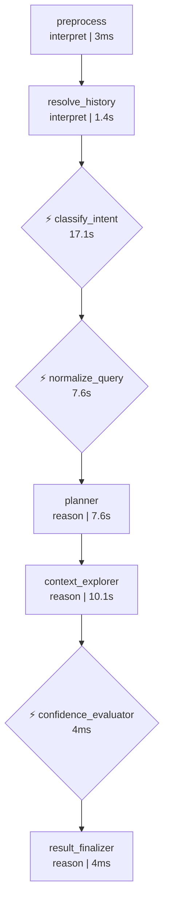

# Pipeline Trace: session-1774855283224

## 1. Executive Summary

**질의**: 지점별 관리 고객 수 알려줘
**결과**: ❌ 실패
**소요**: 43.9s | LLM 6회, 31,827토큰

| 단계 | 결과 |
|------|------|
| 의도 분류 | data_analysis (95%) |
| 질문 정규화 | EXTRACT |
| 준비도 판정 | ask_user (60%) |

## 2. Decision Trail

| # | 노드 | 유형 | 결정 | 확신도 | 근거 |
|--:|------|------|------|-------:|------|
| 1 | classify_intent | intent_classification | data_analysis | 95% | category=DATA_ANALYSIS, 지점별 분류축을 사용하여 수치 데이터를 조회하고… |
| 2 | normalize_query | normalization | EXTRACT | 0% | entities=['지점', '고객'], measures=['고객 수'], filters=… |
| 3 | batch_interpret | table_comparison | TB_ADW_CSC101M, TB_ADW_COM001M | 33% | TB_ADW_CSC110L: 내방 내역 정보로, 소속 지점별 고객 수 집계와는 무관함., … |
| 4 | confidence_evaluator | readiness_verdict | ask_user | 60% | knowledge=4/6, tables=13, pending_steps=0 |

## 3. Referenced Information

### embedding_encode

| # | 검색 쿼리 | 결과 수 | 소요시간 |
|--:|-----------|-------:|--------:|
| 1 | 오늘 기준 지점별 관리 고객 수 알려줘 | 1 | 297ms |
|   | ↳ dense_dim=1024 |   |   |
|   | ↳ sparse_nnz=10 |   |   |
| 2 | 오늘 기준 지점별 관리 고객 수 알려줘 2026-03-30 기준으로 지점별 관리 고객 수를… | 1 | 269ms |
|   | ↳ dense_dim=1024 |   |   |
|   | ↳ sparse_nnz=28 |   |   |

### reranker

| # | 검색 쿼리 | 결과 수 | 소요시간 |
|--:|-----------|-------:|--------:|
| 1 | 오늘 기준 지점별 관리 고객 수 알려줘 | 5 | 2.8s |
|   | ↳ backend=onnx |   |   |
|   | ↳ input=20 |   |   |
|   | ↳ filtered=20 |   |   |
| 2 | 오늘 기준 지점별 관리 고객 수 알려줘 2026-03-30 기준으로 지점별 관리 고객 수를… | 5 | 1.9s |
|   | ↳ backend=onnx |   |   |
|   | ↳ input=20 |   |   |
|   | ↳ filtered=20 |   |   |

### search_use_cases

| # | 검색 쿼리 | 결과 수 | 소요시간 |
|--:|-----------|-------:|--------:|
| 1 | 오늘 기준 지점별 관리 고객 수 알려줘 2026-03-30 기준으로 지점별 관리 고객 수를… | 5 | 2.3s |
|   | ↳ 결과 5건 수집 (배치 해석 대기) |   |   |

### search_table_meta

| # | 검색 쿼리 | 결과 수 | 소요시간 |
|--:|-----------|-------:|--------:|
| 1 | TB_ADW_CSC101M | 1 | 11ms |
|   | ↳ 결과 1건 수집 (배치 해석 대기) |   |   |
| 2 | TB_ADW_COM001M | 1 | 12ms |
|   | ↳ 결과 1건 수집 (배치 해석 대기) |   |   |
| 3 | TB_ADW_CSC110L | 1 | 16ms |
|   | ↳ 결과 1건 수집 (배치 해석 대기) |   |   |
| 4 | TB_ADW_CSC111L | 1 | 15ms |
|   | ↳ 결과 1건 수집 (배치 해석 대기) |   |   |
| 5 | TB_ADW_CSC105M | 1 | 10ms |
|   | ↳ 결과 1건 수집 (배치 해석 대기) |   |   |
| 6 | TB_ADW_CSC109H | 1 | 10ms |
|   | ↳ 결과 1건 수집 (배치 해석 대기) |   |   |
| 7 | TB_ADW_CSC106M | 1 | 22ms |
|   | ↳ 결과 1건 수집 (배치 해석 대기) |   |   |
| 8 | TB_ADW_CSC104D | 1 | 14ms |
|   | ↳ 결과 1건 수집 (배치 해석 대기) |   |   |
| 9 | TB_ADW_COM002M | 1 | 17ms |
|   | ↳ 결과 1건 수집 (배치 해석 대기) |   |   |
| 10 | TB_ADW_CSC102H | 1 | 11ms |
|   | ↳ 결과 1건 수집 (배치 해석 대기) |   |   |
| 11 | TB_ADW_CSC107M | 1 | 8ms |
|   | ↳ 결과 1건 수집 (배치 해석 대기) |   |   |

### 합계

- 총 검색: 16회 (성공 16, 결과 0건 0)
- 총 소요: 7.8s

## 4. State Evolution

| 노드 | 변경 필드 | 변화 내용 |
|------|----------|----------|
| preprocess | preprocessed_input | → `지점별 관리 고객 수 알려줘` |
|  | status | → `preprocessing` |
| resolve_history | preprocessed_input | → `오늘 기준 지점별 관리 고객 수 알려줘` |
|  | awaiting_clarification | → `False` |
|  | clarification_response | → `` |
| classify_intent | intent | → `data_analysis` |
|  | intent_confidence | → `0.95` |
|  | query_category | → `DATA_ANALYSIS` |
|  | status | → `intent_classified` |
| normalize_query | normalized_query | → `original_query='오늘 기준 지점별 관리 고객 수 알려줘' r…` |
|  | status | → `query_normalized` |
|  | intent | → `clarification_needed` |
| planner | reason | → `phase=<Phase.EXPLORING: 'EXPLORING'> que…` |
| context_explorer | reason | → `phase=<Phase.EXPLORING: 'EXPLORING'> que…` |
| confidence_evaluator | reason | → `phase=<Phase.VERIFYING: 'VERIFYING'> que…` |
| result_finalizer | reason | → `phase=<Phase.DONE: 'DONE'> query_decompo…` |
|  | awaiting_clarification | → `True` |
|  | clarification_turns | → `4` |
|  | clarification_question | → `추가로 다음 항목도 확인이 필요합니다:  1. **ambiguity:'관…` |

## 5. Node Flow

## 6. Performance

### 노드 실행 타이밍

```mermaid
gantt
    title Node Execution Gantt
    dateFormat X
    axisFormat %s

    section 초기 실행
    preprocess : 0, 0.1s
    resolve_history : 0, 1.4s
    classify_intent :crit, 0, 17.1s
    normalize_query : 0, 7.6s
    planner : 0, 7.6s
    context_explorer :crit, 0, 10.1s
    confidence_evaluator : 0, 0.1s
    result_finalizer : 0, 0.1s
```

### LLM 호출 분석

| 노드 | 호출 수 | 토큰 | 소요시간 | 비중 |
|------|-------:|-----:|--------:|-----:|
| batch_interpret | 1 | 13,775 | 7.6s | 43% |
| normalization_phase1 | 1 | 9,008 | 3.8s | 28% |
| planner | 1 | 4,228 | 4.3s | 13% |
| normalization_phase2 | 1 | 2,239 | 3.8s | 7% |
| 이력해소 | 1 | 1,469 | 1.4s | 5% |
| intent_gate | 1 | 1,108 | 17.1s | 3% |
| **합계** | **6** | **31,827** | **38.0s** | 100% |

## 7. Automated Findings

- 🔴 **CRITICAL** [sql_generator] SQL 미생성 — 파이프라인이 SQL 생성에 도달하지 못함
- 🟡 **WARNING** [pipeline] LLM 응답 10초 초과: 1건 — Thinking 모드 비활성화 고려
- 🔵 **INFO** [tracker] 내부 이벤트 없는 노드: preprocess, resolve_history, result_finalizer — 추적 누락 가능성

> 합계: CRITICAL 1건, INFO 1건, WARNING 1건

## Appendix: Detailed Timeline

| Seq | Type | Node | Summary | Detail | Duration | Status | State Changes |
|----:|------|------|-------|--------|--------:|--------|---------------|
| 1 | ▶ node_start | preprocess | preprocess 시작 | - | - | - | - |
| 2 | ■ node_end | preprocess | preprocess 완료 | 2개 필드 변경 | 3ms | success | preprocessed_input: 지점별 관리 고객 수 알려줘, sta… |
| 3 | ▶ node_start | resolve_history | resolve_history 시작 | - | - | - | - |
| 4 | 🤖 llm_call | 이력해소 | LLM(gemini-3.1-flash-lite-preview) 1469t… | gemini-3.1-flash-lite-preview 1440+29tok | 1404ms | - | - |
| 5 | ■ node_end | resolve_history | resolve_history 완료 | 3개 필드 변경 | 1409ms | success | preprocessed_input: 오늘 기준 지점별 관리 고객 수 알려… |
| 6 | ▶ node_start | classify_intent | classify_intent 시작 | - | - | - | - |
| 7 | 🤖 llm_call | intent_gate | LLM(gemini-3.1-flash-lite-preview) 1108t… | gemini-3.1-flash-lite-preview 1050+58tok | 17094ms | - | - |
| 8 |   ⚡ decision | classify_intent | intent_classification: data_analysis |  (95%) category=DATA_ANALYSIS, 지… | - | - | - |
| 9 | ■ node_end | classify_intent | classify_intent 완료 | 4개 필드 변경 | 17098ms | success | intent: data_analysis, intent_confidence… |
| 10 | ▶ node_start | normalize_query | normalize_query 시작 | - | - | - | - |
| 11 | 🤖 llm_call | normalization_phase1 | LLM(gemini-3.1-flash-lite-preview) 9008t… | gemini-3.1-flash-lite-preview 8412+596tok | 3826ms | - | - |
| 12 | 🤖 llm_call | normalization_phase2 | LLM(gemini-3.1-flash-lite-preview) 2239t… | gemini-3.1-flash-lite-preview 1604+635tok | 3793ms | - | - |
| 13 |   ⚡ decision | normalize_query | normalization: EXTRACT |  (0%) entities=['지점', '고객'], me… | - | - | - |
| 14 | ■ node_end | normalize_query | normalize_query 완료 | 3개 필드 변경 | 7624ms | success | normalized_query: original_query='오늘 기준 … |
| 15 | ▶ node_start | planner | planner 시작 | - | - | - | - |
| 16 |   🔧 tool_call | planner | embedding_encode: 1건 | embedding_encode: '오늘 기준 지점별 관리 고객 수 알려줘' → 1건 | 297ms | success | - |
| 17 |   🔧 tool_call | planner | reranker: 5건 | reranker: '오늘 기준 지점별 관리 고객 수 알려줘' → 5건 | 2842ms | success | - |
| 18 |   🤖 llm_call | planner | LLM(gemini-3.1-flash-lite-preview) 4228t… | gemini-3.1-flash-lite-preview 3623+605tok | 4338ms | - | - |
| 19 | ■ node_end | planner | planner 완료 | 1개 필드 변경 | 7575ms | success | reason: phase=<Phase.EXPLORING: 'EXPLORI… |
| 20 | ▶ node_start | context_explorer | context_explorer 시작 | - | - | - | - |
| 21 |   🔧 tool_call | context_explorer | embedding_encode: 1건 | embedding_encode: '오늘 기준 지점별 관리 고객 수 알려줘 202…' → 1건 | 269ms | success | - |
| 22 |   🔧 tool_call | context_explorer | search_use_cases: 5건 | search_use_cases: '오늘 기준 지점별 관리 고객 수 알려줘 202…' → 5건 | 2269ms | success | - |
| 23 |   🔧 tool_call | context_explorer | reranker: 5건 | reranker: '오늘 기준 지점별 관리 고객 수 알려줘 202…' → 5건 | 1947ms | success | - |
| 24 |   🔧 tool_call | context_explorer | search_table_meta: 1건 | search_table_meta: 'TB_ADW_CSC101M' → 1건 | 11ms | success | - |
| 25 |   🔧 tool_call | context_explorer | search_table_meta: 1건 | search_table_meta: 'TB_ADW_COM001M' → 1건 | 12ms | success | - |
| 26 |   🔧 tool_call | context_explorer | search_table_meta: 1건 | search_table_meta: 'TB_ADW_CSC110L' → 1건 | 16ms | success | - |
| 27 |   🔧 tool_call | context_explorer | search_table_meta: 1건 | search_table_meta: 'TB_ADW_CSC111L' → 1건 | 15ms | success | - |
| 28 |   🔧 tool_call | context_explorer | search_table_meta: 1건 | search_table_meta: 'TB_ADW_CSC105M' → 1건 | 10ms | success | - |
| 29 |   🔧 tool_call | context_explorer | search_table_meta: 1건 | search_table_meta: 'TB_ADW_CSC109H' → 1건 | 10ms | success | - |
| 30 |   🔧 tool_call | context_explorer | search_table_meta: 1건 | search_table_meta: 'TB_ADW_CSC106M' → 1건 | 22ms | success | - |
| 31 |   🔧 tool_call | context_explorer | search_table_meta: 1건 | search_table_meta: 'TB_ADW_CSC104D' → 1건 | 14ms | success | - |
| 32 |   🔧 tool_call | context_explorer | search_table_meta: 1건 | search_table_meta: 'TB_ADW_COM002M' → 1건 | 17ms | success | - |
| 33 |   🔧 tool_call | context_explorer | search_table_meta: 1건 | search_table_meta: 'TB_ADW_CSC102H' → 1건 | 11ms | success | - |
| 34 |   🔧 tool_call | context_explorer | search_table_meta: 1건 | search_table_meta: 'TB_ADW_CSC107M' → 1건 | 8ms | success | - |
| 35 | 🤖 llm_call | batch_interpret | LLM(gemini-3.1-flash-lite-preview) 13775… | gemini-3.1-flash-lite-preview 12356+1419tok | 7571ms | - | - |
| 36 | ⚡ decision | batch_interpret | table_comparison: TB_ADW_CSC101M, TB_ADW… |  (33%) TB_ADW_CSC110L: 내방 내역 정보로… | - | - | - |
| 37 | ■ node_end | context_explorer | context_explorer 완료 | 1개 필드 변경 | 10121ms | success | reason: phase=<Phase.EXPLORING: 'EXPLORI… |
| 38 | ▶ node_start | confidence_evaluator | confidence_evaluator 시작 | - | - | - | - |
| 39 |   ⚡ decision | confidence_evaluator | readiness_verdict: ask_user |  (60%) knowledge=4/6, tables=13,… | - | - | - |
| 40 | ■ node_end | confidence_evaluator | confidence_evaluator 완료 | 1개 필드 변경 | 4ms | success | reason: phase=<Phase.VERIFYING: 'VERIFYI… |
| 41 | ▶ node_start | result_finalizer | result_finalizer 시작 | - | - | - | - |
| 42 | ■ node_end | result_finalizer | result_finalizer 완료 | 4개 필드 변경 | 4ms | success | reason: phase=<Phase.DONE: 'DONE'> query… |
