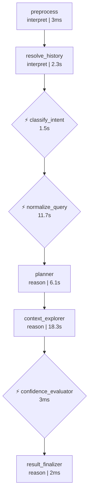

# Pipeline Trace: session-1774855283224

## 1. Executive Summary

**질의**: 지점별 여신 잔액 합계를 지점명과 함께 상위 10개 보여줘
**결과**: ❌ 실패
**소요**: 39.9s | LLM 6회, 32,274토큰

| 단계 | 결과 |
|------|------|
| 의도 분류 | data_extraction (95%) |
| 질문 정규화 | RANK |
| 준비도 판정 | ask_user (68%) |

## 2. Decision Trail

| # | 노드 | 유형 | 결정 | 확신도 | 근거 |
|--:|------|------|------|-------:|------|
| 1 | classify_intent | intent_classification | data_extraction | 95% | category=DATA_EXTRACTION, 지점별 여신 잔액이라는 데이터 엔티티와 지표… |
| 2 | normalize_query | normalization | RANK | 0% | entities=['지점', '여신'], measures=['잔액'], filters=0,… |
| 3 | batch_interpret | table_comparison | TB_ADW_LNB301M, TB_ADW_COM001M | 50% | TB_ADW_LNB343S: 통계 테이블이나, 개별 건 기준의 정밀한 최신 잔액 조회를 위… |
| 4 | confidence_evaluator | readiness_verdict | ask_user | 68% | knowledge=4/6, tables=17, pending_steps=0 |

## 3. Referenced Information

### embedding_encode

| # | 검색 쿼리 | 결과 수 | 소요시간 |
|--:|-----------|-------:|--------:|
| 1 | 지점별 여신 잔액 합계를 지점명과 함께 상위 10개 보여줘 | 1 | 165ms |
|   | ↳ dense_dim=1024 |   |   |
|   | ↳ sparse_nnz=17 |   |   |
| 2 | 지점별 여신 잔액 합계를 지점명과 함께 상위 10개 보여줘 지점명별 여신 잔액 합계를 기준… | 1 | 381ms |
|   | ↳ dense_dim=1024 |   |   |
|   | ↳ sparse_nnz=22 |   |   |

### reranker

| # | 검색 쿼리 | 결과 수 | 소요시간 |
|--:|-----------|-------:|--------:|
| 1 | 지점별 여신 잔액 합계를 지점명과 함께 상위 10개 보여줘 | 5 | 2.1s |
|   | ↳ backend=onnx |   |   |
|   | ↳ input=20 |   |   |
|   | ↳ filtered=20 |   |   |
| 2 | 지점별 여신 잔액 합계를 지점명과 함께 상위 10개 보여줘 지점명별 여신 잔액 합계를 기준… | 5 | 3.4s |
|   | ↳ backend=onnx |   |   |
|   | ↳ input=20 |   |   |
|   | ↳ filtered=20 |   |   |

### search_use_cases

| # | 검색 쿼리 | 결과 수 | 소요시간 |
|--:|-----------|-------:|--------:|
| 1 | 지점별 여신 잔액 합계를 지점명과 함께 상위 10개 보여줘 지점명별 여신 잔액 합계를 기준… | 5 | 3.8s |
|   | ↳ 결과 5건 수집 (배치 해석 대기) |   |   |

### search_table_meta

| # | 검색 쿼리 | 결과 수 | 소요시간 |
|--:|-----------|-------:|--------:|
| 1 | TB_ADW_LNB301M | 1 | 45ms |
|   | ↳ 결과 1건 수집 (배치 해석 대기) |   |   |
| 2 | TB_ADW_COM001M | 1 | 12ms |
|   | ↳ 결과 1건 수집 (배치 해석 대기) |   |   |
| 3 | TB_ADW_LNB343S | 1 | 11ms |
|   | ↳ 결과 1건 수집 (배치 해석 대기) |   |   |
| 4 | TB_ADW_LNB341P | 1 | 20ms |
|   | ↳ 결과 1건 수집 (배치 해석 대기) |   |   |
| 5 | TB_ADW_INS828M | 1 | 12ms |
|   | ↳ 결과 1건 수집 (배치 해석 대기) |   |   |
| 6 | TB_ADW_GLB1338H | 1 | 15ms |
|   | ↳ 결과 1건 수집 (배치 해석 대기) |   |   |
| 7 | TB_ADW_DEP201P | 1 | 14ms |
|   | ↳ 결과 1건 수집 (배치 해석 대기) |   |   |
| 8 | TB_ADW_FIN1319S | 1 | 13ms |
|   | ↳ 결과 1건 수집 (배치 해석 대기) |   |   |
| 9 | TB_ADW_LNA304L | 1 | 13ms |
|   | ↳ 결과 1건 수집 (배치 해석 대기) |   |   |
| 10 | TB_ADW_FXB534M | 1 | 19ms |
|   | ↳ 결과 1건 수집 (배치 해석 대기) |   |   |
| 11 | TB_ADW_CRD442P | 1 | 30ms |
|   | ↳ 결과 1건 수집 (배치 해석 대기) |   |   |

### 합계

- 총 검색: 16회 (성공 16, 결과 0건 0)
- 총 소요: 10.1s

## 4. State Evolution

| 노드 | 변경 필드 | 변화 내용 |
|------|----------|----------|
| preprocess | preprocessed_input | → `지점별 여신 잔액 합계를 지점명과 함께 상위 10개 보여줘` |
|  | status | → `preprocessing` |
| resolve_history | awaiting_clarification | → `False` |
|  | clarification_response | → `` |
|  | clarification_question | → `` |
| classify_intent | intent | → `data_extraction` |
|  | intent_confidence | → `0.95` |
|  | query_category | → `DATA_EXTRACTION` |
|  | status | → `intent_classified` |
| normalize_query | normalized_query | → `original_query='지점별 여신 잔액 합계를 지점명과 함께 상위…` |
|  | status | → `query_normalized` |
|  | intent | → `clarification_needed` |
| planner | reason | → `phase=<Phase.EXPLORING: 'EXPLORING'> que…` |
| context_explorer | reason | → `phase=<Phase.EXPLORING: 'EXPLORING'> que…` |
| confidence_evaluator | reason | → `phase=<Phase.VERIFYING: 'VERIFYING'> que…` |
| result_finalizer | reason | → `phase=<Phase.DONE: 'DONE'> query_decompo…` |
|  | awaiting_clarification | → `True` |
|  | clarification_turns | → `5` |
|  | clarification_question | → `추가로 다음 항목도 확인이 필요합니다:  1. **ambiguity:조회…` |

## 5. Node Flow

## 6. Performance

### 노드 실행 타이밍

```mermaid
gantt
    title Node Execution Gantt
    dateFormat X
    axisFormat %s

    section 초기 실행
    preprocess : 0, 0.1s
    resolve_history : 0, 2.3s
    classify_intent : 0, 1.5s
    normalize_query :crit, 0, 11.7s
    planner : 0, 6.1s
    context_explorer :crit, 0, 18.3s
    confidence_evaluator : 0, 0.1s
    result_finalizer : 0, 0.1s
```

### LLM 호출 분석

| 노드 | 호출 수 | 토큰 | 소요시간 | 비중 |
|------|-------:|-----:|--------:|-----:|
| batch_interpret | 1 | 14,099 | 14.0s | 44% |
| normalization_phase1 | 1 | 9,000 | 8.1s | 28% |
| planner | 1 | 4,352 | 3.8s | 13% |
| normalization_phase2 | 1 | 2,225 | 3.6s | 7% |
| 이력해소 | 1 | 1,470 | 2.3s | 5% |
| intent_gate | 1 | 1,128 | 1.5s | 3% |
| **합계** | **6** | **32,274** | **33.2s** | 100% |

## 7. Automated Findings

- 🔴 **CRITICAL** [sql_generator] SQL 미생성 — 파이프라인이 SQL 생성에 도달하지 못함
- 🟡 **WARNING** [pipeline] LLM 응답 10초 초과: 1건 — Thinking 모드 비활성화 고려
- 🔵 **INFO** [tracker] 내부 이벤트 없는 노드: preprocess, resolve_history, result_finalizer — 추적 누락 가능성

> 합계: CRITICAL 1건, INFO 1건, WARNING 1건

## Appendix: Detailed Timeline

| Seq | Type | Node | Summary | Detail | Duration | Status | State Changes |
|----:|------|------|-------|--------|--------:|--------|---------------|
| 1 | ▶ node_start | preprocess | preprocess 시작 | - | - | - | - |
| 2 | ■ node_end | preprocess | preprocess 완료 | 2개 필드 변경 | 3ms | success | preprocessed_input: 지점별 여신 잔액 합계를 지점명과 함… |
| 3 | ▶ node_start | resolve_history | resolve_history 시작 | - | - | - | - |
| 4 | 🤖 llm_call | 이력해소 | LLM(gemini-3.1-flash-lite-preview) 1470t… | gemini-3.1-flash-lite-preview 1430+40tok | 2258ms | - | - |
| 5 | ■ node_end | resolve_history | resolve_history 완료 | 3개 필드 변경 | 2261ms | success | awaiting_clarification: False, clarifica… |
| 6 | ▶ node_start | classify_intent | classify_intent 시작 | - | - | - | - |
| 7 | 🤖 llm_call | intent_gate | LLM(gemini-3.1-flash-lite-preview) 1128t… | gemini-3.1-flash-lite-preview 1062+66tok | 1529ms | - | - |
| 8 |   ⚡ decision | classify_intent | intent_classification: data_extraction |  (95%) category=DATA_EXTRACTION,… | - | - | - |
| 9 | ■ node_end | classify_intent | classify_intent 완료 | 4개 필드 변경 | 1531ms | success | intent: data_extraction, intent_confiden… |
| 10 | ▶ node_start | normalize_query | normalize_query 시작 | - | - | - | - |
| 11 | 🤖 llm_call | normalization_phase1 | LLM(gemini-3.1-flash-lite-preview) 9000t… | gemini-3.1-flash-lite-preview 8424+576tok | 8127ms | - | - |
| 12 | 🤖 llm_call | normalization_phase2 | LLM(gemini-3.1-flash-lite-preview) 2225t… | gemini-3.1-flash-lite-preview 1618+607tok | 3594ms | - | - |
| 13 |   ⚡ decision | normalize_query | normalization: RANK |  (0%) entities=['지점', '여신'], me… | - | - | - |
| 14 | ■ node_end | normalize_query | normalize_query 완료 | 3개 필드 변경 | 11727ms | success | normalized_query: original_query='지점별 여신… |
| 15 | ▶ node_start | planner | planner 시작 | - | - | - | - |
| 16 |   🔧 tool_call | planner | embedding_encode: 1건 | embedding_encode: '지점별 여신 잔액 합계를 지점명과 함께 상위 …' → 1건 | 165ms | success | - |
| 17 |   🔧 tool_call | planner | reranker: 5건 | reranker: '지점별 여신 잔액 합계를 지점명과 함께 상위 …' → 5건 | 2112ms | success | - |
| 18 |   🤖 llm_call | planner | LLM(gemini-3.1-flash-lite-preview) 4352t… | gemini-3.1-flash-lite-preview 3773+579tok | 3765ms | - | - |
| 19 | ■ node_end | planner | planner 완료 | 1개 필드 변경 | 6119ms | success | reason: phase=<Phase.EXPLORING: 'EXPLORI… |
| 20 | ▶ node_start | context_explorer | context_explorer 시작 | - | - | - | - |
| 21 |   🔧 tool_call | context_explorer | embedding_encode: 1건 | embedding_encode: '지점별 여신 잔액 합계를 지점명과 함께 상위 …' → 1건 | 381ms | success | - |
| 22 |   🔧 tool_call | context_explorer | search_use_cases: 5건 | search_use_cases: '지점별 여신 잔액 합계를 지점명과 함께 상위 …' → 5건 | 3826ms | success | - |
| 23 |   🔧 tool_call | context_explorer | reranker: 5건 | reranker: '지점별 여신 잔액 합계를 지점명과 함께 상위 …' → 5건 | 3385ms | success | - |
| 24 |   🔧 tool_call | context_explorer | search_table_meta: 1건 | search_table_meta: 'TB_ADW_LNB301M' → 1건 | 45ms | success | - |
| 25 |   🔧 tool_call | context_explorer | search_table_meta: 1건 | search_table_meta: 'TB_ADW_COM001M' → 1건 | 12ms | success | - |
| 26 |   🔧 tool_call | context_explorer | search_table_meta: 1건 | search_table_meta: 'TB_ADW_LNB343S' → 1건 | 11ms | success | - |
| 27 |   🔧 tool_call | context_explorer | search_table_meta: 1건 | search_table_meta: 'TB_ADW_LNB341P' → 1건 | 20ms | success | - |
| 28 |   🔧 tool_call | context_explorer | search_table_meta: 1건 | search_table_meta: 'TB_ADW_INS828M' → 1건 | 12ms | success | - |
| 29 |   🔧 tool_call | context_explorer | search_table_meta: 1건 | search_table_meta: 'TB_ADW_GLB1338H' → 1건 | 15ms | success | - |
| 30 |   🔧 tool_call | context_explorer | search_table_meta: 1건 | search_table_meta: 'TB_ADW_DEP201P' → 1건 | 14ms | success | - |
| 31 |   🔧 tool_call | context_explorer | search_table_meta: 1건 | search_table_meta: 'TB_ADW_FIN1319S' → 1건 | 13ms | success | - |
| 32 |   🔧 tool_call | context_explorer | search_table_meta: 1건 | search_table_meta: 'TB_ADW_LNA304L' → 1건 | 13ms | success | - |
| 33 |   🔧 tool_call | context_explorer | search_table_meta: 1건 | search_table_meta: 'TB_ADW_FXB534M' → 1건 | 19ms | success | - |
| 34 |   🔧 tool_call | context_explorer | search_table_meta: 1건 | search_table_meta: 'TB_ADW_CRD442P' → 1건 | 30ms | success | - |
| 35 | 🤖 llm_call | batch_interpret | LLM(gemini-3.1-flash-lite-preview) 14099… | gemini-3.1-flash-lite-preview 12679+1420tok | 13959ms | - | - |
| 36 | ⚡ decision | batch_interpret | table_comparison: TB_ADW_LNB301M, TB_ADW… |  (50%) TB_ADW_LNB343S: 통계 테이블이나,… | - | - | - |
| 37 | ■ node_end | context_explorer | context_explorer 완료 | 1개 필드 변경 | 18257ms | success | reason: phase=<Phase.EXPLORING: 'EXPLORI… |
| 38 | ▶ node_start | confidence_evaluator | confidence_evaluator 시작 | - | - | - | - |
| 39 |   ⚡ decision | confidence_evaluator | readiness_verdict: ask_user |  (68%) knowledge=4/6, tables=17,… | - | - | - |
| 40 | ■ node_end | confidence_evaluator | confidence_evaluator 완료 | 1개 필드 변경 | 3ms | success | reason: phase=<Phase.VERIFYING: 'VERIFYI… |
| 41 | ▶ node_start | result_finalizer | result_finalizer 시작 | - | - | - | - |
| 42 | ■ node_end | result_finalizer | result_finalizer 완료 | 4개 필드 변경 | 2ms | success | reason: phase=<Phase.DONE: 'DONE'> query… |
