# Pipeline Trace: session-1774857961456

## 1. Executive Summary

**질의**: 1
**결과**: ❌ 실패 (3회 재탐색 후 최대 시도 횟수 초과) — SQL 생성 실패
시도한 접근 방식:
  - [FailureType.DB_ERROR] DB 실행 오류: (sqlalchemy.dialects.postgresql.asyncpg.Pr
**소요**: 117.5s | LLM 17회, 85,941토큰

| 단계 | 결과 |
|------|------|
| 의도 분류 | data_extraction (95%) |
| 질문 정규화 | RANK |
| 준비도 판정 | generate_sql (86%) |
| SQL | 4회 시도, 검증 실패 |
| 실패 원인 | SQL 생성 실패 시도한 접근 방식:   - [FailureType.DB_ERROR] DB 실행 오류: (sqlalchemy.dialects.p… |

## 2. Decision Trail

| # | 노드 | 유형 | 결정 | 확신도 | 근거 |
|--:|------|------|------|-------:|------|
| 1 | classify_intent | intent_classification | data_extraction | 95% | category=DATA_EXTRACTION, 지점별 여신 잔액이라는 구체적인 엔티티와 지… |
| 2 | normalize_query | normalization | RANK | 0% | entities=['지점', '여신'], measures=['잔액 합계'], filters… |
| 3 | batch_interpret | table_comparison | TB_ADW_LNB301M, TB_ADW_COM001M | 18% | TB_ADW_LNB343S: 이미 집계된 통계 테이블이나, 개별 건 기준의 일자 필터링이 … |
| 4 | confidence_evaluator | readiness_verdict | generate_sql | 86% | knowledge=4/4, tables=3, pending_steps=0 |
| 5 | batch_interpret | table_comparison | TB_ADW_LNB301M, TB_ADW_COM001M | 40% | TB_ADW_CRD419M: CRD(포인트) 관련 업무 테이블로 여신(LON) 잔액 집계와… |
| 6 | confidence_evaluator | readiness_verdict | generate_sql | 86% | knowledge=4/4, tables=8, pending_steps=0 |
| 7 | batch_interpret | table_comparison | ADWOWN.TB_ADW_LNB301M, ADWOWN.… | 33% | ADWOWN.TB_ADW_CRD442P: 카드 잔액 정보로 여신 잔액과 무관함., ADWO… |
| 8 | confidence_evaluator | readiness_verdict | generate_sql | 86% | knowledge=4/5, tables=8, pending_steps=0 |
| 9 | batch_interpret | table_comparison | ADWOWN.TB_ADW_LNB301M, ADWOWN.… | 33% | ADWOWN.TB_ADW_CRD442P: 카드 잔액 정보 테이블로 여신(대출) 잔액 질의와… |
| 10 | confidence_evaluator | readiness_verdict | generate_sql | 86% | knowledge=4/5, tables=8, pending_steps=0 |

> 총 4개 사이클 감지됨 (recovery_planner 3회 호출)

## 3. Referenced Information

### embedding_encode

| # | 검색 쿼리 | 결과 수 | 소요시간 |
|--:|-----------|-------:|--------:|
| 1 | 오늘 기준 지점별 여신 잔액 합계를 지점명과 함께 상위 10개 보여줘 | 1 | 22.5s |
|   | ↳ dense_dim=1024 |   |   |
|   | ↳ sparse_nnz=20 |   |   |
| 2 | 오늘 기준 지점별 여신 잔액 합계를 지점명과 함께 상위 10개 보여줘 2026-03-30 … | 1 | 527ms |
|   | ↳ dense_dim=1024 |   |   |
|   | ↳ sparse_nnz=33 |   |   |
| 3 | TB_ADW_LNB301M 테이블 메타 검색을 통해 일자 및 잔액 관련 컬럼 식별 | 1 | 172ms |
|   | ↳ dense_dim=1024 |   |   |
|   | ↳ sparse_nnz=21 |   |   |

### reranker

| # | 검색 쿼리 | 결과 수 | 소요시간 |
|--:|-----------|-------:|--------:|
| 1 | 오늘 기준 지점별 여신 잔액 합계를 지점명과 함께 상위 10개 보여줘 | 5 | 6.4s |
|   | ↳ backend=onnx |   |   |
|   | ↳ input=20 |   |   |
|   | ↳ filtered=20 |   |   |
| 2 | 오늘 기준 지점별 여신 잔액 합계를 지점명과 함께 상위 10개 보여줘 2026-03-30 … | 5 | 3.7s |
|   | ↳ backend=onnx |   |   |
|   | ↳ input=20 |   |   |
|   | ↳ filtered=20 |   |   |
| 3 | TB_ADW_LNB301M 테이블 메타 검색을 통해 일자 및 잔액 관련 컬럼 식별 | 5 | 1.1s |
|   | ↳ backend=onnx |   |   |
|   | ↳ input=20 |   |   |
|   | ↳ filtered=20 |   |   |

### search_use_cases

| # | 검색 쿼리 | 결과 수 | 소요시간 |
|--:|-----------|-------:|--------:|
| 1 | 오늘 기준 지점별 여신 잔액 합계를 지점명과 함께 상위 10개 보여줘 2026-03-30 … | 5 | 4.3s |
|   | ↳ 결과 5건 수집 (배치 해석 대기) |   |   |
| 2 | TB_ADW_LNB301M 테이블 메타 검색을 통해 일자 및 잔액 관련 컬럼 식별 | 5 | 1.3s |
|   | ↳ 결과 5건 수집 (배치 해석 대기) |   |   |

### search_table_meta

| # | 검색 쿼리 | 결과 수 | 소요시간 |
|--:|-----------|-------:|--------:|
| 1 | TB_ADW_LNB301M | 1 | 72ms |
|   | ↳ 결과 1건 수집 (배치 해석 대기) |   |   |
| 2 | TB_ADW_COM001M | 1 | 16ms |
|   | ↳ 결과 1건 수집 (배치 해석 대기) |   |   |
| 3 | TB_ADW_LNB343S | 1 | 12ms |
|   | ↳ 결과 1건 수집 (배치 해석 대기) |   |   |
| 4 | TB_ADW_LNB341P | 1 | 14ms |
|   | ↳ 결과 1건 수집 (배치 해석 대기) |   |   |
| 5 | TB_ADW_INS828M | 1 | 12ms |
|   | ↳ 결과 1건 수집 (배치 해석 대기) |   |   |
| 6 | TB_ADW_GLB1338H | 1 | 12ms |
|   | ↳ 결과 1건 수집 (배치 해석 대기) |   |   |
| 7 | TB_ADW_DEP201P | 1 | 12ms |
|   | ↳ 결과 1건 수집 (배치 해석 대기) |   |   |
| 8 | TB_ADW_FIN1319S | 1 | 11ms |
|   | ↳ 결과 1건 수집 (배치 해석 대기) |   |   |
| 9 | TB_ADW_LNA304L | 1 | 12ms |
|   | ↳ 결과 1건 수집 (배치 해석 대기) |   |   |
| 10 | TB_ADW_FXB534M | 1 | 28ms |
|   | ↳ 결과 1건 수집 (배치 해석 대기) |   |   |
| 11 | TB_ADW_CRD442P | 1 | 26ms |
|   | ↳ 결과 1건 수집 (배치 해석 대기) |   |   |
| 12 | 지점/여신 테이블의 날짜 및 잔액 컬럼 | 8 | 11ms |
|   | ↳ 결과 8건 수집 (배치 해석 대기) |   |   |

### get_date_distribution

| # | 검색 쿼리 | 결과 수 | 소요시간 |
|--:|-----------|-------:|--------:|
| 1 | TB_ADW_LNB301M,STD_DT | 0 | 5ms |
|   | ↳ 결과 0건 수집 (배치 해석 대기) |   |   |
| 2 | TB_ADW_LNB301M,STD_DT | 0 | 7ms |
|   | ↳ 결과 0건 수집 (배치 해석 대기) |   |   |

### get_sample_rows

| # | 검색 쿼리 | 결과 수 | 소요시간 |
|--:|-----------|-------:|--------:|
| 1 | TB_ADW_LNB301M | 0 | 4ms |
|   | ↳ 결과 0건 수집 (배치 해석 대기) |   |   |
| 2 | TB_ADW_LNB301M | 0 | 6ms |
|   | ↳ 결과 0건 수집 (배치 해석 대기) |   |   |

### 합계

- 총 검색: 24회 (성공 20, 결과 0건 4)
- 총 소요: 40.4s

## 4. State Evolution

| 노드 | 변경 필드 | 변화 내용 |
|------|----------|----------|
| preprocess | preprocessed_input | → `1` |
|  | status | → `preprocessing` |
| resolve_history | preprocessed_input | → `오늘 기준 지점별 여신 잔액 합계를 지점명과 함께 상위 10개 보여줘` |
|  | awaiting_clarification | → `False` |
|  | clarification_response | → `` |
| classify_intent | intent | → `data_extraction` |
|  | intent_confidence | → `0.95` |
|  | query_category | → `DATA_EXTRACTION` |
|  | status | → `intent_classified` |
| normalize_query | normalized_query | → `original_query='오늘 기준 지점별 여신 잔액 합계를 지점명과…` |
|  | status | → `query_normalized` |
| planner | reason | → `phase=<Phase.EXPLORING: 'EXPLORING'> que…` |
| context_explorer | reason | → `phase=<Phase.EXPLORING: 'EXPLORING'> que…` |
| confidence_evaluator | reason | → `phase=<Phase.GENERATING: 'GENERATING'> q…` |
| sql_generator | reason | → `phase=<Phase.GENERATING: 'GENERATING'> q…` |
| sql_validator | reason | → `phase=<Phase.VALIDATING: 'VALIDATING'> q…` |
| recovery_planner | reason | → `phase=<Phase.EXPLORING: 'EXPLORING'> que…` |
| context_explorer ② | reason | → `phase=<Phase.EXPLORING: 'EXPLORING'> que…` |
| confidence_evaluator ② | reason | → `phase=<Phase.GENERATING: 'GENERATING'> q…` |
| sql_generator ② | reason | → `phase=<Phase.GENERATING: 'GENERATING'> q…` |
| sql_validator ② | reason | → `phase=<Phase.VALIDATING: 'VALIDATING'> q…` |
| recovery_planner ② | reason | → `phase=<Phase.EXPLORING: 'EXPLORING'> que…` |
| context_explorer ③ | reason | → `phase=<Phase.EXPLORING: 'EXPLORING'> que…` |
| confidence_evaluator ③ | reason | → `phase=<Phase.GENERATING: 'GENERATING'> q…` |
| sql_generator ③ | reason | → `phase=<Phase.GENERATING: 'GENERATING'> q…` |
| sql_validator ③ | reason | → `phase=<Phase.VALIDATING: 'VALIDATING'> q…` |
| recovery_planner ③ | reason | → `phase=<Phase.EXPLORING: 'EXPLORING'> que…` |
| context_explorer ④ | reason | → `phase=<Phase.EXPLORING: 'EXPLORING'> que…` |
| confidence_evaluator ④ | reason | → `phase=<Phase.GENERATING: 'GENERATING'> q…` |
| result_finalizer | reason | → `phase=<Phase.DONE: 'DONE'> query_decompo…` |
|  | error_message | → `SQL 생성 실패 시도한 접근 방식:   - [FailureType.DB…` |
|  | status | → `error` |
| error_end | formatted_response | → `죄송합니다. 여러 번 시도했지만 안전한 SQL을 생성하지 못했습니다. 요…` |
|  | status | → `error` |

## 5. Node Flow

```mermaid
flowchart TD
    subgraph cycle0["초기 실행"]
    n1["preprocess<br/>interpret | 2ms"]
    n2["resolve_history<br/>interpret | 2.1s"]
    n1 --> n2
    n3{⚡ classify_intent<br/>1.6s}
    n2 --> n3
    n4{⚡ normalize_query<br/>9.3s}
    n3 --> n4
    n5["planner<br/>reason | 40.0s"]
    n4 --> n5
    n6["context_explorer<br/>reason | 4.4s"]
    n5 --> n6
    n7{⚡ confidence_evaluator<br/>6ms}
    n6 --> n7
    n8["sql_generator<br/>reason | 4.1s"]
    n7 --> n8
    n9["sql_validator<br/>reason | 6.2s"]
    n8 --> n9
    n10["recovery_planner<br/>reason | 7.2s"]
    n9 --> n10
    end
    subgraph cycle1["재시도 ①"]
    n11["context_explorer<br/>reason | 4.4s"]
    n12{⚡ confidence_evaluator<br/>6ms}
    n11 --> n12
    n13["sql_generator<br/>reason | 4.1s"]
    n12 --> n13
    n14["sql_validator<br/>reason | 6.2s"]
    n13 --> n14
    n15["recovery_planner<br/>reason | 7.2s"]
    n14 --> n15
    end
    subgraph cycle2["재시도 ②"]
    n16["context_explorer<br/>reason | 4.4s"]
    n17{⚡ confidence_evaluator<br/>6ms}
    n16 --> n17
    n18["sql_generator<br/>reason | 4.1s"]
    n17 --> n18
    n19["sql_validator<br/>reason | 6.2s"]
    n18 --> n19
    n20["recovery_planner<br/>reason | 7.2s"]
    n19 --> n20
    end
    subgraph cycle3["재시도 ③"]
    n21["context_explorer<br/>reason | 4.4s"]
    n22{⚡ confidence_evaluator<br/>6ms}
    n21 --> n22
    n23["result_finalizer<br/>reason | 5ms"]
    n22 --> n23
    n24["error_end<br/>? | 1ms"]
    n23 --> n24
    end
    n10 -.->|재시도| n11
    n15 -.->|재시도| n16
    n20 -.->|재시도| n21
```



## 6. Performance

### 노드 실행 타이밍

```mermaid
gantt
    title Node Execution Gantt
    dateFormat X
    axisFormat %s

    section 초기 실행
    preprocess : 0, 0.1s
    resolve_history : 0, 2.1s
    classify_intent : 0, 1.6s
    normalize_query : 0, 9.3s
    planner :crit, 0, 40.0s
    context_explorer :crit, 0, 13.3s
    confidence_evaluator : 0, 0.1s
    sql_generator : 0, 2.2s
    sql_validator : 0, 2.8s
    recovery_planner : 0, 0.1s
    section 재시도 ①
    context_explorer ② : 0, 8.3s
    confidence_evaluator ② : 0, 0.1s
    sql_generator ② : 0, 2.1s
    sql_validator ② : 0, 3.1s
    recovery_planner ② : 0, 4.4s
    section 재시도 ②
    context_explorer ③ : 0, 6.2s
    confidence_evaluator ③ : 0, 0.1s
    sql_generator ③ : 0, 4.1s
    sql_validator ③ : 0, 6.2s
    recovery_planner ③ : 0, 7.2s
    section 재시도 ③
    context_explorer ④ : 0, 4.4s
    confidence_evaluator ④ : 0, 0.1s
    result_finalizer : 0, 0.1s
    error_end : 0, 0.1s
```



### LLM 호출 분석

| 노드 | 호출 수 | 토큰 | 소요시간 | 비중 |
|------|-------:|-----:|--------:|-----:|
| batch_interpret | 4 | 38,079 | 25.9s | 44% |
| agentic_SQL생성 | 3 | 11,749 | 8.4s | 14% |
| normalization_phase1 | 1 | 9,111 | 5.9s | 11% |
| recovery_planner | 2 | 8,806 | 11.6s | 10% |
| sql_validator_layer2b | 3 | 8,729 | 12.1s | 10% |
| planner | 1 | 4,430 | 4.4s | 5% |
| normalization_phase2 | 1 | 2,411 | 3.4s | 3% |
| 이력해소 | 1 | 1,497 | 2.0s | 2% |
| intent_gate | 1 | 1,129 | 1.6s | 1% |
| **합계** | **17** | **85,941** | **75.3s** | 100% |

## 7. Automated Findings

- 🔴 **CRITICAL** [sql_validator] SQL 검증 실패
  - 검증 오류 상세 없음
- 🟡 **WARNING** [context_explorer] 검색 결과 0건인 도구: get_date_distribution, get_sample_rows, get_date_distribution, get_sample_rows — 검색 키워드 또는 메타 데이터 점검 필요
- 🟡 **WARNING** [context_explorer] 응답 지연 5초 초과: embedding_encode(22536ms), reranker(6432ms)
- 🟡 **WARNING** [pipeline] LLM 호출 17회 — 비용/지연 최적화 필요
- 🟡 **WARNING** [sql_generator] SQL 재생성 3회 — 프롬프트 또는 컨텍스트 품질 점검 필요
- 🟡 **WARNING** [recovery_planner] 재계획 3회 — 초기 가설 품질 또는 메타 부족 가능성
- 🟡 **WARNING** [planner] 노드 planner 실행 40027ms (30초 초과)
- 🔵 **INFO** [tracker] 내부 이벤트 없는 노드: preprocess, resolve_history, sql_generator, sql_validator, sql_generator — 추적 누락 가능성

> 합계: CRITICAL 1건, INFO 1건, WARNING 6건

## Appendix: Detailed Timeline

| Seq | Type | Node | Summary | Detail | Duration | Status | State Changes |
|----:|------|------|-------|--------|--------:|--------|---------------|
| 1 | ▶ node_start | preprocess | preprocess 시작 | - | - | - | - |
| 2 | ■ node_end | preprocess | preprocess 완료 | 2개 필드 변경 | 2ms | success | preprocessed_input: 1, status: preproces… |
| 3 | ▶ node_start | resolve_history | resolve_history 시작 | - | - | - | - |
| 4 | 🤖 llm_call | 이력해소 | LLM(gemini-3.1-flash-lite-preview) 1497t… | gemini-3.1-flash-lite-preview 1454+43tok | 2046ms | - | - |
| 5 | ■ node_end | resolve_history | resolve_history 완료 | 3개 필드 변경 | 2051ms | success | preprocessed_input: 오늘 기준 지점별 여신 잔액 합계를 … |
| 6 | ▶ node_start | classify_intent | classify_intent 시작 | - | - | - | - |
| 7 | 🤖 llm_call | intent_gate | LLM(gemini-3.1-flash-lite-preview) 1129t… | gemini-3.1-flash-lite-preview 1064+65tok | 1578ms | - | - |
| 8 |   ⚡ decision | classify_intent | intent_classification: data_extraction |  (95%) category=DATA_EXTRACTION,… | - | - | - |
| 9 | ■ node_end | classify_intent | classify_intent 완료 | 4개 필드 변경 | 1582ms | success | intent: data_extraction, intent_confiden… |
| 10 | ▶ node_start | normalize_query | normalize_query 시작 | - | - | - | - |
| 11 | 🤖 llm_call | normalization_phase1 | LLM(gemini-3.1-flash-lite-preview) 9111t… | gemini-3.1-flash-lite-preview 8426+685tok | 5862ms | - | - |
| 12 | 🤖 llm_call | normalization_phase2 | LLM(gemini-3.1-flash-lite-preview) 2411t… | gemini-3.1-flash-lite-preview 1707+704tok | 3399ms | - | - |
| 13 |   ⚡ decision | normalize_query | normalization: RANK |  (0%) entities=['지점', '여신'], me… | - | - | - |
| 14 | ■ node_end | normalize_query | normalize_query 완료 | 2개 필드 변경 | 9267ms | success | normalized_query: original_query='오늘 기준 … |
| 15 | ▶ node_start | planner | planner 시작 | - | - | - | - |
| 16 |   🔧 tool_call | planner | embedding_encode: 1건 | embedding_encode: '오늘 기준 지점별 여신 잔액 합계를 지점명과 …' → 1건 | 22536ms | success | - |
| 17 |   🔧 tool_call | planner | reranker: 5건 | reranker: '오늘 기준 지점별 여신 잔액 합계를 지점명과 …' → 5건 | 6432ms | success | - |
| 18 |   🤖 llm_call | planner | LLM(gemini-3.1-flash-lite-preview) 4430t… | gemini-3.1-flash-lite-preview 3807+623tok | 4386ms | - | - |
| 19 | ■ node_end | planner | planner 완료 | 1개 필드 변경 | 40027ms | success | reason: phase=<Phase.EXPLORING: 'EXPLORI… |
| 20 | ▶ node_start | context_explorer | context_explorer 시작 | - | - | - | - |
| 21 |   🔧 tool_call | context_explorer | embedding_encode: 1건 | embedding_encode: '오늘 기준 지점별 여신 잔액 합계를 지점명과 …' → 1건 | 527ms | success | - |
| 22 |   🔧 tool_call | context_explorer | search_use_cases: 5건 | search_use_cases: '오늘 기준 지점별 여신 잔액 합계를 지점명과 …' → 5건 | 4283ms | success | - |
| 23 |   🔧 tool_call | context_explorer | reranker: 5건 | reranker: '오늘 기준 지점별 여신 잔액 합계를 지점명과 …' → 5건 | 3680ms | success | - |
| 24 |   🔧 tool_call | context_explorer | search_table_meta: 1건 | search_table_meta: 'TB_ADW_LNB301M' → 1건 | 72ms | success | - |
| 25 |   🔧 tool_call | context_explorer | search_table_meta: 1건 | search_table_meta: 'TB_ADW_COM001M' → 1건 | 16ms | success | - |
| 26 |   🔧 tool_call | context_explorer | search_table_meta: 1건 | search_table_meta: 'TB_ADW_LNB343S' → 1건 | 12ms | success | - |
| 27 |   🔧 tool_call | context_explorer | search_table_meta: 1건 | search_table_meta: 'TB_ADW_LNB341P' → 1건 | 14ms | success | - |
| 28 |   🔧 tool_call | context_explorer | search_table_meta: 1건 | search_table_meta: 'TB_ADW_INS828M' → 1건 | 12ms | success | - |
| 29 |   🔧 tool_call | context_explorer | search_table_meta: 1건 | search_table_meta: 'TB_ADW_GLB1338H' → 1건 | 12ms | success | - |
| 30 |   🔧 tool_call | context_explorer | search_table_meta: 1건 | search_table_meta: 'TB_ADW_DEP201P' → 1건 | 12ms | success | - |
| 31 |   🔧 tool_call | context_explorer | search_table_meta: 1건 | search_table_meta: 'TB_ADW_FIN1319S' → 1건 | 11ms | success | - |
| 32 |   🔧 tool_call | context_explorer | search_table_meta: 1건 | search_table_meta: 'TB_ADW_LNA304L' → 1건 | 12ms | success | - |
| 33 |   🔧 tool_call | context_explorer | search_table_meta: 1건 | search_table_meta: 'TB_ADW_FXB534M' → 1건 | 28ms | success | - |
| 34 |   🔧 tool_call | context_explorer | search_table_meta: 1건 | search_table_meta: 'TB_ADW_CRD442P' → 1건 | 26ms | success | - |
| 35 | 🤖 llm_call | batch_interpret | LLM(gemini-3.1-flash-lite-preview) 14279… | gemini-3.1-flash-lite-preview 12676+1603tok | 8446ms | - | - |
| 36 | ⚡ decision | batch_interpret | table_comparison: TB_ADW_LNB301M, TB_ADW… |  (18%) TB_ADW_LNB343S: 이미 집계된 통계… | - | - | - |
| 37 | ■ node_end | context_explorer | context_explorer 완료 | 1개 필드 변경 | 13306ms | success | reason: phase=<Phase.EXPLORING: 'EXPLORI… |
| 38 | ▶ node_start | confidence_evaluator | confidence_evaluator 시작 | - | - | - | - |
| 39 |   ⚡ decision | confidence_evaluator | readiness_verdict: generate_sql |  (86%) knowledge=4/4, tables=3, … | - | - | - |
| 40 | ■ node_end | confidence_evaluator | confidence_evaluator 완료 | 1개 필드 변경 | 4ms | success | reason: phase=<Phase.GENERATING: 'GENERA… |
| 41 | ▶ node_start | sql_generator | sql_generator 시작 | - | - | - | - |
| 42 | 🤖 llm_call | agentic_SQL생성 | LLM(gemini-3.1-flash-lite-preview) 3349t… | gemini-3.1-flash-lite-preview 3164+185tok | 2190ms | - | - |
| 43 | ■ node_end | sql_generator | sql_generator 완료 | 1개 필드 변경 | 2194ms | success | reason: phase=<Phase.GENERATING: 'GENERA… |
| 44 | ▶ node_start | sql_validator | sql_validator 시작 | - | - | - | - |
| 45 | 🤖 llm_call | sql_validator_layer2b | LLM(gemini-3.1-flash-lite-preview) 2679t… | gemini-3.1-flash-lite-preview 2349+330tok | 2751ms | - | - |
| 46 | ■ node_end | sql_validator | sql_validator 완료 | 1개 필드 변경 | 2823ms | success | reason: phase=<Phase.VALIDATING: 'VALIDA… |
| 47 | ▶ node_start | recovery_planner | recovery_planner 시작 | - | - | - | - |
| 48 | ■ node_end | recovery_planner | recovery_planner 완료 | 1개 필드 변경 | 2ms | success | reason: phase=<Phase.EXPLORING: 'EXPLORI… |
| 49 | ▶ node_start | context_explorer | context_explorer 시작 | - | - | - | - |
| 50 |   🔧 tool_call | context_explorer | search_table_meta: 8건 | search_table_meta: '지점/여신 테이블의 날짜 및 잔액 컬럼' → 8건 | 11ms | success | - |
| 51 |   🔧 tool_call | context_explorer | embedding_encode: 1건 | embedding_encode: 'TB_ADW_LNB301M 테이블 메타 검색을…' → 1건 | 172ms | success | - |
| 52 |   🔧 tool_call | context_explorer | search_use_cases: 5건 | search_use_cases: 'TB_ADW_LNB301M 테이블 메타 검색을…' → 5건 | 1347ms | success | - |
| 53 |   🔧 tool_call | context_explorer | reranker: 5건 | reranker: 'TB_ADW_LNB301M 테이블 메타 검색을…' → 5건 | 1125ms | success | - |
| 54 | 🤖 llm_call | batch_interpret | LLM(gemini-3.1-flash-lite-preview) 11047… | gemini-3.1-flash-lite-preview 9872+1175tok | 6897ms | - | - |
| 55 | ⚡ decision | batch_interpret | table_comparison: TB_ADW_LNB301M, TB_ADW… |  (40%) TB_ADW_CRD419M: CRD(포인트) … | - | - | - |
| 56 | ■ node_end | context_explorer | context_explorer 완료 | 1개 필드 변경 | 8319ms | success | reason: phase=<Phase.EXPLORING: 'EXPLORI… |
| 57 | ▶ node_start | confidence_evaluator | confidence_evaluator 시작 | - | - | - | - |
| 58 |   ⚡ decision | confidence_evaluator | readiness_verdict: generate_sql |  (86%) knowledge=4/4, tables=8, … | - | - | - |
| 59 | ■ node_end | confidence_evaluator | confidence_evaluator 완료 | 1개 필드 변경 | 3ms | success | reason: phase=<Phase.GENERATING: 'GENERA… |
| 60 | ▶ node_start | sql_generator | sql_generator 시작 | - | - | - | - |
| 61 | 🤖 llm_call | agentic_SQL생성 | LLM(gemini-3.1-flash-lite-preview) 4149t… | gemini-3.1-flash-lite-preview 3966+183tok | 2111ms | - | - |
| 62 | ■ node_end | sql_generator | sql_generator 완료 | 1개 필드 변경 | 2113ms | success | reason: phase=<Phase.GENERATING: 'GENERA… |
| 63 | ▶ node_start | sql_validator | sql_validator 시작 | - | - | - | - |
| 64 | 🤖 llm_call | sql_validator_layer2b | LLM(gemini-3.1-flash-lite-preview) 2976t… | gemini-3.1-flash-lite-preview 2584+392tok | 3135ms | - | - |
| 65 | ■ node_end | sql_validator | sql_validator 완료 | 1개 필드 변경 | 3140ms | success | reason: phase=<Phase.VALIDATING: 'VALIDA… |
| 66 | ▶ node_start | recovery_planner | recovery_planner 시작 | - | - | - | - |
| 67 |   🤖 llm_call | recovery_planner | LLM(gemini-3.1-flash-lite-preview) 4160t… | gemini-3.1-flash-lite-preview 3714+446tok | 4394ms | - | - |
| 68 | ■ node_end | recovery_planner | recovery_planner 완료 | 1개 필드 변경 | 4397ms | success | reason: phase=<Phase.EXPLORING: 'EXPLORI… |
| 69 | ▶ node_start | context_explorer | context_explorer 시작 | - | - | - | - |
| 70 |   🔧 tool_call | context_explorer | get_date_distribution: 0건 | get_date_distribution: 'TB_ADW_LNB301M,STD_DT' → 0건 | 5ms | success | - |
| 71 |   🔧 tool_call | context_explorer | get_sample_rows: 0건 | get_sample_rows: 'TB_ADW_LNB301M' → 0건 | 4ms | success | - |
| 72 | 🤖 llm_call | batch_interpret | LLM(gemini-3.1-flash-lite-preview) 6670t… | gemini-3.1-flash-lite-preview 5476+1194tok | 6175ms | - | - |
| 73 | ⚡ decision | batch_interpret | table_comparison: ADWOWN.TB_ADW_LNB301M,… |  (33%) ADWOWN.TB_ADW_CRD442P: 카드… | - | - | - |
| 74 | ■ node_end | context_explorer | context_explorer 완료 | 1개 필드 변경 | 6211ms | success | reason: phase=<Phase.EXPLORING: 'EXPLORI… |
| 75 | ▶ node_start | confidence_evaluator | confidence_evaluator 시작 | - | - | - | - |
| 76 |   ⚡ decision | confidence_evaluator | readiness_verdict: generate_sql |  (86%) knowledge=4/5, tables=8, … | - | - | - |
| 77 | ■ node_end | confidence_evaluator | confidence_evaluator 완료 | 1개 필드 변경 | 6ms | success | reason: phase=<Phase.GENERATING: 'GENERA… |
| 78 | ▶ node_start | sql_generator | sql_generator 시작 | - | - | - | - |
| 79 | 🤖 llm_call | agentic_SQL생성 | LLM(gemini-3.1-flash-lite-preview) 4251t… | gemini-3.1-flash-lite-preview 4070+181tok | 4135ms | - | - |
| 80 | ■ node_end | sql_generator | sql_generator 완료 | 1개 필드 변경 | 4140ms | success | reason: phase=<Phase.GENERATING: 'GENERA… |
| 81 | ▶ node_start | sql_validator | sql_validator 시작 | - | - | - | - |
| 82 | 🤖 llm_call | sql_validator_layer2b | LLM(gemini-3.1-flash-lite-preview) 3074t… | gemini-3.1-flash-lite-preview 2688+386tok | 6216ms | - | - |
| 83 | ■ node_end | sql_validator | sql_validator 완료 | 1개 필드 변경 | 6227ms | success | reason: phase=<Phase.VALIDATING: 'VALIDA… |
| 84 | ▶ node_start | recovery_planner | recovery_planner 시작 | - | - | - | - |
| 85 |   🤖 llm_call | recovery_planner | LLM(gemini-3.1-flash-lite-preview) 4646t… | gemini-3.1-flash-lite-preview 4203+443tok | 7182ms | - | - |
| 86 | ■ node_end | recovery_planner | recovery_planner 완료 | 1개 필드 변경 | 7187ms | success | reason: phase=<Phase.EXPLORING: 'EXPLORI… |
| 87 | ▶ node_start | context_explorer | context_explorer 시작 | - | - | - | - |
| 88 |   🔧 tool_call | context_explorer | get_date_distribution: 0건 | get_date_distribution: 'TB_ADW_LNB301M,STD_DT' → 0건 | 7ms | success | - |
| 89 |   🔧 tool_call | context_explorer | get_sample_rows: 0건 | get_sample_rows: 'TB_ADW_LNB301M' → 0건 | 6ms | success | - |
| 90 | 🤖 llm_call | batch_interpret | LLM(gemini-3.1-flash-lite-preview) 6083t… | gemini-3.1-flash-lite-preview 5472+611tok | 4393ms | - | - |
| 91 | ⚡ decision | batch_interpret | table_comparison: ADWOWN.TB_ADW_LNB301M,… |  (33%) ADWOWN.TB_ADW_CRD442P: 카드… | - | - | - |
| 92 | ■ node_end | context_explorer | context_explorer 완료 | 1개 필드 변경 | 4438ms | success | reason: phase=<Phase.EXPLORING: 'EXPLORI… |
| 93 | ▶ node_start | confidence_evaluator | confidence_evaluator 시작 | - | - | - | - |
| 94 |   ⚡ decision | confidence_evaluator | readiness_verdict: generate_sql |  (86%) knowledge=4/5, tables=8, … | - | - | - |
| 95 | ■ node_end | confidence_evaluator | confidence_evaluator 완료 | 1개 필드 변경 | 6ms | success | reason: phase=<Phase.GENERATING: 'GENERA… |
| 96 | ▶ node_start | result_finalizer | result_finalizer 시작 | - | - | - | - |
| 97 | ■ node_end | result_finalizer | result_finalizer 완료 | 3개 필드 변경 | 5ms | success | reason: phase=<Phase.DONE: 'DONE'> query… |
| 98 | ▶ node_start | error_end | error_end 시작 | - | - | - | - |
| 99 | ■ node_end | error_end | error_end 완료 | 2개 필드 변경 | 1ms | success | formatted_response: 죄송합니다. 여러 번 시도했지만 안전… |

## Appendix: Generated SQL

```sql
SELECT T2.BR_NM AS 지점명, SUM(T1.LN_BAL_AMT) AS 여신잔액합계 FROM ADWOWN.TB_ADW_LNB301M T1 INNER JOIN ADWOWN.TB_ADW_COM001M T2 ON T1.BLNG_BRCD = T2.BLNG_BRCD WHERE T1.STD_DT = TO_CHAR(CURRENT_DATE, 'YYYYMMDD') GROUP BY T2.BR_NM ORDER BY 여신잔액합계 DESC LIMIT 10
```
