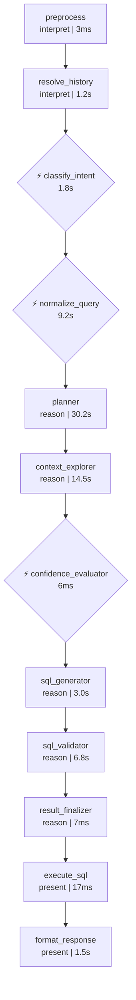

# Pipeline Trace: session-1774859576594

## 1. Executive Summary

**질의**: 1
**결과**: ❌ 실패
**소요**: 68.2s | LLM 9회, 41,769토큰

| 단계 | 결과 |
|------|------|
| 의도 분류 | data_extraction (95%) |
| 질문 정규화 | RANK |
| 준비도 판정 | generate_sql (86%) |
| SQL | 2회 시도, 검증 통과, 실행 성공 (10건) |

## 2. Decision Trail

| # | 노드 | 유형 | 결정 | 확신도 | 근거 |
|--:|------|------|------|-------:|------|
| 1 | classify_intent | intent_classification | data_extraction | 95% | category=DATA_EXTRACTION, 지점별 여신 잔액이라는 데이터 엔티티와 구체… |
| 2 | normalize_query | normalization | RANK | 0% | entities=['지점', '여신'], measures=['여신 잔액 합계'], filt… |
| 3 | batch_interpret | table_comparison | TB_ADW_LNB301M, TB_ADW_COM001M | 40% | TB_ADW_LNB343S: 지점별 통계 테이블이나, 최신 일자(STD_DT) 기준 정밀 … |
| 4 | confidence_evaluator | readiness_verdict | generate_sql | 86% | knowledge=4/4, tables=15, pending_steps=0 |

## 3. Referenced Information

### embedding_encode

| # | 검색 쿼리 | 결과 수 | 소요시간 |
|--:|-----------|-------:|--------:|
| 1 | 오늘(최신) 기준 지점별 여신 잔액 합계를 지점명과 함께 상위 10개 보여줘 | 1 | 15.1s |
|   | ↳ dense_dim=1024 |   |   |
|   | ↳ sparse_nnz=21 |   |   |
| 2 | 오늘(최신) 기준 지점별 여신 잔액 합계를 지점명과 함께 상위 10개 보여줘 2026-03… | 1 | 751ms |
|   | ↳ dense_dim=1024 |   |   |
|   | ↳ sparse_nnz=30 |   |   |

### reranker

| # | 검색 쿼리 | 결과 수 | 소요시간 |
|--:|-----------|-------:|--------:|
| 1 | 오늘(최신) 기준 지점별 여신 잔액 합계를 지점명과 함께 상위 10개 보여줘 | 5 | 3.7s |
|   | ↳ backend=onnx |   |   |
|   | ↳ input=20 |   |   |
|   | ↳ filtered=20 |   |   |
| 2 | 오늘(최신) 기준 지점별 여신 잔액 합계를 지점명과 함께 상위 10개 보여줘 2026-03… | 5 | 4.8s |
|   | ↳ backend=onnx |   |   |
|   | ↳ input=20 |   |   |
|   | ↳ filtered=20 |   |   |

### search_use_cases

| # | 검색 쿼리 | 결과 수 | 소요시간 |
|--:|-----------|-------:|--------:|
| 1 | 오늘(최신) 기준 지점별 여신 잔액 합계를 지점명과 함께 상위 10개 보여줘 2026-03… | 5 | 5.6s |
|   | ↳ 결과 5건 수집 (배치 해석 대기) |   |   |

### search_table_meta

| # | 검색 쿼리 | 결과 수 | 소요시간 |
|--:|-----------|-------:|--------:|
| 1 | TB_ADW_LNB301M | 1 | 78ms |
|   | ↳ 결과 1건 수집 (배치 해석 대기) |   |   |
| 2 | TB_ADW_COM001M | 1 | 26ms |
|   | ↳ 결과 1건 수집 (배치 해석 대기) |   |   |
| 3 | TB_ADW_LNB343S | 1 | 10ms |
|   | ↳ 결과 1건 수집 (배치 해석 대기) |   |   |
| 4 | TB_ADW_LNB341P | 1 | 31ms |
|   | ↳ 결과 1건 수집 (배치 해석 대기) |   |   |
| 5 | TB_ADW_INS828M | 1 | 31ms |
|   | ↳ 결과 1건 수집 (배치 해석 대기) |   |   |
| 6 | TB_ADW_GLB1338H | 1 | 44ms |
|   | ↳ 결과 1건 수집 (배치 해석 대기) |   |   |
| 7 | TB_ADW_DEP201P | 1 | 31ms |
|   | ↳ 결과 1건 수집 (배치 해석 대기) |   |   |
| 8 | TB_ADW_FIN1319S | 1 | 21ms |
|   | ↳ 결과 1건 수집 (배치 해석 대기) |   |   |
| 9 | TB_ADW_LNA304L | 1 | 19ms |
|   | ↳ 결과 1건 수집 (배치 해석 대기) |   |   |
| 10 | TB_ADW_FXB534M | 1 | 29ms |
|   | ↳ 결과 1건 수집 (배치 해석 대기) |   |   |
| 11 | TB_ADW_CRD442P | 1 | 28ms |
|   | ↳ 결과 1건 수집 (배치 해석 대기) |   |   |

### info_db_execute

| # | 검색 쿼리 | 결과 수 | 소요시간 |
|--:|-----------|-------:|--------:|
| 1 | SELECT T2.BR_NM AS 지점명, SUM(T1.LN_BAL_AMT) AS 여신잔액… | 10 | 12ms |
|   | ↳ 컬럼: 지점명, 여신잔액합계 |   |   |
|   | ↳ 행 수: 10건 |   |   |
|   | ↳ 소요: 11.6ms |   |   |

### 합계

- 총 검색: 17회 (성공 17, 결과 0건 0)
- 총 소요: 30.3s

## 4. State Evolution

| 노드 | 변경 필드 | 변화 내용 |
|------|----------|----------|
| preprocess | preprocessed_input | → `1` |
|  | status | → `preprocessing` |
| resolve_history | preprocessed_input | → `오늘(최신) 기준 지점별 여신 잔액 합계를 지점명과 함께 상위 10개 보…` |
|  | awaiting_clarification | → `False` |
|  | clarification_response | → `` |
| classify_intent | intent | → `data_extraction` |
|  | intent_confidence | → `0.95` |
|  | query_category | → `DATA_EXTRACTION` |
|  | status | → `intent_classified` |
| normalize_query | normalized_query | → `original_query='오늘(최신) 기준 지점별 여신 잔액 합계를 …` |
|  | status | → `query_normalized` |
| planner | reason | → `phase=<Phase.EXPLORING: 'EXPLORING'> que…` |
| context_explorer | reason | → `phase=<Phase.EXPLORING: 'EXPLORING'> que…` |
| confidence_evaluator | reason | → `phase=<Phase.GENERATING: 'GENERATING'> q…` |
| sql_generator | reason | → `phase=<Phase.GENERATING: 'GENERATING'> q…` |
| sql_validator | reason | → `phase=<Phase.VALIDATING: 'VALIDATING'> q…` |
| result_finalizer | reason | → `phase=<Phase.DONE: 'DONE'> query_decompo…` |
|  | context | → `table_metas=[TableMeta(table_name='TB_AD…` |
| execute_sql | sql_result | → `columns=['지점명', '여신잔액합계'] rows=[{'지점명': …` |
|  | status | → `executed` |
| format_response | formatted_response | → `오늘 날짜 기준으로 여신 잔액이 높은 상위 10개 지점의 현황을 조회했습…` |
|  | status | → `formatted` |

## 5. Node Flow



## 6. Performance

### 노드 실행 타이밍

```mermaid
gantt
    title Node Execution Gantt
    dateFormat X
    axisFormat %s

    section 초기 실행
    preprocess : 0, 0.1s
    resolve_history : 0, 1.2s
    classify_intent : 0, 1.8s
    normalize_query : 0, 9.2s
    planner :crit, 0, 30.2s
    context_explorer :crit, 0, 14.5s
    confidence_evaluator : 0, 0.1s
    sql_generator : 0, 3.0s
    sql_validator : 0, 6.8s
    result_finalizer : 0, 0.1s
    execute_sql : 0, 0.1s
    format_response : 0, 1.5s
```



### LLM 호출 분석

| 노드 | 호출 수 | 토큰 | 소요시간 | 비중 |
|------|-------:|-----:|--------:|-----:|
| batch_interpret | 1 | 14,173 | 8.2s | 34% |
| normalization_phase1 | 1 | 9,175 | 4.2s | 22% |
| agentic_SQL생성 | 1 | 4,658 | 2.9s | 11% |
| planner | 1 | 4,540 | 4.9s | 11% |
| sql_validator_layer2b | 1 | 2,734 | 6.7s | 7% |
| normalization_phase2 | 1 | 2,518 | 4.9s | 6% |
| 이력해소 | 1 | 1,489 | 1.2s | 4% |
|  | 1 | 1,344 | 1.5s | 3% |
| intent_gate | 1 | 1,138 | 1.8s | 3% |
| **합계** | **9** | **41,769** | **36.3s** | 100% |

## 7. Automated Findings

- 🟡 **WARNING** [context_explorer] 응답 지연 5초 초과: embedding_encode(15106ms), search_use_cases(5638ms)
- 🟡 **WARNING** [planner] 노드 planner 실행 30155ms (30초 초과)
- 🔵 **INFO** [tracker] 내부 이벤트 없는 노드: preprocess, resolve_history, sql_generator, sql_validator, result_finalizer — 추적 누락 가능성

> 합계: INFO 1건, WARNING 2건

## Appendix: Detailed Timeline

| Seq | Type | Node | Summary | Detail | Duration | Status | State Changes |
|----:|------|------|-------|--------|--------:|--------|---------------|
| 1 | ▶ node_start | preprocess | preprocess 시작 | - | - | - | - |
| 2 | ■ node_end | preprocess | preprocess 완료 | 2개 필드 변경 | 3ms | success | preprocessed_input: 1, status: preproces… |
| 3 | ▶ node_start | resolve_history | resolve_history 시작 | - | - | - | - |
| 4 | 🤖 llm_call | 이력해소 | LLM(gemini-3.1-flash-lite-preview) 1489t… | gemini-3.1-flash-lite-preview 1442+47tok | 1240ms | - | - |
| 5 | ■ node_end | resolve_history | resolve_history 완료 | 3개 필드 변경 | 1245ms | success | preprocessed_input: 오늘(최신) 기준 지점별 여신 잔액 … |
| 6 | ▶ node_start | classify_intent | classify_intent 시작 | - | - | - | - |
| 7 | 🤖 llm_call | intent_gate | LLM(gemini-3.1-flash-lite-preview) 1138t… | gemini-3.1-flash-lite-preview 1068+70tok | 1816ms | - | - |
| 8 |   ⚡ decision | classify_intent | intent_classification: data_extraction |  (95%) category=DATA_EXTRACTION,… | - | - | - |
| 9 | ■ node_end | classify_intent | classify_intent 완료 | 4개 필드 변경 | 1821ms | success | intent: data_extraction, intent_confiden… |
| 10 | ▶ node_start | normalize_query | normalize_query 시작 | - | - | - | - |
| 11 | 🤖 llm_call | normalization_phase1 | LLM(gemini-3.1-flash-lite-preview) 9175t… | gemini-3.1-flash-lite-preview 8430+745tok | 4200ms | - | - |
| 12 | 🤖 llm_call | normalization_phase2 | LLM(gemini-3.1-flash-lite-preview) 2518t… | gemini-3.1-flash-lite-preview 1771+747tok | 4948ms | - | - |
| 13 |   ⚡ decision | normalize_query | normalization: RANK |  (0%) entities=['지점', '여신'], me… | - | - | - |
| 14 | ■ node_end | normalize_query | normalize_query 완료 | 2개 필드 변경 | 9155ms | success | normalized_query: original_query='오늘(최신)… |
| 15 | ▶ node_start | planner | planner 시작 | - | - | - | - |
| 16 |   🔧 tool_call | planner | embedding_encode: 1건 | embedding_encode: '오늘(최신) 기준 지점별 여신 잔액 합계를 지…' → 1건 | 15106ms | success | - |
| 17 |   🔧 tool_call | planner | reranker: 5건 | reranker: '오늘(최신) 기준 지점별 여신 잔액 합계를 지…' → 5건 | 3682ms | success | - |
| 18 |   🤖 llm_call | planner | LLM(gemini-3.1-flash-lite-preview) 4540t… | gemini-3.1-flash-lite-preview 3824+716tok | 4856ms | - | - |
| 19 | ■ node_end | planner | planner 완료 | 1개 필드 변경 | 30155ms | success | reason: phase=<Phase.EXPLORING: 'EXPLORI… |
| 20 | ▶ node_start | context_explorer | context_explorer 시작 | - | - | - | - |
| 21 |   🔧 tool_call | context_explorer | embedding_encode: 1건 | embedding_encode: '오늘(최신) 기준 지점별 여신 잔액 합계를 지…' → 1건 | 751ms | success | - |
| 22 |   🔧 tool_call | context_explorer | search_use_cases: 5건 | search_use_cases: '오늘(최신) 기준 지점별 여신 잔액 합계를 지…' → 5건 | 5638ms | success | - |
| 23 |   🔧 tool_call | context_explorer | reranker: 5건 | reranker: '오늘(최신) 기준 지점별 여신 잔액 합계를 지…' → 5건 | 4797ms | success | - |
| 24 |   🔧 tool_call | context_explorer | search_table_meta: 1건 | search_table_meta: 'TB_ADW_LNB301M' → 1건 | 78ms | success | - |
| 25 |   🔧 tool_call | context_explorer | search_table_meta: 1건 | search_table_meta: 'TB_ADW_COM001M' → 1건 | 26ms | success | - |
| 26 |   🔧 tool_call | context_explorer | search_table_meta: 1건 | search_table_meta: 'TB_ADW_LNB343S' → 1건 | 10ms | success | - |
| 27 |   🔧 tool_call | context_explorer | search_table_meta: 1건 | search_table_meta: 'TB_ADW_LNB341P' → 1건 | 31ms | success | - |
| 28 |   🔧 tool_call | context_explorer | search_table_meta: 1건 | search_table_meta: 'TB_ADW_INS828M' → 1건 | 31ms | success | - |
| 29 |   🔧 tool_call | context_explorer | search_table_meta: 1건 | search_table_meta: 'TB_ADW_GLB1338H' → 1건 | 44ms | success | - |
| 30 |   🔧 tool_call | context_explorer | search_table_meta: 1건 | search_table_meta: 'TB_ADW_DEP201P' → 1건 | 31ms | success | - |
| 31 |   🔧 tool_call | context_explorer | search_table_meta: 1건 | search_table_meta: 'TB_ADW_FIN1319S' → 1건 | 21ms | success | - |
| 32 |   🔧 tool_call | context_explorer | search_table_meta: 1건 | search_table_meta: 'TB_ADW_LNA304L' → 1건 | 19ms | success | - |
| 33 |   🔧 tool_call | context_explorer | search_table_meta: 1건 | search_table_meta: 'TB_ADW_FXB534M' → 1건 | 29ms | success | - |
| 34 |   🔧 tool_call | context_explorer | search_table_meta: 1건 | search_table_meta: 'TB_ADW_CRD442P' → 1건 | 28ms | success | - |
| 35 | 🤖 llm_call | batch_interpret | LLM(gemini-3.1-flash-lite-preview) 14173… | gemini-3.1-flash-lite-preview 12677+1496tok | 8161ms | - | - |
| 36 | ⚡ decision | batch_interpret | table_comparison: TB_ADW_LNB301M, TB_ADW… |  (40%) TB_ADW_LNB343S: 지점별 통계 테이… | - | - | - |
| 37 | ■ node_end | context_explorer | context_explorer 완료 | 1개 필드 변경 | 14514ms | success | reason: phase=<Phase.EXPLORING: 'EXPLORI… |
| 38 | ▶ node_start | confidence_evaluator | confidence_evaluator 시작 | - | - | - | - |
| 39 |   ⚡ decision | confidence_evaluator | readiness_verdict: generate_sql |  (86%) knowledge=4/4, tables=15,… | - | - | - |
| 40 | ■ node_end | confidence_evaluator | confidence_evaluator 완료 | 1개 필드 변경 | 6ms | success | reason: phase=<Phase.GENERATING: 'GENERA… |
| 41 | ▶ node_start | sql_generator | sql_generator 시작 | - | - | - | - |
| 42 | 🤖 llm_call | agentic_SQL생성 | LLM(gemini-3.1-flash-lite-preview) 4658t… | gemini-3.1-flash-lite-preview 4444+214tok | 2947ms | - | - |
| 43 | ■ node_end | sql_generator | sql_generator 완료 | 1개 필드 변경 | 2952ms | success | reason: phase=<Phase.GENERATING: 'GENERA… |
| 44 | ▶ node_start | sql_validator | sql_validator 시작 | - | - | - | - |
| 45 | 🤖 llm_call | sql_validator_layer2b | LLM(gemini-3.1-flash-lite-preview) 2734t… | gemini-3.1-flash-lite-preview 2398+336tok | 6707ms | - | - |
| 46 | ■ node_end | sql_validator | sql_validator 완료 | 1개 필드 변경 | 6806ms | success | reason: phase=<Phase.VALIDATING: 'VALIDA… |
| 47 | ▶ node_start | result_finalizer | result_finalizer 시작 | - | - | - | - |
| 48 | ■ node_end | result_finalizer | result_finalizer 완료 | 2개 필드 변경 | 7ms | success | reason: phase=<Phase.DONE: 'DONE'> query… |
| 49 | ▶ node_start | execute_sql | execute_sql 시작 | - | - | - | - |
| 50 |   🔧 tool_call | execute_sql | info_db_execute: 10건 | info_db_execute: 'SELECT T2.BR_NM AS 지점명, S…' → 10건 | 12ms | success | - |
| 51 | ■ node_end | execute_sql | execute_sql 완료 | 2개 필드 변경 | 17ms | success | sql_result: columns=['지점명', '여신잔액합계'] ro… |
| 52 | ▶ node_start | format_response | format_response 시작 | - | - | - | - |
| 53 | 🤖 llm_call |  | LLM(gemini-3.1-flash-lite-preview) 1344t… | gemini-3.1-flash-lite-preview 1068+276tok | 1473ms | - | - |
| 54 | ■ node_end | format_response | format_response 완료 | 2개 필드 변경 | 1477ms | success | formatted_response: 오늘 날짜 기준으로 여신 잔액이 높은… |

## Appendix: Generated SQL

```sql
SELECT T2.BR_NM AS 지점명, SUM(T1.LN_BAL_AMT) AS 여신잔액합계 FROM ADWOWN.TB_ADW_LNB301M T1 INNER JOIN ADWOWN.TB_ADW_COM001M T2 ON T1.BLNG_BRCD = T2.BLNG_BRCD WHERE T1.STD_DT = (SELECT MAX(STD_DT) FROM ADWOWN.TB_ADW_LNB301M) GROUP BY T2.BR_NM ORDER BY 여신잔액합계 DESC LIMIT 10
```
