# Pipeline Trace: session-1774867541599

## 1. Executive Summary

**질의**: 여신 1억 이상이면서 연체 30일 초과한 개인고객의 지점별 수
**결과**: ❌ 실패
**소요**: 34.0s | LLM 5회, 15,909토큰

| 단계 | 결과 |
|------|------|
| 의도 분류 | data_analysis (95%) |
| 질문 정규화 | AGGREGATE |

## 2. Decision Trail

| # | 노드 | 유형 | 결정 | 확신도 | 근거 |
|--:|------|------|------|-------:|------|
| 1 | classify_intent | intent_classification | data_analysis | 95% | category=DATA_ANALYSIS, 지점별 분류축을 통해 수치를 비교하고자 하는 의… |
| 2 | normalize_query | normalization | AGGREGATE | 0% | entities=['여신', '개인고객', '지점'], measures=['수'], fil… |

## 3. Referenced Information

> 참조 정보 없음

## 4. State Evolution

| 노드 | 변경 필드 | 변화 내용 |
|------|----------|----------|
| preprocess | preprocessed_input | → `여신 1억 이상이면서 연체 30일 초과한 개인고객의 지점별 수` |
|  | status | → `preprocessing` |
| resolve_history | preprocessed_input | → `여신 1억 이상이면서 연체 30일 초과한 개인고객의 지점별 수` |
|  | awaiting_clarification | → `False` |
|  | clarification_response | → `` |
| classify_intent | intent | → `data_analysis` |
|  | intent_confidence | → `0.95` |
|  | query_category | → `DATA_ANALYSIS` |
|  | status | → `intent_classified` |
| normalize_query | normalized_query | → `original_query='여신 1억 이상이면서 연체 30일 초과한 개…` |
|  | status | → `query_normalized` |
|  | intent | → `clarification_needed` |
| clarify | clarification_question | → `정확한 조회를 위해 여신 기준을 확인해 주시겠어요?  1) 대출 원금 기…` |
|  | formatted_response | → `정확한 조회를 위해 여신 기준을 확인해 주시겠어요?  1) 대출 원금 기…` |
|  | awaiting_clarification | → `True` |
|  | clarification_turns | → `1` |
|  | status | → `awaiting_clarification` |

## 5. Node Flow

```mermaid
sequenceDiagram
    title Pipeline Execution Timeline

    participant User
    participant preprocess as preprocess<br/>(interpret)
    participant resolvehistory as resolve_history<br/>(interpret)
    participant 이력해소 as 이력해소<br/>(reason)
    participant classifyintent as classify_intent<br/>(interpret)
    participant intentgate as intent_gate<br/>(reason)
    participant normalizequery as normalize_query<br/>(interpret)
    participant normalizationphase1 as normalization_phase1<br/>(reason)
    participant normalizationphase2 as normalization_phase2<br/>(reason)
    participant clarify as clarify<br/>(interpret)
    participant LLM
    participant Tool

    User->>+preprocess: [1] preprocess 시작
    deactivate preprocess
    preprocess->>+resolvehistory: [3] resolve_history 시작
    이력해소->>+LLM: [4] LLM(gemini-3.1-flash-lite-preview) 1457tok
    LLM-->>-이력해소: 응답 3304ms
    deactivate resolvehistory
    resolvehistory->>+classifyintent: [6] classify_intent 시작
    intentgate->>+LLM: [7] LLM(gemini-3.1-flash-lite-preview) 1145tok
    LLM-->>-intentgate: 응답 1140ms
    Note over classifyintent: [8] ⚡ intent_classification: data_analysis
    deactivate classifyintent
    classifyintent->>+normalizequery: [10] normalize_query 시작
    normalizationphase1->>+LLM: [11] LLM(gemini-3.1-flash-lite-preview) 9198tok
    LLM-->>-normalizationphase1: 응답 4169ms
    normalizationphase2->>+LLM: [12] LLM(gemini-3.1-flash-lite-preview) 2573tok
    LLM-->>-normalizationphase2: 응답 11888ms
    Note over normalizequery: [13] ⚡ normalization: AGGREGATE
    deactivate normalizequery
    normalizequery->>+clarify: [15] clarify 시작
    ->>+LLM: [16] LLM(gemini-3.1-flash-lite-preview) 1536tok
    LLM-->>-: 응답 10693ms
    deactivate clarify
```

## 6. Performance

### 노드 실행 타이밍

```mermaid
gantt
    title Node Execution Gantt
    dateFormat X
    axisFormat %s

    section 초기 실행
    preprocess : 0, 0.1s
    resolve_history : 0, 5.9s
    classify_intent : 0, 1.1s
    normalize_query :crit, 0, 16.1s
    clarify :crit, 0, 10.7s
```



### LLM 호출 분석

| 노드 | 호출 수 | 토큰 | 소요시간 | 비중 |
|------|-------:|-----:|--------:|-----:|
| normalization_phase1 | 1 | 9,198 | 4.2s | 58% |
| normalization_phase2 | 1 | 2,573 | 11.9s | 16% |
|  | 1 | 1,536 | 10.7s | 10% |
| 이력해소 | 1 | 1,457 | 3.3s | 9% |
| intent_gate | 1 | 1,145 | 1.1s | 7% |
| **합계** | **5** | **15,909** | **31.2s** | 100% |

## 7. Automated Findings

- 🔴 **CRITICAL** [context_explorer] 컨텍스트 수집 기록 없음 — 도구 실행이 전혀 추적되지 않았음
- 🔴 **CRITICAL** [sql_generator] SQL 미생성 — 파이프라인이 SQL 생성에 도달하지 못함
- 🟡 **WARNING** [pipeline] LLM 응답 10초 초과: 2건 — Thinking 모드 비활성화 고려
- 🔵 **INFO** [confidence_evaluator] readiness 판정 기록 없음 — evaluator 추적 미적용 가능성
- 🔵 **INFO** [tracker] 내부 이벤트 없는 노드: preprocess, resolve_history, clarify — 추적 누락 가능성

> 합계: CRITICAL 2건, INFO 2건, WARNING 1건

## Appendix: Detailed Timeline

| Seq | Type | Node | Summary | Detail | Duration | Status | State Changes |
|----:|------|------|-------|--------|--------:|--------|---------------|
| 1 | ▶ node_start | preprocess | preprocess 시작 | - | - | - | - |
| 2 | ■ node_end | preprocess | preprocess 완료 | 2개 필드 변경 | 4ms | success | preprocessed_input: 여신 1억 이상이면서 연체 30일 초… |
| 3 | ▶ node_start | resolve_history | resolve_history 시작 | - | - | - | - |
| 4 | 🤖 llm_call | 이력해소 | LLM(gemini-3.1-flash-lite-preview) 1457t… | gemini-3.1-flash-lite-preview 1413+44tok | 3304ms | - | - |
| 5 | ■ node_end | resolve_history | resolve_history 완료 | 3개 필드 변경 | 5943ms | success | preprocessed_input: 여신 1억 이상이면서 연체 30일 초… |
| 6 | ▶ node_start | classify_intent | classify_intent 시작 | - | - | - | - |
| 7 | 🤖 llm_call | intent_gate | LLM(gemini-3.1-flash-lite-preview) 1145t… | gemini-3.1-flash-lite-preview 1065+80tok | 1140ms | - | - |
| 8 |   ⚡ decision | classify_intent | intent_classification: data_analysis |  (95%) category=DATA_ANALYSIS, 지… | - | - | - |
| 9 | ■ node_end | classify_intent | classify_intent 완료 | 4개 필드 변경 | 1145ms | success | intent: data_analysis, intent_confidence… |
| 10 | ▶ node_start | normalize_query | normalize_query 시작 | - | - | - | - |
| 11 | 🤖 llm_call | normalization_phase1 | LLM(gemini-3.1-flash-lite-preview) 9198t… | gemini-3.1-flash-lite-preview 8427+771tok | 4169ms | - | - |
| 12 | 🤖 llm_call | normalization_phase2 | LLM(gemini-3.1-flash-lite-preview) 2573t… | gemini-3.1-flash-lite-preview 1794+779tok | 11888ms | - | - |
| 13 |   ⚡ decision | normalize_query | normalization: AGGREGATE |  (0%) entities=['여신', '개인고객', '… | - | - | - |
| 14 | ■ node_end | normalize_query | normalize_query 완료 | 3개 필드 변경 | 16067ms | success | normalized_query: original_query='여신 1억 … |
| 15 | ▶ node_start | clarify | clarify 시작 | - | - | - | - |
| 16 | 🤖 llm_call |  | LLM(gemini-3.1-flash-lite-preview) 1536t… | gemini-3.1-flash-lite-preview 1481+55tok | 10693ms | - | - |
| 17 | ■ node_end | clarify | clarify 완료 | 5개 필드 변경 | 10695ms | success | clarification_question: 정확한 조회를 위해 여신 기준… |
