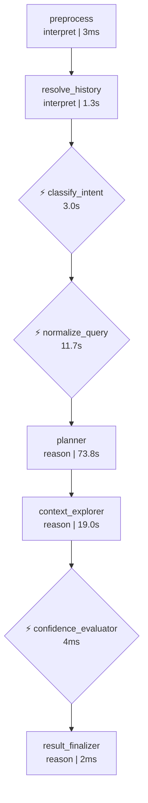

# Pipeline Trace: session-1774867541599

## 1. Executive Summary

**질의**: 1
**결과**: ❌ 실패
**소요**: 108.9s | LLM 6회, 35,103토큰

| 단계 | 결과 |
|------|------|
| 의도 분류 | data_extraction (95%) |
| 질문 정규화 | EXTRACT |
| 준비도 판정 | ask_user (68%) |

## 2. Decision Trail

| # | 노드 | 유형 | 결정 | 확신도 | 근거 |
|--:|------|------|------|-------:|------|
| 1 | classify_intent | intent_classification | data_extraction | 95% | category=DATA_EXTRACTION, 특정 조건(1억 원 이상)을 만족하는 고객 … |
| 2 | normalize_query | normalization | EXTRACT | 0% | entities=['대출', '고객'], measures=['대출 잔액'], filters… |
| 3 | batch_interpret | table_comparison | TB_ADW_LNB301M | 33% | TB_ADW_CSC101M: 고객 기본 정보만 담고 있으며 대출 잔액 정보가 없음, TB_… |
| 4 | confidence_evaluator | readiness_verdict | ask_user | 68% | knowledge=5/6, tables=22, pending_steps=0 |

## 3. Referenced Information

### embedding_encode

| # | 검색 쿼리 | 결과 수 | 소요시간 |
|--:|-----------|-------:|--------:|
| 1 | 대출 잔액 기준 1억 원 이상인 고객 중 고객별 총 대출 잔액의 합계가 1억 원 이상인 고… | 1 | 37.3s |
|   | ↳ dense_dim=1024 |   |   |
|   | ↳ sparse_nnz=20 |   |   |
| 2 | 대출 잔액 기준 1억 원 이상인 고객 중 고객별 총 대출 잔액의 합계가 1억 원 이상인 고… | 1 | 463ms |
|   | ↳ dense_dim=1024 |   |   |
|   | ↳ sparse_nnz=26 |   |   |

### reranker

| # | 검색 쿼리 | 결과 수 | 소요시간 |
|--:|-----------|-------:|--------:|
| 1 | 대출 잔액 기준 1억 원 이상인 고객 중 고객별 총 대출 잔액의 합계가 1억 원 이상인 고… | 5 | 14.1s |
|   | ↳ backend=onnx |   |   |
|   | ↳ input=20 |   |   |
|   | ↳ filtered=20 |   |   |
| 2 | 대출 잔액 기준 1억 원 이상인 고객 중 고객별 총 대출 잔액의 합계가 1억 원 이상인 고… | 5 | 8.3s |
|   | ↳ backend=onnx |   |   |
|   | ↳ input=20 |   |   |
|   | ↳ filtered=20 |   |   |

### search_use_cases

| # | 검색 쿼리 | 결과 수 | 소요시간 |
|--:|-----------|-------:|--------:|
| 1 | 대출 잔액 기준 1억 원 이상인 고객 중 고객별 총 대출 잔액의 합계가 1억 원 이상인 고… | 5 | 8.9s |
|   | ↳ 결과 5건 수집 (배치 해석 대기) |   |   |

### search_table_meta

| # | 검색 쿼리 | 결과 수 | 소요시간 |
|--:|-----------|-------:|--------:|
| 1 | TB_ADW_CSC101M | 1 | 138ms |
|   | ↳ 결과 1건 수집 (배치 해석 대기) |   |   |
| 2 | TB_ADW_DEP201P | 1 | 58ms |
|   | ↳ 결과 1건 수집 (배치 해석 대기) |   |   |
| 3 | TB_ADW_LNB301M | 1 | 30ms |
|   | ↳ 결과 1건 수집 (배치 해석 대기) |   |   |
| 4 | TB_ADW_CSC110L | 1 | 18ms |
|   | ↳ 결과 1건 수집 (배치 해석 대기) |   |   |
| 5 | TB_ADW_CSC111L | 1 | 47ms |
|   | ↳ 결과 1건 수집 (배치 해석 대기) |   |   |
| 6 | TB_ADW_CSC105M | 1 | 45ms |
|   | ↳ 결과 1건 수집 (배치 해석 대기) |   |   |
| 7 | TB_ADW_CSC109H | 1 | 19ms |
|   | ↳ 결과 1건 수집 (배치 해석 대기) |   |   |
| 8 | TB_ADW_CSC106M | 1 | 35ms |
|   | ↳ 결과 1건 수집 (배치 해석 대기) |   |   |
| 9 | TB_ADW_CSC104D | 1 | 11ms |
|   | ↳ 결과 1건 수집 (배치 해석 대기) |   |   |
| 10 | TB_ADW_COM002M | 1 | 15ms |
|   | ↳ 결과 1건 수집 (배치 해석 대기) |   |   |
| 11 | TB_ADW_CSC102H | 1 | 11ms |
|   | ↳ 결과 1건 수집 (배치 해석 대기) |   |   |
| 12 | TB_ADW_CSC107M | 1 | 38ms |
|   | ↳ 결과 1건 수집 (배치 해석 대기) |   |   |

### search_code_meta

| # | 검색 쿼리 | 결과 수 | 소요시간 |
|--:|-----------|-------:|--------:|
| 1 | 대출 잔액 | 10 | 38ms |
|   | ↳ 결과 10건 수집 (배치 해석 대기) |   |   |
| 2 | 총 대출 잔액의 합계 | 10 | 10ms |
|   | ↳ 결과 10건 수집 (배치 해석 대기) |   |   |

### 합계

- 총 검색: 19회 (성공 19, 결과 0건 0)
- 총 소요: 69.7s

## 4. State Evolution

| 노드 | 변경 필드 | 변화 내용 |
|------|----------|----------|
| preprocess | preprocessed_input | → `1` |
|  | status | → `preprocessing` |
| resolve_history | preprocessed_input | → `대출 잔액 기준 1억 원 이상인 고객 중 고객별 총 대출 잔액의 합계가 …` |
|  | awaiting_clarification | → `False` |
|  | clarification_response | → `` |
| classify_intent | intent | → `data_extraction` |
|  | intent_confidence | → `0.95` |
|  | query_category | → `DATA_EXTRACTION` |
|  | status | → `intent_classified` |
| normalize_query | normalized_query | → `original_query='대출 잔액 기준 1억 원 이상인 고객 중 고…` |
|  | status | → `query_normalized` |
|  | intent | → `clarification_needed` |
| planner | reason | → `phase=<Phase.EXPLORING: 'EXPLORING'> que…` |
| context_explorer | reason | → `phase=<Phase.EXPLORING: 'EXPLORING'> que…` |
| confidence_evaluator | reason | → `phase=<Phase.VERIFYING: 'VERIFYING'> que…` |
| result_finalizer | reason | → `phase=<Phase.DONE: 'DONE'> query_decompo…` |
|  | awaiting_clarification | → `True` |
|  | clarification_turns | → `3` |
|  | clarification_question | → `추가로 다음 항목도 확인이 필요합니다:  1. **ambiguity:대출…` |
|  | formatted_response | → `추가로 다음 항목도 확인이 필요합니다:  1. **ambiguity:대출…` |

## 5. Node Flow

## 6. Performance

### 노드 실행 타이밍

```mermaid
gantt
    title Node Execution Gantt
    dateFormat X
    axisFormat %s

    section 초기 실행
    preprocess : 0, 0.1s
    resolve_history : 0, 1.3s
    classify_intent : 0, 3.0s
    normalize_query :crit, 0, 11.7s
    planner :crit, 0, 73.8s
    context_explorer :crit, 0, 19.0s
    confidence_evaluator : 0, 0.1s
    result_finalizer : 0, 0.1s
```

### LLM 호출 분석

| 노드 | 호출 수 | 토큰 | 소요시간 | 비중 |
|------|-------:|-----:|--------:|-----:|
| batch_interpret | 1 | 15,970 | 9.0s | 45% |
| normalization_phase1 | 1 | 9,233 | 5.5s | 26% |
| planner | 1 | 4,528 | 13.7s | 13% |
| normalization_phase2 | 1 | 2,685 | 6.2s | 8% |
| 이력해소 | 1 | 1,559 | 1.3s | 4% |
| intent_gate | 1 | 1,128 | 3.0s | 3% |
| **합계** | **6** | **35,103** | **38.7s** | 100% |

## 7. Automated Findings

- 🔴 **CRITICAL** [sql_generator] SQL 미생성 — 파이프라인이 SQL 생성에 도달하지 못함
- 🟡 **WARNING** [context_explorer] 응답 지연 5초 초과: embedding_encode(37289ms), reranker(14139ms), search_use_cases(8922ms), reranker(8342ms)
- 🟡 **WARNING** [pipeline] LLM 응답 10초 초과: 1건 — Thinking 모드 비활성화 고려
- 🟡 **WARNING** [planner] 노드 planner 실행 73845ms (30초 초과)
- 🔵 **INFO** [tracker] 내부 이벤트 없는 노드: preprocess, resolve_history, result_finalizer — 추적 누락 가능성

> 합계: CRITICAL 1건, INFO 1건, WARNING 3건

## Appendix: Detailed Timeline

| Seq | Type | Node | Summary | Detail | Duration | Status | State Changes |
|----:|------|------|-------|--------|--------:|--------|---------------|
| 1 | ▶ node_start | preprocess | preprocess 시작 | - | - | - | - |
| 2 | ■ node_end | preprocess | preprocess 완료 | 2개 필드 변경 | 3ms | success | preprocessed_input: 1, status: preproces… |
| 3 | ▶ node_start | resolve_history | resolve_history 시작 | - | - | - | - |
| 4 | 🤖 llm_call | 이력해소 | LLM(gemini-3.1-flash-lite-preview) 1559t… | gemini-3.1-flash-lite-preview 1506+53tok | 1300ms | - | - |
| 5 | ■ node_end | resolve_history | resolve_history 완료 | 3개 필드 변경 | 1304ms | success | preprocessed_input: 대출 잔액 기준 1억 원 이상인 고객… |
| 6 | ▶ node_start | classify_intent | classify_intent 시작 | - | - | - | - |
| 7 | 🤖 llm_call | intent_gate | LLM(gemini-3.1-flash-lite-preview) 1128t… | gemini-3.1-flash-lite-preview 1074+54tok | 3018ms | - | - |
| 8 |   ⚡ decision | classify_intent | intent_classification: data_extraction |  (95%) category=DATA_EXTRACTION,… | - | - | - |
| 9 | ■ node_end | classify_intent | classify_intent 완료 | 4개 필드 변경 | 3021ms | success | intent: data_extraction, intent_confiden… |
| 10 | ▶ node_start | normalize_query | normalize_query 시작 | - | - | - | - |
| 11 | 🤖 llm_call | normalization_phase1 | LLM(gemini-3.1-flash-lite-preview) 9233t… | gemini-3.1-flash-lite-preview 8436+797tok | 5470ms | - | - |
| 12 | 🤖 llm_call | normalization_phase2 | LLM(gemini-3.1-flash-lite-preview) 2685t… | gemini-3.1-flash-lite-preview 1829+856tok | 6216ms | - | - |
| 13 |   ⚡ decision | normalize_query | normalization: EXTRACT |  (0%) entities=['대출', '고객'], me… | - | - | - |
| 14 | ■ node_end | normalize_query | normalize_query 완료 | 3개 필드 변경 | 11696ms | success | normalized_query: original_query='대출 잔액 … |
| 15 | ▶ node_start | planner | planner 시작 | - | - | - | - |
| 16 |   🔧 tool_call | planner | embedding_encode: 1건 | embedding_encode: '대출 잔액 기준 1억 원 이상인 고객 중 고객…' → 1건 | 37289ms | success | - |
| 17 |   🔧 tool_call | planner | reranker: 5건 | reranker: '대출 잔액 기준 1억 원 이상인 고객 중 고객…' → 5건 | 14139ms | success | - |
| 18 |   🤖 llm_call | planner | LLM(gemini-3.1-flash-lite-preview) 4528t… | gemini-3.1-flash-lite-preview 3960+568tok | 13681ms | - | - |
| 19 | ■ node_end | planner | planner 완료 | 1개 필드 변경 | 73845ms | success | reason: phase=<Phase.EXPLORING: 'EXPLORI… |
| 20 | ▶ node_start | context_explorer | context_explorer 시작 | - | - | - | - |
| 21 |   🔧 tool_call | context_explorer | embedding_encode: 1건 | embedding_encode: '대출 잔액 기준 1억 원 이상인 고객 중 고객…' → 1건 | 463ms | success | - |
| 22 |   🔧 tool_call | context_explorer | search_use_cases: 5건 | search_use_cases: '대출 잔액 기준 1억 원 이상인 고객 중 고객…' → 5건 | 8922ms | success | - |
| 23 |   🔧 tool_call | context_explorer | reranker: 5건 | reranker: '대출 잔액 기준 1억 원 이상인 고객 중 고객…' → 5건 | 8342ms | success | - |
| 24 |   🔧 tool_call | context_explorer | search_table_meta: 1건 | search_table_meta: 'TB_ADW_CSC101M' → 1건 | 138ms | success | - |
| 25 |   🔧 tool_call | context_explorer | search_table_meta: 1건 | search_table_meta: 'TB_ADW_DEP201P' → 1건 | 58ms | success | - |
| 26 |   🔧 tool_call | context_explorer | search_table_meta: 1건 | search_table_meta: 'TB_ADW_LNB301M' → 1건 | 30ms | success | - |
| 27 |   🔧 tool_call | context_explorer | search_table_meta: 1건 | search_table_meta: 'TB_ADW_CSC110L' → 1건 | 18ms | success | - |
| 28 |   🔧 tool_call | context_explorer | search_table_meta: 1건 | search_table_meta: 'TB_ADW_CSC111L' → 1건 | 47ms | success | - |
| 29 |   🔧 tool_call | context_explorer | search_table_meta: 1건 | search_table_meta: 'TB_ADW_CSC105M' → 1건 | 45ms | success | - |
| 30 |   🔧 tool_call | context_explorer | search_table_meta: 1건 | search_table_meta: 'TB_ADW_CSC109H' → 1건 | 19ms | success | - |
| 31 |   🔧 tool_call | context_explorer | search_table_meta: 1건 | search_table_meta: 'TB_ADW_CSC106M' → 1건 | 35ms | success | - |
| 32 |   🔧 tool_call | context_explorer | search_table_meta: 1건 | search_table_meta: 'TB_ADW_CSC104D' → 1건 | 11ms | success | - |
| 33 |   🔧 tool_call | context_explorer | search_table_meta: 1건 | search_table_meta: 'TB_ADW_COM002M' → 1건 | 15ms | success | - |
| 34 |   🔧 tool_call | context_explorer | search_table_meta: 1건 | search_table_meta: 'TB_ADW_CSC102H' → 1건 | 11ms | success | - |
| 35 |   🔧 tool_call | context_explorer | search_table_meta: 1건 | search_table_meta: 'TB_ADW_CSC107M' → 1건 | 38ms | success | - |
| 36 |   🔧 tool_call | context_explorer | search_code_meta: 10건 | search_code_meta: '대출 잔액' → 10건 | 38ms | success | - |
| 37 |   🔧 tool_call | context_explorer | search_code_meta: 10건 | search_code_meta: '총 대출 잔액의 합계' → 10건 | 10ms | success | - |
| 38 | 🤖 llm_call | batch_interpret | LLM(gemini-3.1-flash-lite-preview) 15970… | gemini-3.1-flash-lite-preview 14690+1280tok | 9015ms | - | - |
| 39 | ⚡ decision | batch_interpret | table_comparison: TB_ADW_LNB301M |  (33%) TB_ADW_CSC101M: 고객 기본 정보만… | - | - | - |
| 40 | ■ node_end | context_explorer | context_explorer 완료 | 1개 필드 변경 | 18979ms | success | reason: phase=<Phase.EXPLORING: 'EXPLORI… |
| 41 | ▶ node_start | confidence_evaluator | confidence_evaluator 시작 | - | - | - | - |
| 42 |   ⚡ decision | confidence_evaluator | readiness_verdict: ask_user |  (68%) knowledge=5/6, tables=22,… | - | - | - |
| 43 | ■ node_end | confidence_evaluator | confidence_evaluator 완료 | 1개 필드 변경 | 4ms | success | reason: phase=<Phase.VERIFYING: 'VERIFYI… |
| 44 | ▶ node_start | result_finalizer | result_finalizer 시작 | - | - | - | - |
| 45 | ■ node_end | result_finalizer | result_finalizer 완료 | 5개 필드 변경 | 2ms | success | reason: phase=<Phase.DONE: 'DONE'> query… |
