# Pipeline Trace: session-1774867541599

## 1. Executive Summary

**질의**: 똑같은 말 아니야 ? 대출 잔액이야
**결과**: ❌ 실패 (3회 재탐색 후 최대 시도 횟수 초과) — SQL 생성 실패
시도한 접근 방식:
  - [FailureType.DB_ERROR] DB 실행 오류: (sqlalchemy.dialects.postgresql.asyncpg.Pr
**소요**: 96.1s | LLM 17회, 102,793토큰

| 단계 | 결과 |
|------|------|
| 의도 분류 | data_extraction (95%) |
| 질문 정규화 | EXTRACT |
| 준비도 판정 | generate_sql (83%) |
| SQL | 4회 시도, 검증 실패 |
| 실패 원인 | SQL 생성 실패 시도한 접근 방식:   - [FailureType.DB_ERROR] DB 실행 오류: (sqlalchemy.dialects.p… |

## 2. Decision Trail

| # | 노드 | 유형 | 결정 | 확신도 | 근거 |
|--:|------|------|------|-------:|------|
| 1 | classify_intent | intent_classification | data_extraction | 95% | category=DATA_EXTRACTION, 특정 조건(1억 이상)을 만족하는 데이터 목… |
| 2 | normalize_query | normalization | EXTRACT | 0% | entities=['고객', '대출'], measures=['대출 잔액'], filters… |
| 3 | batch_interpret | table_comparison | TB_ADW_LNB301M, TB_ADW_CSC101M | 40% | TB_ADW_CRD442P: 여신(대출) 데이터가 아닌 카드 잔액 데이터임., TB_ADW… |
| 4 | confidence_evaluator | readiness_verdict | generate_sql | 81% | knowledge=4/4, tables=21, pending_steps=0 |
| 5 | batch_interpret | table_comparison | TB_ADW_LNB301M, TB_ADW_CSC101M | 33% | TB_ADW_CRD442P: 카드 잔액 정보로 대출 잔액과는 무관함, TB_ADW_CRD4… |
| 6 | confidence_evaluator | readiness_verdict | generate_sql | 83% | knowledge=7/7, tables=31, pending_steps=0 |
| 7 | batch_interpret | table_comparison | ADWOWN.TB_ADW_LNB301M | 33% | ADWOWN.TB_ADW_CSC101M: 고객 인적사항 정보를 포함하나, 대출 잔액 계산과… |
| 8 | confidence_evaluator | readiness_verdict | generate_sql | 83% | knowledge=8/8, tables=31, pending_steps=0 |
| 9 | batch_interpret | table_comparison | TB_ADW_LNB301M | 25% | TB_ADW_CSC101M: 고객 정보 기본으로 대출 잔액 데이터가 포함되어 있지 않음.,… |
| 10 | confidence_evaluator | readiness_verdict | generate_sql | 83% | knowledge=8/8, tables=31, pending_steps=0 |

> 총 4개 사이클 감지됨 (recovery_planner 3회 호출)

## 3. Referenced Information

### embedding_encode

| # | 검색 쿼리 | 결과 수 | 소요시간 |
|--:|-----------|-------:|--------:|
| 1 | 고객별 총 대출 잔액의 합계가 1억 원 이상인 대출 잔액 정보 보여줘 | 1 | 479ms |
|   | ↳ dense_dim=1024 |   |   |
|   | ↳ sparse_nnz=17 |   |   |
| 2 | TB_ADW_LNB301M 대출 잔액 합계 | 1 | 209ms |
|   | ↳ dense_dim=1024 |   |   |
|   | ↳ sparse_nnz=12 |   |   |

### reranker

| # | 검색 쿼리 | 결과 수 | 소요시간 |
|--:|-----------|-------:|--------:|
| 1 | 고객별 총 대출 잔액의 합계가 1억 원 이상인 대출 잔액 정보 보여줘 | 5 | 2.5s |
|   | ↳ backend=onnx |   |   |
|   | ↳ input=20 |   |   |
|   | ↳ filtered=20 |   |   |
| 2 | TB_ADW_LNB301M 대출 잔액 합계 | 5 | 3.8s |
|   | ↳ backend=onnx |   |   |
|   | ↳ input=20 |   |   |
|   | ↳ filtered=20 |   |   |

### search_table_meta

| # | 검색 쿼리 | 결과 수 | 소요시간 |
|--:|-----------|-------:|--------:|
| 1 | TB_ADW_LNB301M | 1 | 8ms |
|   | ↳ 결과 1건 수집 (배치 해석 대기) |   |   |
| 2 | TB_ADW_CSC106M | 1 | 7ms |
|   | ↳ 결과 1건 수집 (배치 해석 대기) |   |   |
| 3 | TB_ADW_CSC107M | 1 | 5ms |
|   | ↳ 결과 1건 수집 (배치 해석 대기) |   |   |
| 4 | TB_ADW_CSC101M | 1 | 6ms |
|   | ↳ 결과 1건 수집 (배치 해석 대기) |   |   |
| 5 | TB_ADW_CSC105M | 1 | 5ms |
|   | ↳ 결과 1건 수집 (배치 해석 대기) |   |   |
| 6 | TB_ADW_CSC102H | 1 | 5ms |
|   | ↳ 결과 1건 수집 (배치 해석 대기) |   |   |
| 7 | TB_ADW_CRD442P | 1 | 6ms |
|   | ↳ 결과 1건 수집 (배치 해석 대기) |   |   |
| 8 | TB_ADW_COM014M | 1 | 5ms |
|   | ↳ 결과 1건 수집 (배치 해석 대기) |   |   |
| 9 | TB_ADW_COM002M | 1 | 6ms |
|   | ↳ 결과 1건 수집 (배치 해석 대기) |   |   |
| 10 | TB_ADW_CRD419M | 1 | 5ms |
|   | ↳ 결과 1건 수집 (배치 해석 대기) |   |   |
| 11 | TB_ADW_CSC104D | 1 | 5ms |
|   | ↳ 결과 1건 수집 (배치 해석 대기) |   |   |
| 12 | 제공된 관련 테이블 목록(TB_ADW_CSC106M 등)의 메타데이터를 직접 검색 | 10 | 26ms |
|   | ↳ 결과 10건 수집 (배치 해석 대기) |   |   |

### search_code_meta

| # | 검색 쿼리 | 결과 수 | 소요시간 |
|--:|-----------|-------:|--------:|
| 1 | 총 대출 잔액의 합계 | 10 | 6ms |
|   | ↳ 결과 10건 수집 (배치 해석 대기) |   |   |
| 2 | LN_STCD | 10 | 6ms |
|   | ↳ 결과 10건 수집 (배치 해석 대기) |   |   |

### get_date_distribution

| # | 검색 쿼리 | 결과 수 | 소요시간 |
|--:|-----------|-------:|--------:|
| 1 | TB_ADW_LNB301M,STD_DT | 0 | 5ms |
|   | ↳ 결과 0건 수집 (배치 해석 대기) |   |   |
| 2 | TB_ADW_LNB301M,STD_DT | 0 | 5ms |
|   | ↳ 결과 0건 수집 (배치 해석 대기) |   |   |

### get_sample_rows

| # | 검색 쿼리 | 결과 수 | 소요시간 |
|--:|-----------|-------:|--------:|
| 1 | TB_ADW_LNB301M | 0 | 4ms |
|   | ↳ 결과 0건 수집 (배치 해석 대기) |   |   |

### search_use_cases

| # | 검색 쿼리 | 결과 수 | 소요시간 |
|--:|-----------|-------:|--------:|
| 1 | TB_ADW_LNB301M 대출 잔액 합계 | 5 | 4.0s |
|   | ↳ 결과 5건 수집 (배치 해석 대기) |   |   |

### 합계

- 총 검색: 22회 (성공 19, 결과 0건 3)
- 총 소요: 11.0s

## 4. State Evolution

| 노드 | 변경 필드 | 변화 내용 |
|------|----------|----------|
| preprocess | preprocessed_input | → `똑같은 말 아니야 ? 대출 잔액이야` |
|  | status | → `preprocessing` |
| resolve_history | preprocessed_input | → `고객별 총 대출 잔액의 합계가 1억 원 이상인 대출 잔액 정보 보여줘` |
|  | awaiting_clarification | → `False` |
|  | clarification_response | → `` |
| classify_intent | intent | → `data_extraction` |
|  | intent_confidence | → `0.95` |
|  | query_category | → `DATA_EXTRACTION` |
|  | status | → `intent_classified` |
| normalize_query | normalized_query | → `original_query='고객별 총 대출 잔액의 합계가 1억 원 이상…` |
|  | status | → `query_normalized` |
|  | intent | → `clarification_needed` |
| planner | reason | → `phase=<Phase.EXPLORING: 'EXPLORING'> que…` |
| context_explorer | reason | → `phase=<Phase.EXPLORING: 'EXPLORING'> que…` |
| confidence_evaluator | reason | → `phase=<Phase.GENERATING: 'GENERATING'> q…` |
| sql_generator | reason | → `phase=<Phase.GENERATING: 'GENERATING'> q…` |
| sql_validator | reason | → `phase=<Phase.VALIDATING: 'VALIDATING'> q…` |
| recovery_planner | reason | → `phase=<Phase.EXPLORING: 'EXPLORING'> que…` |
| context_explorer ② | reason | → `phase=<Phase.EXPLORING: 'EXPLORING'> que…` |
| confidence_evaluator ② | reason | → `phase=<Phase.GENERATING: 'GENERATING'> q…` |
| sql_generator ② | reason | → `phase=<Phase.GENERATING: 'GENERATING'> q…` |
| sql_validator ② | reason | → `phase=<Phase.VALIDATING: 'VALIDATING'> q…` |
| recovery_planner ② | reason | → `phase=<Phase.EXPLORING: 'EXPLORING'> que…` |
| context_explorer ③ | reason | → `phase=<Phase.EXPLORING: 'EXPLORING'> que…` |
| confidence_evaluator ③ | reason | → `phase=<Phase.GENERATING: 'GENERATING'> q…` |
| sql_generator ③ | reason | → `phase=<Phase.GENERATING: 'GENERATING'> q…` |
| sql_validator ③ | reason | → `phase=<Phase.VALIDATING: 'VALIDATING'> q…` |
| recovery_planner ③ | reason | → `phase=<Phase.EXPLORING: 'EXPLORING'> que…` |
| context_explorer ④ | reason | → `phase=<Phase.EXPLORING: 'EXPLORING'> que…` |
| confidence_evaluator ④ | reason | → `phase=<Phase.GENERATING: 'GENERATING'> q…` |
| result_finalizer | reason | → `phase=<Phase.DONE: 'DONE'> query_decompo…` |
|  | error_message | → `SQL 생성 실패 시도한 접근 방식:   - [FailureType.DB…` |
|  | status | → `error` |
| error_end | formatted_response | → `죄송합니다. 여러 번 시도했지만 안전한 SQL을 생성하지 못했습니다. 요…` |
|  | status | → `error` |

## 5. Node Flow

```mermaid
flowchart TD
    subgraph cycle0["초기 실행"]
    n1["preprocess<br/>interpret | 4ms"]
    n2["resolve_history<br/>interpret | 3.1s"]
    n1 --> n2
    n3{⚡ classify_intent<br/>1.7s}
    n2 --> n3
    n4{⚡ normalize_query<br/>11.7s}
    n3 --> n4
    n5["planner<br/>reason | 5.9s"]
    n4 --> n5
    n6["context_explorer<br/>reason | 10.0s"]
    n5 --> n6
    n7{⚡ confidence_evaluator<br/>4ms}
    n6 --> n7
    n8["sql_generator<br/>reason | 4.8s"]
    n7 --> n8
    n9["sql_validator<br/>reason | 10.5s"]
    n8 --> n9
    n10["recovery_planner<br/>reason | 2.7s"]
    n9 --> n10
    end
    subgraph cycle1["재시도 ①"]
    n11["context_explorer<br/>reason | 10.0s"]
    n12{⚡ confidence_evaluator<br/>4ms}
    n11 --> n12
    n13["sql_generator<br/>reason | 4.8s"]
    n12 --> n13
    n14["sql_validator<br/>reason | 10.5s"]
    n13 --> n14
    n15["recovery_planner<br/>reason | 2.7s"]
    n14 --> n15
    end
    subgraph cycle2["재시도 ②"]
    n16["context_explorer<br/>reason | 10.0s"]
    n17{⚡ confidence_evaluator<br/>4ms}
    n16 --> n17
    n18["sql_generator<br/>reason | 4.8s"]
    n17 --> n18
    n19["sql_validator<br/>reason | 10.5s"]
    n18 --> n19
    n20["recovery_planner<br/>reason | 2.7s"]
    n19 --> n20
    end
    subgraph cycle3["재시도 ③"]
    n21["context_explorer<br/>reason | 10.0s"]
    n22{⚡ confidence_evaluator<br/>4ms}
    n21 --> n22
    n23["result_finalizer<br/>reason | 4ms"]
    n22 --> n23
    n24["error_end<br/>? | 1ms"]
    n23 --> n24
    end
    n10 -.->|재시도| n11
    n15 -.->|재시도| n16
    n20 -.->|재시도| n21
```



## 6. Performance

### 노드 실행 타이밍

```mermaid
gantt
    title Node Execution Gantt
    dateFormat X
    axisFormat %s

    section 초기 실행
    preprocess : 0, 0.1s
    resolve_history : 0, 3.1s
    classify_intent : 0, 1.7s
    normalize_query :crit, 0, 11.7s
    planner : 0, 5.9s
    context_explorer :crit, 0, 10.5s
    confidence_evaluator : 0, 0.1s
    sql_generator : 0, 1.8s
    sql_validator : 0, 3.7s
    recovery_planner : 0, 0.1s
    section 재시도 ①
    context_explorer ② : 0, 4.5s
    confidence_evaluator ② : 0, 0.1s
    sql_generator ② : 0, 6.8s
    sql_validator ② : 0, 3.7s
    recovery_planner ② :crit, 0, 11.2s
    section 재시도 ②
    context_explorer ③ : 0, 3.4s
    confidence_evaluator ③ : 0, 0.1s
    sql_generator ③ : 0, 4.8s
    sql_validator ③ :crit, 0, 10.5s
    recovery_planner ③ : 0, 2.7s
    section 재시도 ③
    context_explorer ④ :crit, 0, 10.0s
    confidence_evaluator ④ : 0, 0.1s
    result_finalizer : 0, 0.1s
    error_end : 0, 0.1s
```



### LLM 호출 분석

| 노드 | 호출 수 | 토큰 | 소요시간 | 비중 |
|------|-------:|-----:|--------:|-----:|
| batch_interpret | 4 | 48,248 | 23.5s | 47% |
| agentic_SQL생성 | 3 | 16,628 | 13.2s | 16% |
| recovery_planner | 2 | 10,079 | 13.9s | 10% |
| normalization_phase1 | 1 | 9,206 | 5.5s | 9% |
| sql_validator_layer2b | 3 | 9,038 | 17.8s | 9% |
| planner | 1 | 4,170 | 2.9s | 4% |
| normalization_phase2 | 1 | 2,658 | 6.1s | 3% |
| 이력해소 | 1 | 1,648 | 3.1s | 2% |
| intent_gate | 1 | 1,118 | 1.7s | 1% |
| **합계** | **17** | **102,793** | **87.8s** | 100% |

## 7. Automated Findings

- 🔴 **CRITICAL** [sql_validator] SQL 검증 실패
  - 검증 오류 상세 없음
- 🟡 **WARNING** [context_explorer] 검색 결과 0건인 도구: get_date_distribution, get_sample_rows, get_date_distribution — 검색 키워드 또는 메타 데이터 점검 필요
- 🟡 **WARNING** [pipeline] LLM 응답 10초 초과: 3건 — Thinking 모드 비활성화 고려
- 🟡 **WARNING** [pipeline] LLM 호출 17회 — 비용/지연 최적화 필요
- 🟡 **WARNING** [sql_generator] SQL 재생성 3회 — 프롬프트 또는 컨텍스트 품질 점검 필요
- 🟡 **WARNING** [recovery_planner] 재계획 3회 — 초기 가설 품질 또는 메타 부족 가능성
- 🔵 **INFO** [tracker] 내부 이벤트 없는 노드: preprocess, resolve_history, sql_generator, sql_validator, sql_generator — 추적 누락 가능성

> 합계: CRITICAL 1건, INFO 1건, WARNING 5건

## Appendix: Detailed Timeline

| Seq | Type | Node | Summary | Detail | Duration | Status | State Changes |
|----:|------|------|-------|--------|--------:|--------|---------------|
| 1 | ▶ node_start | preprocess | preprocess 시작 | - | - | - | - |
| 2 | ■ node_end | preprocess | preprocess 완료 | 2개 필드 변경 | 4ms | success | preprocessed_input: 똑같은 말 아니야 ? 대출 잔액이야,… |
| 3 | ▶ node_start | resolve_history | resolve_history 시작 | - | - | - | - |
| 4 | 🤖 llm_call | 이력해소 | LLM(gemini-3.1-flash-lite-preview) 1648t… | gemini-3.1-flash-lite-preview 1604+44tok | 3091ms | - | - |
| 5 | ■ node_end | resolve_history | resolve_history 완료 | 3개 필드 변경 | 3095ms | success | preprocessed_input: 고객별 총 대출 잔액의 합계가 1억 … |
| 6 | ▶ node_start | classify_intent | classify_intent 시작 | - | - | - | - |
| 7 | 🤖 llm_call | intent_gate | LLM(gemini-3.1-flash-lite-preview) 1118t… | gemini-3.1-flash-lite-preview 1065+53tok | 1710ms | - | - |
| 8 |   ⚡ decision | classify_intent | intent_classification: data_extraction |  (95%) category=DATA_EXTRACTION,… | - | - | - |
| 9 | ■ node_end | classify_intent | classify_intent 완료 | 4개 필드 변경 | 1723ms | success | intent: data_extraction, intent_confiden… |
| 10 | ▶ node_start | normalize_query | normalize_query 시작 | - | - | - | - |
| 11 | 🤖 llm_call | normalization_phase1 | LLM(gemini-3.1-flash-lite-preview) 9206t… | gemini-3.1-flash-lite-preview 8427+779tok | 5514ms | - | - |
| 12 | 🤖 llm_call | normalization_phase2 | LLM(gemini-3.1-flash-lite-preview) 2658t… | gemini-3.1-flash-lite-preview 1814+844tok | 6150ms | - | - |
| 13 |   ⚡ decision | normalize_query | normalization: EXTRACT |  (0%) entities=['고객', '대출'], me… | - | - | - |
| 14 | ■ node_end | normalize_query | normalize_query 완료 | 3개 필드 변경 | 11670ms | success | normalized_query: original_query='고객별 총 … |
| 15 | ▶ node_start | planner | planner 시작 | - | - | - | - |
| 16 |   🔧 tool_call | planner | embedding_encode: 1건 | embedding_encode: '고객별 총 대출 잔액의 합계가 1억 원 이상인…' → 1건 | 479ms | success | - |
| 17 |   🔧 tool_call | planner | reranker: 5건 | reranker: '고객별 총 대출 잔액의 합계가 1억 원 이상인…' → 5건 | 2465ms | success | - |
| 18 |   🤖 llm_call | planner | LLM(gemini-3.1-flash-lite-preview) 4170t… | gemini-3.1-flash-lite-preview 3608+562tok | 2898ms | - | - |
| 19 | ■ node_end | planner | planner 완료 | 1개 필드 변경 | 5921ms | success | reason: phase=<Phase.EXPLORING: 'EXPLORI… |
| 20 | ▶ node_start | context_explorer | context_explorer 시작 | - | - | - | - |
| 21 |   🔧 tool_call | context_explorer | search_table_meta: 1건 | search_table_meta: 'TB_ADW_LNB301M' → 1건 | 8ms | success | - |
| 22 |   🔧 tool_call | context_explorer | search_table_meta: 1건 | search_table_meta: 'TB_ADW_CSC106M' → 1건 | 7ms | success | - |
| 23 |   🔧 tool_call | context_explorer | search_table_meta: 1건 | search_table_meta: 'TB_ADW_CSC107M' → 1건 | 5ms | success | - |
| 24 |   🔧 tool_call | context_explorer | search_table_meta: 1건 | search_table_meta: 'TB_ADW_CSC101M' → 1건 | 6ms | success | - |
| 25 |   🔧 tool_call | context_explorer | search_table_meta: 1건 | search_table_meta: 'TB_ADW_CSC105M' → 1건 | 5ms | success | - |
| 26 |   🔧 tool_call | context_explorer | search_table_meta: 1건 | search_table_meta: 'TB_ADW_CSC102H' → 1건 | 5ms | success | - |
| 27 |   🔧 tool_call | context_explorer | search_table_meta: 1건 | search_table_meta: 'TB_ADW_CRD442P' → 1건 | 6ms | success | - |
| 28 |   🔧 tool_call | context_explorer | search_table_meta: 1건 | search_table_meta: 'TB_ADW_COM014M' → 1건 | 5ms | success | - |
| 29 |   🔧 tool_call | context_explorer | search_table_meta: 1건 | search_table_meta: 'TB_ADW_COM002M' → 1건 | 6ms | success | - |
| 30 |   🔧 tool_call | context_explorer | search_table_meta: 1건 | search_table_meta: 'TB_ADW_CRD419M' → 1건 | 5ms | success | - |
| 31 |   🔧 tool_call | context_explorer | search_table_meta: 1건 | search_table_meta: 'TB_ADW_CSC104D' → 1건 | 5ms | success | - |
| 32 |   🔧 tool_call | context_explorer | search_code_meta: 10건 | search_code_meta: '총 대출 잔액의 합계' → 10건 | 6ms | success | - |
| 33 | 🤖 llm_call | batch_interpret | LLM(gemini-3.1-flash-lite-preview) 14421… | gemini-3.1-flash-lite-preview 12421+2000tok | 10345ms | - | - |
| 34 | ⚡ decision | batch_interpret | table_comparison: TB_ADW_LNB301M, TB_ADW… |  (40%) TB_ADW_CRD442P: 여신(대출) 데이… | - | - | - |
| 35 | ■ node_end | context_explorer | context_explorer 완료 | 1개 필드 변경 | 10535ms | success | reason: phase=<Phase.EXPLORING: 'EXPLORI… |
| 36 | ▶ node_start | confidence_evaluator | confidence_evaluator 시작 | - | - | - | - |
| 37 |   ⚡ decision | confidence_evaluator | readiness_verdict: generate_sql |  (81%) knowledge=4/4, tables=21,… | - | - | - |
| 38 | ■ node_end | confidence_evaluator | confidence_evaluator 완료 | 1개 필드 변경 | 6ms | success | reason: phase=<Phase.GENERATING: 'GENERA… |
| 39 | ▶ node_start | sql_generator | sql_generator 시작 | - | - | - | - |
| 40 | 🤖 llm_call | agentic_SQL생성 | LLM(gemini-3.1-flash-lite-preview) 4582t… | gemini-3.1-flash-lite-preview 4419+163tok | 1715ms | - | - |
| 41 | ■ node_end | sql_generator | sql_generator 완료 | 1개 필드 변경 | 1750ms | success | reason: phase=<Phase.GENERATING: 'GENERA… |
| 42 | ▶ node_start | sql_validator | sql_validator 시작 | - | - | - | - |
| 43 | 🤖 llm_call | sql_validator_layer2b | LLM(gemini-3.1-flash-lite-preview) 2595t… | gemini-3.1-flash-lite-preview 2294+301tok | 3605ms | - | - |
| 44 | ■ node_end | sql_validator | sql_validator 완료 | 1개 필드 변경 | 3670ms | success | reason: phase=<Phase.VALIDATING: 'VALIDA… |
| 45 | ▶ node_start | recovery_planner | recovery_planner 시작 | - | - | - | - |
| 46 | ■ node_end | recovery_planner | recovery_planner 완료 | 1개 필드 변경 | 11ms | success | reason: phase=<Phase.EXPLORING: 'EXPLORI… |
| 47 | ▶ node_start | context_explorer | context_explorer 시작 | - | - | - | - |
| 48 |   🔧 tool_call | context_explorer | search_table_meta: 10건 | search_table_meta: '제공된 관련 테이블 목록(TB_ADW_CSC1…' → 10건 | 26ms | success | - |
| 49 | 🤖 llm_call | batch_interpret | LLM(gemini-3.1-flash-lite-preview) 13311… | gemini-3.1-flash-lite-preview 12199+1112tok | 4195ms | - | - |
| 50 | ⚡ decision | batch_interpret | table_comparison: TB_ADW_LNB301M, TB_ADW… |  (33%) TB_ADW_CRD442P: 카드 잔액 정보로… | - | - | - |
| 51 | ■ node_end | context_explorer | context_explorer 완료 | 1개 필드 변경 | 4503ms | success | reason: phase=<Phase.EXPLORING: 'EXPLORI… |
| 52 | ▶ node_start | confidence_evaluator | confidence_evaluator 시작 | - | - | - | - |
| 53 |   ⚡ decision | confidence_evaluator | readiness_verdict: generate_sql |  (83%) knowledge=7/7, tables=31,… | - | - | - |
| 54 | ■ node_end | confidence_evaluator | confidence_evaluator 완료 | 1개 필드 변경 | 5ms | success | reason: phase=<Phase.GENERATING: 'GENERA… |
| 55 | ▶ node_start | sql_generator | sql_generator 시작 | - | - | - | - |
| 56 | 🤖 llm_call | agentic_SQL생성 | LLM(gemini-3.1-flash-lite-preview) 5884t… | gemini-3.1-flash-lite-preview 5661+223tok | 6745ms | - | - |
| 57 | ■ node_end | sql_generator | sql_generator 완료 | 1개 필드 변경 | 6754ms | success | reason: phase=<Phase.GENERATING: 'GENERA… |
| 58 | ▶ node_start | sql_validator | sql_validator 시작 | - | - | - | - |
| 59 | 🤖 llm_call | sql_validator_layer2b | LLM(gemini-3.1-flash-lite-preview) 3095t… | gemini-3.1-flash-lite-preview 2687+408tok | 3671ms | - | - |
| 60 | ■ node_end | sql_validator | sql_validator 완료 | 1개 필드 변경 | 3683ms | success | reason: phase=<Phase.VALIDATING: 'VALIDA… |
| 61 | ▶ node_start | recovery_planner | recovery_planner 시작 | - | - | - | - |
| 62 |   🤖 llm_call | recovery_planner | LLM(gemini-3.1-flash-lite-preview) 4829t… | gemini-3.1-flash-lite-preview 4363+466tok | 11230ms | - | - |
| 63 | ■ node_end | recovery_planner | recovery_planner 완료 | 1개 필드 변경 | 11236ms | success | reason: phase=<Phase.EXPLORING: 'EXPLORI… |
| 64 | ▶ node_start | context_explorer | context_explorer 시작 | - | - | - | - |
| 65 |   🔧 tool_call | context_explorer | get_date_distribution: 0건 | get_date_distribution: 'TB_ADW_LNB301M,STD_DT' → 0건 | 5ms | success | - |
| 66 |   🔧 tool_call | context_explorer | search_code_meta: 10건 | search_code_meta: 'LN_STCD' → 10건 | 6ms | success | - |
| 67 |   🔧 tool_call | context_explorer | get_sample_rows: 0건 | get_sample_rows: 'TB_ADW_LNB301M' → 0건 | 4ms | success | - |
| 68 | 🤖 llm_call | batch_interpret | LLM(gemini-3.1-flash-lite-preview) 9864t… | gemini-3.1-flash-lite-preview 8989+875tok | 3267ms | - | - |
| 69 | ⚡ decision | batch_interpret | table_comparison: ADWOWN.TB_ADW_LNB301M |  (33%) ADWOWN.TB_ADW_CSC101M: 고객… | - | - | - |
| 70 | ■ node_end | context_explorer | context_explorer 완료 | 1개 필드 변경 | 3381ms | success | reason: phase=<Phase.EXPLORING: 'EXPLORI… |
| 71 | ▶ node_start | confidence_evaluator | confidence_evaluator 시작 | - | - | - | - |
| 72 |   ⚡ decision | confidence_evaluator | readiness_verdict: generate_sql |  (83%) knowledge=8/8, tables=31,… | - | - | - |
| 73 | ■ node_end | confidence_evaluator | confidence_evaluator 완료 | 1개 필드 변경 | 4ms | success | reason: phase=<Phase.GENERATING: 'GENERA… |
| 74 | ▶ node_start | sql_generator | sql_generator 시작 | - | - | - | - |
| 75 | 🤖 llm_call | agentic_SQL생성 | LLM(gemini-3.1-flash-lite-preview) 6162t… | gemini-3.1-flash-lite-preview 5903+259tok | 4786ms | - | - |
| 76 | ■ node_end | sql_generator | sql_generator 완료 | 1개 필드 변경 | 4793ms | success | reason: phase=<Phase.GENERATING: 'GENERA… |
| 77 | ▶ node_start | sql_validator | sql_validator 시작 | - | - | - | - |
| 78 | 🤖 llm_call | sql_validator_layer2b | LLM(gemini-3.1-flash-lite-preview) 3348t… | gemini-3.1-flash-lite-preview 2955+393tok | 10539ms | - | - |
| 79 | ■ node_end | sql_validator | sql_validator 완료 | 1개 필드 변경 | 10548ms | success | reason: phase=<Phase.VALIDATING: 'VALIDA… |
| 80 | ▶ node_start | recovery_planner | recovery_planner 시작 | - | - | - | - |
| 81 |   🤖 llm_call | recovery_planner | LLM(gemini-3.1-flash-lite-preview) 5250t… | gemini-3.1-flash-lite-preview 4797+453tok | 2690ms | - | - |
| 82 | ■ node_end | recovery_planner | recovery_planner 완료 | 1개 필드 변경 | 2696ms | success | reason: phase=<Phase.EXPLORING: 'EXPLORI… |
| 83 | ▶ node_start | context_explorer | context_explorer 시작 | - | - | - | - |
| 84 |   🔧 tool_call | context_explorer | get_date_distribution: 0건 | get_date_distribution: 'TB_ADW_LNB301M,STD_DT' → 0건 | 5ms | success | - |
| 85 |   🔧 tool_call | context_explorer | embedding_encode: 1건 | embedding_encode: 'TB_ADW_LNB301M 대출 잔액 합계' → 1건 | 209ms | success | - |
| 86 |   🔧 tool_call | context_explorer | search_use_cases: 5건 | search_use_cases: 'TB_ADW_LNB301M 대출 잔액 합계' → 5건 | 4024ms | success | - |
| 87 |   🔧 tool_call | context_explorer | reranker: 5건 | reranker: 'TB_ADW_LNB301M 대출 잔액 합계' → 5건 | 3758ms | success | - |
| 88 | 🤖 llm_call | batch_interpret | LLM(gemini-3.1-flash-lite-preview) 10652… | gemini-3.1-flash-lite-preview 9734+918tok | 5648ms | - | - |
| 89 | ⚡ decision | batch_interpret | table_comparison: TB_ADW_LNB301M |  (25%) TB_ADW_CSC101M: 고객 정보 기본으… | - | - | - |
| 90 | ■ node_end | context_explorer | context_explorer 완료 | 1개 필드 변경 | 10016ms | success | reason: phase=<Phase.EXPLORING: 'EXPLORI… |
| 91 | ▶ node_start | confidence_evaluator | confidence_evaluator 시작 | - | - | - | - |
| 92 |   ⚡ decision | confidence_evaluator | readiness_verdict: generate_sql |  (83%) knowledge=8/8, tables=31,… | - | - | - |
| 93 | ■ node_end | confidence_evaluator | confidence_evaluator 완료 | 1개 필드 변경 | 4ms | success | reason: phase=<Phase.GENERATING: 'GENERA… |
| 94 | ▶ node_start | result_finalizer | result_finalizer 시작 | - | - | - | - |
| 95 | ■ node_end | result_finalizer | result_finalizer 완료 | 3개 필드 변경 | 4ms | success | reason: phase=<Phase.DONE: 'DONE'> query… |
| 96 | ▶ node_start | error_end | error_end 시작 | - | - | - | - |
| 97 | ■ node_end | error_end | error_end 완료 | 2개 필드 변경 | 1ms | success | formatted_response: 죄송합니다. 여러 번 시도했지만 안전… |

## Appendix: Generated SQL

```sql
SELECT T2.EDPS_CSN AS 고객번호, T2.NM AS 고객명, SUM(T1.LN_BAL_AMT) AS 총대출잔액합계 FROM ADWOWN.TB_ADW_LNB301M T1 INNER JOIN ADWOWN.TB_ADW_CSC101M T2 ON T1.EDPS_CSN = T2.EDPS_CSN WHERE T1.STD_DT = TO_CHAR(CURRENT_DATE - INTERVAL '1 day', 'YYYYMMDD') AND T2.STD_DT = TO_CHAR(CURRENT_DATE - INTERVAL '1 day', 'YYYYMMDD') GROUP BY T2.EDPS_CSN, T2.NM HAVING SUM(T1.LN_BAL_AMT) >= 100000000
```
