# Pipeline Trace: session-1774867541599

## 1. Executive Summary

**질의**: 지난달 지점별 손익 이익 기준으로 TOP 10 현황 분석해줘
**결과**: ❌ 실패
**소요**: 13.7s | LLM 5회, 16,407토큰

| 단계 | 결과 |
|------|------|
| 의도 분류 | data_analysis (95%) |
| 질문 정규화 | RANK |

## 2. Decision Trail

| # | 노드 | 유형 | 결정 | 확신도 | 근거 |
|--:|------|------|------|-------:|------|
| 1 | classify_intent | intent_classification | data_analysis | 95% | category=DATA_ANALYSIS, 지점별 비교를 포함하며 '분석해줘'라는 명시적인… |
| 2 | normalize_query | normalization | RANK | 0% | entities=['지점', '실적'], measures=['이익', '목표달성률'], f… |

## 3. Referenced Information

> 참조 정보 없음

## 4. State Evolution

| 노드 | 변경 필드 | 변화 내용 |
|------|----------|----------|
| preprocess | preprocessed_input | → `지난달 지점별 손익 이익 기준으로 TOP 10 현황 분석해줘` |
|  | status | → `preprocessing` |
| resolve_history | awaiting_clarification | → `False` |
|  | clarification_response | → `` |
|  | clarification_question | → `` |
| classify_intent | intent | → `data_analysis` |
|  | intent_confidence | → `0.95` |
|  | query_category | → `DATA_ANALYSIS` |
|  | status | → `intent_classified` |
| normalize_query | normalized_query | → `original_query='지난달 지점별 손익 이익 기준으로 TOP 1…` |
|  | status | → `query_normalized` |
|  | intent | → `clarification_needed` |
| clarify | clarification_question | → `'손익'과 '이익' 중 어떤 지표를 기준으로 분석할지, 혹은 두 항목을 …` |
|  | formatted_response | → `'손익'과 '이익' 중 어떤 지표를 기준으로 분석할지, 혹은 두 항목을 …` |
|  | awaiting_clarification | → `True` |
|  | clarification_turns | → `1` |
|  | status | → `awaiting_clarification` |

## 5. Node Flow

```mermaid
sequenceDiagram
    title Pipeline Execution Timeline

    participant User
    participant preprocess as preprocess<br/>(interpret)
    participant resolvehistory as resolve_history<br/>(interpret)
    participant 이력해소 as 이력해소<br/>(reason)
    participant classifyintent as classify_intent<br/>(interpret)
    participant intentgate as intent_gate<br/>(reason)
    participant normalizequery as normalize_query<br/>(interpret)
    participant normalizationphase1 as normalization_phase1<br/>(reason)
    participant normalizationphase2 as normalization_phase2<br/>(reason)
    participant clarify as clarify<br/>(interpret)
    participant LLM
    participant Tool

    User->>+preprocess: [1] preprocess 시작
    deactivate preprocess
    preprocess->>+resolvehistory: [3] resolve_history 시작
    이력해소->>+LLM: [4] LLM(gemini-3.1-flash-lite-preview) 1629tok
    LLM-->>-이력해소: 응답 2024ms
    deactivate resolvehistory
    resolvehistory->>+classifyintent: [6] classify_intent 시작
    intentgate->>+LLM: [7] LLM(gemini-3.1-flash-lite-preview) 1111tok
    LLM-->>-intentgate: 응답 2993ms
    Note over classifyintent: [8] ⚡ intent_classification: data_analysis
    deactivate classifyintent
    classifyintent->>+normalizequery: [10] normalize_query 시작
    normalizationphase1->>+LLM: [11] LLM(gemini-3.1-flash-lite-preview) 9147tok
    LLM-->>-normalizationphase1: 응답 3124ms
    normalizationphase2->>+LLM: [12] LLM(gemini-3.1-flash-lite-preview) 2753tok
    LLM-->>-normalizationphase2: 응답 3095ms
    Note over normalizequery: [13] ⚡ normalization: RANK
    deactivate normalizequery
    normalizequery->>+clarify: [15] clarify 시작
    ->>+LLM: [16] LLM(gemini-3.1-flash-lite-preview) 1767tok
    LLM-->>-: 응답 2404ms
    deactivate clarify
```

## 6. Performance

### 노드 실행 타이밍

```mermaid
gantt
    title Node Execution Gantt
    dateFormat X
    axisFormat %s

    section 초기 실행
    preprocess : 0, 0.1s
    resolve_history : 0, 2.0s
    classify_intent : 0, 3.0s
    normalize_query : 0, 6.2s
    clarify : 0, 2.4s
```



### LLM 호출 분석

| 노드 | 호출 수 | 토큰 | 소요시간 | 비중 |
|------|-------:|-----:|--------:|-----:|
| normalization_phase1 | 1 | 9,147 | 3.1s | 56% |
| normalization_phase2 | 1 | 2,753 | 3.1s | 17% |
|  | 1 | 1,767 | 2.4s | 11% |
| 이력해소 | 1 | 1,629 | 2.0s | 10% |
| intent_gate | 1 | 1,111 | 3.0s | 7% |
| **합계** | **5** | **16,407** | **13.6s** | 100% |

## 7. Automated Findings

- 🔴 **CRITICAL** [context_explorer] 컨텍스트 수집 기록 없음 — 도구 실행이 전혀 추적되지 않았음
- 🔴 **CRITICAL** [sql_generator] SQL 미생성 — 파이프라인이 SQL 생성에 도달하지 못함
- 🔵 **INFO** [confidence_evaluator] readiness 판정 기록 없음 — evaluator 추적 미적용 가능성
- 🔵 **INFO** [tracker] 내부 이벤트 없는 노드: preprocess, resolve_history, clarify — 추적 누락 가능성

> 합계: CRITICAL 2건, INFO 2건

## Appendix: Detailed Timeline

| Seq | Type | Node | Summary | Detail | Duration | Status | State Changes |
|----:|------|------|-------|--------|--------:|--------|---------------|
| 1 | ▶ node_start | preprocess | preprocess 시작 | - | - | - | - |
| 2 | ■ node_end | preprocess | preprocess 완료 | 2개 필드 변경 | 5ms | success | preprocessed_input: 지난달 지점별 손익 이익 기준으로 T… |
| 3 | ▶ node_start | resolve_history | resolve_history 시작 | - | - | - | - |
| 4 | 🤖 llm_call | 이력해소 | LLM(gemini-3.1-flash-lite-preview) 1629t… | gemini-3.1-flash-lite-preview 1592+37tok | 2024ms | - | - |
| 5 | ■ node_end | resolve_history | resolve_history 완료 | 3개 필드 변경 | 2030ms | success | awaiting_clarification: False, clarifica… |
| 6 | ▶ node_start | classify_intent | classify_intent 시작 | - | - | - | - |
| 7 | 🤖 llm_call | intent_gate | LLM(gemini-3.1-flash-lite-preview) 1111t… | gemini-3.1-flash-lite-preview 1059+52tok | 2993ms | - | - |
| 8 |   ⚡ decision | classify_intent | intent_classification: data_analysis |  (95%) category=DATA_ANALYSIS, 지… | - | - | - |
| 9 | ■ node_end | classify_intent | classify_intent 완료 | 4개 필드 변경 | 2997ms | success | intent: data_analysis, intent_confidence… |
| 10 | ▶ node_start | normalize_query | normalize_query 시작 | - | - | - | - |
| 11 | 🤖 llm_call | normalization_phase1 | LLM(gemini-3.1-flash-lite-preview) 9147t… | gemini-3.1-flash-lite-preview 8421+726tok | 3124ms | - | - |
| 12 | 🤖 llm_call | normalization_phase2 | LLM(gemini-3.1-flash-lite-preview) 2753t… | gemini-3.1-flash-lite-preview 1743+1010tok | 3095ms | - | - |
| 13 |   ⚡ decision | normalize_query | normalization: RANK |  (0%) entities=['지점', '실적'], me… | - | - | - |
| 14 | ■ node_end | normalize_query | normalize_query 완료 | 3개 필드 변경 | 6230ms | success | normalized_query: original_query='지난달 지점… |
| 15 | ▶ node_start | clarify | clarify 시작 | - | - | - | - |
| 16 | 🤖 llm_call |  | LLM(gemini-3.1-flash-lite-preview) 1767t… | gemini-3.1-flash-lite-preview 1683+84tok | 2404ms | - | - |
| 17 | ■ node_end | clarify | clarify 완료 | 5개 필드 변경 | 2407ms | success | clarification_question: '손익'과 '이익' 중 어떤 … |
