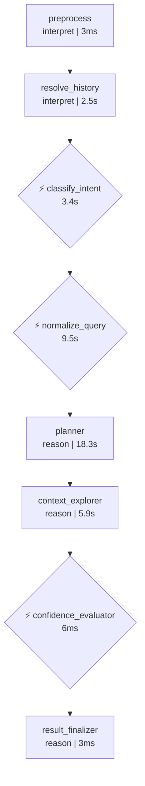

# Pipeline Trace: session-1774867541599

## 1. Executive Summary

**질의**: 1
**결과**: ❌ 실패
**소요**: 39.7s | LLM 6회, 27,955토큰

| 단계 | 결과 |
|------|------|
| 의도 분류 | data_analysis (95%) |
| 질문 정규화 | RANK |
| 준비도 판정 | ask_user (58%) |

## 2. Decision Trail

| # | 노드 | 유형 | 결정 | 확신도 | 근거 |
|--:|------|------|------|-------:|------|
| 1 | classify_intent | intent_classification | data_analysis | 95% | category=DATA_ANALYSIS, 단순 데이터 추출을 넘어 '전월 대비 증감'이라… |
| 2 | normalize_query | normalization | RANK | 0% | entities=['지점'], measures=['순이익', '증감액'], filters=… |
| 3 | batch_interpret | table_comparison | TB_ADW_FIN1319S | 20% | TB_ADW_TRX701L: 통계 테이블이 아닌 원천 거래 로그로, 지점별 집계 시 성능 … |
| 4 | confidence_evaluator | readiness_verdict | ask_user | 58% | knowledge=0/4, tables=9, pending_steps=0 |

## 3. Referenced Information

### embedding_encode

| # | 검색 쿼리 | 결과 수 | 소요시간 |
|--:|-----------|-------:|--------:|
| 1 | 순이익 기준 TOP 10 지점의 순이익 금액과 전월 대비 증감액을 보여줘 | 1 | 416ms |
|   | ↳ dense_dim=1024 |   |   |
|   | ↳ sparse_nnz=18 |   |   |

### reranker

| # | 검색 쿼리 | 결과 수 | 소요시간 |
|--:|-----------|-------:|--------:|
| 1 | 순이익 기준 TOP 10 지점의 순이익 금액과 전월 대비 증감액을 보여줘 | 5 | 11.1s |
|   | ↳ backend=onnx |   |   |
|   | ↳ input=20 |   |   |
|   | ↳ filtered=20 |   |   |

### search_table_meta

| # | 검색 쿼리 | 결과 수 | 소요시간 |
|--:|-----------|-------:|--------:|
| 1 | TB_ADW_TRX701L | 1 | 21ms |
|   | ↳ 결과 1건 수집 (배치 해석 대기) |   |   |
| 2 | TB_ADW_FIN1319S | 1 | 6ms |
|   | ↳ 결과 1건 수집 (배치 해석 대기) |   |   |
| 3 | TB_ADW_FXB534M | 1 | 4ms |
|   | ↳ 결과 1건 수집 (배치 해석 대기) |   |   |
| 4 | TB_ADW_LNB343S | 1 | 4ms |
|   | ↳ 결과 1건 수집 (배치 해석 대기) |   |   |
| 5 | TB_ADW_TRX733S | 1 | 3ms |
|   | ↳ 결과 1건 수집 (배치 해석 대기) |   |   |

### 합계

- 총 검색: 7회 (성공 7, 결과 0건 0)
- 총 소요: 11.6s

## 4. State Evolution

| 노드 | 변경 필드 | 변화 내용 |
|------|----------|----------|
| preprocess | preprocessed_input | → `1` |
|  | status | → `preprocessing` |
| resolve_history | preprocessed_input | → `순이익 기준 TOP 10 지점의 순이익 금액과 전월 대비 증감액을 보여줘` |
|  | awaiting_clarification | → `False` |
|  | clarification_response | → `` |
| classify_intent | intent | → `data_analysis` |
|  | intent_confidence | → `0.95` |
|  | query_category | → `DATA_ANALYSIS` |
|  | status | → `intent_classified` |
| normalize_query | normalized_query | → `original_query='순이익 기준 TOP 10 지점의 순이익 금액…` |
|  | status | → `query_normalized` |
|  | intent | → `clarification_needed` |
| planner | reason | → `phase=<Phase.EXPLORING: 'EXPLORING'> que…` |
| context_explorer | reason | → `phase=<Phase.EXPLORING: 'EXPLORING'> que…` |
| confidence_evaluator | reason | → `phase=<Phase.VERIFYING: 'VERIFYING'> que…` |
| result_finalizer | reason | → `phase=<Phase.DONE: 'DONE'> query_decompo…` |
|  | awaiting_clarification | → `True` |
|  | clarification_turns | → `3` |
|  | clarification_question | → `추가로 다음 항목도 확인이 필요합니다:  1. **ambiguity:순이…` |
|  | formatted_response | → `추가로 다음 항목도 확인이 필요합니다:  1. **ambiguity:순이…` |

## 5. Node Flow

## 6. Performance

### 노드 실행 타이밍

```mermaid
gantt
    title Node Execution Gantt
    dateFormat X
    axisFormat %s

    section 초기 실행
    preprocess : 0, 0.1s
    resolve_history : 0, 2.5s
    classify_intent : 0, 3.4s
    normalize_query : 0, 9.5s
    planner :crit, 0, 18.3s
    context_explorer : 0, 5.9s
    confidence_evaluator : 0, 0.1s
    result_finalizer : 0, 0.1s
```

### LLM 호출 분석

| 노드 | 호출 수 | 토큰 | 소요시간 | 비중 |
|------|-------:|-----:|--------:|-----:|
| normalization_phase1 | 1 | 9,250 | 4.3s | 33% |
| batch_interpret | 1 | 9,002 | 5.8s | 32% |
| planner | 1 | 4,266 | 6.5s | 15% |
| normalization_phase2 | 1 | 2,725 | 5.2s | 10% |
| 이력해소 | 1 | 1,593 | 2.5s | 6% |
| intent_gate | 1 | 1,119 | 3.4s | 4% |
| **합계** | **6** | **27,955** | **27.7s** | 100% |

## 7. Automated Findings

- 🔴 **CRITICAL** [sql_generator] SQL 미생성 — 파이프라인이 SQL 생성에 도달하지 못함
- 🟡 **WARNING** [context_explorer] 응답 지연 5초 초과: reranker(11139ms)
- 🔵 **INFO** [tracker] 내부 이벤트 없는 노드: preprocess, resolve_history, result_finalizer — 추적 누락 가능성

> 합계: CRITICAL 1건, INFO 1건, WARNING 1건

## Appendix: Detailed Timeline

| Seq | Type | Node | Summary | Detail | Duration | Status | State Changes |
|----:|------|------|-------|--------|--------:|--------|---------------|
| 1 | ▶ node_start | preprocess | preprocess 시작 | - | - | - | - |
| 2 | ■ node_end | preprocess | preprocess 완료 | 2개 필드 변경 | 3ms | success | preprocessed_input: 1, status: preproces… |
| 3 | ▶ node_start | resolve_history | resolve_history 시작 | - | - | - | - |
| 4 | 🤖 llm_call | 이력해소 | LLM(gemini-3.1-flash-lite-preview) 1593t… | gemini-3.1-flash-lite-preview 1549+44tok | 2507ms | - | - |
| 5 | ■ node_end | resolve_history | resolve_history 완료 | 3개 필드 변경 | 2513ms | success | preprocessed_input: 순이익 기준 TOP 10 지점의 순이… |
| 6 | ▶ node_start | classify_intent | classify_intent 시작 | - | - | - | - |
| 7 | 🤖 llm_call | intent_gate | LLM(gemini-3.1-flash-lite-preview) 1119t… | gemini-3.1-flash-lite-preview 1065+54tok | 3396ms | - | - |
| 8 |   ⚡ decision | classify_intent | intent_classification: data_analysis |  (95%) category=DATA_ANALYSIS, 단… | - | - | - |
| 9 | ■ node_end | classify_intent | classify_intent 완료 | 4개 필드 변경 | 3412ms | success | intent: data_analysis, intent_confidence… |
| 10 | ▶ node_start | normalize_query | normalize_query 시작 | - | - | - | - |
| 11 | 🤖 llm_call | normalization_phase1 | LLM(gemini-3.1-flash-lite-preview) 9250t… | gemini-3.1-flash-lite-preview 8427+823tok | 4281ms | - | - |
| 12 | 🤖 llm_call | normalization_phase2 | LLM(gemini-3.1-flash-lite-preview) 2725t… | gemini-3.1-flash-lite-preview 1854+871tok | 5206ms | - | - |
| 13 |   ⚡ decision | normalize_query | normalization: RANK |  (0%) entities=['지점'], measures… | - | - | - |
| 14 | ■ node_end | normalize_query | normalize_query 완료 | 3개 필드 변경 | 9494ms | success | normalized_query: original_query='순이익 기준… |
| 15 | ▶ node_start | planner | planner 시작 | - | - | - | - |
| 16 |   🔧 tool_call | planner | embedding_encode: 1건 | embedding_encode: '순이익 기준 TOP 10 지점의 순이익 금액과…' → 1건 | 416ms | success | - |
| 17 |   🔧 tool_call | planner | reranker: 5건 | reranker: '순이익 기준 TOP 10 지점의 순이익 금액과…' → 5건 | 11139ms | success | - |
| 18 |   🤖 llm_call | planner | LLM(gemini-3.1-flash-lite-preview) 4266t… | gemini-3.1-flash-lite-preview 3626+640tok | 6498ms | - | - |
| 19 | ■ node_end | planner | planner 완료 | 1개 필드 변경 | 18332ms | success | reason: phase=<Phase.EXPLORING: 'EXPLORI… |
| 20 | ▶ node_start | context_explorer | context_explorer 시작 | - | - | - | - |
| 21 |   🔧 tool_call | context_explorer | search_table_meta: 1건 | search_table_meta: 'TB_ADW_TRX701L' → 1건 | 21ms | success | - |
| 22 |   🔧 tool_call | context_explorer | search_table_meta: 1건 | search_table_meta: 'TB_ADW_FIN1319S' → 1건 | 6ms | success | - |
| 23 |   🔧 tool_call | context_explorer | search_table_meta: 1건 | search_table_meta: 'TB_ADW_FXB534M' → 1건 | 4ms | success | - |
| 24 |   🔧 tool_call | context_explorer | search_table_meta: 1건 | search_table_meta: 'TB_ADW_LNB343S' → 1건 | 4ms | success | - |
| 25 |   🔧 tool_call | context_explorer | search_table_meta: 1건 | search_table_meta: 'TB_ADW_TRX733S' → 1건 | 3ms | success | - |
| 26 | 🤖 llm_call | batch_interpret | LLM(gemini-3.1-flash-lite-preview) 9002t… | gemini-3.1-flash-lite-preview 7284+1718tok | 5777ms | - | - |
| 27 | ⚡ decision | batch_interpret | table_comparison: TB_ADW_FIN1319S |  (20%) TB_ADW_TRX701L: 통계 테이블이 아… | - | - | - |
| 28 | ■ node_end | context_explorer | context_explorer 완료 | 1개 필드 변경 | 5899ms | success | reason: phase=<Phase.EXPLORING: 'EXPLORI… |
| 29 | ▶ node_start | confidence_evaluator | confidence_evaluator 시작 | - | - | - | - |
| 30 |   ⚡ decision | confidence_evaluator | readiness_verdict: ask_user |  (58%) knowledge=0/4, tables=9, … | - | - | - |
| 31 | ■ node_end | confidence_evaluator | confidence_evaluator 완료 | 1개 필드 변경 | 6ms | success | reason: phase=<Phase.VERIFYING: 'VERIFYI… |
| 32 | ▶ node_start | result_finalizer | result_finalizer 시작 | - | - | - | - |
| 33 | ■ node_end | result_finalizer | result_finalizer 완료 | 5개 필드 변경 | 3ms | success | reason: phase=<Phase.DONE: 'DONE'> query… |
