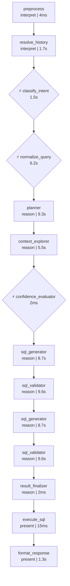

# Pipeline Trace: session-1774867541599

## 1. Executive Summary

**질의**: 그만하자
**결과**: ❌ 실패
**소요**: 45.5s | LLM 10회, 30,933토큰

| 단계 | 결과 |
|------|------|
| 의도 분류 | casual_talk (95%) |
| 질문 정규화 | EXTRACT |
| 준비도 판정 | generate_sql (86%) |
| SQL | 3회 시도, 검증 통과, 실행 성공 (1건) |

## 2. Decision Trail

| # | 노드 | 유형 | 결정 | 확신도 | 근거 |
|--:|------|------|------|-------:|------|
| 1 | classify_intent | intent_classification | casual_talk | 95% | category=CASUAL_TALK, 데이터나 시스템과 관련된 요청이 아니며, 대화를 종… |
| 2 | normalize_query | normalization | EXTRACT | 0% | entities=[], measures=[], filters=0, ambiguities=1 |
| 3 | batch_interpret | table_comparison |  | 0% | TB_ADW_CSC101M: 사용자가 대화 종료를 요청하여 데이터 분석이 필요하지 않음.,… |
| 4 | confidence_evaluator | readiness_verdict | generate_sql | 86% | knowledge=1/1, tables=2, pending_steps=0 |

## 3. Referenced Information

### embedding_encode

| # | 검색 쿼리 | 결과 수 | 소요시간 |
|--:|-----------|-------:|--------:|
| 1 | 그만하자 | 1 | 200ms |
|   | ↳ dense_dim=1024 |   |   |
|   | ↳ sparse_nnz=3 |   |   |

### reranker

| # | 검색 쿼리 | 결과 수 | 소요시간 |
|--:|-----------|-------:|--------:|
| 1 | 그만하자 | 5 | 6.6s |
|   | ↳ backend=onnx |   |   |
|   | ↳ input=20 |   |   |
|   | ↳ filtered=20 |   |   |

### search_table_meta

| # | 검색 쿼리 | 결과 수 | 소요시간 |
|--:|-----------|-------:|--------:|
| 1 | TB_ADW_CSC101M | 1 | 8ms |
|   | ↳ 결과 1건 수집 (배치 해석 대기) |   |   |
| 2 | TB_ADW_CSP103M | 1 | 7ms |
|   | ↳ 결과 1건 수집 (배치 해석 대기) |   |   |

### info_db_execute

| # | 검색 쿼리 | 결과 수 | 소요시간 |
|--:|-----------|-------:|--------:|
| 1 | SELECT '대화 종료' AS 상태, NULL AS 데이터 FROM (SELECT 1 A… | 1 | 7ms |
|   | ↳ 컬럼: 상태, 데이터 |   |   |
|   | ↳ 행 수: 1건 |   |   |
|   | ↳ 소요: 6.7ms |   |   |

### 합계

- 총 검색: 5회 (성공 5, 결과 0건 0)
- 총 소요: 6.9s

## 4. State Evolution

| 노드 | 변경 필드 | 변화 내용 |
|------|----------|----------|
| preprocess | preprocessed_input | → `그만하자` |
|  | status | → `preprocessing` |
| resolve_history | awaiting_clarification | → `False` |
|  | clarification_response | → `` |
|  | clarification_question | → `` |
| classify_intent | intent | → `casual_talk` |
|  | intent_confidence | → `0.95` |
|  | query_category | → `CASUAL_TALK` |
|  | status | → `intent_classified` |
| normalize_query | normalized_query | → `original_query='그만하자' rewritten_query='그…` |
|  | status | → `query_normalized` |
|  | intent | → `clarification_needed` |
| planner | reason | → `phase=<Phase.EXPLORING: 'EXPLORING'> que…` |
| context_explorer | reason | → `phase=<Phase.EXPLORING: 'EXPLORING'> que…` |
| confidence_evaluator | reason | → `phase=<Phase.GENERATING: 'GENERATING'> q…` |
| sql_generator | reason | → `phase=<Phase.GENERATING: 'GENERATING'> q…` |
| sql_validator | reason | → `phase=<Phase.VALIDATING: 'VALIDATING'> q…` |
| sql_generator ② | reason | → `phase=<Phase.GENERATING: 'GENERATING'> q…` |
| sql_validator ② | reason | → `phase=<Phase.VALIDATING: 'VALIDATING'> q…` |
| result_finalizer | reason | → `phase=<Phase.DONE: 'DONE'> query_decompo…` |
|  | context | → `table_metas=[] past_sqls=[] report_sqls=…` |
| execute_sql | sql_result | → `columns=['상태', '데이터'] rows=[{'상태': '대화 종…` |
|  | status | → `executed` |
| format_response | formatted_response | → `요청하신 업무를 종료하며, 대화 결과를 다음과 같이 정리하였습니다.  대…` |
|  | status | → `formatted` |

## 5. Node Flow



## 6. Performance

### 노드 실행 타이밍

```mermaid
gantt
    title Node Execution Gantt
    dateFormat X
    axisFormat %s

    section 초기 실행
    preprocess : 0, 0.1s
    resolve_history : 0, 1.7s
    classify_intent : 0, 1.5s
    normalize_query : 0, 6.2s
    planner : 0, 9.3s
    context_explorer : 0, 5.5s
    confidence_evaluator : 0, 0.1s
    sql_generator : 0, 1.7s
    sql_validator : 0, 0.1s
    sql_generator ② : 0, 8.7s
    sql_validator ② : 0, 9.6s
    result_finalizer : 0, 0.1s
    execute_sql : 0, 0.1s
    format_response : 0, 1.3s
```



### LLM 호출 분석

| 노드 | 호출 수 | 토큰 | 소요시간 | 비중 |
|------|-------:|-----:|--------:|-----:|
| normalization_phase1 | 1 | 8,639 | 2.8s | 28% |
| batch_interpret | 1 | 6,019 | 5.5s | 19% |
| agentic_SQL생성 | 2 | 5,200 | 10.4s | 17% |
| planner | 1 | 3,625 | 2.3s | 12% |
| sql_validator_layer2b | 1 | 2,362 | 9.6s | 8% |
| 이력해소 | 1 | 1,609 | 1.7s | 5% |
| normalization_phase2 | 1 | 1,477 | 3.4s | 5% |
| intent_gate | 1 | 1,094 | 1.4s | 4% |
|  | 1 | 908 | 1.3s | 3% |
| **합계** | **10** | **30,933** | **38.4s** | 100% |

## 7. Automated Findings

- 🟡 **WARNING** [context_explorer] 응답 지연 5초 초과: reranker(6650ms)
- 🟡 **WARNING** [sql_generator] SQL 재생성 2회 — 프롬프트 또는 컨텍스트 품질 점검 필요
- 🔵 **INFO** [tracker] 내부 이벤트 없는 노드: preprocess, resolve_history, sql_generator, sql_validator, sql_generator — 추적 누락 가능성

> 합계: INFO 1건, WARNING 2건

## Appendix: Detailed Timeline

| Seq | Type | Node | Summary | Detail | Duration | Status | State Changes |
|----:|------|------|-------|--------|--------:|--------|---------------|
| 1 | ▶ node_start | preprocess | preprocess 시작 | - | - | - | - |
| 2 | ■ node_end | preprocess | preprocess 완료 | 2개 필드 변경 | 4ms | success | preprocessed_input: 그만하자, status: prepro… |
| 3 | ▶ node_start | resolve_history | resolve_history 시작 | - | - | - | - |
| 4 | 🤖 llm_call | 이력해소 | LLM(gemini-3.1-flash-lite-preview) 1609t… | gemini-3.1-flash-lite-preview 1588+21tok | 1724ms | - | - |
| 5 | ■ node_end | resolve_history | resolve_history 완료 | 3개 필드 변경 | 1730ms | success | awaiting_clarification: False, clarifica… |
| 6 | ▶ node_start | classify_intent | classify_intent 시작 | - | - | - | - |
| 7 | 🤖 llm_call | intent_gate | LLM(gemini-3.1-flash-lite-preview) 1094t… | gemini-3.1-flash-lite-preview 1043+51tok | 1446ms | - | - |
| 8 |   ⚡ decision | classify_intent | intent_classification: casual_talk |  (95%) category=CASUAL_TALK, 데이터… | - | - | - |
| 9 | ■ node_end | classify_intent | classify_intent 완료 | 4개 필드 변경 | 1452ms | success | intent: casual_talk, intent_confidence: … |
| 10 | ▶ node_start | normalize_query | normalize_query 시작 | - | - | - | - |
| 11 | 🤖 llm_call | normalization_phase1 | LLM(gemini-3.1-flash-lite-preview) 8639t… | gemini-3.1-flash-lite-preview 8405+234tok | 2751ms | - | - |
| 12 | 🤖 llm_call | normalization_phase2 | LLM(gemini-3.1-flash-lite-preview) 1477t… | gemini-3.1-flash-lite-preview 1235+242tok | 3444ms | - | - |
| 13 |   ⚡ decision | normalize_query | normalization: EXTRACT |  (0%) entities=[], measures=[],… | - | - | - |
| 14 | ■ node_end | normalize_query | normalize_query 완료 | 3개 필드 변경 | 6205ms | success | normalized_query: original_query='그만하자' … |
| 15 | ▶ node_start | planner | planner 시작 | - | - | - | - |
| 16 |   🔧 tool_call | planner | embedding_encode: 1건 | embedding_encode: '그만하자' → 1건 | 200ms | success | - |
| 17 |   🔧 tool_call | planner | reranker: 5건 | reranker: '그만하자' → 5건 | 6650ms | success | - |
| 18 |   🤖 llm_call | planner | LLM(gemini-3.1-flash-lite-preview) 3625t… | gemini-3.1-flash-lite-preview 3459+166tok | 2270ms | - | - |
| 19 | ■ node_end | planner | planner 완료 | 1개 필드 변경 | 9251ms | success | reason: phase=<Phase.EXPLORING: 'EXPLORI… |
| 20 | ▶ node_start | context_explorer | context_explorer 시작 | - | - | - | - |
| 21 |   🔧 tool_call | context_explorer | search_table_meta: 1건 | search_table_meta: 'TB_ADW_CSC101M' → 1건 | 8ms | success | - |
| 22 |   🔧 tool_call | context_explorer | search_table_meta: 1건 | search_table_meta: 'TB_ADW_CSP103M' → 1건 | 7ms | success | - |
| 23 | 🤖 llm_call | batch_interpret | LLM(gemini-3.1-flash-lite-preview) 6019t… | gemini-3.1-flash-lite-preview 5374+645tok | 5498ms | - | - |
| 24 | ⚡ decision | batch_interpret | table_comparison:  |  (0%) TB_ADW_CSC101M: 사용자가 대화 종… | - | - | - |
| 25 | ■ node_end | context_explorer | context_explorer 완료 | 1개 필드 변경 | 5544ms | success | reason: phase=<Phase.EXPLORING: 'EXPLORI… |
| 26 | ▶ node_start | confidence_evaluator | confidence_evaluator 시작 | - | - | - | - |
| 27 |   ⚡ decision | confidence_evaluator | readiness_verdict: generate_sql |  (86%) knowledge=1/1, tables=2, … | - | - | - |
| 28 | ■ node_end | confidence_evaluator | confidence_evaluator 완료 | 1개 필드 변경 | 2ms | success | reason: phase=<Phase.GENERATING: 'GENERA… |
| 29 | ▶ node_start | sql_generator | sql_generator 시작 | - | - | - | - |
| 30 | 🤖 llm_call | agentic_SQL생성 | LLM(gemini-3.1-flash-lite-preview) 2551t… | gemini-3.1-flash-lite-preview 2514+37tok | 1674ms | - | - |
| 31 | ■ node_end | sql_generator | sql_generator 완료 | 1개 필드 변경 | 1678ms | success | reason: phase=<Phase.GENERATING: 'GENERA… |
| 32 | ▶ node_start | sql_validator | sql_validator 시작 | - | - | - | - |
| 33 | ■ node_end | sql_validator | sql_validator 완료 | 1개 필드 변경 | 3ms | success | reason: phase=<Phase.VALIDATING: 'VALIDA… |
| 34 | ▶ node_start | sql_generator | sql_generator 시작 | - | - | - | - |
| 35 | 🤖 llm_call | agentic_SQL생성 | LLM(gemini-3.1-flash-lite-preview) 2649t… | gemini-3.1-flash-lite-preview 2588+61tok | 8711ms | - | - |
| 36 | ■ node_end | sql_generator | sql_generator 완료 | 1개 필드 변경 | 8716ms | success | reason: phase=<Phase.GENERATING: 'GENERA… |
| 37 | ▶ node_start | sql_validator | sql_validator 시작 | - | - | - | - |
| 38 | 🤖 llm_call | sql_validator_layer2b | LLM(gemini-3.1-flash-lite-preview) 2362t… | gemini-3.1-flash-lite-preview 2102+260tok | 9592ms | - | - |
| 39 | ■ node_end | sql_validator | sql_validator 완료 | 1개 필드 변경 | 9608ms | success | reason: phase=<Phase.VALIDATING: 'VALIDA… |
| 40 | ▶ node_start | result_finalizer | result_finalizer 시작 | - | - | - | - |
| 41 | ■ node_end | result_finalizer | result_finalizer 완료 | 2개 필드 변경 | 2ms | success | reason: phase=<Phase.DONE: 'DONE'> query… |
| 42 | ▶ node_start | execute_sql | execute_sql 시작 | - | - | - | - |
| 43 |   🔧 tool_call | execute_sql | info_db_execute: 1건 | info_db_execute: 'SELECT '대화 종료' AS 상태, NUL…' → 1건 | 7ms | success | - |
| 44 | ■ node_end | execute_sql | execute_sql 완료 | 2개 필드 변경 | 15ms | success | sql_result: columns=['상태', '데이터'] rows=[… |
| 45 | ▶ node_start | format_response | format_response 시작 | - | - | - | - |
| 46 | 🤖 llm_call |  | LLM(gemini-3.1-flash-lite-preview) 908to… | gemini-3.1-flash-lite-preview 824+84tok | 1262ms | - | - |
| 47 | ■ node_end | format_response | format_response 완료 | 2개 필드 변경 | 1265ms | success | formatted_response: 요청하신 업무를 종료하며, 대화 결과… |

## Appendix: Generated SQL

```sql
SELECT '대화 종료' AS 상태, NULL AS 데이터 FROM (SELECT 1 AS ID) T LIMIT 1
```
