# Pipeline Trace: tracking-e2e-test-002

## 1. Executive Summary

**질의**: 이번 달 신규 고객 수 알려줘
**결과**: ❌ 실패 (6회 재탐색 후 최대 시도 횟수 초과) — SQL 생성 실패
시도한 접근 방식:
  - [FailureType.TERM_UNRESOLVABLE] SQL 생성에 필요한 정보가 부족합니다.
- 확정된 지식: 2/3건
- 후보 
**소요**: 47.1s | LLM 10회, 71,777토큰

| 단계 | 결과 |
|------|------|
| 의도 분류 | data_extraction (95%) |
| 질문 정규화 | EXTRACT |
| 준비도 판정 | generate_sql (72%) |
| 실패 원인 | SQL 생성 실패 시도한 접근 방식:   - [FailureType.TERM_UNRESOLVABLE] SQL 생성에 필요한 정보가 부족합니다. … |

## 2. Decision Trail

| # | 노드 | 유형 | 결정 | 확신도 | 근거 |
|--:|------|------|------|-------:|------|
| 1 | classify_intent | intent_classification | data_extraction | 95% | category=DATA_EXTRACTION, 구체적인 엔티티(신규 고객)와 수치(수)를 … |
| 2 | normalize_query | normalization | EXTRACT | 0% | entities=['고객'], measures=['신규 고객 수'], filters=1, … |
| 3 | batch_interpret | table_comparison | TB_CUST_INFO | 17% | TB_LOAN_INFO: 대출 정보 테이블로 고객의 등록 시점과는 무관함, TB_DEPOS… |
| 4 | confidence_evaluator | readiness_verdict | replan | 68% | knowledge=2/3, tables=5, pending_steps=0 |
| 5 | batch_interpret | table_comparison | TB_CUST_INFO | 17% | TB_LOAN_INFO: 여신(대출) 정보로 고객 등록과는 무관함, TB_DEPOSIT_I… |
| 6 | confidence_evaluator | readiness_verdict | replan | 72% | knowledge=3/4, tables=6, pending_steps=0 |
| 7 | confidence_evaluator | readiness_verdict | generate_sql | 68% | knowledge=3/6, tables=6, pending_steps=0 |
| 8 | batch_interpret | table_comparison | TB_CUST_INFO | 17% | TB_LOAN_INFO: 대출 정보 테이블로 고객 가입 시점과는 무관함, TB_DEPOSI… |
| 9 | confidence_evaluator | readiness_verdict | generate_sql | 72% | knowledge=5/8, tables=8, pending_steps=0 |

> 총 7개 사이클 감지됨 (recovery_planner 6회 호출)

## 3. Referenced Information

### search_table_meta

| # | 검색 쿼리 | 결과 수 | 소요시간 |
|--:|-----------|-------:|--------:|
| 1 | TB_ADW_CSC101M | 6 | 0ms |
|   | ↳ 결과 6건 수집 (배치 해석 대기) |   |   |
| 2 | TB_ADW_LNB301M | 6 | 0ms |
|   | ↳ 결과 6건 수집 (배치 해석 대기) |   |   |
| 3 | TB_ADW_DEP201P | 6 | 0ms |
|   | ↳ 결과 6건 수집 (배치 해석 대기) |   |   |
| 4 | TB_CUST_INFO | 1 | 0ms |
|   | ↳ 결과 1건 수집 (배치 해석 대기) |   |   |
| 5 | TB_LOAN_INFO | 1 | 0ms |
|   | ↳ 결과 1건 수집 (배치 해석 대기) |   |   |
| 6 | TB_DEPOSIT_INFO | 1 | 0ms |
|   | ↳ 결과 1건 수집 (배치 해석 대기) |   |   |
| 7 | 신규 판별 컬럼 | 6 | 0ms |
|   | ↳ 결과 6건 수집 (배치 해석 대기) |   |   |
| 8 | 고객 신규 가입 | 3 | 0ms |
|   | ↳ 결과 3건 수집 (배치 해석 대기) |   |   |
| 9 | 통합고객 고객마스터 | 6 | 0ms |
|   | ↳ 결과 6건 수집 (배치 해석 대기) |   |   |

### search_use_cases

| # | 검색 쿼리 | 결과 수 | 소요시간 |
|--:|-----------|-------:|--------:|
| 1 | TB_CUST_INFO 테이블의 컬럼명과 메타 정보를 직접 조회 | 5 | 0ms |
|   | ↳ 결과 5건 수집 (배치 해석 대기) |   |   |
| 2 | 신규 고객 수 집계 | 5 | 0ms |
|   | ↳ 결과 5건 수집 (배치 해석 대기) |   |   |

### get_date_distribution

| # | 검색 쿼리 | 결과 수 | 소요시간 |
|--:|-----------|-------:|--------:|
| 1 | TB_CUST_INFO,REG_DT | 0 | 0ms |
|   | ↳ 결과 0건 수집 (배치 해석 대기) |   |   |

### search_manual

| # | 검색 쿼리 | 결과 수 | 소요시간 |
|--:|-----------|-------:|--------:|
| 1 | 신규 고객 정의 | 1 | 0ms |
|   | ↳ 결과 1건 수집 (배치 해석 대기) |   |   |
| 2 | 고객 상태 코드 | 1 | 0ms |
|   | ↳ 결과 1건 수집 (배치 해석 대기) |   |   |

### get_sample_rows

| # | 검색 쿼리 | 결과 수 | 소요시간 |
|--:|-----------|-------:|--------:|
| 1 | TB_CUST_INFO | 0 | 0ms |
|   | ↳ 결과 0건 수집 (배치 해석 대기) |   |   |

### 합계

- 총 검색: 15회 (성공 13, 결과 0건 2)
- 총 소요: 0ms

## 4. State Evolution

| 노드 | 변경 필드 | 변화 내용 |
|------|----------|----------|
| preprocess | - | (변화 없음) |
| preprocess ② | preprocessed_input | → `이번 달 신규 고객 수 알려줘` |
|  | status | → `preprocessing` |
| resolve_history | - | (변화 없음) |
| resolve_history ② | - | (변화 없음) |
| classify_intent | - | (변화 없음) |
| classify_intent ② | intent | → `data_extraction` |
|  | intent_confidence | → `0.95` |
|  | query_category | → `DATA_EXTRACTION` |
|  | status | → `intent_classified` |
| normalize_query | - | (변화 없음) |
| normalize_query ② | normalized_query | → `original_query='이번 달 신규 고객 수 알려줘' rewrit…` |
|  | status | → `query_normalized` |
| planner | - | (변화 없음) |
| planner ② | reason | → `phase=<Phase.EXPLORING: 'EXPLORING'> que…` |
| context_explorer | reason | → `phase=<Phase.EXPLORING: 'EXPLORING'> que…` |
| confidence_evaluator | - | (변화 없음) |
| confidence_evaluator ② | reason | → `phase=<Phase.REPLANNING: 'REPLANNING'> q…` |
| recovery_planner | - | (변화 없음) |
| recovery_planner ② | reason | → `phase=<Phase.EXPLORING: 'EXPLORING'> que…` |
| context_explorer ② | reason | → `phase=<Phase.EXPLORING: 'EXPLORING'> que…` |
| confidence_evaluator ③ | - | (변화 없음) |
| confidence_evaluator ④ | reason | → `phase=<Phase.REPLANNING: 'REPLANNING'> q…` |
| recovery_planner ③ | - | (변화 없음) |
| recovery_planner ④ | reason | → `phase=<Phase.EXPLORING: 'EXPLORING'> que…` |
| context_explorer ③ | reason | → `phase=<Phase.EXPLORING: 'EXPLORING'> que…` |
| confidence_evaluator ⑤ | - | (변화 없음) |
| confidence_evaluator ⑥ | reason | → `phase=<Phase.GENERATING: 'GENERATING'> q…` |
| recovery_planner ⑤ | - | (변화 없음) |
| recovery_planner ⑥ | reason | → `phase=<Phase.EXPLORING: 'EXPLORING'> que…` |
| context_explorer ④ | reason | → `phase=<Phase.EXPLORING: 'EXPLORING'> que…` |
| confidence_evaluator ⑦ | - | (변화 없음) |
| confidence_evaluator ⑧ | reason | → `phase=<Phase.GENERATING: 'GENERATING'> q…` |
| result_finalizer | - | (변화 없음) |
| result_finalizer ② | reason | → `phase=<Phase.DONE: 'DONE'> query_decompo…` |
|  | error_message | → `SQL 생성 실패 시도한 접근 방식:   - [FailureType.TE…` |
|  | status | → `error` |
| error_end | formatted_response | → `죄송합니다. SQL 생성 실패 시도한 접근 방식:   - [Failure…` |
|  | status | → `error` |

## 5. Node Flow

```mermaid
flowchart TD
    subgraph cycle0["초기 실행"]
    n1["preprocess<br/>interpret | 0ms"]
    n2["preprocess<br/>interpret | 0ms"]
    n1 --> n2
    n3["resolve_history<br/>interpret | 0ms"]
    n2 --> n3
    n4["resolve_history<br/>interpret | 0ms"]
    n3 --> n4
    n5{⚡ {node}<br/>{dur_text}}
    n4 --> n5
    n6{⚡ {node}<br/>{dur_text}}
    n5 --> n6
    n7{⚡ {node}<br/>{dur_text}}
    n6 --> n7
    n8{⚡ {node}<br/>{dur_text}}
    n7 --> n8
    n9["planner<br/>reason | 0ms"]
    n8 --> n9
    n10["planner<br/>reason | 0ms"]
    n9 --> n10
    n11["context_explorer<br/>reason | 5.4s"]
    n10 --> n11
    n12{⚡ {node}<br/>{dur_text}}
    n11 --> n12
    n13{⚡ {node}<br/>{dur_text}}
    n12 --> n13
    n14["recovery_planner<br/>reason | 0ms"]
    n13 --> n14
    end
    subgraph cycle1["재시도 ①"]
    n15["recovery_planner<br/>reason | 0ms"]
    end
    subgraph cycle2["재시도 ②"]
    n16["context_explorer<br/>reason | 5.4s"]
    n17{⚡ {node}<br/>{dur_text}}
    n16 --> n17
    n18{⚡ {node}<br/>{dur_text}}
    n17 --> n18
    n19["recovery_planner<br/>reason | 0ms"]
    n18 --> n19
    end
    subgraph cycle3["재시도 ③"]
    n20["recovery_planner<br/>reason | 0ms"]
    end
    subgraph cycle4["재시도 ④"]
    n21["context_explorer<br/>reason | 5.4s"]
    n22{⚡ {node}<br/>{dur_text}}
    n21 --> n22
    n23{⚡ {node}<br/>{dur_text}}
    n22 --> n23
    n24["recovery_planner<br/>reason | 0ms"]
    n23 --> n24
    end
    subgraph cycle5["재시도 ⑤"]
    n25["recovery_planner<br/>reason | 0ms"]
    end
    subgraph cycle6["재시도 ⑥"]
    n26["context_explorer<br/>reason | 5.4s"]
    n27{⚡ {node}<br/>{dur_text}}
    n26 --> n27
    n28{⚡ {node}<br/>{dur_text}}
    n27 --> n28
    n29["result_finalizer<br/>reason | 0ms"]
    n28 --> n29
    n30["result_finalizer<br/>reason | 0ms"]
    n29 --> n30
    n31["error_end<br/>? | 0ms"]
    n30 --> n31
    end
    n14 -.->|재시도| n15
    n15 -.->|재시도| n16
    n19 -.->|재시도| n20
    n20 -.->|재시도| n21
    n24 -.->|재시도| n25
    n25 -.->|재시도| n26
```

## 6. Performance

### 노드 실행 타이밍

```mermaid
gantt
    title Node Execution Gantt
    dateFormat X
    axisFormat %s

    section 초기 실행
    preprocess : 0, 0.1s
    preprocess ② : 0, 0.1s
    resolve_history : 0, 0.1s
    resolve_history ② : 0, 0.1s
    classify_intent : 0, 0.1s
    classify_intent ② : 0, 0.1s
    normalize_query : 0, 0.1s
    normalize_query ② : 0, 0.1s
    planner : 0, 0.1s
    planner ② : 0, 0.1s
    context_explorer : 0, 3.7s
    confidence_evaluator : 0, 0.1s
    confidence_evaluator ② : 0, 0.1s
    recovery_planner : 0, 0.1s
    section 재시도 ①
    recovery_planner ② : 0, 0.1s
    section 재시도 ②
    context_explorer ② : 0, 6.5s
    confidence_evaluator ③ : 0, 0.1s
    confidence_evaluator ④ : 0, 0.1s
    recovery_planner ③ : 0, 0.1s
    section 재시도 ③
    recovery_planner ④ : 0, 0.1s
    section 재시도 ④
    context_explorer ③ : 0, 5.8s
    confidence_evaluator ⑤ : 0, 0.1s
    confidence_evaluator ⑥ : 0, 0.1s
    recovery_planner ⑤ : 0, 0.1s
    section 재시도 ⑤
    recovery_planner ⑥ : 0, 0.1s
    section 재시도 ⑥
    context_explorer ④ : 0, 5.4s
    confidence_evaluator ⑦ : 0, 0.1s
    confidence_evaluator ⑧ : 0, 0.1s
    result_finalizer : 0, 0.1s
    result_finalizer ② : 0, 0.1s
    error_end : 0, 0.1s
```



### LLM 호출 분석

| 노드 | 호출 수 | 토큰 | 소요시간 | 비중 |
|------|-------:|-----:|--------:|-----:|
| batch_interpret | 4 | 47,875 | 21.4s | 67% |
| normalization_phase1 | 1 | 8,796 | 3.5s | 12% |
| recovery_planner | 2 | 7,964 | 14.4s | 11% |
| planner | 1 | 4,130 | 3.7s | 6% |
| normalization_phase2 | 1 | 1,903 | 2.0s | 3% |
| intent_gate | 1 | 1,109 | 1.5s | 2% |
| **합계** | **10** | **71,777** | **46.5s** | 100% |

## 7. Automated Findings

- 🔴 **CRITICAL** [sql_generator] SQL 미생성 — 파이프라인이 SQL 생성에 도달하지 못함
- 🟡 **WARNING** [context_explorer] 검색 결과 0건인 도구: get_date_distribution, get_sample_rows — 검색 키워드 또는 메타 데이터 점검 필요
- 🟡 **WARNING** [pipeline] LLM 응답 10초 초과: 1건 — Thinking 모드 비활성화 고려
- 🟡 **WARNING** [recovery_planner] 재계획 6회 — 초기 가설 품질 또는 메타 부족 가능성
- 🔵 **INFO** [tracker] 내부 이벤트 없는 노드: preprocess, preprocess, resolve_history, resolve_history, result_finalizer — 추적 누락 가능성

> 합계: CRITICAL 1건, INFO 1건, WARNING 3건

## Appendix: Detailed Timeline

| Seq | Type | Node | Summary | Detail | Duration | Status | State Changes |
|----:|------|------|-------|--------|--------:|--------|---------------|
| 1 | ▶ node_start | preprocess | preprocess 시작 | - | - | - | - |
| 2 | ▶ node_start | preprocess | preprocess 시작 | - | - | - | - |
| 3 | ■ node_end | preprocess | preprocess 완료 | - | 2ms | success | - |
| 4 | ■ node_end | preprocess | preprocess 완료 | 2개 필드 변경 | - | success | preprocessed_input: 이번 달 신규 고객 수 알려줘, st… |
| 5 | ▶ node_start | resolve_history | resolve_history 시작 | - | - | - | - |
| 6 | ▶ node_start | resolve_history | resolve_history 시작 | - | - | - | - |
| 7 | ■ node_end | resolve_history | resolve_history 완료 | - | 0ms | success | - |
| 8 | ■ node_end | resolve_history | resolve_history 완료 | - | - | success | - |
| 9 | ▶ node_start | classify_intent | classify_intent 시작 | - | - | - | - |
| 10 | 🤖 llm_call | intent_gate | LLM(gemini-3.1-flash-lite-preview) 1109t… | gemini-3.1-flash-lite-preview 1048+61tok | 1450ms | - | - |
| 11 |   ⚡ decision | classify_intent | intent_classification: data_extraction |  (95%) category=DATA_EXTRACTION,… | - | - | - |
| 12 | ▶ node_start | classify_intent | classify_intent 시작 | - | - | - | - |
| 13 | ■ node_end | classify_intent | classify_intent 완료 | - | 1ms | success | - |
| 14 | ■ node_end | classify_intent | classify_intent 완료 | 4개 필드 변경 | - | success | intent: data_extraction, intent_confiden… |
| 15 | ▶ node_start | normalize_query | normalize_query 시작 | - | - | - | - |
| 16 | 🤖 llm_call | normalization_phase1 | LLM(gemini-3.1-flash-lite-preview) 8796t… | gemini-3.1-flash-lite-preview 8410+386tok | 3492ms | - | - |
| 17 | 🤖 llm_call | normalization_phase2 | LLM(gemini-3.1-flash-lite-preview) 1903t… | gemini-3.1-flash-lite-preview 1392+511tok | 1989ms | - | - |
| 18 |   ⚡ decision | normalize_query | normalization: EXTRACT |  (0%) entities=['고객'], measures… | - | - | - |
| 19 | ▶ node_start | normalize_query | normalize_query 시작 | - | - | - | - |
| 20 | ■ node_end | normalize_query | normalize_query 완료 | - | 0ms | success | - |
| 21 | ■ node_end | normalize_query | normalize_query 완료 | 2개 필드 변경 | - | success | normalized_query: original_query='이번 달 신… |
| 22 | ▶ node_start | planner | planner 시작 | - | - | - | - |
| 23 |   🤖 llm_call | planner | LLM(gemini-3.1-flash-lite-preview) 4130t… | gemini-3.1-flash-lite-preview 3585+545tok | 3712ms | - | - |
| 24 | ▶ node_start | planner | planner 시작 | - | - | - | - |
| 25 | ■ node_end | planner | planner 완료 | - | 0ms | success | - |
| 26 | ■ node_end | planner | planner 완료 | 1개 필드 변경 | - | success | reason: phase=<Phase.EXPLORING: 'EXPLORI… |
| 27 | ▶ node_start | context_explorer | context_explorer 시작 | - | - | - | - |
| 28 |   🔧 tool_call | context_explorer | search_table_meta: 6건 | search_table_meta: 'TB_ADW_CSC101M' → 6건 | - | success | - |
| 29 |   🔧 tool_call | context_explorer | search_table_meta: 6건 | search_table_meta: 'TB_ADW_LNB301M' → 6건 | - | success | - |
| 30 |   🔧 tool_call | context_explorer | search_table_meta: 6건 | search_table_meta: 'TB_ADW_DEP201P' → 6건 | - | success | - |
| 31 |   🔧 tool_call | context_explorer | search_table_meta: 1건 | search_table_meta: 'TB_CUST_INFO' → 1건 | - | success | - |
| 32 |   🔧 tool_call | context_explorer | search_table_meta: 1건 | search_table_meta: 'TB_LOAN_INFO' → 1건 | - | success | - |
| 33 |   🔧 tool_call | context_explorer | search_table_meta: 1건 | search_table_meta: 'TB_DEPOSIT_INFO' → 1건 | - | success | - |
| 34 | 🤖 llm_call | batch_interpret | LLM(gemini-3.1-flash-lite-preview) 18576… | gemini-3.1-flash-lite-preview 17395+1181tok | 3710ms | - | - |
| 35 | ⚡ decision | batch_interpret | table_comparison: TB_CUST_INFO |  (17%) TB_LOAN_INFO: 대출 정보 테이블로 … | - | - | - |
| 36 | ■ node_end | context_explorer | context_explorer 완료 | 1개 필드 변경 | 3717ms | success | reason: phase=<Phase.EXPLORING: 'EXPLORI… |
| 37 | ▶ node_start | confidence_evaluator | confidence_evaluator 시작 | - | - | - | - |
| 38 |   ⚡ decision | confidence_evaluator | readiness_verdict: replan |  (68%) knowledge=2/3, tables=5, … | - | - | - |
| 39 | ▶ node_start | confidence_evaluator | confidence_evaluator 시작 | - | - | - | - |
| 40 | ■ node_end | confidence_evaluator | confidence_evaluator 완료 | - | 0ms | success | - |
| 41 | ■ node_end | confidence_evaluator | confidence_evaluator 완료 | 1개 필드 변경 | - | success | reason: phase=<Phase.REPLANNING: 'REPLAN… |
| 42 | ▶ node_start | recovery_planner | recovery_planner 시작 | - | - | - | - |
| 43 | ▶ node_start | recovery_planner | recovery_planner 시작 | - | - | - | - |
| 44 | ■ node_end | recovery_planner | recovery_planner 완료 | - | 0ms | success | - |
| 45 | ■ node_end | recovery_planner | recovery_planner 완료 | 1개 필드 변경 | - | success | reason: phase=<Phase.EXPLORING: 'EXPLORI… |
| 46 | ▶ node_start | context_explorer | context_explorer 시작 | - | - | - | - |
| 47 |   🔧 tool_call | context_explorer | search_table_meta: 6건 | search_table_meta: '신규 판별 컬럼' → 6건 | - | success | - |
| 48 |   🔧 tool_call | context_explorer | search_use_cases: 5건 | search_use_cases: 'TB_CUST_INFO 테이블의 컬럼명과 메타…' → 5건 | - | success | - |
| 49 | 🤖 llm_call | batch_interpret | LLM(gemini-3.1-flash-lite-preview) 10053… | gemini-3.1-flash-lite-preview 9200+853tok | 6525ms | - | - |
| 50 | ⚡ decision | batch_interpret | table_comparison: TB_CUST_INFO |  (17%) TB_LOAN_INFO: 여신(대출) 정보로 … | - | - | - |
| 51 | ■ node_end | context_explorer | context_explorer 완료 | 1개 필드 변경 | 6528ms | success | reason: phase=<Phase.EXPLORING: 'EXPLORI… |
| 52 | ▶ node_start | confidence_evaluator | confidence_evaluator 시작 | - | - | - | - |
| 53 |   ⚡ decision | confidence_evaluator | readiness_verdict: replan |  (72%) knowledge=3/4, tables=6, … | - | - | - |
| 54 | ▶ node_start | confidence_evaluator | confidence_evaluator 시작 | - | - | - | - |
| 55 | ■ node_end | confidence_evaluator | confidence_evaluator 완료 | - | 0ms | success | - |
| 56 | ■ node_end | confidence_evaluator | confidence_evaluator 완료 | 1개 필드 변경 | - | success | reason: phase=<Phase.REPLANNING: 'REPLAN… |
| 57 | ▶ node_start | recovery_planner | recovery_planner 시작 | - | - | - | - |
| 58 |   🤖 llm_call | recovery_planner | LLM(gemini-3.1-flash-lite-preview) 3791t… | gemini-3.1-flash-lite-preview 3302+489tok | 3433ms | - | - |
| 59 | ▶ node_start | recovery_planner | recovery_planner 시작 | - | - | - | - |
| 60 | ■ node_end | recovery_planner | recovery_planner 완료 | - | 0ms | success | - |
| 61 | ■ node_end | recovery_planner | recovery_planner 완료 | 1개 필드 변경 | - | success | reason: phase=<Phase.EXPLORING: 'EXPLORI… |
| 62 | ▶ node_start | context_explorer | context_explorer 시작 | - | - | - | - |
| 63 |   🔧 tool_call | context_explorer | get_date_distribution: 0건 | get_date_distribution: 'TB_CUST_INFO,REG_DT' → 0건 | 0ms | success | - |
| 64 |   🔧 tool_call | context_explorer | search_manual: 1건 | search_manual: '신규 고객 정의' → 1건 | - | success | - |
| 65 |   🔧 tool_call | context_explorer | get_sample_rows: 0건 | get_sample_rows: 'TB_CUST_INFO' → 0건 | 0ms | success | - |
| 66 | 🤖 llm_call | batch_interpret | LLM(gemini-3.1-flash-lite-preview) 6403t… | gemini-3.1-flash-lite-preview 5623+780tok | 5778ms | - | - |
| 67 | ■ node_end | context_explorer | context_explorer 완료 | 1개 필드 변경 | 5781ms | success | reason: phase=<Phase.EXPLORING: 'EXPLORI… |
| 68 | ▶ node_start | confidence_evaluator | confidence_evaluator 시작 | - | - | - | - |
| 69 |   ⚡ decision | confidence_evaluator | readiness_verdict: generate_sql |  (68%) knowledge=3/6, tables=6, … | - | - | - |
| 70 | ▶ node_start | confidence_evaluator | confidence_evaluator 시작 | - | - | - | - |
| 71 | ■ node_end | confidence_evaluator | confidence_evaluator 완료 | - | 2ms | success | - |
| 72 | ■ node_end | confidence_evaluator | confidence_evaluator 완료 | 1개 필드 변경 | - | success | reason: phase=<Phase.GENERATING: 'GENERA… |
| 73 | ▶ node_start | recovery_planner | recovery_planner 시작 | - | - | - | - |
| 74 |   🤖 llm_call | recovery_planner | LLM(gemini-3.1-flash-lite-preview) 4173t… | gemini-3.1-flash-lite-preview 3644+529tok | 10989ms | - | - |
| 75 | ▶ node_start | recovery_planner | recovery_planner 시작 | - | - | - | - |
| 76 | ■ node_end | recovery_planner | recovery_planner 완료 | - | 1ms | success | - |
| 77 | ■ node_end | recovery_planner | recovery_planner 완료 | 1개 필드 변경 | - | success | reason: phase=<Phase.EXPLORING: 'EXPLORI… |
| 78 | ▶ node_start | context_explorer | context_explorer 시작 | - | - | - | - |
| 79 |   🔧 tool_call | context_explorer | search_table_meta: 3건 | search_table_meta: '고객 신규 가입' → 3건 | 0ms | success | - |
| 80 |   🔧 tool_call | context_explorer | search_table_meta: 6건 | search_table_meta: '통합고객 고객마스터' → 6건 | - | success | - |
| 81 |   🔧 tool_call | context_explorer | search_use_cases: 5건 | search_use_cases: '신규 고객 수 집계' → 5건 | - | success | - |
| 82 |   🔧 tool_call | context_explorer | search_manual: 1건 | search_manual: '고객 상태 코드' → 1건 | - | success | - |
| 83 | 🤖 llm_call | batch_interpret | LLM(gemini-3.1-flash-lite-preview) 12843… | gemini-3.1-flash-lite-preview 11670+1173tok | 5423ms | - | - |
| 84 | ⚡ decision | batch_interpret | table_comparison: TB_CUST_INFO |  (17%) TB_LOAN_INFO: 대출 정보 테이블로 … | - | - | - |
| 85 | ■ node_end | context_explorer | context_explorer 완료 | 1개 필드 변경 | 5427ms | success | reason: phase=<Phase.EXPLORING: 'EXPLORI… |
| 86 | ▶ node_start | confidence_evaluator | confidence_evaluator 시작 | - | - | - | - |
| 87 |   ⚡ decision | confidence_evaluator | readiness_verdict: generate_sql |  (72%) knowledge=5/8, tables=8, … | - | - | - |
| 88 | ▶ node_start | confidence_evaluator | confidence_evaluator 시작 | - | - | - | - |
| 89 | ■ node_end | confidence_evaluator | confidence_evaluator 완료 | - | 0ms | success | - |
| 90 | ■ node_end | confidence_evaluator | confidence_evaluator 완료 | 1개 필드 변경 | - | success | reason: phase=<Phase.GENERATING: 'GENERA… |
| 91 | ▶ node_start | result_finalizer | result_finalizer 시작 | - | - | - | - |
| 92 | ▶ node_start | result_finalizer | result_finalizer 시작 | - | - | - | - |
| 93 | ■ node_end | result_finalizer | result_finalizer 완료 | - | 0ms | success | - |
| 94 | ■ node_end | result_finalizer | result_finalizer 완료 | 3개 필드 변경 | - | success | reason: phase=<Phase.DONE: 'DONE'> query… |
| 95 | ▶ node_start | error_end | error_end 시작 | - | - | - | - |
| 96 | ■ node_end | error_end | error_end 완료 | 2개 필드 변경 | 0ms | success | formatted_response: 죄송합니다. SQL 생성 실패 시도한… |
