# Pipeline Trace: tracking-e2e-test-003

## 1. Executive Summary

**질의**: 이번 달 신규 고객 수 알려줘
**결과**: ❌ 실패 (3회 재탐색 후 최대 시도 횟수 초과) — SQL 생성 실패
시도한 접근 방식:
  - [FailureType.TERM_UNRESOLVABLE] SQL 생성에 필요한 정보가 부족합니다.
- 확정된 지식: 2/3건
- 후보 
**소요**: 37.3s | LLM 10회, 67,118토큰

| 단계 | 결과 |
|------|------|
| 의도 분류 | data_extraction (95%) |
| 질문 정규화 | EXTRACT |
| 준비도 판정 | generate_sql (70%) |
| 실패 원인 | SQL 생성 실패 시도한 접근 방식:   - [FailureType.TERM_UNRESOLVABLE] SQL 생성에 필요한 정보가 부족합니다. … |

## 2. Decision Trail

| # | 노드 | 유형 | 결정 | 확신도 | 근거 |
|--:|------|------|------|-------:|------|
| 1 | classify_intent | intent_classification | data_extraction | 95% | category=DATA_EXTRACTION, 특정 비즈니스 엔티티(신규 고객)에 대해 수… |
| 2 | normalize_query | normalization | EXTRACT | 0% | entities=['고객'], measures=['신규 고객 수'], filters=0, … |
| 3 | batch_interpret | table_comparison | TB_CUST_INFO | 17% | TB_LOAN_INFO: 대출 정보 테이블로 신규 고객 집계와 무관함., TB_DEPOSI… |
| 4 | confidence_evaluator | readiness_verdict | replan | 68% | knowledge=2/3, tables=5, pending_steps=0 |
| 5 | batch_interpret | table_comparison | TB_CUST_INFO | 33% | TB_LOAN_INFO: 대출 실행 내역 위주의 테이블로 전체 고객의 신규 가입 여부를 판… |
| 6 | confidence_evaluator | readiness_verdict | replan | 72% | knowledge=3/4, tables=6, pending_steps=0 |
| 7 | batch_interpret | table_comparison |  | 0% | DW.TB_CUST_INFO: 해당 테이블의 데이터 조회 및 샘플 확인이 불가하여 질의 수… |
| 8 | confidence_evaluator | readiness_verdict | generate_sql | 64% | knowledge=3/5, tables=6, pending_steps=0 |
| 9 | batch_interpret | table_comparison | TB_CUST_INFO | 33% | TB_LOAN_INFO: 여신(대출) 정보 테이블로, 고객 전체 등록 현황과는 무관함, T… |
| 10 | confidence_evaluator | readiness_verdict | generate_sql | 70% | knowledge=4/7, tables=7, pending_steps=0 |

> 총 4개 사이클 감지됨 (recovery_planner 3회 호출)

## 3. Referenced Information

### search_table_meta

| # | 검색 쿼리 | 결과 수 | 소요시간 |
|--:|-----------|-------:|--------:|
| 1 | TB_ADW_CSC101M | 6 | 0ms |
|   | ↳ 결과 6건 수집 (배치 해석 대기) |   |   |
| 2 | TB_ADW_LNB301M | 6 | 0ms |
|   | ↳ 결과 6건 수집 (배치 해석 대기) |   |   |
| 3 | TB_ADW_DEP201P | 6 | 0ms |
|   | ↳ 결과 6건 수집 (배치 해석 대기) |   |   |
| 4 | TB_CUST_INFO | 1 | 0ms |
|   | ↳ 결과 1건 수집 (배치 해석 대기) |   |   |
| 5 | TB_LOAN_INFO | 1 | 0ms |
|   | ↳ 결과 1건 수집 (배치 해석 대기) |   |   |
| 6 | TB_DEPOSIT_INFO | 1 | 0ms |
|   | ↳ 결과 1건 수집 (배치 해석 대기) |   |   |
| 7 | TB_LOAN_OVERDUE_STAT | 1 | 0ms |
|   | ↳ 결과 1건 수집 (배치 해석 대기) |   |   |
| 8 | 고객 가입일 관련 컬럼 | 3 | 0ms |
|   | ↳ 결과 3건 수집 (배치 해석 대기) |   |   |
| 9 | 고객 개설 신규 가입 | 3 | 0ms |
|   | ↳ 결과 3건 수집 (배치 해석 대기) |   |   |

### search_use_cases

| # | 검색 쿼리 | 결과 수 | 소요시간 |
|--:|-----------|-------:|--------:|
| 1 | 고객 정보 관련 테이블의 컬럼 리스트를 검색하여 가입일 관련 컬럼 식별 | 5 | 0ms |
|   | ↳ 결과 5건 수집 (배치 해석 대기) |   |   |
| 2 | 신규 고객 수 집계 | 5 | 0ms |
|   | ↳ 결과 5건 수집 (배치 해석 대기) |   |   |

### search_manual

| # | 검색 쿼리 | 결과 수 | 소요시간 |
|--:|-----------|-------:|--------:|
| 1 | 신규 고객 기준 정의 | 3 | 0ms |
|   | ↳ 결과 3건 수집 (배치 해석 대기) |   |   |
| 2 | 신규 고객 정의 | 1 | 0ms |
|   | ↳ 결과 1건 수집 (배치 해석 대기) |   |   |

### get_date_distribution

| # | 검색 쿼리 | 결과 수 | 소요시간 |
|--:|-----------|-------:|--------:|
| 1 | TB_CUST_INFO,REG_DT | 0 | 0ms |
|   | ↳ 결과 0건 수집 (배치 해석 대기) |   |   |

### get_sample_rows

| # | 검색 쿼리 | 결과 수 | 소요시간 |
|--:|-----------|-------:|--------:|
| 1 | TB_CUST_INFO | 0 | 0ms |
|   | ↳ 결과 0건 수집 (배치 해석 대기) |   |   |

### 합계

- 총 검색: 15회 (성공 13, 결과 0건 2)
- 총 소요: 1ms

## 4. State Evolution

| 노드 | 변경 필드 | 변화 내용 |
|------|----------|----------|
| preprocess | preprocessed_input | → `이번 달 신규 고객 수 알려줘` |
|  | status | → `preprocessing` |
| resolve_history | - | (변화 없음) |
| classify_intent | intent | → `data_extraction` |
|  | intent_confidence | → `0.95` |
|  | query_category | → `DATA_EXTRACTION` |
|  | status | → `intent_classified` |
| normalize_query | normalized_query | → `original_query='이번 달 신규 고객 수 알려줘' rewrit…` |
|  | status | → `query_normalized` |
| planner | reason | → `phase=<Phase.EXPLORING: 'EXPLORING'> que…` |
| context_explorer | reason | → `phase=<Phase.EXPLORING: 'EXPLORING'> que…` |
| confidence_evaluator | reason | → `phase=<Phase.REPLANNING: 'REPLANNING'> q…` |
| recovery_planner | reason | → `phase=<Phase.EXPLORING: 'EXPLORING'> que…` |
| context_explorer ② | reason | → `phase=<Phase.EXPLORING: 'EXPLORING'> que…` |
| confidence_evaluator ② | reason | → `phase=<Phase.REPLANNING: 'REPLANNING'> q…` |
| recovery_planner ② | reason | → `phase=<Phase.EXPLORING: 'EXPLORING'> que…` |
| context_explorer ③ | reason | → `phase=<Phase.EXPLORING: 'EXPLORING'> que…` |
| confidence_evaluator ③ | reason | → `phase=<Phase.GENERATING: 'GENERATING'> q…` |
| recovery_planner ③ | reason | → `phase=<Phase.EXPLORING: 'EXPLORING'> que…` |
| context_explorer ④ | reason | → `phase=<Phase.EXPLORING: 'EXPLORING'> que…` |
| confidence_evaluator ④ | reason | → `phase=<Phase.GENERATING: 'GENERATING'> q…` |
| result_finalizer | reason | → `phase=<Phase.DONE: 'DONE'> query_decompo…` |
|  | error_message | → `SQL 생성 실패 시도한 접근 방식:   - [FailureType.TE…` |
|  | status | → `error` |
| error_end | formatted_response | → `죄송합니다. SQL 생성 실패 시도한 접근 방식:   - [Failure…` |
|  | status | → `error` |

## 5. Node Flow

```mermaid
flowchart TD
    subgraph cycle0["초기 실행"]
    n1["preprocess<br/>interpret | 2ms"]
    n2["resolve_history<br/>interpret | 1ms"]
    n1 --> n2
    n3{"⚡ classify_intent<br/>2.6s"}
    n2 --> n3
    n4{"⚡ normalize_query<br/>6.0s"}
    n3 --> n4
    n5["planner<br/>reason | 3.5s"]
    n4 --> n5
    n6["context_explorer<br/>reason | 5.0s"]
    n5 --> n6
    n7{"⚡ confidence_evaluator<br/>1ms"}
    n6 --> n7
    n8["recovery_planner<br/>reason | 3.5s"]
    n7 --> n8
    end
    subgraph cycle1["재시도 ①"]
    n9["context_explorer<br/>reason | 5.0s"]
    n10{"⚡ confidence_evaluator<br/>1ms"}
    n9 --> n10
    n11["recovery_planner<br/>reason | 3.5s"]
    n10 --> n11
    end
    subgraph cycle2["재시도 ②"]
    n12["context_explorer<br/>reason | 5.0s"]
    n13{"⚡ confidence_evaluator<br/>1ms"}
    n12 --> n13
    n14["recovery_planner<br/>reason | 3.5s"]
    n13 --> n14
    end
    subgraph cycle3["재시도 ③"]
    n15["context_explorer<br/>reason | 5.0s"]
    n16{"⚡ confidence_evaluator<br/>1ms"}
    n15 --> n16
    n17["result_finalizer<br/>reason | 1ms"]
    n16 --> n17
    n18["error_end<br/>? | 0ms"]
    n17 --> n18
    end
    n8 -.->|재시도| n9
    n11 -.->|재시도| n12
    n14 -.->|재시도| n15
```

## 6. Performance

### 노드 실행 타이밍

```mermaid
gantt
    title Node Execution Gantt
    dateFormat X
    axisFormat %s

    section 초기 실행
    preprocess : 0, 0.1s
    resolve_history : 0, 0.1s
    classify_intent : 0, 2.6s
    normalize_query : 0, 6.0s
    planner : 0, 3.5s
    context_explorer : 0, 3.8s
    confidence_evaluator : 0, 0.1s
    recovery_planner : 0, 0.1s
    section 재시도 ①
    context_explorer ② : 0, 4.9s
    confidence_evaluator ② : 0, 0.1s
    recovery_planner ② : 0, 3.8s
    section 재시도 ②
    context_explorer ③ : 0, 4.0s
    confidence_evaluator ③ : 0, 0.1s
    recovery_planner ③ : 0, 3.5s
    section 재시도 ③
    context_explorer ④ : 0, 5.0s
    confidence_evaluator ④ : 0, 0.1s
    result_finalizer : 0, 0.1s
    error_end : 0, 0.1s
```

### LLM 호출 분석

| 노드 | 호출 수 | 토큰 | 소요시간 | 비중 |
|------|-------:|-----:|--------:|-----:|
| batch_interpret | 4 | 43,226 | 17.8s | 64% |
| normalization_phase1 | 1 | 8,787 | 3.0s | 13% |
| recovery_planner | 2 | 8,042 | 7.3s | 12% |
| planner | 1 | 4,107 | 3.5s | 6% |
| normalization_phase2 | 1 | 1,848 | 3.0s | 3% |
| intent_gate | 1 | 1,108 | 2.1s | 2% |
| **합계** | **10** | **67,118** | **36.7s** | 100% |

## 7. Automated Findings

- 🔴 **CRITICAL** [sql_generator] SQL 미생성 — 파이프라인이 SQL 생성에 도달하지 못함
- 🟡 **WARNING** [context_explorer] 검색 결과 0건인 도구: get_date_distribution, get_sample_rows — 검색 키워드 또는 메타 데이터 점검 필요
- 🟡 **WARNING** [recovery_planner] 재계획 3회 — 초기 가설 품질 또는 메타 부족 가능성
- 🔵 **INFO** [tracker] 내부 이벤트 없는 노드: preprocess, resolve_history, result_finalizer, error_end — 추적 누락 가능성

> 합계: CRITICAL 1건, INFO 1건, WARNING 2건

## Appendix: Detailed Timeline

| Seq | Type | Node | Summary | Detail | Duration | Status | State Changes |
|----:|------|------|-------|--------|--------:|--------|---------------|
| 1 | ▶ node_start | preprocess | preprocess 시작 | - | - | - | - |
| 2 | ■ node_end | preprocess | preprocess 완료 | 2개 필드 변경 | 2ms | success | preprocessed_input: 이번 달 신규 고객 수 알려줘, st… |
| 3 | ▶ node_start | resolve_history | resolve_history 시작 | - | - | - | - |
| 4 | ■ node_end | resolve_history | resolve_history 완료 | - | 1ms | success | - |
| 5 | ▶ node_start | classify_intent | classify_intent 시작 | - | - | - | - |
| 6 | 🤖 llm_call | intent_gate | LLM(gemini-3.1-flash-lite-preview) 1108t… | gemini-3.1-flash-lite-preview 1048+60tok | 2150ms | - | - |
| 7 |   ⚡ decision | classify_intent | intent_classification: data_extraction |  (95%) category=DATA_EXTRACTION,… | - | - | - |
| 8 | ■ node_end | classify_intent | classify_intent 완료 | 4개 필드 변경 | 2637ms | success | intent: data_extraction, intent_confiden… |
| 9 | ▶ node_start | normalize_query | normalize_query 시작 | - | - | - | - |
| 10 | 🤖 llm_call | normalization_phase1 | LLM(gemini-3.1-flash-lite-preview) 8787t… | gemini-3.1-flash-lite-preview 8410+377tok | 2961ms | - | - |
| 11 | 🤖 llm_call | normalization_phase2 | LLM(gemini-3.1-flash-lite-preview) 1848t… | gemini-3.1-flash-lite-preview 1383+465tok | 2992ms | - | - |
| 12 |   ⚡ decision | normalize_query | normalization: EXTRACT |  (0%) entities=['고객'], measures… | - | - | - |
| 13 | ■ node_end | normalize_query | normalize_query 완료 | 2개 필드 변경 | 5956ms | success | normalized_query: original_query='이번 달 신… |
| 14 | ▶ node_start | planner | planner 시작 | - | - | - | - |
| 15 |   🤖 llm_call | planner | LLM(gemini-3.1-flash-lite-preview) 4107t… | gemini-3.1-flash-lite-preview 3584+523tok | 3511ms | - | - |
| 16 | ■ node_end | planner | planner 완료 | 1개 필드 변경 | 3517ms | success | reason: phase=<Phase.EXPLORING: 'EXPLORI… |
| 17 | ▶ node_start | context_explorer | context_explorer 시작 | - | - | - | - |
| 18 |   🔧 tool_call | context_explorer | search_table_meta: 6건 | search_table_meta: 'TB_ADW_CSC101M' → 6건 | - | success | - |
| 19 |   🔧 tool_call | context_explorer | search_table_meta: 6건 | search_table_meta: 'TB_ADW_LNB301M' → 6건 | - | success | - |
| 20 |   🔧 tool_call | context_explorer | search_table_meta: 6건 | search_table_meta: 'TB_ADW_DEP201P' → 6건 | - | success | - |
| 21 |   🔧 tool_call | context_explorer | search_table_meta: 1건 | search_table_meta: 'TB_CUST_INFO' → 1건 | - | success | - |
| 22 |   🔧 tool_call | context_explorer | search_table_meta: 1건 | search_table_meta: 'TB_LOAN_INFO' → 1건 | - | success | - |
| 23 |   🔧 tool_call | context_explorer | search_table_meta: 1건 | search_table_meta: 'TB_DEPOSIT_INFO' → 1건 | - | success | - |
| 24 |   🔧 tool_call | context_explorer | search_table_meta: 1건 | search_table_meta: 'TB_LOAN_OVERDUE_STAT' → 1건 | - | success | - |
| 25 | 🤖 llm_call | batch_interpret | LLM(gemini-3.1-flash-lite-preview) 19507… | gemini-3.1-flash-lite-preview 18238+1269tok | 3832ms | - | - |
| 26 | ⚡ decision | batch_interpret | table_comparison: TB_CUST_INFO |  (17%) TB_LOAN_INFO: 대출 정보 테이블로 … | - | - | - |
| 27 | ■ node_end | context_explorer | context_explorer 완료 | 1개 필드 변경 | 3839ms | success | reason: phase=<Phase.EXPLORING: 'EXPLORI… |
| 28 | ▶ node_start | confidence_evaluator | confidence_evaluator 시작 | - | - | - | - |
| 29 |   ⚡ decision | confidence_evaluator | readiness_verdict: replan |  (68%) knowledge=2/3, tables=5, … | - | - | - |
| 30 | ■ node_end | confidence_evaluator | confidence_evaluator 완료 | 1개 필드 변경 | 1ms | success | reason: phase=<Phase.REPLANNING: 'REPLAN… |
| 31 | ▶ node_start | recovery_planner | recovery_planner 시작 | - | - | - | - |
| 32 | ■ node_end | recovery_planner | recovery_planner 완료 | 1개 필드 변경 | 1ms | success | reason: phase=<Phase.EXPLORING: 'EXPLORI… |
| 33 | ▶ node_start | context_explorer | context_explorer 시작 | - | - | - | - |
| 34 |   🔧 tool_call | context_explorer | search_table_meta: 3건 | search_table_meta: '고객 가입일 관련 컬럼' → 3건 | 0ms | success | - |
| 35 |   🔧 tool_call | context_explorer | search_use_cases: 5건 | search_use_cases: '고객 정보 관련 테이블의 컬럼 리스트를 검색하…' → 5건 | - | success | - |
| 36 | 🤖 llm_call | batch_interpret | LLM(gemini-3.1-flash-lite-preview) 8443t… | gemini-3.1-flash-lite-preview 7687+756tok | 4935ms | - | - |
| 37 | ⚡ decision | batch_interpret | table_comparison: TB_CUST_INFO |  (33%) TB_LOAN_INFO: 대출 실행 내역 위주… | - | - | - |
| 38 | ■ node_end | context_explorer | context_explorer 완료 | 1개 필드 변경 | 4937ms | success | reason: phase=<Phase.EXPLORING: 'EXPLORI… |
| 39 | ▶ node_start | confidence_evaluator | confidence_evaluator 시작 | - | - | - | - |
| 40 |   ⚡ decision | confidence_evaluator | readiness_verdict: replan |  (72%) knowledge=3/4, tables=6, … | - | - | - |
| 41 | ■ node_end | confidence_evaluator | confidence_evaluator 완료 | 1개 필드 변경 | 1ms | success | reason: phase=<Phase.REPLANNING: 'REPLAN… |
| 42 | ▶ node_start | recovery_planner | recovery_planner 시작 | - | - | - | - |
| 43 |   🤖 llm_call | recovery_planner | LLM(gemini-3.1-flash-lite-preview) 3846t… | gemini-3.1-flash-lite-preview 3365+481tok | 3823ms | - | - |
| 44 | ■ node_end | recovery_planner | recovery_planner 완료 | 1개 필드 변경 | 3826ms | success | reason: phase=<Phase.EXPLORING: 'EXPLORI… |
| 45 | ▶ node_start | context_explorer | context_explorer 시작 | - | - | - | - |
| 46 |   🔧 tool_call | context_explorer | search_manual: 3건 | search_manual: '신규 고객 기준 정의' → 3건 | - | success | - |
| 47 |   🔧 tool_call | context_explorer | get_date_distribution: 0건 | get_date_distribution: 'TB_CUST_INFO,REG_DT' → 0건 | 0ms | success | - |
| 48 |   🔧 tool_call | context_explorer | get_sample_rows: 0건 | get_sample_rows: 'TB_CUST_INFO' → 0건 | 0ms | success | - |
| 49 | 🤖 llm_call | batch_interpret | LLM(gemini-3.1-flash-lite-preview) 6324t… | gemini-3.1-flash-lite-preview 5820+504tok | 4035ms | - | - |
| 50 | ⚡ decision | batch_interpret | table_comparison:  |  (0%) DW.TB_CUST_INFO: 해당 테이블의 … | - | - | - |
| 51 | ■ node_end | context_explorer | context_explorer 완료 | 1개 필드 변경 | 4038ms | success | reason: phase=<Phase.EXPLORING: 'EXPLORI… |
| 52 | ▶ node_start | confidence_evaluator | confidence_evaluator 시작 | - | - | - | - |
| 53 |   ⚡ decision | confidence_evaluator | readiness_verdict: generate_sql |  (64%) knowledge=3/5, tables=6, … | - | - | - |
| 54 | ■ node_end | confidence_evaluator | confidence_evaluator 완료 | 1개 필드 변경 | 2ms | success | reason: phase=<Phase.GENERATING: 'GENERA… |
| 55 | ▶ node_start | recovery_planner | recovery_planner 시작 | - | - | - | - |
| 56 |   🤖 llm_call | recovery_planner | LLM(gemini-3.1-flash-lite-preview) 4196t… | gemini-3.1-flash-lite-preview 3727+469tok | 3487ms | - | - |
| 57 | ■ node_end | recovery_planner | recovery_planner 완료 | 1개 필드 변경 | 3489ms | success | reason: phase=<Phase.EXPLORING: 'EXPLORI… |
| 58 | ▶ node_start | context_explorer | context_explorer 시작 | - | - | - | - |
| 59 |   🔧 tool_call | context_explorer | search_manual: 1건 | search_manual: '신규 고객 정의' → 1건 | - | success | - |
| 60 |   🔧 tool_call | context_explorer | search_table_meta: 3건 | search_table_meta: '고객 개설 신규 가입' → 3건 | - | success | - |
| 61 |   🔧 tool_call | context_explorer | search_use_cases: 5건 | search_use_cases: '신규 고객 수 집계' → 5건 | - | success | - |
| 62 | 🤖 llm_call | batch_interpret | LLM(gemini-3.1-flash-lite-preview) 8952t… | gemini-3.1-flash-lite-preview 8050+902tok | 5005ms | - | - |
| 63 | ⚡ decision | batch_interpret | table_comparison: TB_CUST_INFO |  (33%) TB_LOAN_INFO: 여신(대출) 정보 테… | - | - | - |
| 64 | ■ node_end | context_explorer | context_explorer 완료 | 1개 필드 변경 | 5009ms | success | reason: phase=<Phase.EXPLORING: 'EXPLORI… |
| 65 | ▶ node_start | confidence_evaluator | confidence_evaluator 시작 | - | - | - | - |
| 66 |   ⚡ decision | confidence_evaluator | readiness_verdict: generate_sql |  (70%) knowledge=4/7, tables=7, … | - | - | - |
| 67 | ■ node_end | confidence_evaluator | confidence_evaluator 완료 | 1개 필드 변경 | 1ms | success | reason: phase=<Phase.GENERATING: 'GENERA… |
| 68 | ▶ node_start | result_finalizer | result_finalizer 시작 | - | - | - | - |
| 69 | ■ node_end | result_finalizer | result_finalizer 완료 | 3개 필드 변경 | 1ms | success | reason: phase=<Phase.DONE: 'DONE'> query… |
| 70 | ▶ node_start | error_end | error_end 시작 | - | - | - | - |
| 71 | ■ node_end | error_end | error_end 완료 | 2개 필드 변경 | 0ms | success | formatted_response: 죄송합니다. SQL 생성 실패 시도한… |
